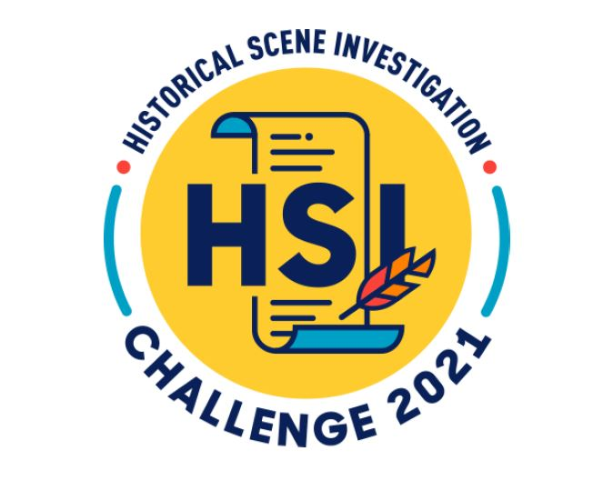

Organised by the National Library Board and supported by the Ministry of Education (Humanities Branch, History Unit), the Historical Scene Investigation (HSI) Challenge is an inter-school contest in which students put their historical inquiry and research skills to the test. 

Opened to lower secondary school students, 2021 was a special year for the contest as it was aligned to the *[Human x Nature: Environmental Histories of Singapore](https://exhibitions.nlb.gov.sg/exhibitions/past-exhibitions/humanxnature/)* exhibition at the National Library. Each team was required to create a video to highlight their historical investigation findings, along with a written report with cited sources.

A total of 59 schools participated in the contest and the submissions showcased the students’ creativity and aptitude in their historical research.

We would like to congratulate the following school teams for achieving the top 3 positions, along with being awarded the Young Historians’ Award by MOE:

**Champion team: Methodist Girls’ School**

- Lim Chu Wern
- Lang Wen Ling Laura
- Jacqueline Lam Zhi En
- Lee Jia Yin, Chloe
  

**1st runner-up: National Junior College (Secondary)**

- Jaya Shree Adheenamilagi
- Eunice Ang Geh Kar
- Venise Hah Xin Yi
- Leong Xian Zhu, Samuel
  

**2nd runner-up: CHIJ St Theresa’s Convent** 

- Aishwerya Sunil Singh
- Fiona Tan Lin Xuan
- Janelle Chan Wai Yee
- Paige Loh Wan Seon
  

 

We would also like to congratulate the following 10 schools for attaining the Gold level certificate in the contest:

**CHIJ St Nicholas Girls’ School**

- Liang Wern Hwee 
- Ng Wing Yan Emily
- Wu Sixin 
- Boh Shu Ting Shannon 
  

**Chung Cheng High School (Main)**

- Foo Jing En Joaquina
- Ariel Lua Kai Xuan
- Lee Xinyi Athena
- Isabella Leow Yi Shan
  

**Hillgrove Secondary School**

- Kitson Neo
- Saanvi Singh
- Tan Shi En, Shyane
- Norin Dianni Binte Abdullah 
  

**Hwa Chong Institution**

- Law Xue Qi Alestor 
- Ashton Lim Yao Kai 
- Yu Yao Quan 
- Chia Ern Kang
  

**Jurong West Secondary School**

- Randilyn Liau Fang Xian
- Tan Yu Ing
- Liew Rui En
- Thet Su Naing
  

**Raffles Girls’ Scho**ol

- Kong Yu-Ann
- Lim Rae-Ann
- Chung Shin Rei
- Chua Jen Ee
  

**Raffles Institution**

- Au Chun Kiat
- Jared Xu Xinrui
- Li Houzhe
- Raoul Abay Gunalan
  

**Seng Kang Secondary School**

- Dang Ngoc Nguyen
- Mohamed Aafif Bin Mohamed Jahir Hussain
- Renie Tan Si En
- Lim Zhuo Yao Prime
  

**School of the Arts (SOTA)**

- Terrell James Ng
- Celestine Sixuan Groleau
- Khin Sandi Tun
- Khoo Sze Min Sophia
  

**Woodlands Ring Secondary School**

- Tan Yi Ning Jessica
- Preethissh s/o S Raguppathi
- Pang Yi Xi
- Isabelle Boey Ming Hui
  

