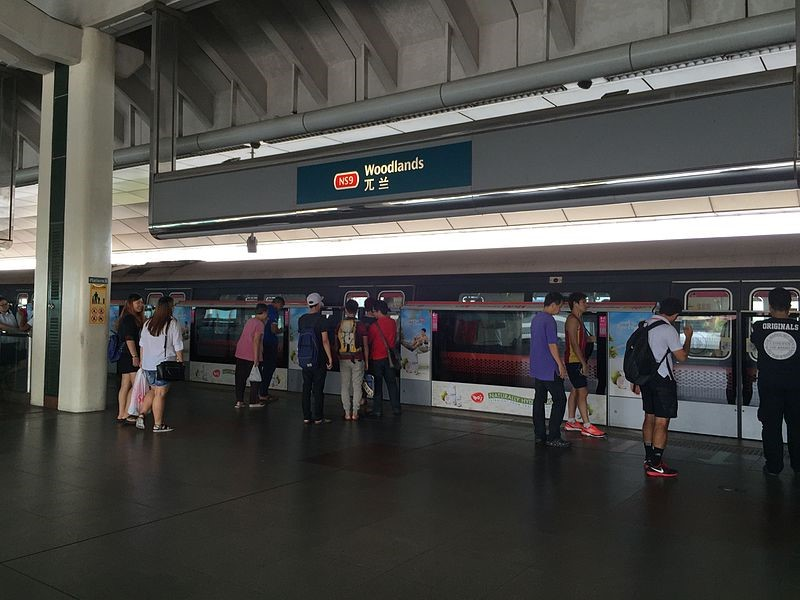
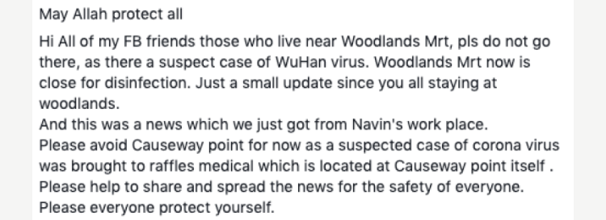

**Applying the S.U.R.E Steps to COVID-19**  

With constant news reports on COVID-19 in Singapore, it is very likely that you have also received forwarded WhatsApp messages regarding this from your friends and family on how to protect yourself against it. Perhaps, you may even have received information on where the latest stock of surgical masks can be found.

However, with the bombardment of such information on all fronts from the news to social media to well-meaning loved ones, how do we know what is real and what is not? Recently, there have been many reports and debunking of fake news regarding COVID-19. 

For example, there were Facebook posts which claimed that Woodlands MRT station had been closed for disinfection on 28 January 2020 because a suspected case had been found there. you can apply the **S.U.R.E steps – Source, Understand, Research and Evaluate** to make a judgement. 

 

   

Firstly, what was the **s**ource of the information? This news originated from several Facebook posts shared. In this case, I felt that it was difficult to determine if it was accurate, as there was no clear origins as to how it started, much less, whether it came from a credible authority. Therefore, I thought that I had to treat this information with suspicion.

Next was to **u**nderstand what I was reading. The Facebook post appeared to be opinion rather than facts. With that, I again found it difficult to confirm if it was real.  

After that, I applied the next step of S.U.R.E, which was **r**esearch. I went online to find out more about the closure of Woodlands MRT station from different websites, and I found that Factually, which is part of the gov.sg website, had actually addressed this. [One of its articles](https://www.gov.sg/article/factually-clarifications-on-falsehoods-on-woodlands-mrt-closure) stated that the news on Woodlands MRT was false, and that it was actually fully operational on 28 January 2020. This was the same when I went to the Ministry of Transport’s official Facebook page that stated that the news was false. 

Since this case was highlighted and debunked in official sources, I could **e**valuate that these are more credible than the Facebook posts shared.

As can be seen from the case of Woodlands MRT, fake news on Covid-19 can quickly expand into misinformation. Because of that, it is very important to think critically about the information you receive regarding COVID-19. 

The next time you read something about COVID-19, you can apply the **S.U.R.E steps – Source, Understand, Research and Evaluate** as mentioned above with the Woodlands MRT closure fake news, to help you decide whether to believe in it or not. 

 
