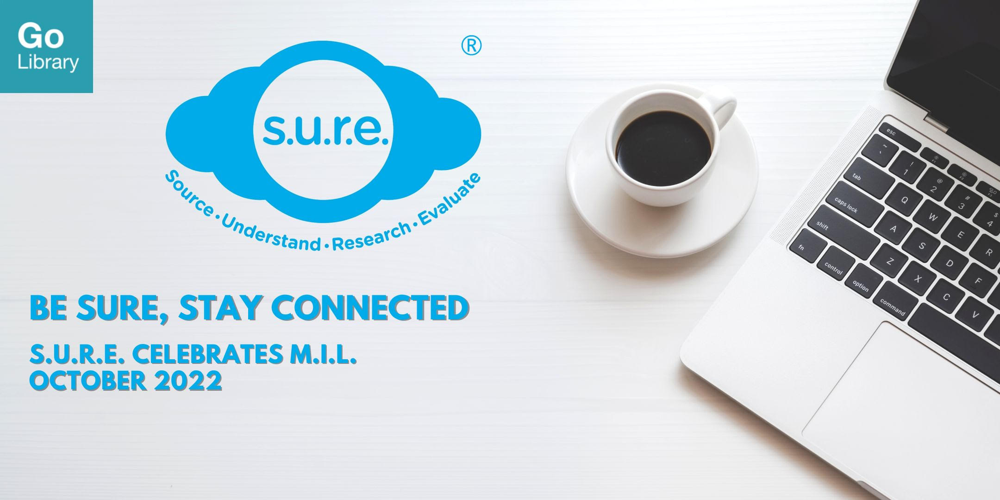

## PROGRAMME CALENDAR

CLICK ON THE PROGRAMME TITLES TO REGISTER!

|                                                              |                                                              |                                |      |
| :----------------------------------------------------------- | ------------------------------------------------------------ | ------------------------------ | ---- |
| **[Who Are You Gonna Call? How to Become a 'Fake News Buster'](https://www.eventbrite.sg/e/who-are-you-gonna-call-how-to-become-a-fake-news-buster-tickets-413816063987)** | Fact-checking is for everyone! In this talk, participants will find out the most common tactics bad actors use to spread misinformation, and tricks they can use to become ‘fake news busters’.  This session will end off with hands-on activities where participants can practice and hone their newly acquired skills. | 5 Oct Wednesday 6:00pm-7:00pm  | Zoom |
| **[Fact & Fiction: Behind the Art of Storytelling](https://www.eventbrite.sg/e/fact-fiction-behind-the-art-of-storytelling-sure-celebrates-mil-tickets-413818330767)** | Get insights and thoughts into the world of creating podcasts, films and television programmes.  Learn about what sort of research is needed to provide context, narration or footage, and the inspiration for creating stories across these mediums. | 6 Oct Thursday 6:00pm-7:00pm   | Zoom |
| **[Inside video game creation: IN-cube’s Fake News Detective game](https://www.eventbrite.sg/e/inside-video-game-creation-in-cubes-fake-news-detective-game-tickets-413819604577)** | Learn how fact-finding skills and adventure are rolled into one in IN-cube’s Fake News Detective game. Meet the team behind the game as they walk you through the process of researching and creating this game, and how it can hone your fake news detection skills IRL (in real life). | 7 Oct Friday 6:00pm-7:00pm     | Zoom |
| **[Ask the Cyber Experts](https://www.eventbrite.com/e/ask-the-cyber-experts-sure-celebrates-mil-tickets-404504573067?aff=odcleoeventsincollection&keep_tld=1)** | *Not sure what to do when you see something fishy online? Don’t get hooked and reeled into a scam!  
 Learn how to navigate cyberspace safely in this talk. Join cyber experts from Cyber Security Agency (CSA) and Singapore Police Force (SPF) who will share tips on how to spot signs of phishing and other scams.* | 11 Oct Tuesday 6:00pm-7:00pm   | Zoom |
| **[Cart or Cut? How to Shop Online Safely](https://www.eventbrite.com/e/cart-or-cut-how-to-shop-online-safely-sure-celebrates-mil-tickets-403874287867?aff=odcleoeventsincollection&keep_tld=1)** | In this webinar, learn about the rising trend of online shopping, its risks and how to apply the S.U.R.E. (Source, Understand, Research, Evaluate) steps to ensure that your next online purchase is safe and authentic. | 12 Oct Wednesday 6:00pm-7:00pm | Zoom |
| [**Complex Connections: Why do we fall for scams?**](https://www.eventbrite.com/e/complex-connections-why-do-we-fall-for-scams-sure-celebrates-mil-tickets-404505826817?aff=odcleoeventsincollection&keep_tld=1) | Learn how to protect your loved-ones and yourself from scams.   Drawing from a psychology and behavioural sciences perspective, this talk will provide a human-centric overview of the potential impacts, vulnerabilities, and range of experiences relating to scams, to discuss the central question of how we can better care and protect our loved-ones and ourselves from potential scams. | 13 Oct Thursday 6:00pm-7:00pm  | Zoom |
| **[Heart of the matter: How to spot and support survivors of online harms](https://www.eventbrite.sg/e/heart-of-the-matter-how-to-spot-and-support-survivors-of-online-harms-tickets-413822202347)** | Online harms have become more pervasive and have significant effect on survivors’ mental health. Join this workshop to find out more about the state of online harms today, misconceptions of victims and how to support those who have experienced it. | 20 Oct Thursday 6:00pm-7:00pm  | Zoom |
| **[News and Laughter in a Meme World](https://www.eventbrite.sg/e/news-and-laughter-in-a-meme-world-sure-celebrates-mil-tickets-413823626607)** | Join the conversation to find out how news, current affairs and pop culture are crafted and consumed in memes, and why we find it relatable. Learn how memes are created and why they are a popular medium for news and information in today’s world. | 26 Oct Wednesday 6:00pm-7:00pm | Zoom |
| [**New News: Online Journalism Today**](https://www.eventbrite.sg/e/new-news-online-journalism-today-sure-celebrates-mil-tickets-413824749967) | How does information overload affect journalism? Has researching and reporting for journalism changed in the digital age? What does it take to be a broadcast journalist or investigative reporter in today’s world? | 27 Oct Thursday 6:00pm-7:00pm  | Zoom |

