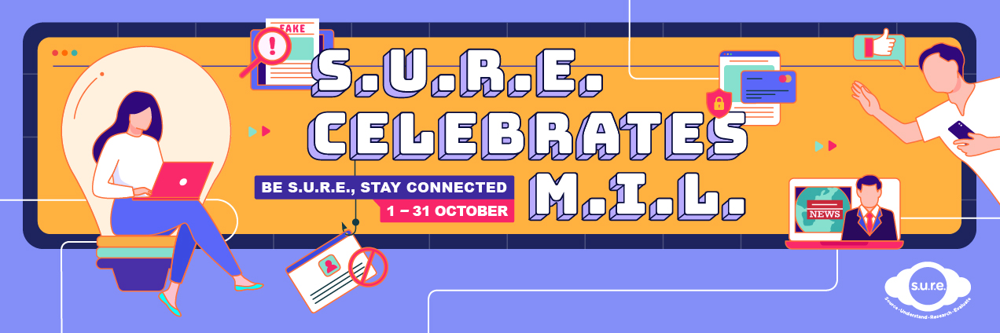

## Results of the S.U.R.E. Bingo Lucky Draw

Congratulations to the following winners of our S.U.R.E. BINGO Lucky Draw!

Check out the myLibrary usernames below to see if you’ve won a prize.

Winners will be notified by email and/or telephone stated in their Lucky Draw form, within 2 weeks of the Lucky Draw, with instructions on prize delivery. Read our S.U.R.E. BINGO Lucky Draw T&Cs [here](https://sure.nlb.gov.sg/events/surecelebratesmil-bingo-tnc/).

|        |                  |        |                  |
| ------ | ---------------- | ------ | ---------------- |
| **1**  | devesoh          | **21** | joan2115         |
| **2**  | yingxiang981     | **22** | KellynLSE        |
| **3**  | misssunshine2305 | **23** | Ngfkmalcolm      |
| **4**  | ktefoo           | **24** | seet15           |
| **5**  | woonch11111      | **25** | tlenggeok        |
| **6**  | ChuaChaiSuang    | **26** | Ciboys74         |
| **7**  | ciufung          | **27** | Elainelaipm      |
| **8**  | noihiang         | **28** | Hockeong         |
| **9**  | tt1228tt         | **29** | ngtg1971         |
| **10** | QuekYBL          | **30** | paulinetriasingh |
| **11** | RickeNG          | **31** | richsum          |
| **12** | TeoSehLin        | **32** | sllimlimsinglip  |
| **13** | Tskhome          | **33** | ant2018          |
| **14** | Askimo           | **34** | Cindigch         |
| **15** | Lok688           | **35** | kineticrk        |
| **16** | yuklinong        | **36** | MatthewSim       |
| **17** | byxie4o          | **37** | tanyenkim        |
| **18** | conesg           | **38** | Ccorinna         |
| **19** | gohmargie        | **39** | Dianachong7      |
| **20** | Jjlemah          | **40** | momo1973         |

 

## About S.U.R.E. Celebrates M.I.L.

The rapid advancements in technology and global events have greatly impacted the way we stay connected to and understand the world around us. Online information users today encounter a multitude of challenges – information overload, misinformation and disinformation, online scams, and our own personal biases. 

Want to build up your media and information literacy (M.I.L) skills to tackle these challenges? Join the National Library Board’s “S.U.R.E. Celebrates M.I.L.” programmes in October 2022, held in conjunction with the [UNESCO Global Media and Information Literacy Week 2022](https://en.unesco.org/commemorations/globalmilweek). 

This year’s theme is “***Be S.U.R.E., Stay Connected***” and you can learn how to:

- Discern and use online information sources
- Unpack and avoid scams
- Avoid online harms 
- Understand news literacy 