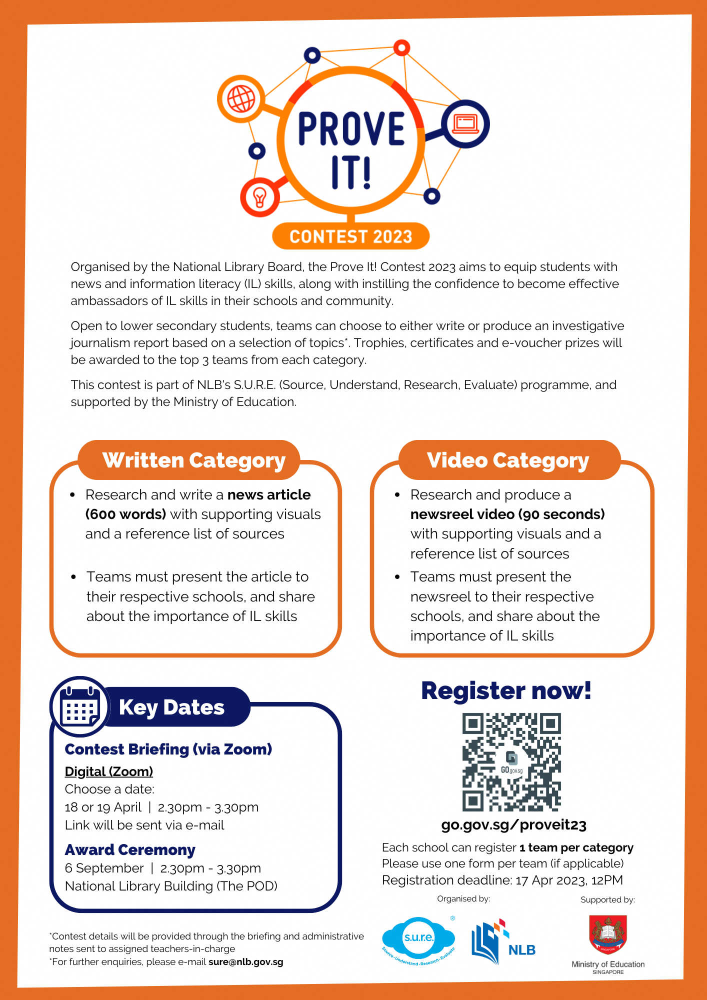

Organised by the National Library Board, the Prove It! Contest 2023 aims to equip students with news and information literacy (IL) skills, along with instilling the confidence to become effective ambassadors of IL skills in their schools and community.

 

Open to lower secondary students, teams can choose to either write or produce an investigative journalism report based on a selection of topics.

 

This contest is part of NLB's S.U.R.E. (Source, Understand, Research, Evaluate) programme, and supported by the Ministry of Education.

