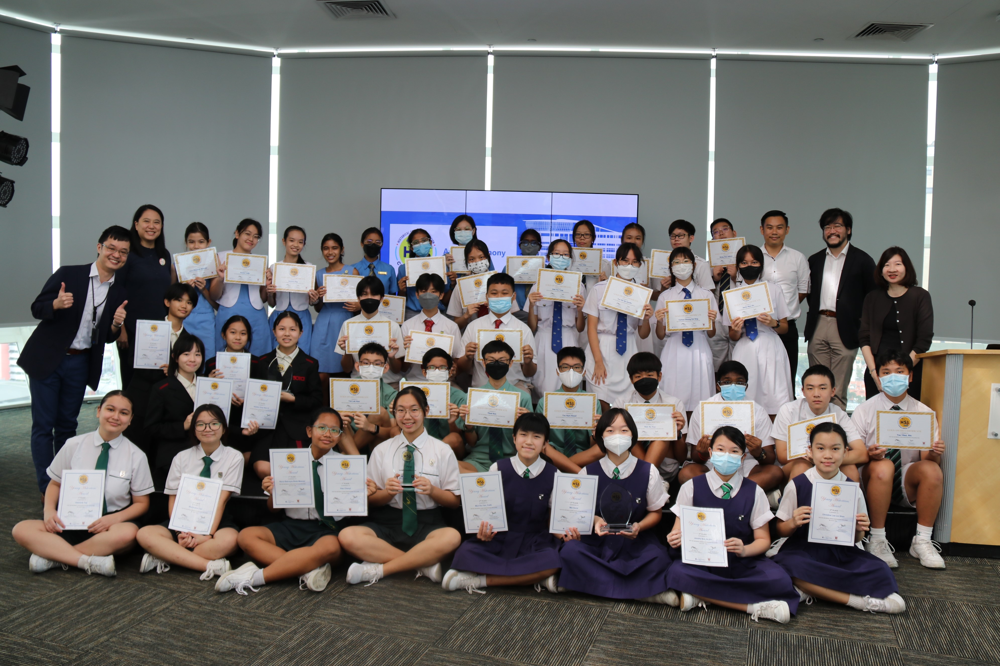

Organised by the National Library Board and supported by the Ministry of Education (Humanities Branch, History Unit), the Historical Scene Investigation (HSI) Challenge is an inter-school contest in which students put their historical inquiry and research skills to the test. 

Opened to lower secondary school students, 2022’s theme commemorated the 80th anniversary of the Fall of Singapore, in which students investigated the historical significance of the Second World War in Singapore between 1942 to 1945. Each team was required to create a video to highlight their historical investigation findings, along with a written report with cited sources.

A record participation of 170 teams from 82 schools participated in the contest and the submissions showcased the students’ creativity and aptitude in their historical research.

On 19 October 2022, the top 10 school teams were invited to the National Library for the awards ceremony.

We would like to congratulate the following school teams for achieving the top 3 positions, along with being awarded the Young Historians’ Award by MOE:

**Champion team: Springfield Secondary School**

- Tay Gabriela

- Tan Shermaine

- Hao Chenyi

- Nurul Batrisyia Mawasi

  

  

  <iframe src="https://nlb.ap.panopto.com/Panopto/Pages/Embed.aspx?id=faf80075-5f72-4938-824b-af25007ab101&autoplay=false&offerviewer=false&showtitle=true&showbrand=true&start=0&interactivity=all" height="405" width="720" style="border: 1px solid #464646;" allowfullscreen allow="autoplay"></iframe>

  

**1st runner-up: Raffles Girls’ School**

- Mei Xurui

- Christine Lee Lin Shan

- Janelle See Jia Xin

- Mun Siu Yan Faith

  

  <iframe src="https://nlb.ap.panopto.com/Panopto/Pages/Embed.aspx?id=b27802a7-0fb7-4861-8992-af25007ab2a0&autoplay=false&offerviewer=false&showtitle=true&showbrand=true&start=0&interactivity=all" height="405" width="720" style="border: 1px solid #464646;" allowfullscreen allow="autoplay"></iframe>

  

**2nd runner-up: School of the Arts (SOTA)**

- Natalie Chua Wen Xi

- Or Gin Ling

- Kate Summer Gobardja

- Isabel Lim Rui Ting

  

  <iframe src="https://nlb.ap.panopto.com/Panopto/Pages/Embed.aspx?id=9481e78d-7c2e-49d6-a4bc-af250081c0d5&autoplay=false&offerviewer=false&showtitle=true&showbrand=true&start=0&interactivity=all" height="405" width="720" style="border: 1px solid #464646;" allowfullscreen allow="autoplay"></iframe>

We would also like to congratulate the following 7 runner-up teams for achieving the top 10 positions for their schools.

**Bedok South Secondary School**

- Lim Jun Kai Raylen

- Thomas Lim Kakiat

- Zhang Cairan

- Ye Ze Xi, Jerry

  

  <iframe src="https://nlb.ap.panopto.com/Panopto/Pages/Embed.aspx?id=a5054136-b901-44be-b142-af27006a1bef&autoplay=false&offerviewer=false&showtitle=true&showbrand=true&start=0&interactivity=all" height="405" width="720" style="border: 1px solid #464646;" allowfullscreen allow="autoplay"></iframe>

  

**Ang Mo Kio Secondary School**

- Supachai Sombat

- Chey Tze Hym Reuel

- Teh Lok Hao

- Thad Kee

  

  <iframe src="https://nlb.ap.panopto.com/Panopto/Pages/Embed.aspx?id=5fa7c150-d618-4aca-a644-af27006a1c1d&autoplay=false&offerviewer=false&showtitle=true&showbrand=true&start=0&interactivity=all" height="405" width="720" style="border: 1px solid #464646;" allowfullscreen allow="autoplay"></iframe>

  

**Raffles Institution**

- Sanjit Vetriselvan

- Kwa Eu Han

- Tan Yikai, Rio

- Tong Yang

  

  <iframe src="https://nlb.ap.panopto.com/Panopto/Pages/Embed.aspx?id=8d858acd-e63c-4a1a-9671-af27006a1bbf&autoplay=false&offerviewer=false&showtitle=true&showbrand=true&start=0&interactivity=all" height="405" width="720" style="border: 1px solid #464646;" allowfullscreen allow="autoplay"></iframe>

  

**Fuhua Secondary School**

- Lee Sian Hon, Jefferson

- Phoon Shi Ji

- Yuan Yinke

- Wang Jiayi Johnny

  

  <iframe src="https://nlb.ap.panopto.com/Panopto/Pages/Embed.aspx?id=d93d8ccd-6c67-424b-af67-af27006a1c46&autoplay=false&offerviewer=false&showtitle=true&showbrand=true&start=0&interactivity=all" height="405" width="720" style="border: 1px solid #464646;" allowfullscreen allow="autoplay"></iframe>

  

**Singapore Chinese Girls’ School**

- Sonya Kaur

- Laura Elizabeth Malcolm

- Gemma Ong

- Rachel Tedja

  

  <iframe src="https://nlb.ap.panopto.com/Panopto/Pages/Embed.aspx?id=473d815d-1371-4157-a943-af27006a1e22&autoplay=false&offerviewer=false&showtitle=true&showbrand=true&start=0&interactivity=all" height="405" width="720" style="border: 1px solid #464646;" allowfullscreen allow="autoplay"></iframe>

  

**Cedar Girls’ Secondary School**

- Hannah Binte Haron

- Bhutada Ashita Amit

- Fan Jinghan

- N. Remila

  

  <iframe src="https://nlb.ap.panopto.com/Panopto/Pages/Embed.aspx?id=3db3f38e-497a-4e74-8911-af27006a1e81&autoplay=false&offerviewer=false&showtitle=true&showbrand=true&start=0&interactivity=all" height="405" width="720" style="border: 1px solid #464646;" allowfullscreen allow="autoplay"></iframe>

  

**Chung Cheng High School (Yishun)**

- Carissa Cheang Kai Sing

- Karin Myo Oo

- Koh Yee Teng

- Too Shi Qii Janelle

  

  <iframe src="https://nlb.ap.panopto.com/Panopto/Pages/Embed.aspx?id=c21dab72-12e3-407c-bc1d-af27006a1f34&autoplay=false&offerviewer=false&showtitle=true&showbrand=true&start=0&interactivity=all" height="405" width="720" style="border: 1px solid #464646;" allowfullscreen allow="autoplay"></iframe>

  

  

  