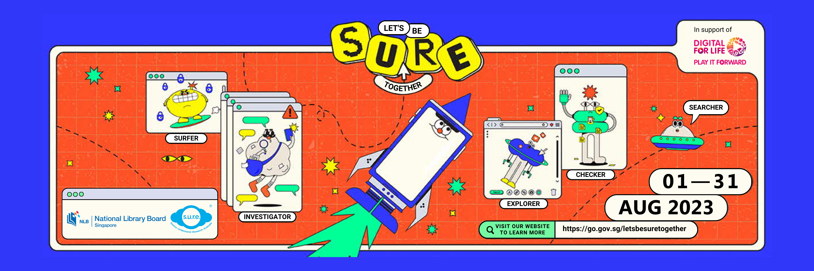
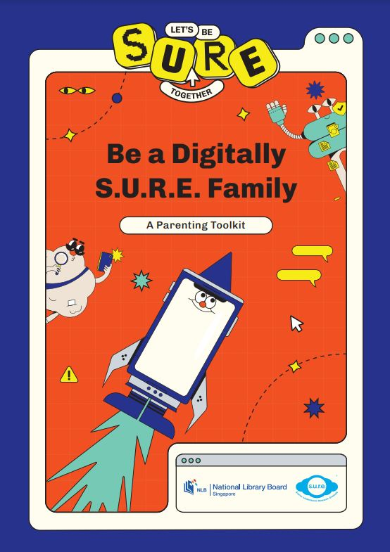

Get ready for a thrilling cyber adventure with your family this August 2023! “Let's be S.U.R.E. together” and explore the online world while ensuring safety and well-being for your digitally savvy family.

 

In today's fast-paced digital world, we face endless opportunities and challenges. As parents, it's crucial to equip ourselves with the knowledge and skills to guide our families through this digital frontier. That's why we're bringing you an exciting line-up of programmes, displays and activities that will empower your family with the tools to make informed decisions.

 

From understanding the impact of generative A.I. to discerning truth from misinformation, we'll dive into these topics head-on. Our four concepts - Source, Understand, Research, Evaluate (S.U.R.E.) - will guide you through the dynamic digital landscape and help you make informed choices in an interconnected world.

 

Don't miss out on month-long displays at Jurong Regional Library, Woodlands Regional Library and Tampines Regional Library and our pop-up event at One Punggol on 19-20 August 2023.

 

Join us for an unforgettable experience that will leave your family digitally S.U.R.E.!

Parents: Download the Parenting Toolkit **[HERE](https://go.gov.sg/sure-parenting-toolkit)** (about 7MB):

 