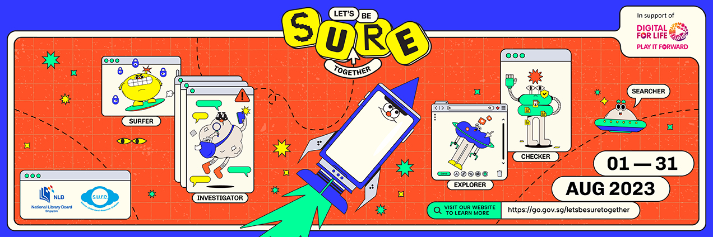

“Let’s be S.U.R.E. together!” features talks and workshops on keeping informed, safe and S.U.R.E. while navigating the online world. Take your pick from the range of online and on-site programmes and stay sure together. 

For the most updated information on each programme, please visit the respective event links. 

| Date/Day        | **Time**      | **Venue**                        | **Programme**                                                |
| --------------- | ------------- | -------------------------------- | ------------------------------------------------------------ |
| 3 Aug,  Thurs   | 7pm-8pm       | Online (Zoom)                | Building Connections: Safe spaces for a digital childhood    |
| 5 Aug,  Sat     | 2.30pm-4pm    | Tampines Regional Library    | RTBS Youth Debates: This House regrets the proliferation of  generative A.I. |
| 10 Aug,   Thurs | 7pm-8pm       | Online (Zoom)                | Growing Up with A.I.: Raising Digitally S.U.R.E. Kids        |
| 12 Aug, Sat     | 11am-12pm     | Woodlands Regional Library   | Digital Detectives: A Cyber S.U.R.E. Drama Workshop for Kids |
| 17 Aug, Thurs   | 7pm-8pm       | Online (Zoom)                | A.I. 101: Understanding ChatGPT and Other A.I. Tools for Students |
| 19 Aug, Sat     | 11am-12pm     | Punggol Regional Library     | Parenting Workshop: Cybersecurity and Cyber Wellness by CSA and POSB |
| 19 Aug, Sat     | 2.30pm-3.30pm | Punggol Regional Library     | Digital Detectives: A Cyber S.U.R.E. Drama Workshop for Kids |
| 20 Aug, Sun     | 11am-12pm     | Punggol Regional Library     | ChatGPT, A.I. Image Generators and the Dangers of Misinformation |
| 20 Aug, Sun     | 2pm-5pm       | Punggol Regional Library     | Game on! Level Up Your Child’s Online Gaming Safety          |
| 24 Aug, Thurs   | 7pm-8pm       | Online (Zoom)                | GGWP: Staying Safe and Calm in Online Games                  |
| 26-Aug, Sat     | 4pm-5.30pm    | Jurong Regional Library          | "Seniors Go Safe Online" Workshop                            |
| 27-Aug, Sun     | 10am-11.30am  | Jurong Regional Library      | "Seniors Go Safe Online" Workshop                        |
| 27-Aug, Sun     | 2pm-5pm       | Jurong Regional Library          | Unleash Your Inner Innovator: Creating Solutions with Design  Thinking and A.I.    |
| 31-Aug, Thurs   | 7pm-8pm       | Online (Zoom)                    | Social MEdia & Online Harms: Empowering Our Children to Navigate  the Thrills and Spills of the Online World    |

 

  