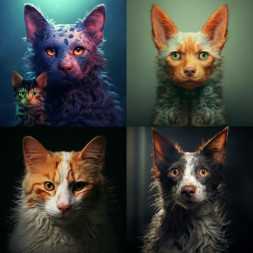

[Introduction](/generative-ai/what-is-generative-ai/)  |   [Programmes](/generative-ai/programmes/)  |  [Games](/generative-ai/games/)  |  [Poll](/generative-ai/gen-ai-poll/)  | [Resources](/generative-ai/resource-toolkit/)  | [Fact-check](/generative-ai/fact-checking-tools/)  | [Gen AI in SG](/generative-ai/generative-ai-singapore/)

The recent advances in generative artificial intelligence (AI) have garnered significant public attention. We have prepared various **[programmes](/generative-ai/programmes/)** and [**resources**](/generative-ai/resource-toolkit/) to help the public to be aware of generative AI and its broad applications and to equip them to use it effectively and safely through the lens of the S.U.R.E. (information literacy) framework.

## What is generative AI?

Here are 2 definitions which are more academic:

> *“Generative AI refers to artificial intelligence algorithms that enable using existing content like text, audio files, or images to create new plausible content. In other words, it allows computers to abstract the underlying pattern related to the input, and then use that to generate similar content.”* 
>
> Source: [Analytics Insight](https://www.analyticsinsight.net/what-is-generative-ai-its-impacts-and-limitations/)

and

> *”Generative algorithms create data using models of the world to synthesize images, sounds and videos that often look increasingly realistic. The algorithms begin with models of what a world must be like and then they create a simulated world that fits the mode*l.”
>
> Source: [Venture Beat](https://venturebeat.com/ai/what-is-generative-artificial-intelligence-ai/)

We asked ChatGPT for a simpler explanation:

> *Generative AI can create new and original content like images, music, and text.  It uses complex algorithms and patterns to understand and mimic what it learns from existing data.*  
>
> *It's like a painter who looks at many paintings and then creates a new one in a similar style.  Generative AI can make realistic images, unique music, and human-like text.*
>
> *It's exciting because it can make things that never existed before and can be useful for creativity, research, and problem-solving.  However, it still needs human help and relies on patterns from existing data. It's not conscious or as creative as humans.*

When asked to provide an explanation to a young child, ChatGPT's explanation was as follows:

> Generative AI is like a smart computer friend that can make things up on its own.  It **looks at pictures, music, or words made by people and creates new ones** that nobody has seen before.
>
> It can imagine new animals like a "**cat-dog**" by combining different animals. e.g. from images of cats and dogs:
>
> 
>
> to cat-dog hybrids:
>
> 
>
> 
>
> Generative AI can make new songs that sound like they were made by famous musicians and write stories like a famous author.  It's clever but needs help from people to learn and make sure it's doing things correctly.
>
> It's like having a creative and smart friend who loves inventing new things.

