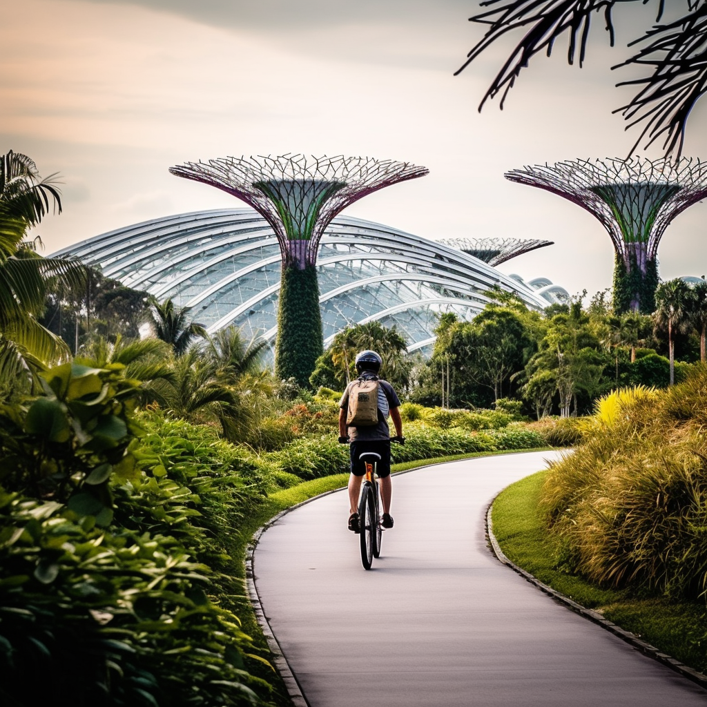
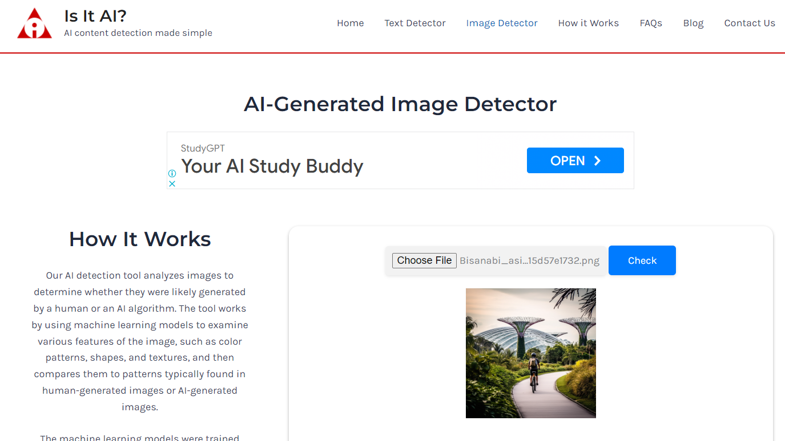
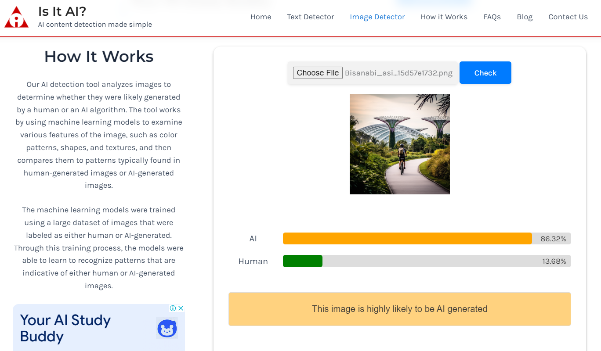

[Introduction](/generative-ai/what-is-generative-ai/)  |   [Programmes](/generative-ai/programmes/)  |  [Games](/generative-ai/games/)  |  [Poll](/generative-ai/gen-ai-poll/)  | [Resources](/generative-ai/resource-toolkit/)  | [Fact-check](/generative-ai/fact-checking-tools/)  | [Gen AI in SG](/generative-ai/generative-ai-singapore/)

## (A)  Detecting AI-generated texts

The tools listed here generally require the user to copy and paste text into a dialogue box to work. Success rates may vary.

- [Copyleaks](https://copyleaks.com/ 
  ) 

- [Crossplag](https://crossplag.com/ 
  )

- [GPTZero](https://gptzero.me/ 
  )

- [Is It AI? - Text Detector](https://isitai.com/ai-text-detector/) 

- [OpenAI AI Text Classifier](https://platform.openai.com/ai-text-classifier) 

- [Writer.com AI Content Detector](https://writer.com/ai-content-detector/ 
  )

  

## (B) Detecting AI-generated images

- [Illuminarty](https://app.illuminarty.ai/)

- [Is It AI? - Image Detector](https://isitai.com/ai-image-detector/)

- [Maybe's AI Art Detector](https://umm-maybe-ai-image-detector.hf.space/)

  

### Activity 

Let's test one of the AI image detectors.

**Step 1:** Download the image from **[here](https://go.gov.sg/sure-mj-image-test1)** and save it to your desktop or mobile device. 

**Step 2:** Go to the ["Is it AI?" Image Detector](https://isitai.com/ai-image-detector/).

**Step 3:** Click "Choose File" and select the image you have saved on your desktop or mobile device.

**Step 4:** Click the "CHECK" button. After a few seconds, you will see the analysis. The image detector has correctly identified the image as "highly likely to be AI generated".

 