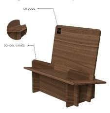
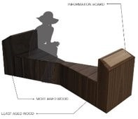

<h1>Nodes at Parks

Encounter eResources on Sustainability at a park near you! From 14 October 2022 to 26 February 2023, NLB is presenting a brand-new initiative called “Nodes at Parks”. Come interact with NLB’s exciting eResources on Sustainability. This initiative is co-funded by the Ministry of Sustainability and Environment under the SG EcoFund. It consists of two parts: The Sustainability Showcase, and Sustainable Benches. Don’t miss the opportunity to visit us at:

**1)**   **Gardens by the Bay** at the foyer outside Visitor Services**:** 14 October to 14 November 2022

**2)**   **Jurong Lake Gardens** at the Entrance Pavilion**:** 25 November to 18 December 2022

**3)**   **East Coast Park** at Raintree Cove**:** 21 December 2022 to 24 January 2023

**4)**   **Pasir Ris Park** at the Shelter near Carpark D**:** 27 January to 26 February 2023

<h2>The Sustainability Showcase

Ever wondered how your daily purchasing decisions impact the environment? Don’t miss this opportunity to browse our “supermarket” aisles and learn about 8 different topics on Sustainability. The items on display showcase interesting products that are conceptual ideas or existing products by green entrepreneurs. Learn about topics such as single-use plastics, composting, sustainable food production and more. 

The **Read to be SURE** component of the Sustainability Showcase provides multiple perspectives to sustainability issues so you can see the big picture. Don’t forget to vote for your preferred perspective too! 

As part of the suite of activities at the Showcase you will also be able to contribute an environmental memory, collect free pre-loved books, donate your own pre-loved books, as well as participate in interactive activities to collect sustainable giveaways. 

**Partner “Show and Tell” Schedule at The Sustainability Showcase**

On selected weekends, come join our partners as they share stories about their green product and participate in their interactive activities as well. 

Click here to view our schedule (updated monthly) 

**eCoupons Giveaway! Test your knowledge on Sustainability, try out the Quiz**

Have you read up on all 8 Sustainability questions and accompanying eResources at our Showcase? How well informed are you about the topic of Sustainability now? Put your knowledge to the test by participating in our quiz. Participants who score 6 out of 8 questions correctly will get access to promo codes for our Sustainability Showcase participating partner’s products. Try our quiz today! 

The quiz is open from 14 October 2022 to 26 February 2023. Terms and Conditions apply.

Click here to start! 

<h2> Sustainable Benches

Look out for our specially curated upcycled Benches around the Park! Placed in the vicinity of the Sustainability Showcase, these benches are 3D installations with interactive elements such as videos for you to discover and directly experience the topic of Sustainability through NLB’s e-collection. Do you know, 7 secondary schools have come on board to paint their own designs on the Sustainable benches, rendering their creative interpretations of NLB’s sustainability eResources in all its visual splendour! The benches will be adopted by the schools after the duration of the run.

 

Schools:

\1.    Admiralty Secondary School

\2.    Chua Chu Kang Secondary School

\3.    Kuo Chuan Presbyterian Secondary School

\4.    Ngee Ann Secondary School

\5.    Spectra Secondary School

\6.    Yusof Ishak Secondary School

\7.    Zhonghua Secondary School

 

Our benches are located here:

\1.    Gardens by the Bay: Beside Visitor Service Centre and at the Golden Garden

\2.    Jurong Lake Gardens: Viewing decks and Eco-pond

\3.    East Coast Park: Lawn next to Marine Cove and Lawn next to Siglap Canal

\4.    Pasir Ris Park: Lawn near Carpark D

 

**Unscramble & Win!** **$500 worth of shopping vouchers up for grabs!**

Ready to hunt down the sustainable benches in the park? Scan the QR codes on the benches to find 14 hidden letters. Unscramble them and submit your answer. $500 worth of shopping vouchers are up for grabs! Click here to find out more. Terms and conditions apply.  

 

**All Things on “Sustainability”**

Keen to learn more about Sustainability? Find more eResources, programmes and activities on NLB’s learning community’s platform LearnX **[here](https://learning.nlb.gov.sg/sustainability/overview)**.

Want to have quick read on Sustainability before coming down to our Showcase? Check out this [article.](https://medium.com/the-national-library-blog/climate-change-in-singapore-813f4ddd62a0) 