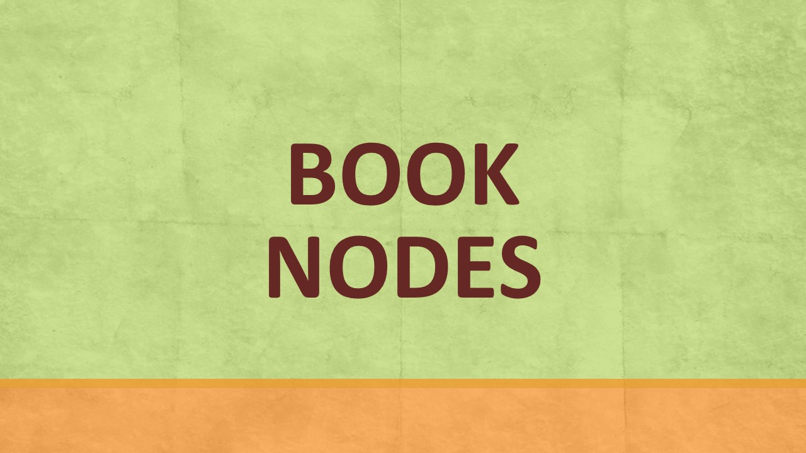

From 14 October 2022 to 26 February 2023, the National Library Board (NLB) presented a brand-new initiative called “Nodes at Parks”, which brought NLB’s exciting eResources on Sustainability to parks and gardens near you. 

 

Due to popular demand, the Nodes at Parks: Sustainability Showcase will be extending its run in the following locations: 

1) **Changi General Hospital** Main Building atrium: 27 February to 13 March 2023, Integrated Building atrium: 14 to 22 March 2023

2) **Plaza Singapura** Near Oldham Lane Entrance: 24 March to 13 April 2023

Look out for it and scan the QR codes to read more about the different perspectives of Sustainability issues! 

    

	

    

    

**The Sustainability Showcase**

Ever wondered how your daily purchasing decisions impact the environment? Don’t miss this opportunity to browse our “supermarket” aisles and learn about 8 different topics on Sustainability. The items on display showcase interesting products that are conceptual ideas or existing products by green entrepreneurs. Learn about topics such as single-use plastics, composting, sustainable food production and more. 

The **[Read to be Sure](/read-to-be-sure/intro/)** component of the Sustainability Showcase provides multiple perspectives to sustainability issues so you can see the big picture. Don’t forget to vote for your preferred perspective too!  Scan the QR codes on the display panels to read more.

**All Things on “Sustainability”**

Keen to learn more about Sustainability? Find more eResources, programmes and activities on NLB’s learning community’s platform **<a href="https://learning.nlb.gov.sg/sustainability/overview"  target="_blank">LearnX Sustainability</a>**

Want to have quick read on Sustainability before coming down to our Showcase? Check out this **<a href="https://go.gov.sg/nodesatparks-ereads-climatechange"  target="_blank"> article</a>**. 

**Book Nodes**

Enjoy reading with a cup of coffee at our BookNodes! From 8 March 2023, head down to 3 Foreword Coffee outlets to browse our BookNodes and pick up a used library book, or scan the QR codes on the bookcase doors to borrow an eBook! BookNodes was conceived to give used library books a new lease of life, and to encourage reading and sharing among the community. These bookshelves are made from sustainably-sourced reclaimed pallet wood in line with the sustainability theme.

**Locations:**

- Yong Siew Toh Conservatory of Music: 3 Conservatory Drive. Level 1 Lounge. Singapore 117376

- Temasek Shophouse: 28 Orchard Road Level 1 Singapore 238832

- First Story: 149 Serangoon North Avenue 1, #01-917, Singapore 550149

**Acknowledgements** 

**Supported by**: <a href="https://www.mse.gov.sg/sgecofund"  target="_blank"> SG Eco Fund</a> and <a href="https://www.nparks.gov.sg/"  target="_blank">NParks </a>

**Venue Partner**: Changi General Hospital and Plaza Singapura

**Showcase Partners:**

- <a href="https://chopvalue.com.sg/"  target="_blank">ChopValue SG</a>
- <a href="https://www.confettisnacks.com/"  target="_blank">Confetti Snacks</A>
- <a href="http://creuse.sg/"  target="_blank">Creuse </a> by Xcel Industrial Supplies Pte Ltd
- <a href="https://www.insectta.com/"  target="_blank">Insectta</a>
- <a href="https://www.nyp.edu.sg/"  target="_blank">Nanyang Polytechnic</a>
- <a href="https://www.sfa.gov.sg/fromSGtoSG/farms/farm/Detail/netatech"  target="_blank"> Netafarm</a>
- <a href="https://shiokmeats.com/"  target="_blank">Shiok Meats</a>
- <a href="https://instagram.com/theplasticproject.sg/shop"  target="_blank">The Plastic Project</a>

