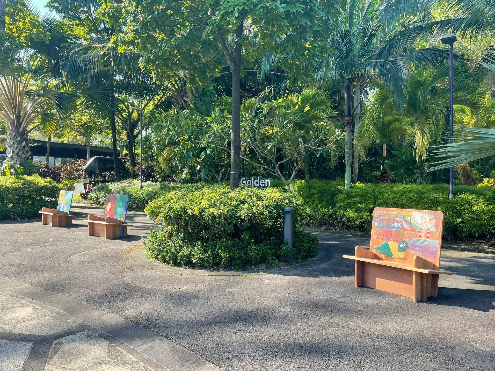

Encounter eResources on Sustainability at a park near you! From 14 October 2022 to 26 February 2023, NLB is presenting a brand-new initiative called “Nodes at Parks”. Come interact with NLB’s exciting eResources on Sustainability. It consists of two parts: The Sustainability Showcase, and Sustainable Benches. Don’t miss the opportunity to visit us at:

1. **Gardens by the Bay** beside the Ticketing Office (near Flower Dome)**:** 14 October to 22 November 2022
2. **Jurong Lake Gardens** at the Entrance Pavilion**:** 25 November to 18 December 2022
3. **East Coast Park** at Raintree Cove**:** 21 December 2022 to 24 January 2023
4. **Pasir Ris Park** at the Shelter near Carpark D**:** 27 January to 26 February 2023

Click **<A HREF="https://go.gov.sg/rtbs-nodes-showcase" TARGET="_BLANK">here</A>** for the location map.

    

    

    

    
    

    
	

    
	

    

**The Sustainability Showcase**

Ever wondered how your daily purchasing decisions impact the environment? Don’t miss this opportunity to browse our “supermarket” aisles and learn about 8 different topics on Sustainability. The items on display showcase interesting products that are conceptual ideas or existing products by green entrepreneurs. Learn about topics such as single-use plastics, composting, sustainable food production and more. 

The **[Read to be Sure](/read-to-be-sure/intro/)** component of the Sustainability Showcase provides multiple perspectives to sustainability issues so you can see the big picture. Don’t forget to vote for your preferred perspective too! 

As part of the suite of activities at the Showcase you will also be able to collect free pre-loved books, donate your own pre-loved books, as well as participate in interactive activities to collect sustainable giveaways. 

**Share a Memory**

Do you have a memorable experience with nature, from past or present? Share them with us and be part of a memory campaign based on personal stories about our encounters with Singapore’s environment. Your stories will be the inspiration behind an eBook that explores Singapore’s changing natural environment, examines our evolving perspectives and explores our relationships with nature. Share your memory <a href="https://go.gov.sg/nodesatparks-memory/" target="_blank">**here**</a>.

**eCoupons Giveaway! Test your knowledge on Sustainability, try out the Quiz**

Have you read up on all 8 Sustainability questions and accompanying eResources at our Showcase? How well informed are you about the topic of Sustainability now? Put your knowledge to the test by participating in our quiz. Participants who score 6 out of 8 questions correctly will get access to promo codes for our Sustainability Showcase participating partner’s products. Try our quiz today! 

The quiz is open from 14 October 2022 to 26 February 2023. <a href="https://go.gov.sg/sustainabilityshowcasequiz-tcs"  target="_blank">Terms and Conditions</a> apply.

Click **<a href="https://go.gov.sg/sustainabilityshowcasequiz4"  target="_blank"> here</A>** to start! 

**Partner “Show and Tell” Schedule at The Sustainability Showcase**

On selected weekends, come join our partners as they share stories about their green product and participate in their interactive activities as well. 

Click **<a href="https://go.gov.sg/showandtell-monthlyschedule"  target="_blank">here</a>** to view our schedule (updated monthly).

**Sustainable Benches**

Look out for our specially curated Sustainable Benches <a href="https://go.gov.sg/rtbs-nodes-bench"  target="_blank">located around the park</a>!

Placed in the vicinity of the<a href="https://go.gov.sg/rtbs-nodes-showcase"  target="_blank"> Sustainability Showcase</a>, these benches allow you to access a wide range of sustainability-themed eResources without having to step foot in the library!  Scan their QR codes to access enriching eReads and watch videos created by Republic Polytechnic students!

7 secondary schools have come on board to paint their own designs on the Sustainable benches, rendering their creative interpretations of NLB’s sustainability eResources in all its visual splendour! The benches will be adopted by the schools after the duration of the run.

 

 

Our benches are <a href="https://go.gov.sg/rtbs-nodes-bench"  target="_blank">located here</a>:

1. **Gardens by the Bay**: Opposite Visitor Service Office and at the Golden Garden (near drop-off point)

2. **Jurong Lake Gardens**: Across the two viewing decks and Eco-pond

3. **East Coast Park**: Lawn next to Marine Cove Coffee Bean & Tea Leaf and Lawn opposite Skater’s Pavilion

4. **Pasir Ris Park**: Lawn between Georges @ The Cove and toilet, and lawn near Toilet D

 

Participating schools:

1. <a href="https://admiraltysec.moe.edu.sg/"  target="_blank">Admiralty Secondary School</a>
2. <a href="https://chuachukangsec.moe.edu.sg/"  target="_blank">Chua Chu Kang Secondary School</a>
3. <a href="https://kuochuanpresbyteriansec.moe.edu.sg/"  target="_blank">Kuo Chuan Presbyterian Secondary School</a>
4. <a href="https://ngeeannsec.moe.edu.sg/"  target="_blank">Ngee Ann Secondary School</a>
5. <a href="https://www.spectra.edu.sg/"  target="_blank">Spectra Secondary School</A>
6. <a href="https://yusofishaksec.moe.edu.sg/"  target="_blank">Yusof Ishak Secondary School</a>
7. <a href="https://www.zhonghuasec.moe.edu.sg/"  target="_blank">Zhonghua Secondary School</a>

 

**Unscramble & Win! $100 worth of shopping eVouchers up for grabs!**

Ready to hunt down the sustainable benches in the park? Scan the QR codes on the benches to find 14 hidden letters. Unscramble them and submit your answer. $100 worth of shopping eVouchers are up for grabs for 5 lucky winners at each park! 

 Click **<a href="https://go.gov.sg/seekandunscramble4"  target="_blank">here</a>** to find out more. <a href=" https://go.gov.sg/susbenchtc"  target="_blank">Terms and conditions</a> apply.

 

**All Things on “Sustainability”**

Keen to learn more about Sustainability? Find more eResources, programmes and activities on NLB’s learning community’s platform **<a href="https://learning.nlb.gov.sg/sustainability/overview"  target="_blank">LearnX Sustainability</a>**

Want to have quick read on Sustainability before coming down to our Showcase? Check out this **<a href="https://go.gov.sg/nodesatparks-ereads-climatechange"  target="_blank"> article</a>**. 

**Acknowledgements** 

**Supported by**: <a href="https://www.mse.gov.sg/sgecofund"  target="_blank"> SG Eco Fund</a> and <a href="https://www.nparks.gov.sg/"  target="_blank">NParks </a>

**Venue Partner**: <a href="https://www.gardensbythebay.com.sg/"  target="_blank">Gardens by the Bay</a>

**Showcase Partners:**

- <a href="https://chopvalue.com.sg/"  target="_blank">ChopValue SG</a>
- <a href="https://www.confettisnacks.com/"  target="_blank">Confetti Snacks</A>
- <a href="http://creuse.sg/"  target="_blank">Creuse </a> by Xcel Industrial Supplies Pte Ltd
- <a href="https://www.insectta.com/"  target="_blank">Insectta</a>
- <a href="https://www.nyp.edu.sg/"  target="_blank">Nanyang Polytechnic</a>
- <a href="https://www.sfa.gov.sg/fromSGtoSG/farms/farm/Detail/netatech"  target="_blank"> Netafarm</a>
- <a href="https://shiokmeats.com/"  target="_blank">Shiok Meats</a>
- <a href="https://instagram.com/theplasticproject.sg/shop"  target="_blank">The Plastic Project</a>

**Participating schools:**

1. <a href="https://admiraltysec.moe.edu.sg/"  target="_blank">Admiralty Secondary School</a>
2. <a href="https://chuachukangsec.moe.edu.sg/"  target="_blank">Chua Chu Kang Secondary School</a>
3. <a href="https://kuochuanpresbyteriansec.moe.edu.sg/"  target="_blank">Kuo Chuan Presbyterian Secondary School</a>
4. <a href="https://ngeeannsec.moe.edu.sg/"  target="_blank">Ngee Ann Secondary School</a>
5. <a href="https://www.rp.edu.sg/"  target="_blank">Republic Polytechnic</a>
6. <a href="https://www.spectra.edu.sg/"  target="_blank">Spectra Secondary School</A>
7. <a href="https://yusofishaksec.moe.edu.sg/"  target="_blank">Yusof Ishak Secondary School</a>
8. <a href="https://www.zhonghuasec.moe.edu.sg/"  target="_blank">Zhonghua Secondary School</a>

