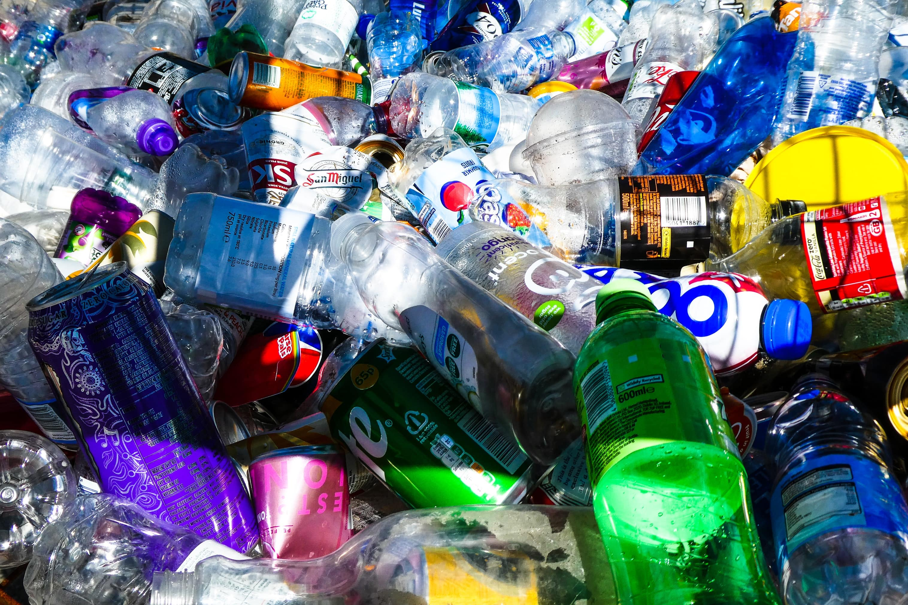
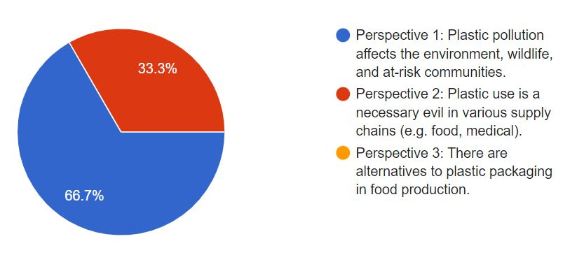

Photo by [Nick Fewings](https://unsplash.com/@jannerboy62?utm_source=unsplash&utm_medium=referral&utm_content=creditCopyText) on [Unsplash](https://unsplash.com/s/photos/plastic-pollution?utm_source=unsplash&utm_medium=referral&utm_content=creditCopyText)

**Are single-use plastics just misunderstood?**

We all know that plastics are non-biodegradable and last for hundreds of years in the ecosystem. Plastic pollution is one of the biggest threats to marine ecosystems, with the prevalence of microplastics in the ocean. Yet, there are still instances where plastics are deemed essential to human activity, playing an important role in our daily lives, as well as in business supply chains. Is plastic use a necessary evil?

<h3>Perspective 1: Plastic pollution affects the environment, wildlife, and at-risk communities</h3>

Single-use or disposable plastics are not biodegradable and break down into micro particles that contaminate our environment, such as our oceans, and may persist for decades to come, affecting the wildlife and disrupting the ecosystem. 

Plastic pollution also disproportionately affects poorer and disadvantaged communities, especially in countries with low recycling rates and difficulties in proper collection of discarded plastics.

[https://www.greenpeace.org/africa/en/blogs/14052/everything-you-should-know-about-single-use-plastic/](https://www.greenpeace.org/africa/en/blogs/14052/everything-you-should-know-about-single-use-plastic/ ) 

[https://www.nationalgeographic.com/environment/article/plastic-pollution](https://www.nationalgeographic.com/environment/article/plastic-pollution) 

[https://www.cnbc.com/2021/05/18/20-companies-responsible-for-55percent-of-single-use-plastic-waste-study.html](https://www.cnbc.com/2021/05/18/20-companies-responsible-for-55percent-of-single-use-plastic-waste-study.html)

[https://www.sciencedirect.com/science/article/pii/S0304389421018537?via%3Dihub](https://www.sciencedirect.com/science/article/pii/S0304389421018537?via%3Dihub)

<H3>Perspective 2: Plastic use is a necessary evil in various supply chains (e.g. food, medical).</H3>

Plastics are used in complex international food supply chains where food needs to be wrapped and transported safely, due to its durability and long lifespan.

In light of the pandemic, single-used plastic products such as gloves and masks were used to minimise contamination. Additionally, other important key healthcare equipment such as syringes utilize plastic.

[https://www.gep.com/blog/mind/single-use-plastics-a-necessary-evil-during-the-pandemic](https://www.gep.com/blog/mind/single-use-plastics-a-necessary-evil-during-the-pandemic)

[https://www.channelnewsasia.com/commentary/ome-plastic-food-packaging-necessary-alternative-waste-874771](https://www.channelnewsasia.com/commentary/ome-plastic-food-packaging-necessary-alternative-waste-874771)

[www.weforum.org/agenda/2018/05/plastic-asset-legal-policy-responsible-use-sadhguru/](http://www.weforum.org/agenda/2018/05/plastic-asset-legal-policy-responsible-use-sadhguru/)

[https://qz.com/1189422/in-defense-of-plastic-the-worlds-most-wasteful-hazardous-downright-useful-material/](https://qz.com/1189422/in-defense-of-plastic-the-worlds-most-wasteful-hazardous-downright-useful-material/)

<h3>Perspective 3: There are alternatives to plastic packaging in food production.</h3>

While cost may be a factor, there are indeed alternatives to packaging food in a more sustainable fashion such as bio-based food contact materials such as paper, wheat-based or seaweed-based materials and beeswax wraps.

Companies such as Nestle, have pledged to ensure all their packaging to be either reusable, recyclable or compostable by 2025.

<a href="https://www.asianscientist.com/2022/02/in-the-lab/food-packaging-shelf-life-smart-sustainable-antimicrobial/ ">https://www.asianscientist.com/2022/02/in-the-lab/food-packaging-shelf-life-smart-sustainable-antimicrobial/</a>

<a href="https://cot.food.gov.uk/sites/default/files/2020-10/Tox%202020%2024%20Alternatives%20to%20conventional%20plastics%20for%20foods%20and%20drinks.pdf">https://cot.food.gov.uk/sites/default/files/2020-10/Tox%202020%2024%20Alternatives%20to%20conventional%20plastics%20for%20foods%20and%20drinks.pdf</a>

<a href="https://www.bbc.com/worklife/article/20180705-whats-the-real-price-of-getting-rid-of-plastic-packaging">https://www.bbc.com/worklife/article/20180705-whats-the-real-price-of-getting-rid-of-plastic-packaging</a>

<a href="https://www.bbc.com/future/article/20220526-what-would-happen-if-we-stopped-using-plastic">https://www.bbc.com/future/article/20220526-what-would-happen-if-we-stopped-using-plastic</a>

**Which perspective do you agree with?**

This chart shows the number of public votes for each perspective. Which perspective do you agree with the most? Vote **[here](https://forms.gle/DoPHtiEYhVxkPL3w8)**. 

