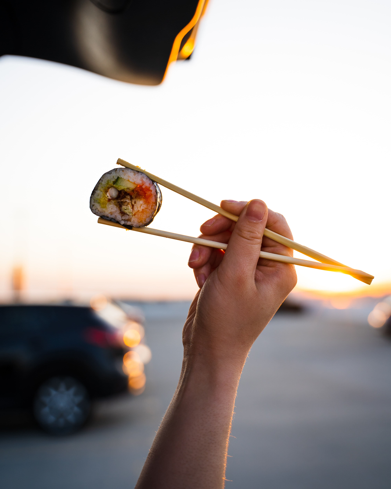

Photo by [Lana Mattice](https://unsplash.com/es/@lanamattice?utm_source=unsplash&utm_medium=referral&utm_content=creditCopyText) on [Unsplash](https://unsplash.com/s/photos/chopsticks?utm_source=unsplash&utm_medium=referral&utm_content=creditCopyText)

**Should our disposable chopsticks be given the “chop”?**

The use of disposable chopsticks has evolved to become an integral part of our takeaway food culture. We find them given out at hawker centres, restaurants or used even at home. Have you ever wondered if the use of disposable chopsticks is sustainable in the long run? 

**Perspective 1: Disposable chopsticks are not sustainable and fuels deforestation.**

Demand for disposable chopsticks in food delivery is responsible for an annual production of 57-80 billion pairs of disposable chopsticks in China alone. This contributes to the deforestation problem in China, where only an estimated 3.34 % of forests remain intact. 

Efforts to wash or recycle disposable wood chopsticks face operational and logistic challenges for companies. 

[https://thediplomat.com/2019/05/cutting-chopsticks-from-chinas-food-delivery-waste/](https://thediplomat.com/2019/05/cutting-chopsticks-from-chinas-food-delivery-waste/ ) 

[https://www.prunderground.com/why-disposable-chopsticks-are-difficult-to-recycle-source-bestchopsticks-com/00161795/](https://www.prunderground.com/why-disposable-chopsticks-are-difficult-to-recycle-source-bestchopsticks-com/00161795/)

**Perspective 2: Lifecycle carbon emissions of disposable wooden chopsticks are dependent on the production process.**

The carbon emissions from the production of disposable wooden chopsticks are dependant on the manufacturing process as well, such as transport emissions and source of lumber. 

In 2021, Japan’s use and import of disposable chopsticks reduced to just over half of the peak usage in mid-2000s. The factors that attribute to the decline include using reusable chopsticks, increased concerns about damaging the environment and the pandemic restrictions in dining out. 

[https://www.asahi.com/ajw/articles/14549212](https://www.asahi.com/ajw/articles/14549212)

[https://sustainenvironres.biomedcentral.com/articles/10.1186/s42834-021-00101-y](https://sustainenvironres.biomedcentral.com/articles/10.1186/s42834-021-00101-y) 

**Perspective 3: Reusable chopsticks are affordable and have lower environmental impact.** 

Metal or bamboo chopsticks can be an affordable and sustainable alternative to disposable chopsticks. 

The ubiquitous Korean flat metal chopsticks can be made from cheaper materials such as stainless steel making it accessible for many. Its design requires fewer steps and raw materials than traditional rounded design. Additionally, it is much easier to clean than wooden or plastic chopsticks, making it easy to reuse. 

[https://chopsticksaroundtheworld.com/why-are-korean-chopsticks-metal/](https://chopsticksaroundtheworld.com/why-are-korean-chopsticks-metal/)

[https://www.ecoandbeyond.co/articles/is-bamboo-sustainable/](https://www.ecoandbeyond.co/articles/is-bamboo-sustainable/)

**Which perspective do you agree with?**

This bar chart shows the number of public votes for each perspective. Which perspective do you agree with the most? Vote **[here](https://forms.gle/EJJZ6C6UUjjeCbDc7)**.

