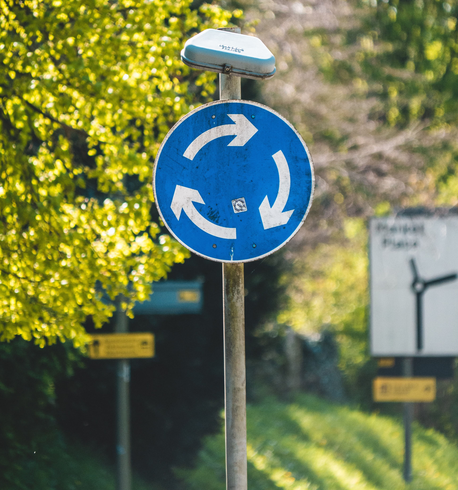

**Circular economy: Does it really take less, make more?**

In a circular economy, we keep resources in use for as long as possible, extract the maximum value from them whilst in use, then recover and regenerate products and materials at the end of the product’s service life. The circular economy is the next buzzword in sustainability. To what extent are its claims true and what are its limitations? Read more to find out.

**Perspective 1: Businesses can go green by making urban waste palatable for other products and applications in a circular economy.** 

By exploring ways to minimise waste consciously when designing processes or operations, businesses that adopt a circular economy could stand to benefit from cost savings in the long run and address security and scarcity resource issues. The circular economy can reduce harmful waste and could be more environmentally sustainable. 

Urban wastes such as wood from trees felled in urban areas or reclaimed wood from demolition can be kept in circulation for use by creating made-to-order products, made-to-stock furniture, flooring or beams. 

[https://www.bwf.org.uk/toolkit/environmental-waste-management/circular-economy/](https://www.bwf.org.uk/toolkit/environmental-waste-management/circular-economy/)

[https://bioresources.cnr.ncsu.edu/resources/the-case-for-urban-and-reclaimed-wood-in-the-circular-economy/](https://bioresources.cnr.ncsu.edu/resources/the-case-for-urban-and-reclaimed-wood-in-the-circular-economy/ ) 

[https://ellenmacarthurfoundation.org/articles/recycling-and-the-circular-seconomy-whats-the-difference](https://ellenmacarthurfoundation.org/articles/recycling-and-the-circular-economy-whats-the-difference ) 

[https://www.channelnewsasia.com/business/money-mind-circular-economy-linear-recycle-make-use-throw-invest-965446](https://www.channelnewsasia.com/business/money-mind-circular-economy-linear-recycle-make-use-throw-invest-965446)

**Perspective 2: Implementation of circular economies still has practical and environmental constraints which may hinder sustainability efforts.** 

The circular economy has critics questioning its effectiveness, given practical and environmental constraints as well as people’s economic and quality of life expectations. 

For instance, collecting and restoring end-of-life products requires energy inputs and new materials. Industries that adopt the closed-loop approach may include returning materials to original factories that are far away.

[https://hbr.org/2021/06/the-limits-of-the-sustainable-economy](https://hbr.org/2021/06/the-limits-of-the-sustainable-economy)

[https://www.tandfonline.com/doi/full/10.1080/09640568.2020.1857226](https://www.tandfonline.com/doi/full/10.1080/09640568.2020.1857226)

[https://www.sciencedirect.com/science/article/pii/S0921344919303349](https://www.sciencedirect.com/science/article/pii/S0921344919303349 ) 

[https://www.forbes.com/sites/thebakersinstitute/2021/08/03/a-circular-economy-does-not-necessarily-translate-to-sustainability/?sh=7ddec61a7f53](https://www.forbes.com/sites/thebakersinstitute/2021/08/03/a-circular-economy-does-not-necessarily-translate-to-sustainability/?sh=7ddec61a7f53 ) 

[https://onlinelibrary.wiley.com/doi/full/10.1111/jiec.13187](https://onlinelibrary.wiley.com/doi/full/10.1111/jiec.13187 ) 

**Which perspective do you agree with?**

Which perspective do you agree with the most? Vote [**here**](https://forms.gle/eQi7M8EFgeqvKTt18).

