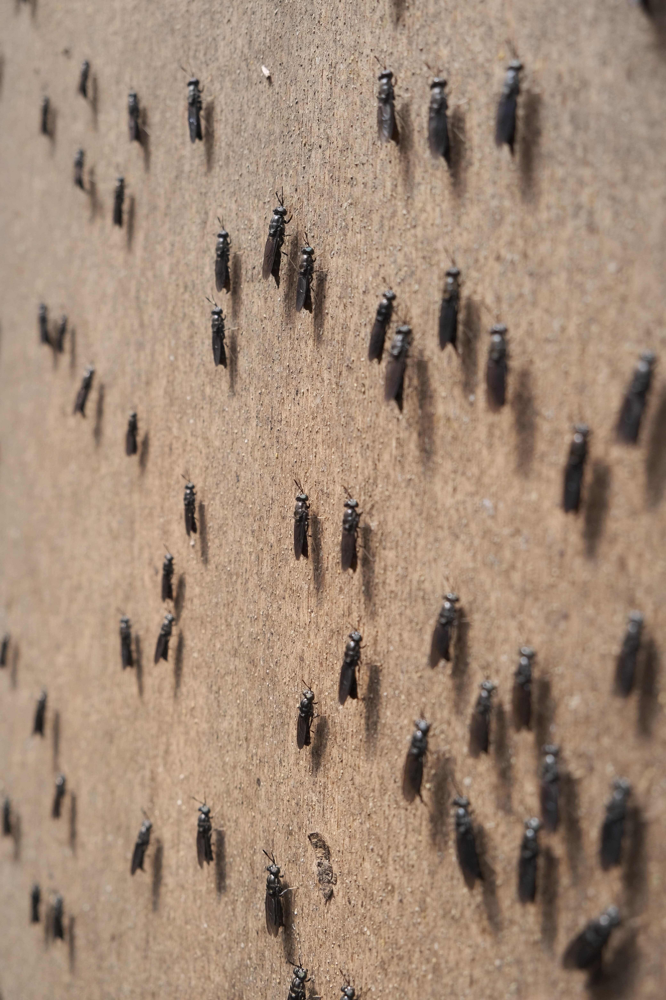

**Critters in composting: A buzzing potential?**

Composting is an eco-friendly way to turn food waste into valuable fertiliser. Insect composting takes it further as valuable biomaterial can be gleaned from the critters who compost food waste. What are the insects that can contribute to this transformative process? Also, find out how you can compost at home without insects.

**Perspective 1: The right insects are vital in revolutionising waste management.** 

Insects can eliminate food waste in a cleaner and greener way, and for some, convert it into sustainable and valuable by-products for agriculture. 

The black soldier fly is an ally in conserving the environment, given that it grows fast, eats food waste quickly and creates valuable biomaterials for organic farming. The waste-filled maggots can even be used as protein-rich animal feed. 

<a href="https://www.straitstimes.com/singapore/turning-trash-to-treasure-0"  target="_blank">https://www.straitstimes.com/singapore/turning-trash-to-treasure-0</a>

<a href="https://www.esquiremag.ph/long-reads/features/black-solider-fly-waste-a00293-20210804-lfrm"  target="_blank">https://www.esquiremag.ph/long-reads/features/black-solider-fly-waste-a00293-20210804-lfrm</a>

<a href="https://www.treehugger.com/china-maggots-munch-away-mountains-food-waste-4866603"  target="_blank">https://www.treehugger.com/china-maggots-munch-away-mountains-food-waste-4866603</a>

<a href="https://www.science.nus.edu.sg/blog/2022/02/07/interdisciplinary-team-to-develop-blueprint-for-sustainable-urban-food-waste-management-and-food-systems-using-black-soldier-flies/"  target="_blank">https://www.science.nus.edu.sg/blog/2022/02/07/interdisciplinary-team-to-develop-blueprint-for-sustainable-urban-food-waste-management-and-food-systems-using-black-soldier-flies/</a>

<a href="https://www.channelnewsasia.com/singapore/insects-solution-food-waste-money-mind-310351"  target="_blank">https://www.channelnewsasia.com/singapore/insects-solution-food-waste-money-mind-310351</a>

**Perspective 2: You don’t really need critters to compost at home.** 

Composting at home does not require harvesting insects. Reducing our carbon impact can begin at home with composting our food waste ourselves instead of sending it to incineration. 

Do-it-yourself composting at home can be done easily with composting bins, where the food waste is broken down by bacteria and other microorganisms via decomposition. 

<a href="https://www.channelnewsasia.com/watch/more-singaporeans-interested-growing-food-composting-video-2725866"  target="_blank">https://www.channelnewsasia.com/watch/more-singaporeans-interested-growing-food-composting-video-2725866</a>

<a href="https://www.super-farmers.com/blogs/news/can-we-practice-composting-in-space-strapped-hdbs-in-singapore"  target="_blank">https://www.super-farmers.com/blogs/news/can-we-practice-composting-in-space-strapped-hdbs-in-singapore</a>

<a href="https://www.nparks.gov.sg/gardening/gardening-resources/caring-for-plants/composting"  target="_blank">https://www.nparks.gov.sg/gardening/gardening-resources/caring-for-plants/composting</a>

<a href="http://www.zerowastesg.com/2009/02/04/start-composting-at-home"  target="_blank">http://www.zerowastesg.com/2009/02/04/start-composting-at-home/</a>

<a href="https://us.cnn.com/2022/01/13/cnn-underscored/how-to-compost-at-home/index.html"  target="_blank">https://us.cnn.com/2022/01/13/cnn-underscored/how-to-compost-at-home/index.html</a>

**Which perspective do you agree with?**

Which perspective do you agree with the most? Vote **<a href="https://forms.gle/YgUqtqRDHg9fZ8a48" target=_blank>here</a>**.