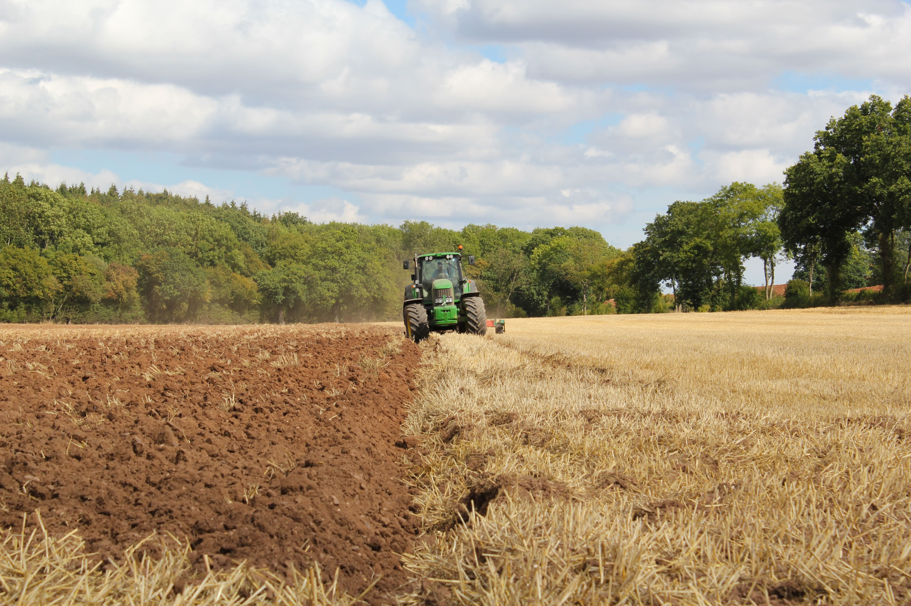

Photo by [Richard Bell](https://unsplash.com/@maplerockdesign?utm_source=unsplash&utm_medium=referral&utm_content=creditCopyText) on [Unsplash](https://unsplash.com/s/photos/farming?utm_source=unsplash&utm_medium=referral&utm_content=creditCopyText)

**Is it (im)possible for food production be environmentally sustainable?**

With limited resources and an expanding global population, it is becoming a challenge to produce enough food without using intensive farming methods that put a strain on the earth. How can food production stay sustainable and ease its impact on the planet? Is there a way to reduce greenhouse gas emissions and provide food for all? Read our perspectives to learn more about sustainable food production methods.

**Perspective 1: Sustainable food production methods with regard to land use and farming techniques can reduce global greenhouse gas emissions.** 

At each stage of food production, pollutants and greenhouse gas emissions are generated. Farm machinery, land use, transportation and even overproduction contribute to climate change. 

Organisations such as the World Wildlife Foundation are helping producers to improve the production of everyday food with the largest environmental impact by identifying and adopting more sustainable practices. 

<a href="https://www.wwf.org.au/what-we-do/food"  target="_blank">https://www.wwf.org.au/what-we-do/food</a>

<a href="https://ec.europa.eu/research-and-innovation/en/horizon-magazine/five-key-questions-answer-about-resilient-and-sustainable-food-systems"  target="_blank">https://ec.europa.eu/research-and-innovation/en/horizon-magazine/five-key-questions-answer-about-resilient-and-sustainable-food-systems </a>

<a href="https://ourworldindata.org/environmental-impacts-of-food"  target="_blank">https://ourworldindata.org/environmental-impacts-of-food</a>

<a href="https://www.bbc.com/future/article/20210629-the-australian-tree-cutting-brazilian-beefs-emissions"  target="_blank">https://www.bbc.com/future/article/20210629-the-australian-tree-cutting-brazilian-beefs-emissions </a>

**Perspective 2: Local food production can contribute to easing the environmental impact of emissions.**

While some parts of the world cannot be fully self-sufficient in food supply, eating food grown and produced locally may mitigate emissions associate with food transport. A recent study published in *Nature* journal showed that “global food-miles account for nearly 20% of total food system emissions”. 

We can do our part in Singapore, where local food production utilises less fuel and other resources. Local produce remain fresher and edible longer and can enhance our food supply resilience. 
<a href="https://www.nature.com/articles/s43016-022-00531-w"  target="_blank">https://www.nature.com/articles/s43016-022-00531-w</a>

<a href="https://safef.org.sg/blog/how-buying-local-produce-supports-singapores-future/"  target="_blank">https://safef.org.sg/blog/how-buying-local-produce-supports-singapores-future/</a>

<a href="https://safef.org.sg/blog/how-buying-local-produce-supports-singapores-future/
"  target="_blank">https://safef.org.sg/blog/how-buying-local-produce-supports-singapores-future/
</a>
<a href="https://www.bbc.com/future/bespoke/follow-the-food/how-to-grow-food-in-a-concrete-jungle/"  target="_blank"> https://www.bbc.com/future/bespoke/follow-the-food/how-to-grow-food-in-a-concrete-jungle/</a>

<a href="https://theconversation.com/the-worlds-affluent-must-start-eating-local-food-to-tackle-the-climate-crisis-new-research-shows-185410"  target="_blank"> https://theconversation.com/the-worlds-affluent-must-start-eating-local-food-to-tackle-the-climate-crisis-new-research-shows-185410</a>

 

**Which perspective do you agree with?**

Which perspective do you agree with the most? Vote **<a href="https://forms.gle/NVCs2yKCJxe3YMUA9" target="_blank">here</a>**.

