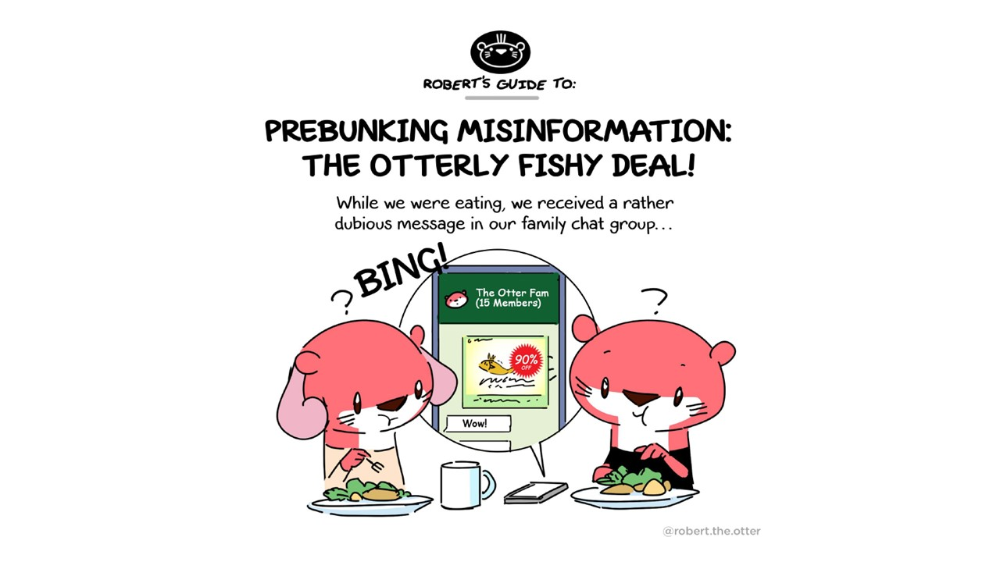

### What is "prebunking"?

You may be familiar with the concept of "debunking" misinformation, and websites like [AFP Factcheck](https://factcheck.afp.com/),  [Reuters Fact Check](https://www.reuters.com/fact-check) or [Factually](https://www.gov.sg/factually) which counter misinformation and disinformation using facts and counterarguments.  

Prebunking works differently. It involves being educated about misinformation *beforehand*, to instill a critical and awareness-driven mindset and to build media literacy. We can compare this to inoculation, or a vaccine against a disease. Essentially, prebunking prevents us from falling for misinformation in the first place.

Prebunking comes in different forms. [Google has produced a series of videos](https://news.sky.com/story/prebunking-the-new-tactic-to-help-you-people-spot-fake-news-12811636) which focus on different techniques used, like scapegoating, false comparisons and exaggeration. Before prebunking videos, it was thought that [playing games about fake news](https://firstdraftnews.org/articles/a-guide-to-prebunking-a-promising-way-to-inoculate-against-misinformation/) could be useful too.

### Robert the Otter comic

Still unsure about prebunking? Let Robert the Otter explain it to you in this comic, available in [Facebook](https://www.facebook.com/roberttheotter/posts/pfbid02TmKYYonZnB4RsAFEG9A4J5R53PT7sD9Kuof5YuMkaTpMGkPcnZbBojDx1WFJ5t6Wl) and [Instagram](https://www.instagram.com/p/CxsRnd4S1nJ/?utm_source=ig_web_copy_link&igshid=MzRlODBiNWFlZA==):

	
