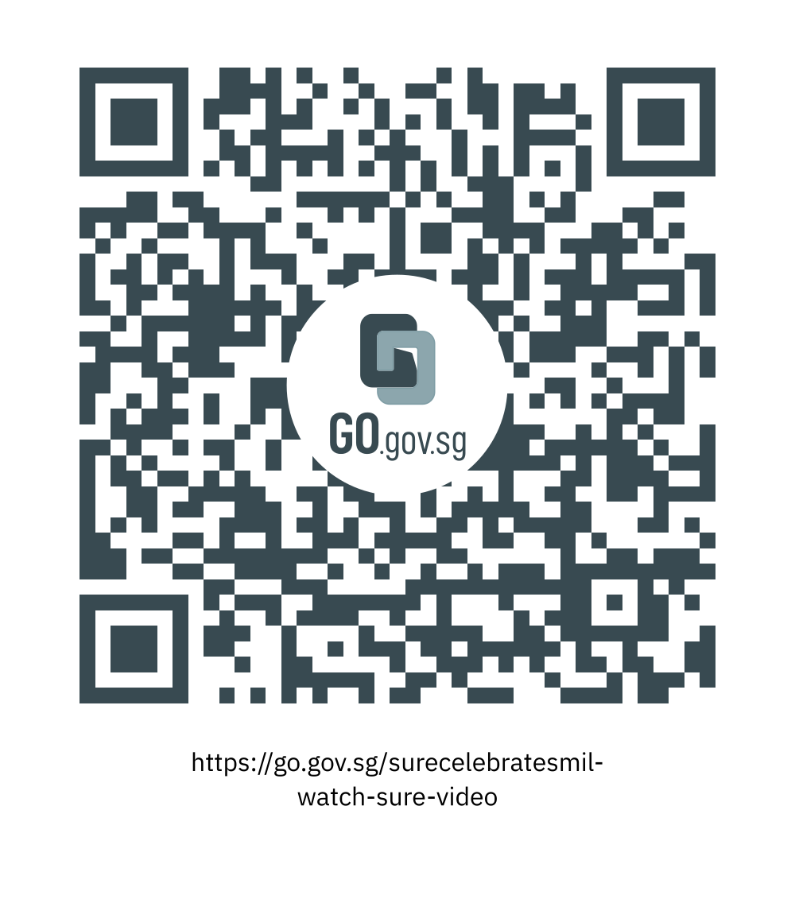

**Read to be SURE (RTBS)** is part of NLB’s Libraries and Archives Blueprint 2025 (LAB25), a five-year journey of our next phase of transformation. RTBS aims to educate and inform the public on trending topics through a combination of curated content and accompanying programmes. By exploring multiple perspectives on these topics, readers and participants will benefit from a balanced and credible knowledge base.

**Volume 2:**

- [Issue 1 - Gender Equality](/read-to-be-sure-volume-2/issue1-gender-equality/)

**Volume 1:**

- [Issue 1: Fast Fashion](/read-to-be-sure/issue1-introduction/)
- [Issue 2: COVID-19 Curbs](/read-to-be-sure/issue2-overview/)
- [Issue 3: Cryptocurrencies and NFTs](/read-to-be-sure/issue3-overview/)
- [Issue 4: Russia-Ukraine Information War](/read-to-be-sure/issue4-ukraine/)

<iframe width="560" height="315" src="https://www.youtube.com/embed/erOZVTrw5Zc" title="YouTube video player" frameborder="0" allow="accelerometer; autoplay; clipboard-write; encrypted-media; gyroscope; picture-in-picture" allowfullscreen></iframe>

We hope you enjoyed watching this video and exploring our Read To Be SURE issues.

Take part in the National Library Board’s “[S.U.R.E. BINGO Lucky Draw](https://sure.nlb.gov.sg/events/surecelebratesmil-bingo-howtoplay/)” by scanning the QR code or clicking on this link: **[https://go.gov.sg/surecelebratesmil-watch-rtbs-video](https://go.gov.sg/surecelebratesmil-watch-rtbs-video)**.

