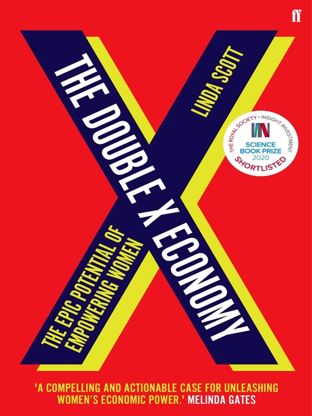
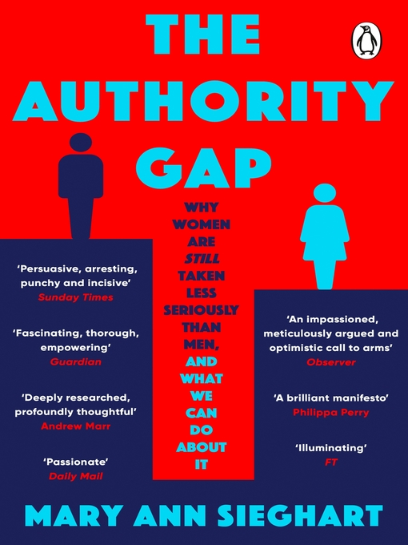
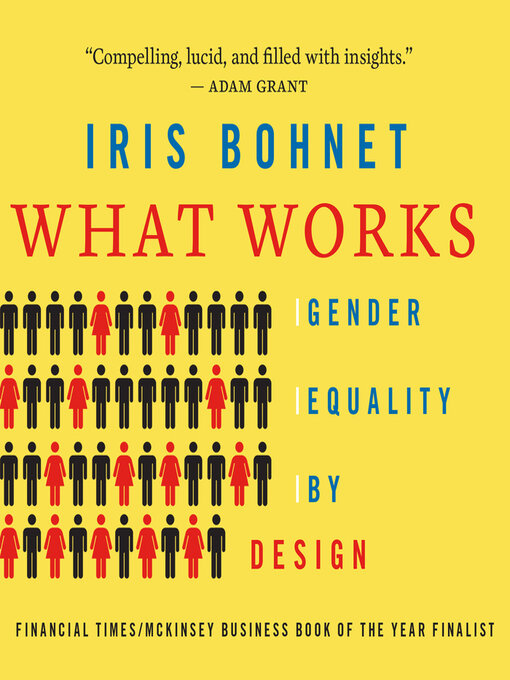
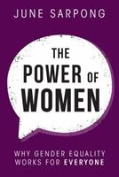

In this issue of Read to be SURE, explore multiple perspectives on the topic of gender equality, where is it not *just* a women’s issue. Take a moment to read, watch and listen to the journeys towards progress and equality for women and girls everywhere. 

This resource guide is produced in accompaniment to the Read to be SURE video:

[ PLACEHOLDER FOR MAIN VIDEO]

Gender equality provides equal rights, opportunities and responsibilities to people regardless of gender. Although there has been progress over the years, the challenges remain with a persistent gap in access to opportunities and empowerment between men and women across the world. 

 

In Singapore, [women earned 4.3 percent less](https://stats.mom.gov.sg/Pages/Update-on-Singapores-Adjusted-Gender-Pay-Gap.aspx) than men in 2020. Women also face various types of physical, sexual, and online harm. A 2021 survey showed that [2 in 5 workers](https://www.aware.org.sg/training/wsh-site/14-statistics/) encountered some form of workplace sexual harassment in the preceding five years. Such harassment has extended to the online space as well, with [163 new cases](https://www.aware.org.sg/2022/04/image-based-sexual-abuse-featured-in-7-in-10-cases-of-technology-facilitated-sexual-violence-seen-by-aware-in-2021/) of technology-facilitated sexual violence against women reported in 2021.  

 

Gender equality is key to a safer and healthier community, equal and inclusive society, and economic prosperity. To achieve this, we need to shift our mindsets, abolish patriarchal values, and empower women.

 

Explore the resources below to find out more about gender equality and why we need it. 

## NLB E-BOOKS

|                                                              | **Recommended Titles**                                       |
| ------------------------------------------------------------ | ------------------------------------------------------------ |
|  | [**The Moment of Lift: How Empowering Women Changes the World**](https://go.nlb.gov.sg/m-link/details?type=ebook&id=2317B9BC-0975-4086-9B41-648C15D5B6AE&utm_source=online&utm_campaign=RTBS_Sep22&utm_medium=website&utm_content=the_moment_of_lift) Gates, Melinda. (2019). The Moment of Lift: How Empowering Women Changes the World. London: Bluebird.   Retrieved from OverDrive. (myLibrary ID is required to access the audiobook).  Call number: English 305.42 GAT |
| <a href="https://go.nlb.gov.sg/m-link/details?type=ebook&id=7541DA74-C3B0-4D98-952C-6A80AD0E82AB&utm_source=online&utm_campaign=RTBS_Sep22&utm_medium=website&utm_content=double_x_economy"> | [**The Double X Economy: The Epic Potential of Empowering Women**](https://go.nlb.gov.sg/m-link/details?type=ebook&id=7541DA74-C3B0-4D98-952C-6A80AD0E82AB&utm_source=online&utm_campaign=RTBS_Sep22&utm_medium=website&utm_content=double_x_economy) Scott, Linda. (2020). The Double X Economy: The Epic Potential of Empowering Women. Faber & Faber.   Retrieved from OverDrive. (myLibrary ID is required to access the eBook). |
|  | **[Mother of Invention: How Good Ideas Get Ignored in a World Built for Men](https://go.nlb.gov.sg/m-link/details?type=ebook&id=85C86C5F-ABCB-4F7D-B7A2-7FEBE0130162&utm_source=online&utm_campaign=RTBS_Sep22&utm_medium=website&utm_content=mother_invention)** Marçal, Katrine. (2021). Mother of Invention: How Good Ideas Get Ignored in a World Built for Men. HarperCollins Publishing.   Retrieved from OverDrive. (myLibrary ID is required to access the eBook). |
|  | **[The Authority Gap: Why Women Are Still Taken Less Seriously Than Men, and What We Can Do About It](https://go.nlb.gov.sg/m-link/details?type=ebook&id=E7C37C1F-9EF8-4AB4-B2DE-D311B7C2AA90&utm_source=online&utm_campaign=RTBS_Sep22&utm_medium=website&utm_content=authority_gap)** Sieghart, Mary Ann. (2021). The Authority Gap: Why Women Are Still Taken Less Seriously Than Men, and What We Can Do About It. Transworld.   Retrieved from OverDrive. (myLibrary ID is required to access the eBook). |
|  | **[Awakening the Rainmaker: A Guide to Gender Equality](https://go.nlb.gov.sg/m-link/details?type=ebook&id=EFDAA6BE-139D-48D8-978A-ED6D886E1A15&utm_source=online&utm_campaign=RTBS_Sep22&utm_medium=website&utm_content=awakening_rainmaker)** Anand, Nishta. (2021). Awakening the Rainmaker: A Guide to Gender Equality. Bloomsbury Publishing.   Retrieved from OverDrive. (myLibrary ID is required to access the eBook). |
|  | **[What Works: Gender Equality by Design](https://go.nlb.gov.sg/m-link/details?type=ebook&id=06BAB8D4-C172-45B7-AE27-D6AB3414512C&utm_source=online&utm_campaign=RTBS_Sep22&utm_medium=website&utm_content=what_works)** Bohnet, Iris & Lefkow, Laurel. (2019). What Works: Gender Equality by Design. Dreamscape Media.   Retrieved from OverDrive. (myLibrary ID is required to access the Audiobook). |
|  | **[All the Rage: Mothers, Fathers, and the Myth of Equal Partnership](https://go.nlb.gov.sg/m-link/details?type=ebook&id=07E6478E-9635-49C8-A0ED-2EA289B77A8A&utm_source=online&utm_campaign=RTBS_Sep22&utm_medium=website&utm_content=all_the_rage)** Lockman, Darcy. (2019). All the Rage: Mothers, Fathers and the Myth of Equal Partnership. HarperCollins.   Retrieved from OverDrive. (myLibrary ID is required to access the eBook). |
|  | **[The Time Has Come: Why Men Must Join the Gender Equality Revolution](https://go.nlb.gov.sg/m-link/details?type=ebook&id=7B7C6191FE-8A55-461B-89EA-10E7AF66A61A&utm_source=online&utm_campaign=RTBS_Sep22&utm_medium=website&utm_content=the_time_has_come)** Kaufman, Michael. (2019). The Time Has Come: Why Men Must Join the Gender Equality Revolution. Catapult.   Retrieved from OverDrive. (myLibrary ID is required to access the eBook). |
|  | **[The Power of Women: Why Gender Equality Works for Everyone](https://go.nlb.gov.sg/m-link/details?type=ebook&id=CBEC1E9F-1C42-4777-827E-4F3B3370BB13&utm_source=online&utm_campaign=RTBS_Sep22&utm_medium=website&utm_content=power_of_women)** Sarpong, June. (2021). The Power of Women: Why Gender Equality Works for Everyone. London: Mira.   Retrieved from OverDrive. (myLibrary ID is required to access the eBook). |
|  | **[Sugarbread](https://go.nlb.gov.sg/m-link/details?type=ebook&id=6E560C78-FDFC-4AB8-9575-A913A5FA81FB&utm_source=online&utm_campaign=RTBS_Sep22&utm_medium=website&utm_content=sugarbread)** Jaswal, Balli Kaur. (2018). Sugarbread. Singapore: Epigram Books.   Retrieved from OverDrive. (myLibrary ID is required to access the eBook). |
|  | **[Madonnas and Mavericks: Power Women in Singapore](https://go.nlb.gov.sg/m-link/details?type=ebook&id=A1050438-9EF7-4552-A8D1-C47922EC3174&utm_source=online&utm_campaign=RTBS_Sep22&utm_medium=website&utm_content=madonnas_and_mavericks)** Chen, Loretta. (2017). Madonnas and Mavericks: Power Women in Singapore. Singapore: Marshall Cavendish International.   Retrieved from OverDrive. (myLibrary ID is required to access the eBook). |
|  | **[The Goddess in the Living Room](https://go.nlb.gov.sg/m-link/details?type=ebook&id=CCFECE98-619C-4C89-A064-2412756E7743 &utm_source=online&utm_campaign=RTBS_Sep22&utm_medium=website&utm_content=goddess_living_room)** Latha. (2014). The Goddess in the Living Room. Singapore: Epigram Books.   Retrieved from OverDrive. (myLibrary ID is required to access the eBook). |
|  | **[Mum Is Where the Heart Is](https://go.nlb.gov.sg/m-link/details?type=ebook&id=B3F9BBD2-4DE2-4C84-9443-C875E1CB9744&utm_source=online&utm_campaign=RTBS_Sep22&utm_medium=website&utm_content=mum_heart)** Jin, You. (2019). Mum Is Where the Heart Is. Singapore: Epigram Books.   Retrieved from OverDrive. (myLibrary ID is required to access the eBook). |
|  | **[Invisible Women: Exposing data bias in a world designed for men.](https://go.nlb.gov.sg/m-link/details?type=ebook&id=91115E7D-9D96-434F-9996-E60D55BDF481&utm_source=online&utm_campaign=RTBS_Sep22&utm_medium=website&utm_content=invisible_women)**  Perez, Caroline C. (2019). Invisible Women: Exposing data bias in a world designed for men. Random House.   Retrieved from OverDrive. (myLibrary ID is required to access the eBook). |
|  | **[Why we march: Signs of protests and hope – Voices from the Women’s March](https://go.nlb.gov.sg/m-link/details?type=ebook&id=E9D17C01-5FB0-4603-9042-C86D1BA56571&utm_source=online&utm_campaign=RTBS_Sep22&utm_medium=website&utm_content=why_we_march)** Artisan. (2017). Why we march: Signs of protests and hope – Voices from Women’s March.   Retrieved from OverDrive. (myLibrary ID is required to access the eBook). |
|                                                              |                                                              |

## VIDEOS

**[Gender Equality Starts at Home: Masagos Zulkifli](https://www.youtube.com/watch?v=4WH9U07girQ)**

CNA. (2022, March). *Gender Equality Starts at Home: Masagos Zulkifli.* Retrieved 2022, July 27

<iframe width="560" height="315" src="https://www.youtube.com/embed/4WH9U07girQ" title="YouTube video player" frameborder="0" allow="accelerometer; autoplay; clipboard-write; encrypted-media; gyroscope; picture-in-picture" allowfullscreen></iframe>

## WEBSITES

[**Global Gender Gap Narrowing, But Still 132 Years to Reach Parity**](https://www.internationalwomensday.com/Missions/18487/Global-gender-gap-narrowing-but-still-132-years-to-reach-parity) 
Global Gender Gap Narrowing, But Still 132 Years to Reach Parity. (2022, July). International Women’s Day. Retrieved 2022, July 27. 

[**Ten Things to Know About Gender Equality**](https://www.mckinsey.com/featured-insights/diversity-and-inclusion/ten-things-to-know-about-gender-equality) 
Krishnan, Mekala, et al. (2020, September 21). Ten Things to Know About Gender Equality. McKinsey & Company. Retrieved 2022, July 27. 

[**Commentary: What’s Behind Varying Attitudes About Gender Equality in Singapore**](https://kontinentalist.com/stories/sexual-assault-and-abuse-in-singapore-need-more-than-the-law) 
Mathews, Matthew. (2021, October 3). Commentary: What’s Behind Varying Attitudes About Gender Equality in Singapore. Institute of Policy Studies. Retrieved 2022, July 27. 

[**Sexual Violence in Singapore: A Crisis**](https://kontinentalist.com/stories/sexual-assault-and-abuse-in-singapore-need-more-than-the-law) 
Sexual Violence in Singapore: A Crisis. (2021, September 8). Kontinentalist. Retrieved 2022, August 10.

## PODCASTS

**[Reviewing Essential Feminist Book Titles with Amanda Chong](https://open.spotify.com/episode/5pB9wWqFfeniANlZmN1vS0)** 
Something Private. (2022, February 17). Reviewing Essential Feminist Book Titles with Amanda Chong. Retrieved 2022, August 10. 

[**Episode 18: Dismantling Patriarchy – Close Encounters and Imperfect Strategies**](https://open.spotify.com/episode/61IS693vxkxGf8uhUdknuM) 
Batliwala, Srilatha, et al. (2021, August 11). Episode 18: Dismantling Patriarchy – Close Encounters and Imperfect Strategies. Retrieved 2022, July 27. 

**[Breaking Bias to Build a More Gender-Equal World](https://www.ecb.europa.eu/press/tvservices/podcast/html/ecb.pod220305_episode29.en.html)** 
Lagarde, Christine, & Shafik, Minouche. (2022, March 5). Breaking Bias to Build a More Gender-Equal World. Retrieved 2022, July 27. 

**[How COVID Deepened Gender Inequality](https://www.weforum.org/agenda/2021/03/gender-inequality-covid-radio-davos-podcast-gendergap21/)** 
Radio Davos. (2021, March 31). How COVID Deepened Gender Inequality. Retrieved 2022, July 27. 

[**YWLChats**](https://open.spotify.com/show/15LZUPKYQMoMgDX3jaQmM0) 
Young Women’s Leadership Connection. (2022). YWLChats playlist. Retrieved 2022, August 22. 

