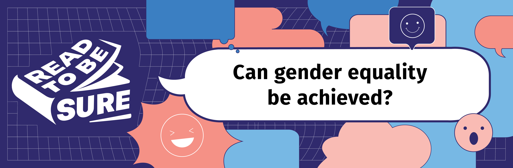

Today, [over 70% of women in Singapore](https://www.humanresourcesonline.net/71-of-women-surveyed-in-singapore-agree-gender-inequality-exists-at-the-workplace) agree that gender discrimination exists in the workplace.

However, men face challenges too. Locally, male pre-school teachers make up only [1% of the total pool of early childhood educators](https://www.channelnewsasia.com/cnainsider/stigma-distrust-male-preschool-teachers-shaping-minds-singapore-1329536). 

 

In this issue of Read to be SURE, take a moment to read, watch and listen to the journeys towards progress and equality for women and men everywhere.

<iframe width="560" height="315" src="https://www.youtube.com/embed/NPhX9ocUEOM" title="YouTube video player" frameborder="0" allow="accelerometer; autoplay; clipboard-write; encrypted-media; gyroscope; picture-in-picture" allowfullscreen></iframe>

*Watch the trailer [**here**](https://fb.watch/fSHelrDaFJ/).*  *Try the Gender Equality Quiz **<a href="https://forms.gle/cpSJ7rKV3GTZR2GLA" target="blank">here</a>**.*

## No: It’s a long way to go before gender equality can be achieved

##  

### 1. Gendered expectations affect mindsets and behaviours

- One [survey](https://www.herworld.com/life/sex-love/pay-first-date-dating-singapore/) showed that 2 in 5 people (both men and women) believe that men should pay for their dates. In [another survey](https://mothership.sg/2021/12/cmb-survey-women-dating-picky/), 23% of female respondents preferred for their partners to earn more than them, compared to 3% of male respondents.

- In relationships, there are also antiquated gender roles: the man is expected to propose; the woman shouldn’t take initiative in planning for proposals. Approximately [only 2% of women surveyed](https://www.zola.com/expert-advice/addressing-the-stigma-around-women-proposing-to-men) propose to their male partners, and two thirds of women feel they must wait for their partner to make their engagement official, even though 98% think of themselves as completely equal to their partners.

  

### 2. Gender discrimination affects both men and women

- In Singapore, [women earned 4.3 percent less](https://stats.mom.gov.sg/Pages/Update-on-Singapores-Adjusted-Gender-Pay-Gap.aspx) than men in 2020. Women also face various types of physical, sexual, and online harm. A 2021 survey showed that [2 in 5 workers](https://www.aware.org.sg/training/wsh-site/14-statistics/) encountered some form of workplace sexual harassment in the preceding five years. Such harassment has extended to the online space as well, with [163 new cases](https://www.aware.org.sg/2022/04/image-based-sexual-abuse-featured-in-7-in-10-cases-of-technology-facilitated-sexual-violence-seen-by-aware-in-2021/) of technology-facilitated sexual violence against women reported in 2021.

- Wage gaps remain, even in emerging industries like influencer marketing where women make up the majority of social media influencers, women often [charge less or have less negotiating power](https://qz.com/work/1618808/theres-even-a-gender-pay-gap-for-social-media-influencers/) when it comes to rates. Men get paid up to [49% more than women](https://www.forbes.com/sites/heatherleighton/2020/01/16/study-finds-a-pay-gap-between-male-and-female-influencers/?sh=7a22b534602f) for sponsored content on Instagram.
   

- Women in the modern economy cope with a “triple shift”: apart from work, there is raising kids and caring for elderly parents. A Mckinsey study found that the [‘double shift’ of housework and childcare on top of work](https://www.mckinsey.com/featured-insights/coronavirus-leading-through-the-crisis/charting-the-path-to-the-next-normal/the-double-shift-of-working-mothers-now-even-longer) is increasing for women and mothers are three times as likely as fathers to do most of the housework and caregiving.  Locally, we have higher labour-force participation rates from women and Singapore’s full-time female employment rate has been rising steadily over the past 10 years, but [women still bear the bulk of the caregiving burden](https://www.msf.gov.sg/media-room/Pages/Welcome-Remarks-By-Minister-Of-State-Sun-Xueling-at-Closing-Session-of-Conversations-on-Singapore-Women's-Development.aspx#:~:text=Our survey showed that women,for caregiving compared to men.), at the expense of their careers, income and savings.
  

- Men face stigma when they choose to be a stay-at-home father, and many stay silent when they [experience abuse or harassment because they are afraid to admit their vulnerability](https://www.straitstimes.com/opinion/forum/forum-men-can-also-be-victims-of-domestic-abuse).

   

- In female-dominated fields like nursing, [male nurses face stigma](https://www.todayonline.com/world/male-nurses-explain-why-nursing-job-future-men), while female nurses still struggle with a gender pay gap even though they make up the majority of staff.
   

## Yes: Policies are in place to promote gender equality, which is an ongoing process

### 1. Advocacy and Legislation 

- Advocacy has led to legislation, giving women recourse under the law when they are harassed or abused. For instance, the Protection from Harassment Act was amended in 2019 to include doxxing (i.e. the revealing and circulating of personal information about someone to the public without the person’s permission), and in 2020, marital rape also recognised as a crime.

  

- Singapore launched the [Conversations on Singapore Women's Development in 2020](https://www.msf.gov.sg/media-room/Pages/Conversations-on-Women-Development.aspx) and the [2022 White Paper on Women’s Development](https://www.scwo.org.sg/white-paper-on-singapore-womens-development-2022-scwos-board-president-ms-junie-foo-welcomes-the-recommendations/), which covered issues such as: 

  - [Allowing elective egg freezing for women aged 21 to 35 years old](https://www.todayonline.com/singapore/parliament-endorses-first-ever-white-paper-addressing-womens-issues-1865326), regardless of marital status.      
  - Women on Boards is one of the most visible and measurable aspects of diversity, and is a useful lead-in to an organisation’s consideration of broader diversity on their boards.  The [Council for Board Diversity](https://www.councilforboarddiversity.sg/driving-change/case-for-diverse-boards/) in Singapore encourages companies listed on SGX to achieve 25% Women On Boards by 2025, and 30% by 2030. 

### 2. Promoting gender equality at the workplace

- In industries like STEM, where gender imbalance is highly skewed, [less than 30 percent of all researchers worldwide are women](https://www.asianscientist.com/2021/02/topnews/international-day-women-girls-in-science-yougov-survey-singapore/). One possibility to overcome this to  [encourage more women to pursue education and careers in STEM](https://www.straitstimes.com/singapore/spore-must-do-more-to-empower-women-to-pursue-stem-careers-heng-swee-keat).

  

- Some companies turn to more proactive policies or affirmative action in hiring to encourage diversity or gender equalityFor example, [Facebook rewarded its recruiters extra for “diversity hires” and Microsoft is tying managers’ bonuses to their diversity hiring](https://www.bloomberg.com/news/articles/2017-01-10/some-tech-companies-are-trying-affirmative-action-hiring-but-don-t-call-it-that#xj4y7vzkg). 

 

### CONCLUSION

Although there has been progress over the years, the challenges remain with a persistent gap in access to opportunities and empowerment between men and women across the world.

Gender equality is key to a safer and healthier community, equal and inclusive society, and economic prosperity. To achieve this, we need to shift our mindsets, abolish patriarchal values, and empower both men and women. While it is encouraging that some companies support policies which incentivise diversity hiring could backfire if handled insensitively: other employees can grow resentful and a woman’s capability or talent when she is hired could be questioned if she is seen as a token diversity dire.

## Recommended Resources

Explore the resources below to find out more about gender equality.

## Videos

CNA. (2022, March). *Gender Equality Starts at Home: Masagos Zulkifli.* Retrieved 2022, July 27. 

<iframe width="560" height="315" src="https://www.youtube.com/embed/4WH9U07girQ" title="YouTube video player" frameborder="0" allow="accelerometer; autoplay; clipboard-write; encrypted-media; gyroscope; picture-in-picture" allowfullscreen></iframe>

 

CNA Insider. (2022, March). *Women in Asia Defy Norms In Gender Equality Strive. CNA Correspondent.* Retrieved 2022, July 27. 

<iframe width="560" height="315" src="https://www.youtube.com/embed/OXyNeU96zaM" title="YouTube video player" frameborder="0" allow="accelerometer; autoplay; clipboard-write; encrypted-media; gyroscope; picture-in-picture" allowfullscreen></iframe>

 

TEDx Talks. (2022, June 28). *Risks of the Gender Equality Business Case . Pascal Kornfuehrer .  TEDxIntlSchoolDüsseldorfWomen*. Retrieved 2022, July 27. 

<iframe width="560" height="315" src="https://www.youtube.com/embed/XGG0mTgNdRk" title="YouTube video player" frameborder="0" allow="accelerometer; autoplay; clipboard-write; encrypted-media; gyroscope; picture-in-picture" allowfullscreen></iframe>

 

Harvard Business Review. (2019, September 24). *When Will We Reach Gender Equality?* Retrieved 2022, July 27. 

<iframe width="560" height="315" src="https://www.youtube.com/embed/HchyqPO8K0I" title="YouTube video player" frameborder="0" allow="accelerometer; autoplay; clipboard-write; encrypted-media; gyroscope; picture-in-picture" allowfullscreen></iframe>

 

TEDx Talks. (2019, September 13). Why Gender Equality is Not Just About Women . Caroline Strachan . TEDxFolkestone. Retrieved 2022, July 27. 

<iframe width="560" height="315" src="https://www.youtube.com/embed/a4WuurpnSbc" title="YouTube video player" frameborder="0" allow="accelerometer; autoplay; clipboard-write; encrypted-media; gyroscope; picture-in-picture" allowfullscreen></iframe>

## Websites

[**Global Gender Gap Narrowing, But Still 132 Years to Reach Parity**](https://www.internationalwomensday.com/Missions/18487/Global-gender-gap-narrowing-but-still-132-years-to-reach-parity) 
Global Gender Gap Narrowing, But Still 132 Years to Reach Parity. (2022, July). International Women’s Day. Retrieved 2022, July 27. 

[**Ten Things to Know About Gender Equality**](https://www.mckinsey.com/featured-insights/diversity-and-inclusion/ten-things-to-know-about-gender-equality) 
Krishnan, Mekala, et al. (2020, September 21). Ten Things to Know About Gender Equality. McKinsey & Company. Retrieved 2022, July 27. 

[**Commentary: What’s Behind Varying Attitudes About Gender Equality in Singapore**](https://kontinentalist.com/stories/sexual-assault-and-abuse-in-singapore-need-more-than-the-law) 
Mathews, Matthew. (2021, October 3). Commentary: What’s Behind Varying Attitudes About Gender Equality in Singapore. Institute of Policy Studies. Retrieved 2022, July 27. 

[**Sexual Violence in Singapore: A Crisis**](https://kontinentalist.com/stories/sexual-assault-and-abuse-in-singapore-need-more-than-the-law) 
Sexual Violence in Singapore: A Crisis. (2021, September 8). Kontinentalist. Retrieved 2022, August 10.

## Podcasts

**[Reviewing Essential Feminist Book Titles with Amanda Chong](https://open.spotify.com/episode/5pB9wWqFfeniANlZmN1vS0)** 
Something Private. (2022, February 17). Reviewing Essential Feminist Book Titles with Amanda Chong. Retrieved 2022, August 10. 

[**Episode 18: Dismantling Patriarchy – Close Encounters and Imperfect Strategies**](https://open.spotify.com/episode/61IS693vxkxGf8uhUdknuM) 
Batliwala, Srilatha, et al. (2021, August 11). Episode 18: Dismantling Patriarchy – Close Encounters and Imperfect Strategies. Retrieved 2022, July 27. 

**[Breaking Bias to Build a More Gender-Equal World](https://www.ecb.europa.eu/press/tvservices/podcast/html/ecb.pod220305_episode29.en.html)** 
Lagarde, Christine, & Shafik, Minouche. (2022, March 5). Breaking Bias to Build a More Gender-Equal World. Retrieved 2022, July 27. 

**[How COVID Deepened Gender Inequality](https://www.weforum.org/agenda/2021/03/gender-inequality-covid-radio-davos-podcast-gendergap21/)** 
Radio Davos. (2021, March 31). How COVID Deepened Gender Inequality. Retrieved 2022, July 27. 

[**YWLChats**](https://open.spotify.com/show/15LZUPKYQMoMgDX3jaQmM0) 
Young Women’s Leadership Connection. (2022). YWLChats playlist. Retrieved 2022, August 22. 

## NLB eBooks

|                                                              | **Recommended Titles**                                       |
| ------------------------------------------------------------ | ------------------------------------------------------------ |
| <a href="https://go.nlb.gov.sg/m-link/details?type=ebook&id=7541DA74-C3B0-4D98-952C-6A80AD0E82AB&utm_source=online&utm_campaign=RTBS_Sep22&utm_medium=website&utm_content=double_x_economy">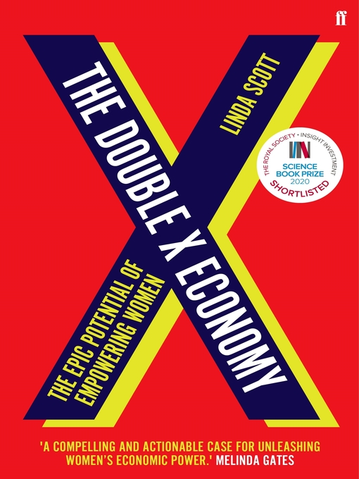 | [**The Double X Economy: The Epic Potential of Empowering Women**](https://go.nlb.gov.sg/m-link/details?type=ebook&id=7541DA74-C3B0-4D98-952C-6A80AD0E82AB&utm_source=online&utm_campaign=RTBS_Sep22&utm_medium=website&utm_content=double_x_economy) Scott, Linda. (2020). The Double X Economy: The Epic Potential of Empowering Women. Faber & Faber.   Retrieved from OverDrive. (myLibrary ID is required to access the eBook). |
| <a href="https://go.nlb.gov.sg/m-link/details?type=ebook&id=85C86C5F-ABCB-4F7D-B7A2-7FEBE0130162&utm_source=online&utm_campaign=RTBS_Sep22&utm_medium=website&utm_content=mother_invention">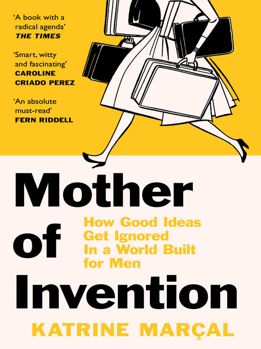</a> | **[Mother of Invention: How Good Ideas Get Ignored in a World Built for Men](https://go.nlb.gov.sg/m-link/details?type=ebook&id=85C86C5F-ABCB-4F7D-B7A2-7FEBE0130162&utm_source=online&utm_campaign=RTBS_Sep22&utm_medium=website&utm_content=mother_invention)** Marçal, Katrine. (2021). Mother of Invention: How Good Ideas Get Ignored in a World Built for Men. HarperCollins Publishing.   Retrieved from OverDrive. (myLibrary ID is required to access the eBook). |
| <a href="https://go.nlb.gov.sg/m-link/details?type=ebook&id=E7C37C1F-9EF8-4AB4-B2DE-D311B7C2AA90&utm_source=online&utm_campaign=RTBS_Sep22&utm_medium=website&utm_content=authority_gap">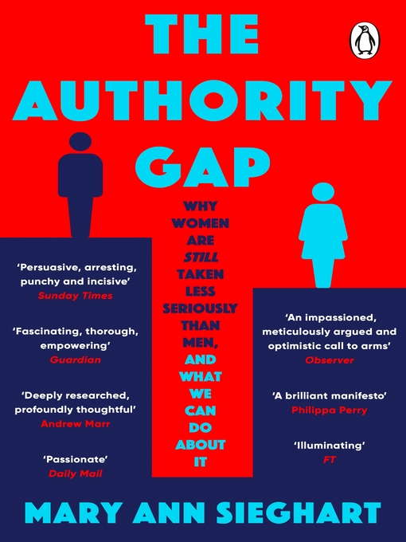</a> | **[The Authority Gap: Why Women Are Still Taken Less Seriously Than Men, and What We Can Do About It](https://go.nlb.gov.sg/m-link/details?type=ebook&id=E7C37C1F-9EF8-4AB4-B2DE-D311B7C2AA90&utm_source=online&utm_campaign=RTBS_Sep22&utm_medium=website&utm_content=authority_gap)** Sieghart, Mary Ann. (2021). The Authority Gap: Why Women Are Still Taken Less Seriously Than Men, and What We Can Do About It. Transworld.   Retrieved from OverDrive. (myLibrary ID is required to access the eBook). |
| <a href="https://go.nlb.gov.sg/m-link/details?type=ebook&id=EFDAA6BE-139D-48D8-978A-ED6D886E1A15&utm_source=online&utm_campaign=RTBS_Sep22&utm_medium=website&utm_content=awakening_rainmaker">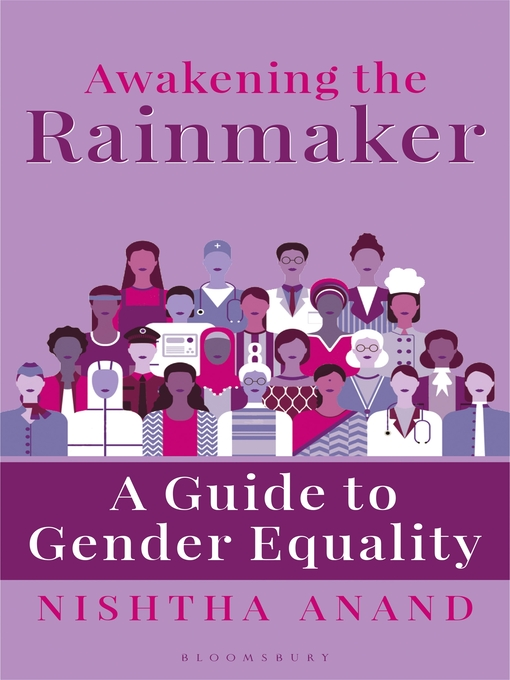</a> | **[Awakening the Rainmaker: A Guide to Gender Equality](https://go.nlb.gov.sg/m-link/details?type=ebook&id=EFDAA6BE-139D-48D8-978A-ED6D886E1A15&utm_source=online&utm_campaign=RTBS_Sep22&utm_medium=website&utm_content=awakening_rainmaker)** Anand, Nishta. (2021). Awakening the Rainmaker: A Guide to Gender Equality. Bloomsbury Publishing.   Retrieved from OverDrive. (myLibrary ID is required to access the eBook). |
| <a href="https://go.nlb.gov.sg/m-link/details?type=ebook&id=06BAB8D4-C172-45B7-AE27-D6AB3414512C&utm_source=online&utm_campaign=RTBS_Sep22&utm_medium=website&utm_content=what_works">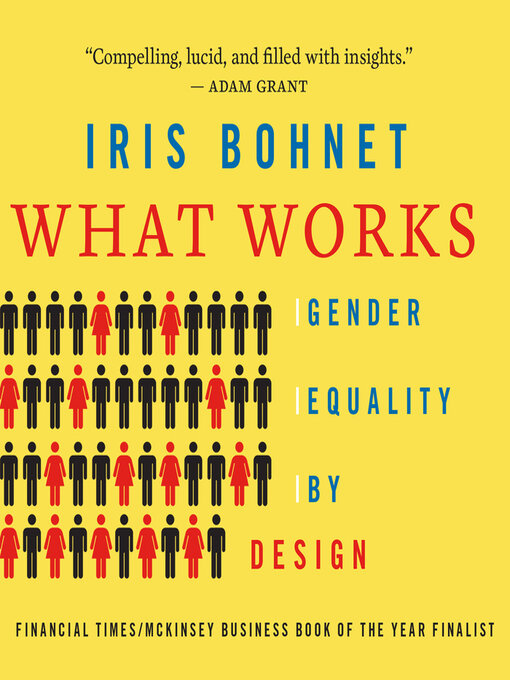</a> | **[What Works: Gender Equality by Design](https://go.nlb.gov.sg/m-link/details?type=ebook&id=06BAB8D4-C172-45B7-AE27-D6AB3414512C&utm_source=online&utm_campaign=RTBS_Sep22&utm_medium=website&utm_content=what_works)** Bohnet, Iris & Lefkow, Laurel. (2019). What Works: Gender Equality by Design. Dreamscape Media.   Retrieved from OverDrive. (myLibrary ID is required to access the Audiobook). |
| <a href="https://go.nlb.gov.sg/m-link/details?type=ebook&id=07E6478E-9635-49C8-A0ED-2EA289B77A8A&utm_source=online&utm_campaign=RTBS_Sep22&utm_medium=website&utm_content=all_the_rage">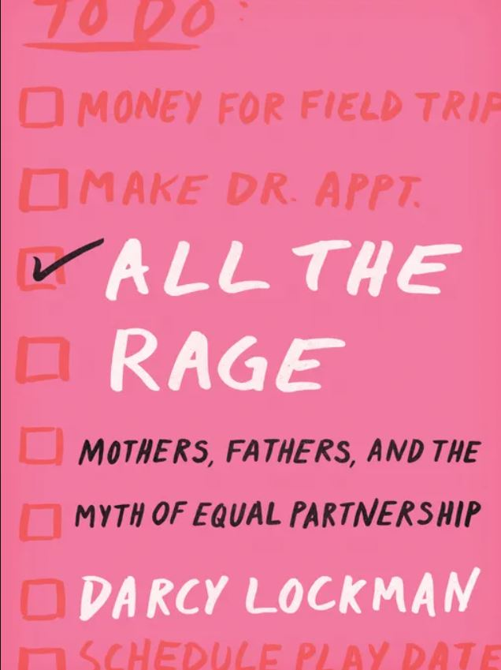</a> | **[All the Rage: Mothers, Fathers, and the Myth of Equal Partnership](https://go.nlb.gov.sg/m-link/details?type=ebook&id=07E6478E-9635-49C8-A0ED-2EA289B77A8A&utm_source=online&utm_campaign=RTBS_Sep22&utm_medium=website&utm_content=all_the_rage)** Lockman, Darcy. (2019). All the Rage: Mothers, Fathers and the Myth of Equal Partnership. HarperCollins.   Retrieved from OverDrive. (myLibrary ID is required to access the eBook). |
| <a href="https://go.nlb.gov.sg/m-link/details?type=ebook&id=7C6191FE-8A55-461B-89EA-10E7AF66A61A&utm_source=online&utm_campaign=RTBS_Sep22&utm_medium=website&utm_content=the_time_has_come">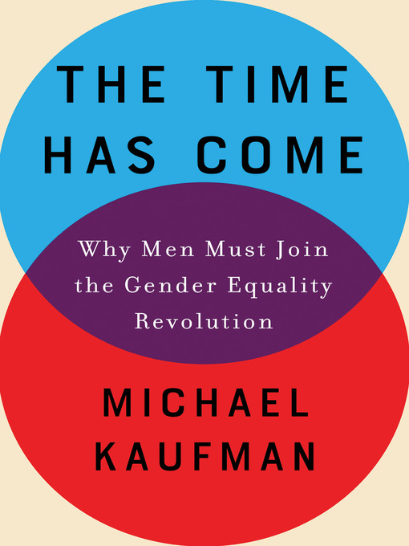</a> | **[The Time Has Come: Why Men Must Join the Gender Equality Revolution](https://go.nlb.gov.sg/m-link/details?type=ebook&id=7C6191FE-8A55-461B-89EA-10E7AF66A61A&utm_source=online&utm_campaign=RTBS_Sep22&utm_medium=website&utm_content=the_time_has_come)** Kaufman, Michael. (2019). The Time Has Come: Why Men Must Join the Gender Equality Revolution. Catapult.   Retrieved from OverDrive. (myLibrary ID is required to access the eBook). |
| <a href="https://go.nlb.gov.sg/m-link/details?type=ebook&id=CBEC1E9F-1C42-4777-827E-4F3B3370BB13&utm_source=online&utm_campaign=RTBS_Sep22&utm_medium=website&utm_content=power_of_women">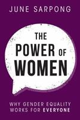</a> | **[The Power of Women: Why Gender Equality Works for Everyone](https://go.nlb.gov.sg/m-link/details?type=ebook&id=CBEC1E9F-1C42-4777-827E-4F3B3370BB13&utm_source=online&utm_campaign=RTBS_Sep22&utm_medium=website&utm_content=power_of_women)** Sarpong, June. (2021). The Power of Women: Why Gender Equality Works for Everyone. London: Mira.   Retrieved from OverDrive. (myLibrary ID is required to access the eBook). |
|  | **[Sugarbread](https://go.nlb.gov.sg/m-link/details?type=ebook&id=6E560C78-FDFC-4AB8-9575-A913A5FA81FB&utm_source=online&utm_campaign=RTBS_Sep22&utm_medium=website&utm_content=sugarbread)** Jaswal, Balli Kaur. (2018). Sugarbread. Singapore: Epigram Books.   Retrieved from OverDrive. (myLibrary ID is required to access the eBook). |
| <a href="https://go.nlb.gov.sg/m-link/details?type=ebook&id=A1050438-9EF7-4552-A8D1-C47922EC3174&utm_source=online&utm_campaign=RTBS_Sep22&utm_medium=website&utm_content=madonnas_and_mavericks">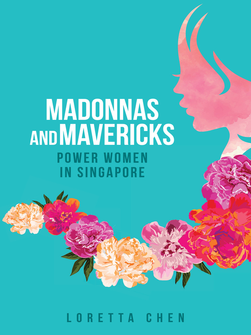</a> | **[Madonnas and Mavericks: Power Women in Singapore](https://go.nlb.gov.sg/m-link/details?type=ebook&id=A1050438-9EF7-4552-A8D1-C47922EC3174&utm_source=online&utm_campaign=RTBS_Sep22&utm_medium=website&utm_content=madonnas_and_mavericks)** Chen, Loretta. (2017). Madonnas and Mavericks: Power Women in Singapore. Singapore: Marshall Cavendish International.   Retrieved from OverDrive. (myLibrary ID is required to access the eBook). |
|  | **[The Goddess in the Living Room](https://go.nlb.gov.sg/m-link/details?type=ebook&id=CCFECE98-619C-4C89-A064-2412756E7743 &utm_source=online&utm_campaign=RTBS_Sep22&utm_medium=website&utm_content=goddess_living_room)** Latha. (2014). The Goddess in the Living Room. Singapore: Epigram Books.   Retrieved from OverDrive. (myLibrary ID is required to access the eBook). |
| <a href="https://go.nlb.gov.sg/m-link/details?type=ebook&id=B3F9BBD2-4DE2-4C84-9443-C875E1CB9744&utm_source=online&utm_campaign=RTBS_Sep22&utm_medium=website&utm_content=mum_heart">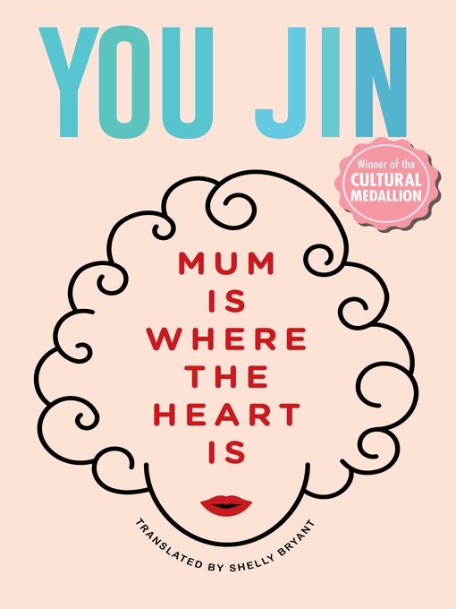</a> | **[Mum Is Where the Heart Is](https://go.nlb.gov.sg/m-link/details?type=ebook&id=B3F9BBD2-4DE2-4C84-9443-C875E1CB9744&utm_source=online&utm_campaign=RTBS_Sep22&utm_medium=website&utm_content=mum_heart)** Jin, You. (2019). Mum Is Where the Heart Is. Singapore: Epigram Books.   Retrieved from OverDrive. (myLibrary ID is required to access the eBook). |
| <a href="https://go.nlb.gov.sg/m-link/details?type=ebook&id=91115E7D-9D96-434F-9996-E60D55BDF481&utm_source=online&utm_campaign=RTBS_Sep22&utm_medium=website&utm_content=invisible_women">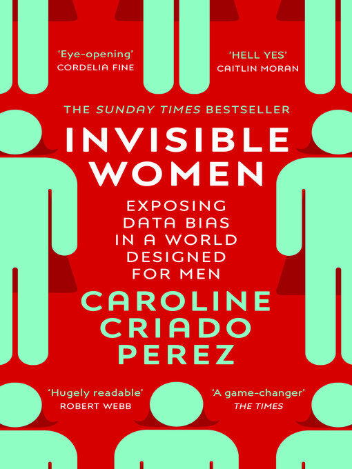</a> | **[Invisible Women: Exposing data bias in a world designed for men.](https://go.nlb.gov.sg/m-link/details?type=ebook&id=91115E7D-9D96-434F-9996-E60D55BDF481&utm_source=online&utm_campaign=RTBS_Sep22&utm_medium=website&utm_content=invisible_women)**  Perez, Caroline C. (2019). Invisible Women: Exposing data bias in a world designed for men. Random House.   Retrieved from OverDrive. (myLibrary ID is required to access the eBook). |
| <a href="https://go.nlb.gov.sg/m-link/details?type=ebook&id=E9D17C01-5FB0-4603-9042-C86D1BA56571&utm_source=online&utm_campaign=RTBS_Sep22&utm_medium=website&utm_content=why_we_march">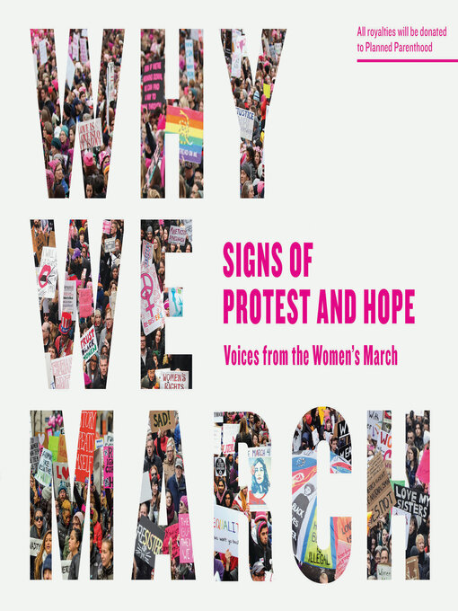</a> | **[Why we march: Signs of protests and hope – Voices from the Women’s March](https://go.nlb.gov.sg/m-link/details?type=ebook&id=E9D17C01-5FB0-4603-9042-C86D1BA56571&utm_source=online&utm_campaign=RTBS_Sep22&utm_medium=website&utm_content=why_we_march)** Artisan. (2017). Why we march: Signs of protests and hope – Voices from Women’s March.   Retrieved from OverDrive. (myLibrary ID is required to access the eBook). |
|                                                              |                                                              |

