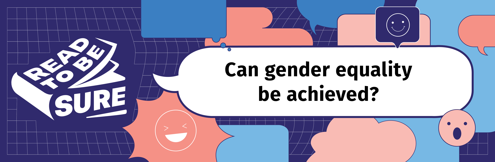
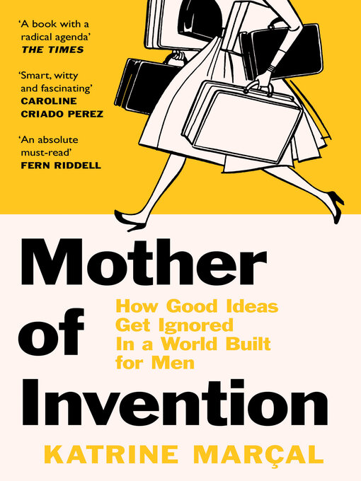
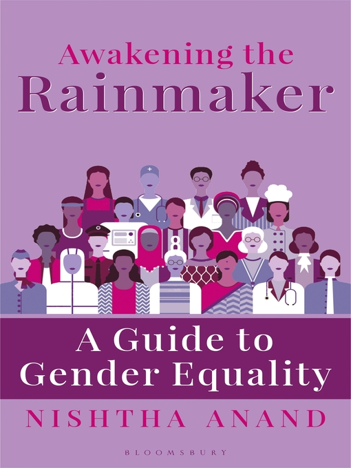
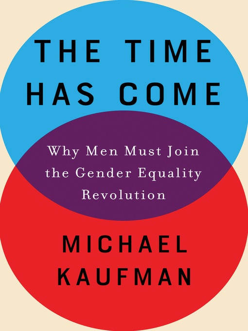

Today, [over 70% of women in Singapore](https://www.humanresourcesonline.net/71-of-women-surveyed-in-singapore-agree-gender-inequality-exists-at-the-workplace) agree that gender discrimination exists in the workplace.

However, men face challenges too. Locally, male pre-school teachers make up only [1% of the total pool of early childhood educators](https://www.channelnewsasia.com/cnainsider/stigma-distrust-male-preschool-teachers-shaping-minds-singapore-1329536). 

*How much do you know about gender equality? Test your knowledge here:*

<iframe width="560" height="315" src="https://www.youtube.com/embed/pXdPY15pSjs" title="YouTube video player" frameborder="0" allow="accelerometer; autoplay; clipboard-write; encrypted-media; gyroscope; picture-in-picture" allowfullscreen></iframe>

Can you do better than our guest speakers? Try the **<a href="https://forms.gle/YpDfWBT8xa4PNqpG8" target="_blank">Gender Equality Quiz</a>** now!

## So, can gender equality be achieved?

| NO, LONG WAY TO GO!                                       | YES, IT CAN BE ACHIEVED!                                  |
| :----------------------------------------------------------- | ------------------------------------------------------------ |
| **1.**   **Not everyone is supportive.**  [1 in 3 Singaporean men](https://www.ipsos.com/en-sg/singaporeans-attitudes-towards-gender-equality-feminism-and-online-behaviour) believe feminism does more harm than good and that traditional masculinity is under threat. A quarter of Singaporeans do not believe that gender inequality exists. | **1. Advocacy and Legislation**  Singapore launched the [Conversations on Singapore Women's Development in 2020](https://www.msf.gov.sg/media-room/Pages/Conversations-on-Women-Development.aspx) and the [2022 White Paper on Women’s Development](https://www.scwo.org.sg/white-paper-on-singapore-womens-development-2022-scwos-board-president-ms-junie-foo-welcomes-the-recommendations/), which covered issues from [elective egg freezing](https://www.todayonline.com/singapore/parliament-endorses-first-ever-white-paper-addressing-womens-issues-1865326) to having more Women in various fields.  |
| **2. Gendered expectations affect mindsets and behaviours** One [survey](https://www.herworld.com/life/sex-love/pay-first-date-dating-singapore/) showed that 2 in 5 people (both men and women) believe that men should pay for their dates.  Approximately [only 2% of women surveyed](https://www.zola.com/expert-advice/addressing-the-stigma-around-women-proposing-to-men) propose to their male partners, and two thirds of women feel they must wait for their partner to make their engagement official, even though 98% think of themselves as completely equal to their partners. | **2. Promoting gender equality at the workplace** In industries like STEM, where gender imbalance is highly skewed, [less than 30 percent of all researchers worldwide are women](https://www.asianscientist.com/2021/02/topnews/international-day-women-girls-in-science-yougov-survey-singapore/). One possibility to overcome this to [encourage more women to pursue education and careers in STEM](https://www.straitstimes.com/singapore/spore-must-do-more-to-empower-women-to-pursue-stem-careers-heng-swee-keat).  Some companies support policies which incentivise diversity hiring. For example, [Facebook rewarded its recruiters extra for “diversity hires” and Microsoft is tying managers’ bonuses to their diversity hiring](https://www.bloomberg.com/news/articles/2017-01-10/some-tech-companies-are-trying-affirmative-action-hiring-but-don-t-call-it-that#xj4y7vzkg). |

**Gender discrimination affects both men and women**

- In Singapore, [women earned 4.3 percent less](https://stats.mom.gov.sg/Pages/Update-on-Singapores-Adjusted-Gender-Pay-Gap.aspx) than men in 2020. Women also face various types of physical, sexual, and online harm. A 2021 survey showed that [2 in 5 workers](https://www.aware.org.sg/training/wsh-site/14-statistics/) encountered some form of workplace sexual harassment in the preceding five years. Such harassment has extended to the online space as well, with [163 new cases](https://www.aware.org.sg/2022/04/image-based-sexual-abuse-featured-in-7-in-10-cases-of-technology-facilitated-sexual-violence-seen-by-aware-in-2021/) of technology-facilitated sexual violence against women reported in 2021.

  

- Women in the modern economy cope with a “triple shift”: apart from work, there is raising kids and caring for elderly parents. A Mckinsey study found that the [‘double shift’ of housework and childcare on top of work](https://www.mckinsey.com/featured-insights/coronavirus-leading-through-the-crisis/charting-the-path-to-the-next-normal/the-double-shift-of-working-mothers-now-even-longer) is increasing for women and mothers are three times as likely as fathers to do most of the housework and caregiving. Locally, we have higher labour-force participation rates from women and Singapore’s full-time female employment rate has been rising steadily over the past 10 years, but [women still bear the bulk of the caregiving burden](https://www.msf.gov.sg/media-room/Pages/Welcome-Remarks-By-Minister-Of-State-Sun-Xueling-at-Closing-Session-of-Conversations-on-Singapore-Women's-Development.aspx#:~:text=Our survey showed that women,for caregiving compared to men.), at the expense of their careers, income and savings.

  

- In female-dominated fields like nursing, [male nurses face stigma](https://www.todayonline.com/world/male-nurses-explain-why-nursing-job-future-men), while female nurses still struggle with a gender pay gap even though they make up the majority of staff.

  

- [Stay-at-home fathers](https://www.todayonline.com/singapore/stay-home-fathers-spore-face-stigma-amid-persistent-belief-mothers-are-best-caregivers) in Singapore face stigma. Family policies in Singapore continue to signal that [childcare](https://mothership.sg/2022/03/louis-ng-paternity-leave-childcare-sick-leave/) is a woman’s responsibility and reinforce gender stereotypes. 

**Conclusion**

 Although there has been progress over the years, the challenges remain with a persistent gap in access to opportunities and empowerment between men and women across the world.  Gender equality is key to a safer and healthier community, equal and inclusive society, and economic prosperity. To achieve this, we need to shift our mindsets, abolish patriarchal values, and empower both men and women.

## Poll: Your views matter!

If you are unable to view the embedded form below, please click **<a href="https://forms.gle/EMfzJCqisS1EH2fB8" target="_blank">here</a>**.

<iframe src="https://docs.google.com/forms/d/e/1FAIpQLScKMjR_hPSy9SDUvKZSfQqs12W66lckc0t17QCyq_nuxroK6w/viewform?embedded=true" width="640" height="400" frameborder="0" marginheight="0" marginwidth="0">Loading…</iframe>

​	

Let's hear our guest speakers weigh in on this issue:

<iframe width="560" height="315" src="https://www.youtube.com/embed/NPhX9ocUEOM" title="YouTube video player" frameborder="0" allow="accelerometer; autoplay; clipboard-write; encrypted-media; gyroscope; picture-in-picture" allowfullscreen></iframe>

## Evacomics

If you are unable to view the Instagram or Facebook post embedded below, click **<a href="https://www.instagram.com/p/CjVSKCwBSbv/?utm_source=ig_web_copy_link" target="_blank">here</a>** and **<a href="https://www.facebook.com/evacomics/posts/pfbid022HqT9r3eF2ARxEi9NNgHMg3L3pZ3GdzrJnDwFTjtVhe14QyyAtjUYkNf2yTHVVPGl" target="_blank">here</a>** respectively.

<blockquote class="instagram-media" data-instgrm-captioned data-instgrm-permalink="https://www.instagram.com/p/CjVSKCwBSbv/?utm_source=ig_embed&amp;utm_campaign=loading" data-instgrm-version="14" style=" background:#FFF; border:0; border-radius:3px; box-shadow:0 0 1px 0 rgba(0,0,0,0.5),0 1px 10px 0 rgba(0,0,0,0.15); margin: 1px; max-width:540px; min-width:326px; padding:0; width:99.375%; width:-webkit-calc(100% - 2px); width:calc(100% - 2px);">
 <a href="https://www.instagram.com/p/CjVSKCwBSbv/?utm_source=ig_embed&amp;utm_campaign=loading" style=" background:#FFFFFF; line-height:0; padding:0 0; text-align:center; text-decoration:none; width:100%;" target="_blank"> 
 

 
 

 

 
<svg width="50px" height="50px" viewBox="0 0 60 60" version="1.1" xmlns="https://www.w3.org/2000/svg" xmlns:xlink="https://www.w3.org/1999/xlink"><g stroke="none" stroke-width="1" fill="none" fill-rule="evenodd"><g transform="translate(-511.000000, -20.000000)" fill="#000000"><g><path d="M556.869,30.41 C554.814,30.41 553.148,32.076 553.148,34.131 C553.148,36.186 554.814,37.852 556.869,37.852 C558.924,37.852 560.59,36.186 560.59,34.131 C560.59,32.076 558.924,30.41 556.869,30.41 M541,60.657 C535.114,60.657 530.342,55.887 530.342,50 C530.342,44.114 535.114,39.342 541,39.342 C546.887,39.342 551.658,44.114 551.658,50 C551.658,55.887 546.887,60.657 541,60.657 M541,33.886 C532.1,33.886 524.886,41.1 524.886,50 C524.886,58.899 532.1,66.113 541,66.113 C549.9,66.113 557.115,58.899 557.115,50 C557.115,41.1 549.9,33.886 541,33.886 M565.378,62.101 C565.244,65.022 564.756,66.606 564.346,67.663 C563.803,69.06 563.154,70.057 562.106,71.106 C561.058,72.155 560.06,72.803 558.662,73.347 C557.607,73.757 556.021,74.244 553.102,74.378 C549.944,74.521 548.997,74.552 541,74.552 C533.003,74.552 532.056,74.521 528.898,74.378 C525.979,74.244 524.393,73.757 523.338,73.347 C521.94,72.803 520.942,72.155 519.894,71.106 C518.846,70.057 518.197,69.06 517.654,67.663 C517.244,66.606 516.755,65.022 516.623,62.101 C516.479,58.943 516.448,57.996 516.448,50 C516.448,42.003 516.479,41.056 516.623,37.899 C516.755,34.978 517.244,33.391 517.654,32.338 C518.197,30.938 518.846,29.942 519.894,28.894 C520.942,27.846 521.94,27.196 523.338,26.654 C524.393,26.244 525.979,25.756 528.898,25.623 C532.057,25.479 533.004,25.448 541,25.448 C548.997,25.448 549.943,25.479 553.102,25.623 C556.021,25.756 557.607,26.244 558.662,26.654 C560.06,27.196 561.058,27.846 562.106,28.894 C563.154,29.942 563.803,30.938 564.346,32.338 C564.756,33.391 565.244,34.978 565.378,37.899 C565.522,41.056 565.552,42.003 565.552,50 C565.552,57.996 565.522,58.943 565.378,62.101 M570.82,37.631 C570.674,34.438 570.167,32.258 569.425,30.349 C568.659,28.377 567.633,26.702 565.965,25.035 C564.297,23.368 562.623,22.342 560.652,21.575 C558.743,20.834 556.562,20.326 553.369,20.18 C550.169,20.033 549.148,20 541,20 C532.853,20 531.831,20.033 528.631,20.18 C525.438,20.326 523.257,20.834 521.349,21.575 C519.376,22.342 517.703,23.368 516.035,25.035 C514.368,26.702 513.342,28.377 512.574,30.349 C511.834,32.258 511.326,34.438 511.181,37.631 C511.035,40.831 511,41.851 511,50 C511,58.147 511.035,59.17 511.181,62.369 C511.326,65.562 511.834,67.743 512.574,69.651 C513.342,71.625 514.368,73.296 516.035,74.965 C517.703,76.634 519.376,77.658 521.349,78.425 C523.257,79.167 525.438,79.673 528.631,79.82 C531.831,79.965 532.853,80.001 541,80.001 C549.148,80.001 550.169,79.965 553.369,79.82 C556.562,79.673 558.743,79.167 560.652,78.425 C562.623,77.658 564.297,76.634 565.965,74.965 C567.633,73.296 568.659,71.625 569.425,69.651 C570.167,67.743 570.674,65.562 570.82,62.369 C570.966,59.17 571,58.147 571,50 C571,41.851 570.966,40.831 570.82,37.631"></path></g></g></g></svg>

 
View this post on Instagram

 

 

 

 

 

 

 

 

 

 
 

 

</a>
<a href="https://www.instagram.com/p/CjVSKCwBSbv/?utm_source=ig_embed&amp;utm_campaign=loading" style=" color:#c9c8cd; font-family:Arial,sans-serif; font-size:14px; font-style:normal; font-weight:normal; line-height:17px; text-decoration:none;" target="_blank">A post shared by Evangeline Neo (@evacomics)</a>

</blockquote> 

<iframe src="https://www.facebook.com/plugins/post.php?href=https%3A%2F%2Fwww.facebook.com%2Fevacomics%2Fposts%2Fpfbid022HqT9r3eF2ARxEi9NNgHMg3L3pZ3GdzrJnDwFTjtVhe14QyyAtjUYkNf2yTHVVPGl&show_text=false&width=500" width="500" height="498" style="border:none;overflow:hidden" scrolling="no" frameborder="0" allowfullscreen="true" allow="autoplay; clipboard-write; encrypted-media; picture-in-picture; web-share"></iframe>

## Recommended Resources

Explore the resources below to find out more about gender equality.

### Videos

CNA. (2022, March). *Gender Equality Starts at Home: Masagos Zulkifli.* Retrieved 2022, July 27. 

<iframe width="560" height="315" src="https://www.youtube.com/embed/4WH9U07girQ" title="YouTube video player" frameborder="0" allow="accelerometer; autoplay; clipboard-write; encrypted-media; gyroscope; picture-in-picture" allowfullscreen></iframe>

 

CNA Insider. (2022, March). *Women in Asia Defy Norms In Gender Equality Strive. CNA Correspondent.* Retrieved 2022, July 27. 

<iframe width="560" height="315" src="https://www.youtube.com/embed/OXyNeU96zaM" title="YouTube video player" frameborder="0" allow="accelerometer; autoplay; clipboard-write; encrypted-media; gyroscope; picture-in-picture" allowfullscreen></iframe>

 

TEDx Talks. (2022, June 28). *Risks of the Gender Equality Business Case . Pascal Kornfuehrer .  TEDxIntlSchoolDüsseldorfWomen*. Retrieved 2022, July 27. 

<iframe width="560" height="315" src="https://www.youtube.com/embed/XGG0mTgNdRk" title="YouTube video player" frameborder="0" allow="accelerometer; autoplay; clipboard-write; encrypted-media; gyroscope; picture-in-picture" allowfullscreen></iframe>

 

Harvard Business Review. (2019, September 24). *When Will We Reach Gender Equality?* Retrieved 2022, July 27. 

<iframe width="560" height="315" src="https://www.youtube.com/embed/HchyqPO8K0I" title="YouTube video player" frameborder="0" allow="accelerometer; autoplay; clipboard-write; encrypted-media; gyroscope; picture-in-picture" allowfullscreen></iframe>

 

TEDx Talks. (2019, September 13). Why Gender Equality is Not Just About Women . Caroline Strachan . TEDxFolkestone. Retrieved 2022, July 27. 

<iframe width="560" height="315" src="https://www.youtube.com/embed/a4WuurpnSbc" title="YouTube video player" frameborder="0" allow="accelerometer; autoplay; clipboard-write; encrypted-media; gyroscope; picture-in-picture" allowfullscreen></iframe>

### Websites

[**Global Gender Gap Narrowing, But Still 132 Years to Reach Parity**](https://www.internationalwomensday.com/Missions/18487/Global-gender-gap-narrowing-but-still-132-years-to-reach-parity) 
Global Gender Gap Narrowing, But Still 132 Years to Reach Parity. (2022, July). International Women’s Day. Retrieved 2022, July 27. 

[**Ten Things to Know About Gender Equality**](https://www.mckinsey.com/featured-insights/diversity-and-inclusion/ten-things-to-know-about-gender-equality) 
Krishnan, Mekala, et al. (2020, September 21). Ten Things to Know About Gender Equality. McKinsey & Company. Retrieved 2022, July 27. 

[**Commentary: What’s Behind Varying Attitudes About Gender Equality in Singapore**](https://kontinentalist.com/stories/sexual-assault-and-abuse-in-singapore-need-more-than-the-law) 
Mathews, Matthew. (2021, October 3). Commentary: What’s Behind Varying Attitudes About Gender Equality in Singapore. Institute of Policy Studies. Retrieved 2022, July 27. 

[**Sexual Violence in Singapore: A Crisis**](https://kontinentalist.com/stories/sexual-assault-and-abuse-in-singapore-need-more-than-the-law) 
Sexual Violence in Singapore: A Crisis. (2021, September 8). Kontinentalist. Retrieved 2022, August 10.

### Podcasts

**[Reviewing Essential Feminist Book Titles with Amanda Chong](https://open.spotify.com/episode/5pB9wWqFfeniANlZmN1vS0)** 
Something Private. (2022, February 17). Reviewing Essential Feminist Book Titles with Amanda Chong. Retrieved 2022, August 10. 

[**Episode 18: Dismantling Patriarchy – Close Encounters and Imperfect Strategies**](https://open.spotify.com/episode/61IS693vxkxGf8uhUdknuM) 
Batliwala, Srilatha, et al. (2021, August 11). Episode 18: Dismantling Patriarchy – Close Encounters and Imperfect Strategies. Retrieved 2022, July 27. 

**[Breaking Bias to Build a More Gender-Equal World](https://www.ecb.europa.eu/press/tvservices/podcast/html/ecb.pod220305_episode29.en.html)** 
Lagarde, Christine, & Shafik, Minouche. (2022, March 5). Breaking Bias to Build a More Gender-Equal World. Retrieved 2022, July 27. 

**[How COVID Deepened Gender Inequality](https://www.weforum.org/agenda/2021/03/gender-inequality-covid-radio-davos-podcast-gendergap21/)** 
Radio Davos. (2021, March 31). How COVID Deepened Gender Inequality. Retrieved 2022, July 27. 

[**YWLChats**](https://open.spotify.com/show/15LZUPKYQMoMgDX3jaQmM0) 
Young Women’s Leadership Connection. (2022). YWLChats playlist. Retrieved 2022, August 22. 

### NLB eBooks

|                                                              | **Recommended Titles**                                       |
| ------------------------------------------------------------ | ------------------------------------------------------------ |
| <a href="https://go.nlb.gov.sg/m-link/details?type=ebook&id=7541DA74-C3B0-4D98-952C-6A80AD0E82AB&utm_source=online&utm_campaign=RTBS_Sep22&utm_medium=website&utm_content=double_x_economy"> | [**The Double X Economy: The Epic Potential of Empowering Women**](https://go.nlb.gov.sg/m-link/details?type=ebook&id=7541DA74-C3B0-4D98-952C-6A80AD0E82AB&utm_source=online&utm_campaign=RTBS_Sep22&utm_medium=website&utm_content=double_x_economy) Scott, Linda. (2020). The Double X Economy: The Epic Potential of Empowering Women. Faber & Faber.   Retrieved from OverDrive. (myLibrary ID is required to access the eBook). |
|  | **[Mother of Invention: How Good Ideas Get Ignored in a World Built for Men](https://go.nlb.gov.sg/m-link/details?type=ebook&id=85C86C5F-ABCB-4F7D-B7A2-7FEBE0130162&utm_source=online&utm_campaign=RTBS_Sep22&utm_medium=website&utm_content=mother_invention)** Marçal, Katrine. (2021). Mother of Invention: How Good Ideas Get Ignored in a World Built for Men. HarperCollins Publishing.   Retrieved from OverDrive. (myLibrary ID is required to access the eBook). |
|  | **[The Authority Gap: Why Women Are Still Taken Less Seriously Than Men, and What We Can Do About It](https://go.nlb.gov.sg/m-link/details?type=ebook&id=E7C37C1F-9EF8-4AB4-B2DE-D311B7C2AA90&utm_source=online&utm_campaign=RTBS_Sep22&utm_medium=website&utm_content=authority_gap)** Sieghart, Mary Ann. (2021). The Authority Gap: Why Women Are Still Taken Less Seriously Than Men, and What We Can Do About It. Transworld.   Retrieved from OverDrive. (myLibrary ID is required to access the eBook). |
|  | **[Awakening the Rainmaker: A Guide to Gender Equality](https://go.nlb.gov.sg/m-link/details?type=ebook&id=EFDAA6BE-139D-48D8-978A-ED6D886E1A15&utm_source=online&utm_campaign=RTBS_Sep22&utm_medium=website&utm_content=awakening_rainmaker)** Anand, Nishta. (2021). Awakening the Rainmaker: A Guide to Gender Equality. Bloomsbury Publishing.   Retrieved from OverDrive. (myLibrary ID is required to access the eBook). |
|  | **[What Works: Gender Equality by Design](https://go.nlb.gov.sg/m-link/details?type=ebook&id=06BAB8D4-C172-45B7-AE27-D6AB3414512C&utm_source=online&utm_campaign=RTBS_Sep22&utm_medium=website&utm_content=what_works)** Bohnet, Iris & Lefkow, Laurel. (2019). What Works: Gender Equality by Design. Dreamscape Media.   Retrieved from OverDrive. (myLibrary ID is required to access the Audiobook). |
|  | **[All the Rage: Mothers, Fathers, and the Myth of Equal Partnership](https://go.nlb.gov.sg/m-link/details?type=ebook&id=07E6478E-9635-49C8-A0ED-2EA289B77A8A&utm_source=online&utm_campaign=RTBS_Sep22&utm_medium=website&utm_content=all_the_rage)** Lockman, Darcy. (2019). All the Rage: Mothers, Fathers and the Myth of Equal Partnership. HarperCollins.   Retrieved from OverDrive. (myLibrary ID is required to access the eBook). |
|  | **[The Time Has Come: Why Men Must Join the Gender Equality Revolution](https://go.nlb.gov.sg/m-link/details?type=ebook&id=7C6191FE-8A55-461B-89EA-10E7AF66A61A&utm_source=online&utm_campaign=RTBS_Sep22&utm_medium=website&utm_content=the_time_has_come)** Kaufman, Michael. (2019). The Time Has Come: Why Men Must Join the Gender Equality Revolution. Catapult.   Retrieved from OverDrive. (myLibrary ID is required to access the eBook). |
|  | **[The Power of Women: Why Gender Equality Works for Everyone](https://go.nlb.gov.sg/m-link/details?type=ebook&id=CBEC1E9F-1C42-4777-827E-4F3B3370BB13&utm_source=online&utm_campaign=RTBS_Sep22&utm_medium=website&utm_content=power_of_women)** Sarpong, June. (2021). The Power of Women: Why Gender Equality Works for Everyone. London: Mira.   Retrieved from OverDrive. (myLibrary ID is required to access the eBook). |
|  | **[Sugarbread](https://go.nlb.gov.sg/m-link/details?type=ebook&id=6E560C78-FDFC-4AB8-9575-A913A5FA81FB&utm_source=online&utm_campaign=RTBS_Sep22&utm_medium=website&utm_content=sugarbread)** Jaswal, Balli Kaur. (2018). Sugarbread. Singapore: Epigram Books.   Retrieved from OverDrive. (myLibrary ID is required to access the eBook). |
|  | **[Madonnas and Mavericks: Power Women in Singapore](https://go.nlb.gov.sg/m-link/details?type=ebook&id=A1050438-9EF7-4552-A8D1-C47922EC3174&utm_source=online&utm_campaign=RTBS_Sep22&utm_medium=website&utm_content=madonnas_and_mavericks)** Chen, Loretta. (2017). Madonnas and Mavericks: Power Women in Singapore. Singapore: Marshall Cavendish International.   Retrieved from OverDrive. (myLibrary ID is required to access the eBook). |
|  | **[The Goddess in the Living Room](https://go.nlb.gov.sg/m-link/details?type=ebook&id=CCFECE98-619C-4C89-A064-2412756E7743 &utm_source=online&utm_campaign=RTBS_Sep22&utm_medium=website&utm_content=goddess_living_room)** Latha. (2014). The Goddess in the Living Room. Singapore: Epigram Books.   Retrieved from OverDrive. (myLibrary ID is required to access the eBook). |
|  | **[Mum Is Where the Heart Is](https://go.nlb.gov.sg/m-link/details?type=ebook&id=B3F9BBD2-4DE2-4C84-9443-C875E1CB9744&utm_source=online&utm_campaign=RTBS_Sep22&utm_medium=website&utm_content=mum_heart)** Jin, You. (2019). Mum Is Where the Heart Is. Singapore: Epigram Books.   Retrieved from OverDrive. (myLibrary ID is required to access the eBook). |
|  | **[Invisible Women: Exposing data bias in a world designed for men.](https://go.nlb.gov.sg/m-link/details?type=ebook&id=91115E7D-9D96-434F-9996-E60D55BDF481&utm_source=online&utm_campaign=RTBS_Sep22&utm_medium=website&utm_content=invisible_women)**  Perez, Caroline C. (2019). Invisible Women: Exposing data bias in a world designed for men. Random House.   Retrieved from OverDrive. (myLibrary ID is required to access the eBook). |
|  | **[Why we march: Signs of protests and hope – Voices from the Women’s March](https://go.nlb.gov.sg/m-link/details?type=ebook&id=E9D17C01-5FB0-4603-9042-C86D1BA56571&utm_source=online&utm_campaign=RTBS_Sep22&utm_medium=website&utm_content=why_we_march)** Artisan. (2017). Why we march: Signs of protests and hope – Voices from Women’s March.   Retrieved from OverDrive. (myLibrary ID is required to access the eBook). |
|                                                              |                                                              |

