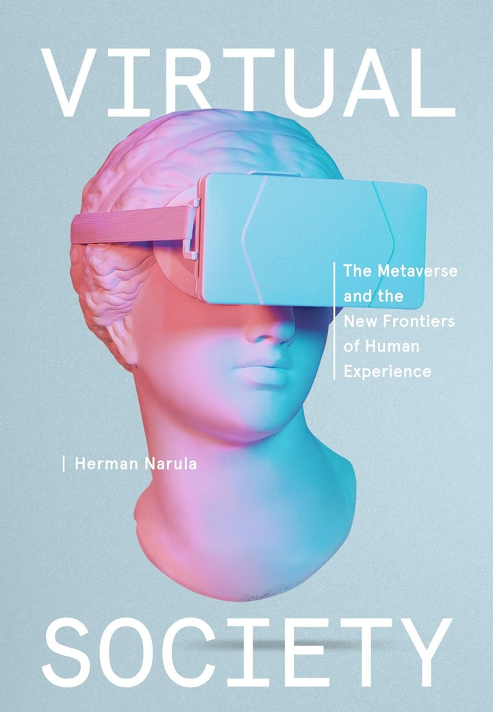
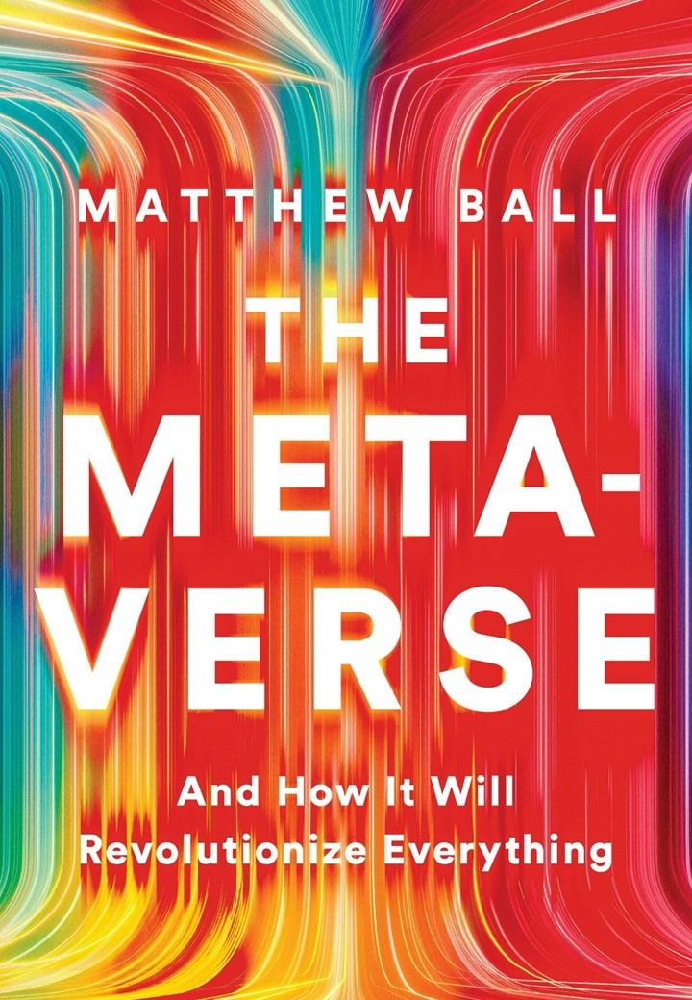
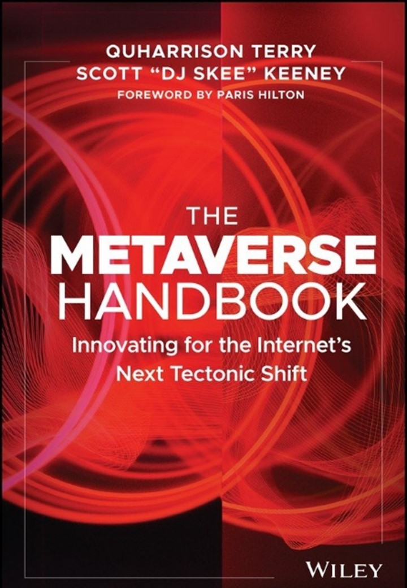

 **<a href="#perspectives">Perspectives</a>**   /  **<a href="#poll">Poll</a>**   /  **<a href="#evacomics">Evacomics</a>**  /  **<a href="#resources">Recommended Resources</a>** 

The term [metaverse](https://www.wired.com/story/what-is-the-metaverse/) can broadly include virtual reality, which is characterised by persistent virtual worlds, as well as augmented reality that combines aspects of the digital and physical worlds. The metaverse enables people to have real time interactions and experiences across distance. 

 

To understand the concepts of a metaverse, think of it as the next generation of the Internet that may provide a more immersive virtual experience. Many companies that have embraced the metaverse envisage that it would bring about some sort of new digital economy, where users can create, buy, and sell goods. 

 

The promise of the metaverse is that it could provide a greater convergence of our digital and physical lives in wealth, socialisation, productivity, shopping, and entertainment. However, as the experience of virtual worlds and digital commerce in the metaverse grow in scope and scale, virtual crimes such as assault and theft may become a serious issue.

[PLACEHOLDER FOR TRAILER VIDEO]

## **So, will the metaverse be a virtual paradise?**

[<a href="#top">Back to top</a>]

| YES, THE METAVERSE WILL BE A DIGITAL DREAM AND PARADISE.  | NO, THE METAVERSE WILL BE A VIRTUAL NIGHTMARE FOR US.        |
| :----------------------------------------------------------- | ------------------------------------------------------------ |
| **Advocates argue that it could be a social equalizer.**  Metaverse has the potential to be built with opportunities for [diversity, equity and inclusion](https://www.weforum.org/agenda/2022/06/metaverse-platforms-face-diversity-equity-and-inclusion-challenges-heres-how-to-address-them/) across the spectrum of ability and age.    Users can experience lives beyond their own, interact with people from other communities and [become more empathetic](https://www.psychologytoday.com/sg/blog/urban-survival/202112/can-empathy-exist-in-the-metaverse-and-virtual-reality) towards different groups.      Constraints of the physical world could be overcome, taking [virtual mobility](https://theconversation.com/five-ways-the-metaverse-could-be-revolutionary-for-people-with-disabilities-183057) to the next level for people with disabilities, breaking down [language barriers](https://about.fb.com/news/2022/02/building-the-metaverse-with-diversity-and-inclusion-from-the-start/) and allowing for world-wide participation in celebrations or events.  | **Not everyone is optimistic of the potential for social good.**  Metaverse might exacerbate [discrimination](https://www.fastcompany.com/90706466/the-metaverse-is-shaping-up-to-be-a-racist-hellscape-it-doesnt-have-to-be-that-way) and [violence against marginalised communities](https://lawreview.law.ucdavis.edu/issues/51/2/Symposium/51-2_Franks.pdf). [Abuse](https://nypost.com/2022/02/01/mom-opens-up-about-being-virtually-gang-raped-in-metaverse/) and [harassment](https://www.theedgesingapore.com/digitaledge/digital-economy/building-safe-and-ethical-metaverse) are already reported in the metaverse.      Other potential negative impacts include [abusive behaviour, bullying, threats of violence ](https://counterhate.com/research/facebooks-metaverse/)and further [marginalization of identities](https://theconversation.com/im-a-black-woman-and-the-metaverse-scares-me-heres-how-to-make-the-next-iteration-of-the-internet-inclusive-173310). The lack of understanding of how to navigate the immersive spaces safely may leave minors susceptible to [exploitation](https://blog.policy.manchester.ac.uk/posts/2022/06/online-safety-child-abuse-and-exploitation-in-extended-reality/) and abuse.    [Singaporeans are the least optimistic](https://vulcanpost.com/775938/singaporeans-least-optimistic-about-metaverse-among-sea/) about the metaverse among those surveyed in Southeast Asia, citing issues of trust and privacy. Some experts also claim that metaverse [would not have a significantly broader influence in our lives](https://www.pewresearch.org/internet/2022/06/30/the-metaverse-will-not-fully-emerge-in-the-way-todays-advocates-hope/) by 2040. Others have raised [diversity, equity and inclusion issues](https://www.weforum.org/agenda/2022/06/metaverse-platforms-face-diversity-equity-and-inclusion-challenges-heres-how-to-address-them/).   |
| **It promises many potential financial gains.** The metaverse offers many exciting potential [socio-economic](https://www.weforum.org/agenda/2022/05/how-to-build-an-economically-viable-inclusive-and-safe-metaverse) opportunities when a fully functional persistent cross platform metaverse becomes a reality.   It creates real [value](https://www.mckinsey.com/about-us/new-at-mckinsey-blog/meet-the-metaverse-creating-real-value-in-a-virtual-world) in a virtual world. It could transform the way we conduct business, interact with brands, drive innovation and [develop shared experiences](ttps://www.sciencedirect.com/science/article/pii/S0268401222000767). The metaverse market size is expected to reach over [$1,607 billion](https://www.emergenresearch.com/industry-report/metaverse-market) by 2030.  The potential for [new job creation](https://www.cnbc.com/2022/01/15/inside-the-metaverse-economy-this-is-what-will-be-for-real-in-2022.html) in the economy has countries like Dubai targeting as many as [40,000 additional virtual jobs](https://www.businesstimes.com.sg/startups-tech/technology/dubais-metaverse-plan-targets-40000-virtual-jobs-5-years) in 5 years. Two strands of “[jobs in the metaverse](https://altopartners.com/news/2022-the-metaverse-what-kind-of-new-jobs-might-it-create)” are the technical aspects of the metaverse and existing industries that will use it as a platform for their activities.   | **Financial promise is idealistic.** Concerns of [accessibility and affordability](https://thedebrief.org/is-the-cost-of-the-metaverse-limiting-its-diversity/) of the expansive promises of virtual experiences have raised the question of who will be [left out of the metaverse](https://www.lifewire.com/how-the-metaverse-could-worsen-the-digital-divide-5215708).  The cost of hardware such as virtual reality equipment has been [out of reach for the average buyer](https://www.pewresearch.org/internet/2022/06/30/the-metaverse-will-not-fully-emerge-in-the-way-todays-advocates-hope/), limiting the individuals who will actually be able to participate in the metaverse and widening [the digital divide](https://www.undp.org/blog/traversing-metaverse-whilst-managing-risks-opportunities).  There are also [legal challenges](https://theconversation.com/the-metaverse-three-legal-issues-we-need-to-address-175891) to addressing [crimes](https://www.wired.com/story/crime-metaverse-virtual-reality/) such as [fraud, theft](https://www.weforum.org/agenda/2022/08/crime-punishment-metaverse/) and assault committed in the virtual world. The deluge of data raises a number of [data protection and cybersecurity issues](https://www.europarl.europa.eu/RegData/etudes/BRIE/2022/733557/EPRS_BRI(2022)733557_EN.pdf) such as how to protect avatars against identity theft.   |
| **Enhanced immersive lifestyle and entertainment experiences.** The metaverse could enhance [consumer experiences](https://www.weforum.org/agenda/2022/08/virtual-reality-shopping-retail/), with simulations allowing us to “touch and feel” products before purchasing.  Immersive experiences can be amplified, allowing for [greater connectivity, engagement and entertainment](https://thepressunited.com/updates/the-metaverse-will-reshape-our-lives-lets-make-sure-its-for-the-better/). 3D interactions increase non-verbal forms of communication, improving engagement with friends and loved ones.  Experiences like sky-diving, [travelling to exotic destinations or attending concerts](https://www.straitstimes.com/asia/metaverse-craze-hits-asia-with-cities-and-companies-chasing-after-a-11-trillion-pie) could become more accessible and affordable. | **Immersive experiences may lead to greater online harms.** There is danger of a [virtual world that could become more attractive than reality](https://eujournalfuturesresearch.springeropen.com/articles/10.1186/s40309-022-00208-4), potentially further stimulating digital [addiction](https://eujournalfuturesresearch.springeropen.com/counter/pdf/10.1186/s40309-022-00208-4.pdf).  [Digital immersion](https://www.childrenandscreens.com/2015-conference/talks-and-panels/digital-immersion-in-children-and-adolescents-addiction-or-obsession/) in the metaverse is particularly worrying for vulnerable groups such as [minors](https://www.today.com/parents/parents/dangers-virtual-reality-young-children-rcna21278). We need to be cautious of the potential [harms to our mental and physical health](https://www.makeuseof.com/metaverse-impact-on-health/) with prolonged screen times and possibilities of addiction issues.  Getting caught up in the metaverse for prolonged periods may lead to issues of [mood disorders, increased loneliness and social isolation](https://gpsych.bmj.com/content/35/4/e100825).   |

Let's hear our guest speakers weigh in on this issue:

[PLACEHOLDER FOR MAIN VIDEO]

## Poll: Your views matter!

[<a href="#top">Back to top</a>]

If you are unable to view the embedded form below, please click **<a href="https://forms.gle/EMfzJCqisS1EH2fB8" target="_blank">here</a>**.

<iframe src="https://docs.google.com/forms/d/e/1FAIpQLScKMjR_hPSy9SDUvKZSfQqs12W66lckc0t17QCyq_nuxroK6w/viewform?embedded=true" width="640" height="400" frameborder="0" marginheight="0" marginwidth="0">Loading…</iframe>

## Evacomics

[<a href="#top">Back to top</a>]

What does the metaverse mean to you?   Join the discussion in Evangeline's **<a href="https://www.instagram.com/p/CjVSKCwBSbv/?utm_source=ig_web_copy_link" target="_blank">Instagram</a>** and **<a href="https://www.facebook.com/evacomics/posts/pfbid022HqT9r3eF2ARxEi9NNgHMg3L3pZ3GdzrJnDwFTjtVhe14QyyAtjUYkNf2yTHVVPGl" target="_blank">Facebook</a>** now!

Here are some experiences shared by others:

## Recommended Resources

[<a href="#top">Back to top</a>]

*Explore the resources below to find out more about the metaverse, and how it may change the Internet and other things.*

### Videos

CNBC International. (2022, April 25). *What is the Metaverse?* Retrieved 2022, October 4.

<iframe width="560" height="315" src="https://www.youtube.com/embed/hHmXhxxx8Dw" title="YouTube video player" frameborder="0" allow="accelerometer; autoplay; clipboard-write; encrypted-media; gyroscope; picture-in-picture" allowfullscreen></iframe>

 

IE Insights. (2022, September 28). *Metaverse: What to Watch out for*. Retrieved 2022, October 4. 

<iframe width="560" height="315" src="https://www.youtube.com/embed/wiGNpwGQ-zE" title="YouTube video player" frameborder="0" allow="accelerometer; autoplay; clipboard-write; encrypted-media; gyroscope; picture-in-picture" allowfullscreen></iframe>

 

TED. (2022, June 4). *The Awesome Potential of Many Metaverses*. Retrieved 2022, October 4. 

<iframe width="560" height="315" src="https://www.youtube.com/embed/IBsSUVIwupQ" title="YouTube video player" frameborder="0" allow="accelerometer; autoplay; clipboard-write; encrypted-media; gyroscope; picture-in-picture" allowfullscreen></iframe>

 

IE Insights. (2022, June 6). *The Metaverse is Much More than VR Glasses*. Retrieved 2022, October 4. 

<iframe width="560" height="315" src="https://www.youtube.com/embed/ryncFRZxPOA?start=129" title="YouTube video player" frameborder="0" allow="accelerometer; autoplay; clipboard-write; encrypted-media; gyroscope; picture-in-picture" allowfullscreen></iframe>

 

Financial Times. (2022, May 2022). [*Game On: How Tech Companies Are Betting on the Metaverse*](https://www.ft.com/video/6b8420bb-13f2-4c15-8a0c-6a0eb84f0860). Retrieved 2022, October 4. 

 

Bloomberg. (2022, June 22). *[The Metaverse is Coming for Your Office](https://www.bloomberg.com/news/articles/2022-06-21/video-the-metaverse-will-be-arriving-in-your-office-soon)*. Retrieved 2022, October 4. 

 

Ernst & Young. (2022, April 29). *[Breaking Down the Digital Divide in the Metaverse](https://www.ey.com/en_us/consulting/breaking-down-the-digital-divide-in-the-metaverse)*. Retrieved 2022, October 4. 

### Websites

**[What Is the Metaverse, Exactly?](https://www.wired.com/story/what-is-the-metaverse/)** 

Ravenscraft, Eric. (2022, April 25). *What Is the Metaverse, Exactly?* Wired. Retrieved 2022, October 4

**[The Metaverse in 2040](https://www.pewresearch.org/internet/2022/06/30/the-metaverse-in-2040/)**

Anderson, Janna, and Lee Rainie. *The Metaverse in 2040*. (2022, June 30). Pew Research Center. Retrieved 2022, October 4. 

**[Value Creation in the Metaverse: The Real Business of the Virtual World](https://www.mckinsey.com/~/media/mckinsey/business functions/marketing and sales/our insights/value creation in the metaverse/Value-creation-in-the-metaverse.pdf)**

Elmasry, Tarek, et al. (2022, June 22). *Value Creation in the Metaverse: The Real Business of the Virtual World*. McKinsey & Company. Retrieved 2022, October 4. 

**[Younger Generations Expect to Spend a Lot More Time in the Metaverse](https://www.weforum.org/agenda/2022/08/metaverse-technology-virtual-future-people/)**  

Strange, Adario. (2022, August 19). *Younger Generations Expect to Spend a Lot More Time in the Metaverse*. World Economic Forum. Retrieved 2022, October 4. 

**[The Potential Global Economic Impact of the Metaverse](https://www.analysisgroup.com/link/9b17b5084705446497c861529f33970a.aspx)**

Christensen, Laurits, and Alex Robinson. (2022). *The Potential Global Economic Impact of the Metaverse*. Analysis Group. Retrieved 2022, October 4. 

### Podcasts

[**Is the Metaverse Going to Suck? A Conversation with Matthew Ball**](https://www.theverge.com/23269170/what-is-the-metaverse-matthew-ball-interview-decoder-podcast) 

The Verge. (2022, July 19). *Is the Metaverse Going to Suck? A Conversation with Matthew Ball*. Retrieved 2022, October 4. 

[**What is the Metaverse—and What Does it Mean for Business?**](https://www.mckinsey.com/capabilities/mckinsey-digital/our-insights/what-is-the-metaverse-and-what-does-it-mean-for-business)

McKinsey Digital. (2022, March 29). *What is the Metaverse—and What Does it Mean for Business?* Retrieved 2022, October 4.

[**Understanding the Metaverse and Web 3.0**](https://www.goldmansachs.com/insights/podcasts/episodes/01-11-2022-eric-sheridan.html) 

Goldman Sachs (2022, January 11). *Understanding the Metaverse and Web 3.0*. Retrieved 2022, October 4. 

[**Microsoft and the Metaverse**](https://www.nytimes.com/2022/01/20/podcasts/the-daily/metaverse-microsoft-activision-blizzard.html) 

New York Times. (2022, January 20). *Microsoft and the Metaverse*. Retrieved 2022, October 4. 

[**Innovative and Practical Applications of the Metaverse**](https://www.mckinsey.com/capabilities/mckinsey-digital/our-insights/innovative-and-practical-applications-of-the-metaverse) 

McKinsey Digital. (2022, March 29). *Innovative and Practical Applications of the Metaverse*. Retrieved 2022, October 4. 

### NLB eBooks

|                                                              | **Recommended Titles**                                       |
| ------------------------------------------------------------ | ------------------------------------------------------------ |
|  | [**Virtual Society: The Metaverse and the New Frontiers of Human Experience**](https://go.nlb.gov.sg/m-link/details?type=ebook&id=B9172CEC-FE72-493F-9097-4C2A21834A3E&utm_source=online&utm_campaign=RTBS_Dec22&utm_medium=website&utm_content=virtual_society) Narula, Herman. (2022). *Virtual Society: The Metaverse and the New Frontiers of Human Experience.*  Retrieved from OverDrive. (myLibrary ID is required to access the eBook). |
|  | [**The Metaverse: And How it Will Revolutionize Everything**](https://go.nlb.gov.sg/m-link/details?type=ebook&id=FF0EFEDE-AEB4-44ED-83C8-04B7FC55A14A&utm_source=online&utm_campaign=RTBS_Dec22&utm_medium=website&utm_content=metaverse_revolutionize ) Ball, Matthew. (2022). *The Metaverse: And How it Will Revolutionize Everything*. New York: Liveright.   Retrieved from OverDrive. (myLibrary ID is required to access the eBook). |
|  | **[The Metaverse Handbook: Innovating for the Internet's Next Tectonic Shift](https://go.nlb.gov.sg/m-link/details?type=ebook&id=43D2CEAB-2D47-4557-9E0E-298A9E1A9532&utm_source=online&utm_campaign=RTBS_Dec22&utm_medium=website&utm_content=metaverse_handbook)** Terry, Quharrison, and Scott Keeney. (2022). The Metaverse Handbook: Innovating for the Internet's Next Tectonic Shift. Hoboken: Wiley   Retrieved from OverDrive. (myLibrary ID is required to access the eBook). |
|  | **[Step Into the Metaverse: How the Immersive Internet Will Unlock a Trillion-Dollar Social Economy](https://go.nlb.gov.sg/m-link/details?type=ebook&id=E3086AE8-E9C5-4236-B7DE-11956E181F69&utm_source=online&utm_campaign=RTBS_Dec22&utm_medium=website&utm_content=step_into_the_metaverse )** Van Rijmenam, Mark. (2022). Step Into the Metaverse: How the Immersive Internet Will Unlock a Trillion-Dollar Social Economy. Hoboken: Wiley.   Retrieved from OverDrive. (myLibrary ID is required to access the eBook). |
|  | **[Navigating the Metaverse: A Guide to Limitless Possibilities in a Web 3.0 World](https://go.nlb.gov.sg/m-link/details?type=ebook&id=C72070D4-D6A7-494B-80C3-B9673E67231D&utm_source=online&utm_campaign=RTBS_Dec22&utm_medium=website&utm_content=navigating_metaverse )** Hackl, Cathy. (2022). Navigating the Metaverse: A Guide to Limitless Possibilities in a Web 3.0 World. Hoboken: Wiley.    Retrieved from OverDrive. (myLibrary ID is required to access the Audiobook). |
|  | **[Blockchain and Web3: Building the Cryptocurrency, Privacy, and Security Foundations of the Metaverse](https://go.nlb.gov.sg/m-link/details?type=ebook&id=5A3FE763-25FF-48A5-AB44-370EA89D1F8F&utm_source=online&utm_campaign=RTBS_Dec22&utm_medium=website&utm_content=blockchain_web3 )** Ma, Winston. (2022). Blockchain and WEB3: Building the Cryptocurrency, Privacy, and Security Foundations of the Metaverse. Hoboken: Wiley.  Retrieved from OverDrive. (myLibrary ID is required to access the eBook). |
|  | **[Reality+: Virtual Worlds and the Problems of Philosophy](https://go.nlb.gov.sg/m-link/details?type=ebook&id=52B5192F-E111-4B71-812E-B4794AC08CF7&utm_source=online&utm_campaign=RTBS_Dec22&utm_medium=website&utm_content=reality_philosophy)** Chalmers, David J. (2022). Reality+: Virtual Worlds and the Problems of Philosophy. New York: W. W. Norton and Company.    Retrieved from OverDrive. (myLibrary ID is required to access the eBook). |
|  | **[Charlie Fink's Metaverse (Summary): An AR Enabled Guide to VR & AR](https://go.nlb.gov.sg/m-link/details?type=ebook&id=0C43D3CD-2B0F-4402-8D4E-4909F37C6411&utm_source=online&utm_campaign=RTBS_Dec22&utm_medium=website&utm_content=charlie_fink_metaverse)** Fink, Charlie. (2017). Charlie Fink's Metaverse (Summary): An AR Enabled Guide to VR & AR. Luzern: getAbstract.   Retrieved from OverDrive. (myLibrary ID is required to access the eBook). |
|  | **[Metaverse for Beginners: A Complete Guide on How to Invest in the Metaverse](https://go.nlb.gov.sg/m-link/details?type=ebook&id=4A25CAE4-C871-4475-BEFC-28B0FF7CF87A&utm_source=online&utm_campaign=RTBS_Dec22&utm_medium=website&utm_content=metaverse_beginners )** Russel, John, and Connor, Sullivan. (2021). Metaverse for Beginners: A Complete Guide on How to Invest in the Metaverse. Solon: John Russel.    Retrieved from OverDrive. (myLibrary ID is required to access the eBook). |
|                                                              |                                                              |

## Metaverse: A double-edged sword for users

While the metaverse could potentially enhance our lives in many ways, we need to be mindful that it can also negatively impact the quality of our lives. Here are some tips to safeguard yourself:

1. ### Reading before you enter the metaverse

###  

Companies may have public education reminders on privacy and content, take time to read before proceeding. Making [informed consent](https://edition.cnn.com/2022/09/23/opinions/metaverse-transformative-ethics-thomason-spc-intl/index.html) is one way to managing your personal data, funds or IP in the metaverse. Similar to how banks that make users read reminders before making online transactions, be sure of what you read, before taking action. 

 

2. ### Cyber safety should [start young](https://www.commonsensemedia.org/kids-action/articles/what-are-kids-doing-in-the-metaverse)

 

Prevention is better than cure. Educating the young and other vulnerable groups on cyber threats to look out for online through websites such as [Connect Safely](https://www.connectsafely.org/metaverse-and-vr-tips-for-parents/), [Cyberwise](https://www.cyberwise.org/post/what-the-heck-is-the-metaverse-and-should-you-let-your-children-go-there) and [Common Sense Media](https://www.commonsensemedia.org/sites/default/files/featured-content/files/metaverse-white-paper.pdf). Check out general cyber safety programmes such as [Digital for Life](https://www.digitalforlife.gov.sg/) or [Media Literacy Council Cyber Wellness](https://www.imda.gov.sg/digitalforlife/cyberwellnesschallenge) which can help them stay safe in the online world. 

 

3. ### Managing our screen time

Children and adults are equally at risk for digital addiction and the myriad of health and mental issues that come with it. 

\-    We can [manage and track our screen time](https://www.cnbc.com/2020/03/13/why-you-should-be-reducing-screen-time-and-3-simple-tips-to-do-it.html) using built-in functions in smartphones or productive apps. 

\-    Conversations with the family on limiting the time spent online per day can improve mental health. 

\-    Spend three to four hours daily without any screens, by being active or engaging with people or yourself through hobbies or active rest. 