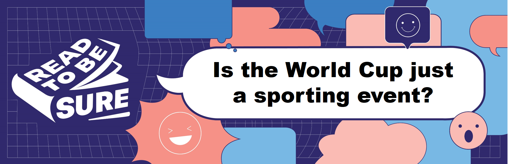
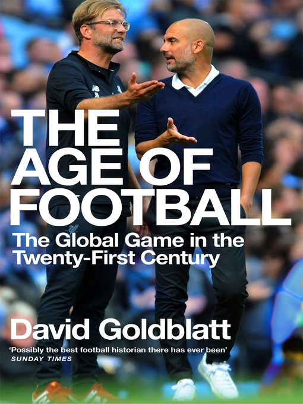
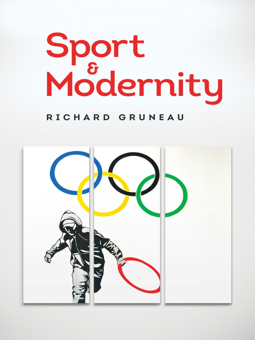
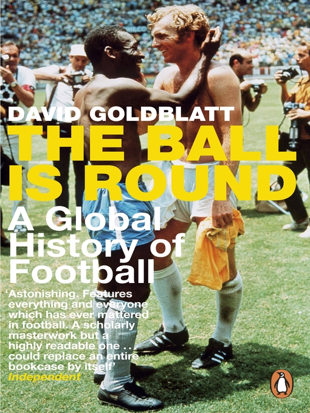
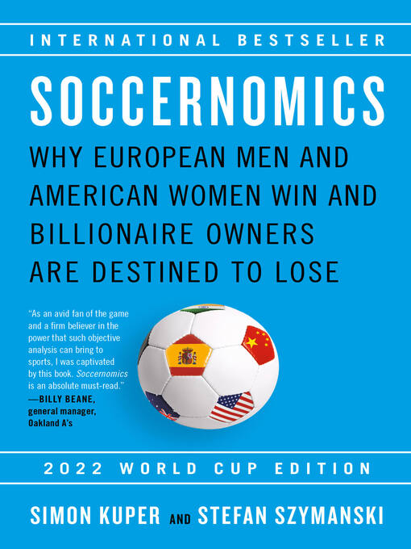

**<a href="#perspectives">Perspectives</a>**   /  **<a href="#poll">Poll</a>**   /  **<a href="#resources">Recommended Resources</a>** 

Held every four years, this prestigious football event amasses a [global viewership in the billions](https://www.statista.com/chart/28766/global-reach-and-tv-viewership-of-the-fifa-world-cup/) and [Singaporeans](https://safe.menlosecurity.com/https:/www.ipsos.com/en-sg/more-half-adults-singapore-plan-watch-2022-fifa-world-cup) are not immune to the World Cup craze. However, the World Cup is more than fun and entertainment. This sporting event has offered job opportunities to Singaporeans, from [training match officials](https://safe.menlosecurity.com/https:/www.straitstimes.com/sport/world-cup-meet-m-ganesan-the-man-from-singapore-who-is-a-brother-to-match-officials-in-qatar) to selling [bubble tea](https://safe.menlosecurity.com/https:/www.straitstimes.com/videos/world-cup-the-singaporean-who-took-bubble-tea-to-qatar--dispatches-from-doha/6316614929112). 

 

Touted as the “beautiful game” that unites rather than divides, numerous criticisms of the World Cup over the years beg the question of whether the charm of the global sporting event really transcends socio-political and economic problems. The FIFA 2022 World Cup kicked off in the small gulf state of Qatar, amid a backdrop of [celebrations](https://www.goal.com/en-sg/lists/why-the-world-cup-is-the-ultimate-moment-of-celebration/blt61bfdee112428517#csa2d63f154033526e)and [controversies](https://www.washingtonpost.com/world/2022/11/18/qatar-world-cup-migrant-workers/). 

 

Major sporting events like the [Olympics](https://www.cfr.org/backgrounder/economics-hosting-olympic-games) and the World Cup could generate [multibillion-dollar investments and “intangible legacy”](https://www.youtube.com/watch?v=l7obedVLB_k) for host countries. Other benefits include [new infrastructure](https://www.aljazeera.com/sports/2022/11/17/do-host-countries-make-money-from-the-world-cup) projects, [improved international perception](https://pitjournal.unc.edu/article/assessing-long-term-economic-impacts-world-cup-mega-sport-event) of host countries and [celebrating unity](https://medium.com/@overtake/more-than-just-a-game-football-brings-people-together-e92802328132) in [a shared love](https://sg.news.yahoo.com/no-politics-iran-usa-fans-195829336.html?guccounter=1) for the game. 

 

However, speculations on [the actual economic gains in the long term](https://theconversation.com/hosting-the-fifa-world-cup-brings-benefits-but-not-as-many-as-politicians-claim-190923), [corruption](https://www.npr.org/2022/11/18/1137204271/qatar-world-cup-controversies) allegations of officials, ethics of “[sportswashing](https://safe.menlosecurity.com/https:/theconversation.com/world-cup-2022-qatar-is-accused-of-sportswashing-but-do-the-fans-really-care-193485)”, the [social cost](https://youtu.be/C-0CebFpF_s) of construction and[ issues of human rights](https://www.unisg.ch/en/newsdetail/news/world-cup-in-qatar-more-than-a-game/) seem to mar any “goodwill” and “good-feeling” arising from the World Cup. 

## **So, is the World Cup good for the world?**

[<a href="#top">Back to top</a>]	

| **YES, THE WORLD CUP BRINGS BENEFITS TO THE WORLD.**      | **NO, THE WORLD CUP RAISES PROBLEMS FOR THE WORLD.**         |
| :----------------------------------------------------------- | ------------------------------------------------------------ |
| **The World Cup promises opportunities for economic gains.**  Host countries stand to [gain financial investment in sporting and public infrastructure](https://www.project-syndicate.org/commentary/why-host-the-world-cup-by-andrew-zimbalist-2018-06) and [economic benefits](https://pitjournal.unc.edu/article/assessing-long-term-economic-impacts-world-cup-mega-sport-event) in the long term.  Some experts are optimistic that economic growth can be sustained by leveraging on the most-watched sporting event to showcase Qatar’s “[state-of-the-art transportation systems, world class tourism and culinary experiences… and generous hospitality](https://www.gulf-times.com/article/650224/opinion/hosting-the-fifa-world-cup-2022-impact-on-qatar-and-the-region)”.BR> There are [increased digital marketing opportunities ](https://www.channelnewsasia.com/commentary/fifa-world-cup-effect-qatar-tech-stock-market-app-social-media-food-delivery-3086121)as more viewers are digitally engaged with the World Cup. [F&B operators and delivery platforms](https://www.straitstimes.com/singapore/fb-outlets-and-food-delivery-platforms-score-big-during-world-cup-2022) may also reap benefits given the social nature of watching the games.  | **The true cost of the World Cup cannot be ignored.**  Criticisms of t[he working conditions of labourers](https://www.aljazeera.com/sports/2014/7/3/world-cup-workers-struggle-for-basic-rights) in preparation for the World Cup have [plagued the tournament over the years](https://www.theguardian.com/football/2017/may/25/fifa-world-cup-2018-workers-human-rights-abuses).   The huge expenses borne by host countries [may not be offset](https://www.managementstudyguide.com/effects-of-fifa-world-cup-on-economy.htm) by potential economic gains in tourism. Additionally, the [organising body for the World Cup may stand to gain more](https://www.cnbc.com/2022/11/10/why-hosting-the-world-cup-can-be-a-bad-idea-for-some-countries.html) financially than host countries.   Sporting infrastructure built specifically for the event may become [“white elephant” structures](https://youtu.be/AOHP0pH0yMA) after the World Cup ends.  |
| **It provides a stage for countries to improve international relations.**   Hosting the World Cup is an opportunity to [garner soft power](https://moderndiplomacy.eu/2022/10/26/the-qatar-world-cup-footballing-for-soft-power/) and garner support from the international community.   The global sporting event allows nations to showcase a favourable image to global and domestic audiences: from highlighting “[change and progress](https://www.tandfonline.com/doi/full/10.1080/09523367.2021.1988932)” within host nations to visiting nations such as the [Japanese](https://mothership.sg/2022/12/japan-croatia-fans-clean-stadium/) and [Moroccans](https://www.dailysabah.com/sports/football/morocco-captures-imagination-by-reciting-from-quran-before-shootout), displaying positive traits.  | **Existing socio-political issues may be exacerbated.**   The World Cup tournaments have a long [history of politics mixing with sports](https://www.youtube.com/watch?v=eyZ7ULF349M), casting a spotlight on global politics.   [Mixed public opinion surveys ](https://moderndiplomacy.eu/2022/10/26/the-qatar-world-cup-footballing-for-soft-power/)and [critical media coverage](https://edition.cnn.com/2022/11/23/middleeast/why-arabs-are-furious-world-cup-mime-intl/index.html) could impact national reputations.   [Political expressions on the field](https://www.theweek.in/theweek/cover/2022/11/11/football-players-political-views-qatar-world-cup.html), sanctioned or not, and calls for [boycotts](https://www.euronews.com/2022/11/10/fifa-and-qatar-rattled-as-european-world-cup-boycott-gathers-pace), further highlight the [socio-political tensions](https://theconversation.com/fifas-mirage-of-unity-why-the-world-cup-is-a-vessel-for-political-protest-195432).   |
| **It serves as a shared experience.**   The [billions of viewers ](https://www.beinsports.com/en/fifa-world-cup-qatar-2022/news/bein-mena-viewership-exceeds-one-billion-for-/1996664)simultaneously tuning in to the World Cup provides a truly[ global shared experience](https://berkleycenter.georgetown.edu/responses/when-globalism-outscores-nationalism) beyond borders.    An opportunity for solidarity, differences, be it on the [domestic](https://medium.com/@overtake/more-than-just-a-game-football-brings-people-together-e92802328132) or [political](https://www.straitstimes.com/sport/football/world-cup-arab-fans-unite-after-surprise-wins-in-qatar) front, could be set aside as fans [unite under one flag](https://www.aljazeera.com/sports/2022/11/7/world-cup-2022-thousands-of-argentina-fans-flock-to-qatar). | **Not everyone views the game as truly unifying.**    Some critics have viewed that sporting events such as football are just games, with [no real importance](https://www.tandfonline.com/doi/full/10.1080/14660970.2020.1797496) to our lives.   The competition also seems to further support a “[nationally divided world](https://www.unisg.ch/en/newsdetail/news/world-cup-in-qatar-more-than-a-game/)”, under the spectacle of entertainment and sporting rivalry.   Additionally, global sporting events are a hotbed for [conflicting expressions of nationhood](https://cpb-us-w2.wpmucdn.com/about.illinoisstate.edu/dist/e/34/files/2019/09/Alexander_Nelson_pdf.pdf) and [belonging](https://www.tandfonline.com/doi/full/10.1080/09523367.2020.1844188). |

## Poll: Your views matter!

[<a href="#top">Back to top</a>]

If you are unable to view the embedded form below, please click **<a href="https://forms.gle/https://forms.gle/BQjGD7rPKJUcMUr99" target="_blank">here</a>**.

<iframe src="https://docs.google.com/forms/d/e/1FAIpQLSeTzhJG7i29T-k4rneCC0qI6ppVCx79MJLIUegllyIo3FCH9A/viewform?embedded=true" width="640" height="1413" frameborder="0" marginheight="0" marginwidth="0">Loading…</iframe>

## Recommended Resources

[<a href="#top">Back to top</a>]

**Explore the resources below to find out more about the World Cup, soccer and how it can impact the world.* *

### Videos

Concordia. (2022, September 22). The social and human legacy of the World Cup. 2022 Concordia Annual Summit. Retrieved 2022, December 11. 
<iframe width="560" height="315" src="https://www.youtube.com/embed/kiRrvQR2xW8" title="YouTube video player" frameborder="0" allow="accelerometer; autoplay; clipboard-write; encrypted-media; gyroscope; picture-in-picture" allowfullscreen></iframe>
 

Insider Business. (2022, October 22). *The true cost of the Qatar 2022 World Cup.* Retrieved 2022, December 11. 

  

<iframe width="560" height="315" src="https://www.youtube.com/embed/2ALeYFi_1hg" title="YouTube video player" frameborder="0" allow="accelerometer; autoplay; clipboard-write; encrypted-media; gyroscope; picture-in-picture" allowfullscreen></iframe>

 

DW News. (2022, December 3). *‘Double standards’ - Is western criticism of Qatar’s World Cup unfair?* Retrieved 2022, December 11. 

<iframe width="560" height="315" src="https://www.youtube.com/embed/SMJ809JPwq8" title="YouTube video player" frameborder="0" allow="accelerometer; autoplay; clipboard-write; encrypted-media; gyroscope; picture-in-picture" allowfullscreen></iframe>

 

ABC News In-Depth. (2022, October 29). *Qatar 22: Controversy, Corruption, and the Cup.* Retrieved 2022, December 11.

<iframe width="560" height="315" src="https://www.youtube.com/embed/N240i1DZwso" title="YouTube video player" frameborder="0" allow="accelerometer; autoplay; clipboard-write; encrypted-media; gyroscope; picture-in-picture" allowfullscreen></iframe>

 

The Economist. (2022, November 18). *Why is the World Cup important to Qatar?* Retrieved 2022, December 11.

<iframe width="560" height="315" src="https://www.youtube.com/embed/xyjnDBoJY7k" title="YouTube video player" frameborder="0" allow="accelerometer; autoplay; clipboard-write; encrypted-media; gyroscope; picture-in-picture" allowfullscreen></iframe>

 

Al Jazeera English. (2018, July 15). *Politics and the World Cup.* Retrieved 2022, December 11. 

<iframe width="560" height="315" src="https://www.youtube.com/embed/_XIrMijsy1E" title="YouTube video player" frameborder="0" allow="accelerometer; autoplay; clipboard-write; encrypted-media; gyroscope; picture-in-picture" allowfullscreen></iframe>

 

### Websites

|                                                              |
| ------------------------------------------------------------ |
| [Hosting the FIFA World Cup: An Economic Analysis of how   the World Cup has Impacted the Economy of a Developed and a Developing Nation](https://digitalshowcase.lynchburg.edu/utcp/157/)[.](https://digitalshowcase.lynchburg.edu/utcp/157/)     Borga, Juan, "Hosting the  FIFA World Cup: An Economic Analysis of how the World Cup has Impacted the  Economy of a Developed and a Developing Nation" (2020). *Undergraduate Theses and Capstone Projects*.  157. Retrieved 2022, December 12.  |
| [A Spectacle of Scoundrels](https://www.theatlantic.com/newsletters/archive/2022/11/scoundrels-world-cup/672152/)     Foer,  Franklin. (2022, November 17). A Spectacle of Scoundrels. *The Atlantic*. Retrieved 2022, December  12.    |
| [Why some Arabs and Muslims feel stung by coverage of   the Qatar World Cup](https://edition.cnn.com/2022/11/23/middleeast/why-arabs-are-furious-world-cup-mime-intl/index.html)     Ebrahim,  Nadeen and Al Lawati, Abbas. (2022, November 24). Why some Arabs and Muslims  feel stung by coverage of the Qatar World Cup. *CNN.* Retrieved 2022, December 12.    |
| [Football corruption and the remarkable road to Qatar’s   World Cup. ](https://www.theguardian.com/football/2022/oct/08/football-corruption-and-the-remarkable-road-to-qatar-world-cup)     Ronay,  Barney. (2022, October 8). Football corruption and the remarkable road to  Qatar’s World Cup. *The Guardian*.  Retrieved 2022, December 12.    |
| [Morocco are rewriting what football means to an African   Muslim like me. ](https://theathletic.com/3988894/2022/12/10/morocco-islam-world-cup/)     Ibrahim,  Mina. (2022, December 11). Morocco are rewriting what football means to an  African Muslim like me. *The Athletic.* Retrieved  2022, December 12.    |

### Podcasts

|                                                              |
| ------------------------------------------------------------ |
| Brookings  Podcast Network. (2022, December 5). *The  economics of the World Cup*. Retrieved 2022, December 11.   https://www.brookings.edu/podcast-episode/the-economics-of-the-world-cup/  |
| The New  York Times. (2022, November 28). *Qatar’s  big bet on the World Cup.* Retrieved 2022, December 11.       https://www.nytimes.com/2022/11/28/podcasts/the-daily/qatar-world-cup-2022.html      |
| The  Journal. (2022, November 21). *A  controversial World Cup begins in Qatar.* Retrieved 2022, December 11.       https://www.wsj.com/podcasts/the-journal/a-controversial-world-cup-begins-in-qatar/e5a7536b-0aba-4a1f-8a0a-1f2210d22020      |
| BBC. (2022,  November 19). *Qatar and the fall of  FIFA.* Retrieved 2022, December 11.     https://www.bbc.co.uk/sounds/play/p0dhp38p      |
| Crooked  Media. (2022, November 17). *World  Corrupt Episode 1: A toxic love affair between politics and sports*.  Retrieved 2022, December 11.     https://www.podcastrepublic.net/podcast/1655202888      |

### NLB eBooks

|                                                              | **Recommended Titles**                                       |
| ------------------------------------------------------------ | ------------------------------------------------------------ |
|  | [**The Age of Football**](https://go.nlb.gov.sg/m-link/details?type=ebook&id=A89509EA-0DC7-4317-A388-26713A4596BE&utm_source=online&utm_campaign=RTBS_Dec22viral&utm_medium=website&utm_content=age_of_football) Goldblatt, David. (2019) *The Age of Football.* London: Macmillan..*  Retrieved from OverDrive. (myLibrary ID is required to access the eBook). |
|  | [**Sport and Modernity**](https://go.nlb.gov.sg/m-link/details?type=ebook&id=9C495A86-E93A-4041-9204-115E37EFB1AB&utm_source=online&utm_campaign=RTBS_Dec22viral&utm_medium=website&utm_content=sports_modernity) Gruneau, Richard. (2017). *Sport and Modernity.* New York: Polity.   Retrieved from OverDrive. (myLibrary ID is required to access the eBook). |
|  | **[The Ball Is Round](https://go.nlb.gov.sg/m-link/details?type=ebook&id=678E3AFC-8DF7-43BF-ADD8-5E79D074B74D&utm_source=online&utm_campaign=RTBS_Dec22viral&utm_medium=website&utm_content=global_history_football)** Goldblatt, David. (2007). *The Ball is Round: A Global History of Football.* London: Penguin.   Retrieved from OverDrive. (myLibrary ID is required to access the eBook). |
|  | **[Circus Maximus: The Economic Gamble Behind Hosting the Olympics and the World Cup](https://go.nlb.gov.sg/m-link/details?type=ebook&id=64C50A1F-1517-4A63-B205-C364CC740208&utm_source=online&utm_campaign=RTBS_Dec22viral&utm_medium=website&utm_content=circus_maximus)** Zimbalist, Andrew. (2020). *Circus Maximus: The Economic Gamble Behind Hosting the Olympics and the World Cup.* LaVergne: Brookings Institution Press.   Retrieved from OverDrive. (myLibrary ID is required to access the eBook). |
|  | **[Soccernomics (2022 world cup edition): Why European men and American women win and billionaire owners are destined to lose](https://go.nlb.gov.sg/m-link/details?type=ebook&id=FB1CEAE8-5E84-4D01-94C6-B68B7B92798A&utm_source=online&utm_campaign=RTBS_Dec22viral&utm_medium=website&utm_content=soccernomics)** Kuper, Simon. (2022). *Soccernomics (2022 world cup edition): Why European men and American women win and billionaire owners are destined to lose.* New York: Bold Type Books.   Retrieved from OverDrive. (myLibrary ID is required to access the Audiobook).  |
|  | **[The Ugly Game: The Qatari Plot to Buy the World Cup](https://go.nlb.gov.sg/m-link/details?type=ebook&id=E519A122-7CE0-45C4-80E7-084B87EF1AEF&utm_source=online&utm_campaign=RTBS_Dec22viral&utm_medium=website&utm_content=ugly_game)** Blake, Heidi. (2015). *The Ugly Game: The Qatari Plot to Buy the World Cup.* New York: Simon & Schuster UK  Retrieved from OverDrive. (myLibrary ID is required to access the eBook). |
