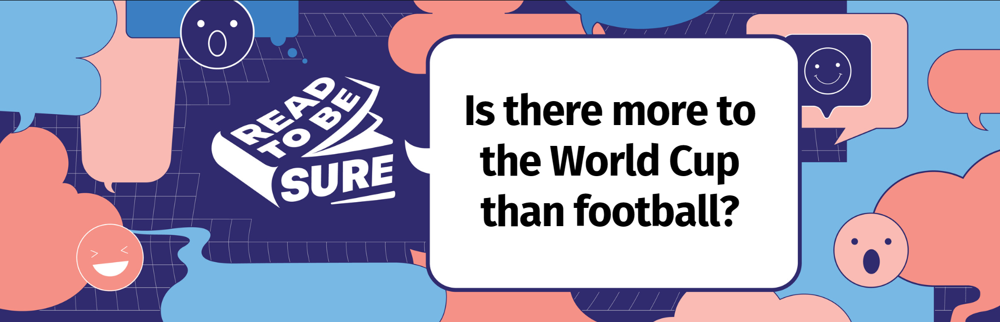

**<a href="#perspectives">Perspectives</a>**   /  **<a href="#poll">Poll</a>**   /  **<a href="#resources">Recommended Resources</a>** 

Held every four years, this international football event gets a [global viewership in the billions](https://www.statista.com/chart/28766/global-reach-and-tv-viewership-of-the-fifa-world-cup/) and [Singaporeans](https://safe.menlosecurity.com/https:/www.ipsos.com/en-sg/more-half-adults-singapore-plan-watch-2022-fifa-world-cup) also get caught up in the excitement of the World Cup. However, the World Cup is more than fun and entertainment. This sporting event has offered economic and job opportunities to many, including Singaporeans, from [training match officials](https://safe.menlosecurity.com/https:/www.straitstimes.com/sport/world-cup-meet-m-ganesan-the-man-from-singapore-who-is-a-brother-to-match-officials-in-qatar) to selling [bubble tea](https://safe.menlosecurity.com/https:/www.straitstimes.com/videos/world-cup-the-singaporean-who-took-bubble-tea-to-qatar--dispatches-from-doha/6316614929112). 

 

Although it is known as the “beautiful game”, it has also drawn its share of criticisms. The FIFA 2022 World Cup kicked off in the small gulf state of Qatar, amid a backdrop of [celebrations](https://www.goal.com/en-sg/lists/why-the-world-cup-is-the-ultimate-moment-of-celebration/blt61bfdee112428517#csa2d63f154033526e)and some [controversies](https://www.washingtonpost.com/world/2022/11/18/qatar-world-cup-migrant-workers/). 

 

Major sporting events like the [Olympics](https://www.cfr.org/backgrounder/economics-hosting-olympic-games) and the World Cup could generate [multibillion-dollar investments and “intangible legacy”](https://www.youtube.com/watch?v=l7obedVLB_k) for host countries. These result in benefits for the host country such as [new infrastructure](https://www.aljazeera.com/sports/2022/11/17/do-host-countries-make-money-from-the-world-cup) and [improved international perception](https://pitjournal.unc.edu/article/assessing-long-term-economic-impacts-world-cup-mega-sport-event) as it unites the world in [a shared love](https://sg.news.yahoo.com/no-politics-iran-usa-fans-195829336.html?guccounter=1) for sports. 

 

However, some also question the [benefits of hosting such major games](https://theconversation.com/hosting-the-fifa-world-cup-brings-benefits-but-not-as-many-as-politicians-claim-190923). This includes questions on the [infrastructure built](https://youtu.be/C-0CebFpF_s) and if it has longer term benefits, or the issue of “[sportswashing](https://safe.menlosecurity.com/https:/theconversation.com/world-cup-2022-qatar-is-accused-of-sportswashing-but-do-the-fans-really-care-193485)”.  

## **Does the World Cup score a goal (or two) in your books?**

[<a href="#top">Back to top</a>]	

| **YES, THE WORLD CUP BRINGS BENEFITS TO THE WORLD.**      | **NO, THE WORLD CUP RAISES PROBLEMS FOR THE WORLD.**         |
| :----------------------------------------------------------- | ------------------------------------------------------------ |
| **The World Cup promises opportunities for economic gains.**  Host countries stand to [gain with investments in sporting and public infrastructure](https://www.project-syndicate.org/commentary/why-host-the-world-cup-by-andrew-zimbalist-2018-06) and [economic benefits](https://pitjournal.unc.edu/article/assessing-long-term-economic-impacts-world-cup-mega-sport-event) in the long term.   Some experts are optimistic that economic growth can be sustained by showcasing Qatar’s “[state-of-the-art transportation systems, world class tourism and culinary experiences… and generous hospitality](https://www.gulf-times.com/article/650224/opinion/hosting-the-fifa-world-cup-2022-impact-on-qatar-and-the-region)”.   There are [increased digital marketing opportunities ](https://www.channelnewsasia.com/commentary/fifa-world-cup-effect-qatar-tech-stock-market-app-social-media-food-delivery-3086121)as more viewers are digitally engaged with the World Cup. [F&B operators and delivery platforms](https://www.straitstimes.com/singapore/fb-outlets-and-food-delivery-platforms-score-big-during-world-cup-2022) may also reap benefits given the social nature of watching the games.   | **The true cost of the World Cup cannot be ignored.**  Criticisms of t[he working conditions of those who ](https://www.gov.uk/government/case-studies/the-world-cup-and-human-rights-in-brazil)helped lay the physical infrastructure for the World Cup have been rife.   The huge expenses incurred by host countries [may not be offset](https://www.managementstudyguide.com/effects-of-fifa-world-cup-on-economy.htm) by potential economic gains, such as through tourism.  Sporting infrastructure built specifically for the event may become [“white elephant” structures](https://youtu.be/AOHP0pH0yMA) after the World Cup ends.    |
| **It provides a stage for countries to improve international relations.**   Hosting the World Cup is an opportunity to [garner soft power](https://moderndiplomacy.eu/2022/10/26/the-qatar-world-cup-footballing-for-soft-power/) and garner support from the international community.   From highlighting “[change and progress](https://www.tandfonline.com/doi/full/10.1080/09523367.2021.1988932)” within host nations to [visiting nations](https://mothership.sg/2022/12/japan-croatia-fans-clean-stadium/) displaying positive traits, countries are able to showcase a favourable image on an international stage.   | **Existing socio-political issues may be exacerbated.**   The World Cup tournaments over the years have had a [history of politics mixing with sports](https://www.youtube.com/watch?v=eyZ7ULF349M).   [Political expressions on the field](https://www.theweek.in/theweek/cover/2022/11/11/football-players-political-views-qatar-world-cup.html), sanctioned or not, and calls for [boycotts](https://www.euronews.com/2022/11/10/fifa-and-qatar-rattled-as-european-world-cup-boycott-gathers-pace), highlight the [socio-political tensions](https://theconversation.com/fifas-mirage-of-unity-why-the-world-cup-is-a-vessel-for-political-protest-195432).  [Mixed public opinion surveys ](https://moderndiplomacy.eu/2022/10/26/the-qatar-world-cup-footballing-for-soft-power/)and [critical media coverage](https://edition.cnn.com/2022/11/23/middleeast/why-arabs-are-furious-world-cup-mime-intl/index.html) could impact national reputations.   |
| **It serves as a shared experience.**   The [billions of viewers ](https://www.beinsports.com/en/fifa-world-cup-qatar-2022/news/bein-mena-viewership-exceeds-one-billion-for-/1996664)simultaneously tuning in to the World Cup makes for a truly [global shared experience](https://berkleycenter.georgetown.edu/responses/when-globalism-outscores-nationalism) beyond borders.   An opportunity for solidarity, differences, be it on the [domestic](https://medium.com/@overtake/more-than-just-a-game-football-brings-people-together-e92802328132) or [political](https://www.straitstimes.com/sport/football/world-cup-arab-fans-unite-after-surprise-wins-in-qatar) front, could be set aside as fans [unite under one flag](https://www.aljazeera.com/sports/2022/11/7/world-cup-2022-thousands-of-argentina-fans-flock-to-qatar).  Rooting for the “underdogs” in any sporting event has the power to [rally spectators from various countries or cultures](https://www.nbcnews.com/news/world/moroccos-surprise-world-cup-run-rallied-legion-arab-fans-rcna60907), especially if they embody identities that are often [under-represented](https://www.vox.com/2015/3/20/8260445/underdogs-psychology).   | **Not everyone views the game as truly unifying.**    Some critics say that sporting events such as football are just games, with [no real importance](https://www.tandfonline.com/doi/full/10.1080/14660970.2020.1797496) to our lives.  The competition also seems to further support a “[nationally divided world](https://www.unisg.ch/en/newsdetail/news/world-cup-in-qatar-more-than-a-game/)”, under the spectacle of entertainment and sporting rivalry.  Additionally, global sporting events are a hotbed for [conflicting expressions of nationhood](https://cpb-us-w2.wpmucdn.com/about.illinoisstate.edu/dist/e/34/files/2019/09/Alexander_Nelson_pdf.pdf) and [belonging](https://www.tandfonline.com/doi/full/10.1080/09523367.2020.1844188). |

<table class=MsoNormalTable border=1 cellspacing=0 cellpadding=0 width=0
 style='border-collapse:collapse;mso-table-layout-alt:fixed;border:none;
 mso-border-alt:solid black 1.0pt;mso-yfti-tbllook:1536;mso-padding-alt:5.0pt 5.0pt 5.0pt 5.0pt;
 mso-border-insideh:1.0pt solid black;mso-border-insidev:1.0pt solid black'>
 <tr style='mso-yfti-irow:0;mso-yfti-firstrow:yes'>
  <td width=411 valign=top style='width:308.05pt;border:solid black 1.0pt;
  padding:5.0pt 5.0pt 5.0pt 5.0pt'>
  
<b
  style='mso-bidi-font-weight:normal'>Yes, the World Cup
  brings benefits to the world <o:p></o:p></b>

  </td>
  <td width=411 valign=top style='width:308.1pt;border:solid black 1.0pt;
  border-left:none;mso-border-left-alt:solid black 1.0pt;padding:5.0pt 5.0pt 5.0pt 5.0pt'>
  
<b
  style='mso-bidi-font-weight:normal'>No, the World Cup raises
  problems for the world. <o:p></o:p></b>

  </td>
 </tr>
 <tr style='mso-yfti-irow:1'>
  <td width=411 valign=top style='width:308.05pt;border:solid black 1.0pt;
  border-top:none;mso-border-top-alt:solid black 1.0pt;padding:5.0pt 5.0pt 5.0pt 5.0pt'>
  
<b
  style='mso-bidi-font-weight:normal'>The World Cup promises
  opportunities for economic gains. <o:p></o:p></b>

  
<b
  style='mso-bidi-font-weight:normal'><o:p>&nbsp;</o:p></b>

  
Host countries stand to <u><a
  href="https://www.project-syndicate.org/commentary/why-host-the-world-cup-by-andrew-zimbalist-2018-06">gain with investments in sporting and public infrastructure</a></u>
  and <u><a
  href="https://pitjournal.unc.edu/article/assessing-long-term-economic-impacts-world-cup-mega-sport-event">economic benefits</a></u> in the long
  term. 

  
<o:p>&nbsp;</o:p>

  
Some experts are optimistic that economic growth can be sustained
  by showcasing Qatar�s �<u><a
  href="https://www.gulf-times.com/article/650224/opinion/hosting-the-fifa-world-cup-2022-impact-on-qatar-and-the-region">state-of-the-art transportation systems, world class
  tourism and culinary experiences� and generous hospitality</a></u>�.

  
<o:p>&nbsp;</o:p>

  
There are <u><a
  href="https://www.channelnewsasia.com/commentary/fifa-world-cup-effect-qatar-tech-stock-market-app-social-media-food-delivery-3086121">increased digital marketing opportunities </a></u>as
  more viewers are digitally engaged with the World Cup. <u><a
  href="https://www.straitstimes.com/singapore/fb-outlets-and-food-delivery-platforms-score-big-during-world-cup-2022">F&amp;B operators and delivery platforms</a></u>
  may also reap benefits given the social nature of watching the games.

  </td>
  <td width=411 valign=top style='width:308.1pt;border-top:none;border-left:
  none;border-bottom:solid black 1.0pt;border-right:solid black 1.0pt;
  mso-border-top-alt:solid black 1.0pt;mso-border-left-alt:solid black 1.0pt;
  padding:5.0pt 5.0pt 5.0pt 5.0pt'>
  
<b
  style='mso-bidi-font-weight:normal'>The true cost of the
  World Cup cannot be ignored. <o:p></o:p></b>

  
<b
  style='mso-bidi-font-weight:normal'><o:p>&nbsp;</o:p></b>

  
Criticisms of t<u><a
  href="https://www.gov.uk/government/case-studies/the-world-cup-and-human-rights-in-brazil">he working conditions of those who </a></u>helped
  lay the physical infrastructure for the World Cup have been rife. 

  
<o:p>&nbsp;</o:p>

  
The huge expenses incurred by host countries <u><a
  href="https://www.managementstudyguide.com/effects-of-fifa-world-cup-on-economy.htm">may not be offset</a></u> by potential
  economic gains, such as through tourism. 

  
<o:p>&nbsp;</o:p>

  
Sporting infrastructure built specifically for the event may
  become <u><a href="https://youtu.be/AOHP0pH0yMA">�white elephant� structures</a></u> after
  the World Cup ends. 

  </td>
 </tr>
 <tr style='mso-yfti-irow:2'>
  <td width=411 valign=top style='width:308.05pt;border:solid black 1.0pt;
  border-top:none;mso-border-top-alt:solid black 1.0pt;padding:5.0pt 5.0pt 5.0pt 5.0pt'>
  
<b
  style='mso-bidi-font-weight:normal'>It provides a stage for
  countries to improve international relations. <o:p></o:p></b>

  
<o:p>&nbsp;</o:p>

  
Hosting the World Cup is an opportunity to project a more positive
  image, and <u><a
  href="https://moderndiplomacy.eu/2022/10/26/the-qatar-world-cup-footballing-for-soft-power/">gain soft power</a></u> and support from
  the international community. 

  
<o:p>&nbsp;</o:p>

  
From highlighting �<u><a
  href="https://www.tandfonline.com/doi/full/10.1080/09523367.2021.1988932">change and progress</a></u>� within host
  nations to <a
  href="https://mothership.sg/2022/12/japan-croatia-fans-clean-stadium/">visiting
  nations</a> displaying positive traits, countries are able to showcase a
  favourable image on an international stage. 

  
<o:p>&nbsp;</o:p>

  </td>
  <td width=411 valign=top style='width:308.1pt;border-top:none;border-left:
  none;border-bottom:solid black 1.0pt;border-right:solid black 1.0pt;
  mso-border-top-alt:solid black 1.0pt;mso-border-left-alt:solid black 1.0pt;
  padding:5.0pt 5.0pt 5.0pt 5.0pt'>
  
<b
  style='mso-bidi-font-weight:normal'>Existing socio-political
  issues may be exacerbated.</b>

  
<o:p>&nbsp;</o:p>

  
The World Cup tournaments over the years have had a <u><a href="https://www.youtube.com/watch?v=eyZ7ULF349M">history of politics mixing with sports</a>.</u>
  

  
<o:p>&nbsp;</o:p>

  
<u><a
  href="https://www.theweek.in/theweek/cover/2022/11/11/football-players-political-views-qatar-world-cup.html">Political expressions on the field</a></u>, sanctioned or not, and calls for <u><a
  href="https://www.euronews.com/2022/11/10/fifa-and-qatar-rattled-as-european-world-cup-boycott-gathers-pace">boycotts</a></u>, highlight the <u><a
  href="https://theconversation.com/fifas-mirage-of-unity-why-the-world-cup-is-a-vessel-for-political-protest-195432">socio-political tensions</a></u>.

  
<o:p>&nbsp;</o:p>

  
<u><a
  href="https://moderndiplomacy.eu/2022/10/26/the-qatar-world-cup-footballing-for-soft-power/">Mixed public opinion surveys </a></u>and <u><a
  href="https://edition.cnn.com/2022/11/23/middleeast/why-arabs-are-furious-world-cup-mime-intl/index.html">critical media coverage</a></u> could
  impact national reputations. 

  
<o:p>&nbsp;</o:p>

  </td>
 </tr>
 <tr style='mso-yfti-irow:3;mso-yfti-lastrow:yes'>
  <td width=411 valign=top style='width:308.05pt;border:solid black 1.0pt;
  border-top:none;mso-border-top-alt:solid black 1.0pt;padding:5.0pt 5.0pt 5.0pt 5.0pt'>
  
<b
  style='mso-bidi-font-weight:normal'>It serves as a shared
  experience. <o:p></o:p></b>

  
<b
  style='mso-bidi-font-weight:normal'><o:p>&nbsp;</o:p></b>

  
The <u><a
  href="https://www.beinsports.com/en/fifa-world-cup-qatar-2022/news/bein-mena-viewership-exceeds-one-billion-for-/1996664">billions of viewers </a></u>simultaneously
  tuning in to the World Cup makes for a truly<u><a
  href="https://berkleycenter.georgetown.edu/responses/when-globalism-outscores-nationalism"> global shared experience</a></u> beyond
  borders. 

  
<o:p>&nbsp;</o:p>

  
An opportunity for solidarity, differences, be it on the <u><a
  href="https://medium.com/@overtake/more-than-just-a-game-football-brings-people-together-e92802328132">domestic</a></u> or <u><a
  href="https://www.straitstimes.com/sport/football/world-cup-arab-fans-unite-after-surprise-wins-in-qatar">political</a></u> front, could be set
  aside as fans <u><a
  href="https://www.aljazeera.com/sports/2022/11/7/world-cup-2022-thousands-of-argentina-fans-flock-to-qatar">unite under one flag</a></u>. 

  
<o:p>&nbsp;</o:p>

  
Rooting for the �underdogs� in any sporting event has the power to
  <a
  href="https://www.nbcnews.com/news/world/moroccos-surprise-world-cup-run-rallied-legion-arab-fans-rcna60907">rally
  spectators from various countries or cultures</a>, especially if they embody
  identities that are often <a
  href="https://www.vox.com/2015/3/20/8260445/underdogs-psychology">under-represented</a>.
  

  
<o:p>&nbsp;</o:p>

  </td>
  <td width=411 valign=top style='width:308.1pt;border-top:none;border-left:
  none;border-bottom:solid black 1.0pt;border-right:solid black 1.0pt;
  mso-border-top-alt:solid black 1.0pt;mso-border-left-alt:solid black 1.0pt;
  padding:5.0pt 5.0pt 5.0pt 5.0pt'>
  
<b
  style='mso-bidi-font-weight:normal'>Not everyone views the
  game as truly unifying. <o:p></o:p></b>

  
<b
  style='mso-bidi-font-weight:normal'><o:p>&nbsp;</o:p></b>

  
Some critics say that sporting events such as football are just
  games, with <u><a
  href="https://www.tandfonline.com/doi/full/10.1080/14660970.2020.1797496">no real importance</a></u> to our lives. 

  
<o:p>&nbsp;</o:p>

  
The competition also seems to further support a �<u><a
  href="https://www.unisg.ch/en/newsdetail/news/world-cup-in-qatar-more-than-a-game/">nationally divided world</a></u>�, under
  the spectacle of entertainment and sporting rivalry. 

  
<o:p>&nbsp;</o:p>

  
Additionally, global sporting events are a hotbed for <u><a
  href="https://cpb-us-w2.wpmucdn.com/about.illinoisstate.edu/dist/e/34/files/2019/09/Alexander_Nelson_pdf.pdf">conflicting expressions of nationhood</a></u>
  and <u><a
  href="https://www.tandfonline.com/doi/full/10.1080/09523367.2020.1844188">belonging</a></u>.

  
<o:p>&nbsp;</o:p>

  </td>
 </tr>
</table>

## Poll: Your views matter!

[<a href="#top">Back to top</a>]

If you are unable to view the embedded form below, please click **<a href="https://forms.gle/FTGSAZGPnXFvWd3F8" target="_blank">here</a>**.

<iframe src="https://docs.google.com/forms/d/e/1FAIpQLSeTzhJG7i29T-k4rneCC0qI6ppVCx79MJLIUegllyIo3FCH9A/viewform?embedded=true" width="640" height="1413" frameborder="0" marginheight="0" marginwidth="0">Loading…</iframe>

 Photo by [Fauzan Saari](https://unsplash.com/@fznsr_?utm_source=unsplash&utm_medium=referral&utm_content=creditCopyText) on [Unsplash](https://unsplash.com/s/photos/world-cup?utm_source=unsplash&utm_medium=referral&utm_content=creditCopyText)  

## Recommended Resources

[<a href="#top">Back to top</a>]

**Explore the resources below to find out more about the World Cup, soccer and how it can impact the world.* *

### Videos

Concordia. (2022, September 22). The social and human legacy of the World Cup. 2022 Concordia Annual Summit. Retrieved 2022, December 11. 
<iframe width="560" height="315" src="https://www.youtube.com/embed/kiRrvQR2xW8" title="YouTube video player" frameborder="0" allow="accelerometer; autoplay; clipboard-write; encrypted-media; gyroscope; picture-in-picture" allowfullscreen></iframe>
 

Insider Business. (2022, October 22). *The true cost of the Qatar 2022 World Cup.* Retrieved 2022, December 11. 

  

<iframe width="560" height="315" src="https://www.youtube.com/embed/2ALeYFi_1hg" title="YouTube video player" frameborder="0" allow="accelerometer; autoplay; clipboard-write; encrypted-media; gyroscope; picture-in-picture" allowfullscreen></iframe>

 

DW News. (2022, December 3). *‘Double standards’ - Is western criticism of Qatar’s World Cup unfair?* Retrieved 2022, December 11. 

<iframe width="560" height="315" src="https://www.youtube.com/embed/SMJ809JPwq8" title="YouTube video player" frameborder="0" allow="accelerometer; autoplay; clipboard-write; encrypted-media; gyroscope; picture-in-picture" allowfullscreen></iframe>

 

The Economist. (2022, November 18). *Why is the World Cup important to Qatar?* Retrieved 2022, December 11.

<iframe width="560" height="315" src="https://www.youtube.com/embed/xyjnDBoJY7k" title="YouTube video player" frameborder="0" allow="accelerometer; autoplay; clipboard-write; encrypted-media; gyroscope; picture-in-picture" allowfullscreen></iframe>

 

Al Jazeera English. (2018, July 15). *Politics and the World Cup.* Retrieved 2022, December 11. 

<iframe width="560" height="315" src="https://www.youtube.com/embed/_XIrMijsy1E" title="YouTube video player" frameborder="0" allow="accelerometer; autoplay; clipboard-write; encrypted-media; gyroscope; picture-in-picture" allowfullscreen></iframe>

 

### Websites

|                                                              |
| ------------------------------------------------------------ |
| [Hosting the FIFA World Cup: An Economic Analysis of how   the World Cup has Impacted the Economy of a Developed and a Developing Nation](https://digitalshowcase.lynchburg.edu/utcp/157/)[.](https://digitalshowcase.lynchburg.edu/utcp/157/)      Borga, Juan, "Hosting the  FIFA World Cup: An Economic Analysis of how the World Cup has Impacted the  Economy of a Developed and a Developing Nation" (2020). *Undergraduate Theses and Capstone Projects*.  157. Retrieved 2022, December 12.   |
| [A Spectacle of Scoundrels](https://www.theatlantic.com/newsletters/archive/2022/11/scoundrels-world-cup/672152/)   Foer,  Franklin. (2022, November 17). A Spectacle of Scoundrels. *The Atlantic*. Retrieved 2022, December  12.     |
| [Why some Arabs and Muslims feel stung by coverage of   the Qatar World Cup](https://edition.cnn.com/2022/11/23/middleeast/why-arabs-are-furious-world-cup-mime-intl/index.html)   Ebrahim,  Nadeen and Al Lawati, Abbas. (2022, November 24). Why some Arabs and Muslims  feel stung by coverage of the Qatar World Cup. *CNN.* Retrieved 2022, December 12.     |
| [Football corruption and the remarkable road to Qatar’s   World Cup. ](https://www.theguardian.com/football/2022/oct/08/football-corruption-and-the-remarkable-road-to-qatar-world-cup)      Ronay,  Barney. (2022, October 8). Football corruption and the remarkable road to  Qatar’s World Cup. *The Guardian*.  Retrieved 2022, December 12.     |
| [Morocco are rewriting what football means to an African   Muslim like me. ](https://theathletic.com/3988894/2022/12/10/morocco-islam-world-cup/)      Ibrahim,  Mina. (2022, December 11). Morocco are rewriting what football means to an  African Muslim like me. *The Athletic.* Retrieved  2022, December 12.    |

### Podcasts

|                                                              |
| ------------------------------------------------------------ |
| Brookings  Podcast Network. (2022, December 5). *The  economics of the World Cup*. Retrieved 2022, December 11.  [https://www.brookings.edu/podcast-episode/the-economics-of-the-world-cup/](https://www.brookings.edu/podcast-episode/the-economics-of-the-world-cup/)   |
| The New  York Times. (2022, November 28). *Qatar’s  big bet on the World Cup.* Retrieved 2022, December 11.       [https://www.nytimes.com/2022/11/28/podcasts/the-daily/qatar-world-cup-2022.html](https://www.nytimes.com/2022/11/28/podcasts/the-daily/qatar-world-cup-2022.html)       |
| The Journal. (2022, November 21). *A  controversial World Cup begins in Qatar.* Retrieved 2022, December 11.       [https://www.wsj.com/podcasts/the-journal/a-controversial-world-cup-begins-in-qatar/e5a7536b-0aba-4a1f-8a0a-1f2210d22020](https://www.wsj.com/podcasts/the-journal/a-controversial-world-cup-begins-in-qatar/e5a7536b-0aba-4a1f-8a0a-1f2210d22020)       |
| BBC. (2022,  November 19). *Qatar and the fall of  FIFA.* Retrieved 2022, December 11.     [https://www.bbc.co.uk/sounds/play/p0dhp38p](https://www.bbc.co.uk/sounds/play/p0dhp38p)       |
| Crooked  Media. (2022, November 17). *World  Corrupt Episode 1: A toxic love affair between politics and sports*.  Retrieved 2022, December 11.    [https://www.podcastrepublic.net/podcast/1655202888](https://www.podcastrepublic.net/podcast/1655202888)      |

### NLB eBooks

|                                                              | **Recommended Titles**                                       |
| ------------------------------------------------------------ | ------------------------------------------------------------ |
|  | [**The Age of Football**](https://go.nlb.gov.sg/m-link/details?type=ebook&id=A89509EA-0DC7-4317-A388-26713A4596BE&utm_source=online&utm_campaign=RTBS_Dec22viral&utm_medium=website&utm_content=age_of_football) Goldblatt, David. (2019) *The Age of Football.* London: Macmillan..*  Retrieved from OverDrive. (myLibrary ID is required to access the eBook). |
|  | [**Sport and Modernity**](https://go.nlb.gov.sg/m-link/details?type=ebook&id=9C495A86-E93A-4041-9204-115E37EFB1AB&utm_source=online&utm_campaign=RTBS_Dec22viral&utm_medium=website&utm_content=sports_modernity) Gruneau, Richard. (2017). *Sport and Modernity.* New York: Polity.   Retrieved from OverDrive. (myLibrary ID is required to access the eBook). |
|  | **[The Ball Is Round](https://go.nlb.gov.sg/m-link/details?type=ebook&id=678E3AFC-8DF7-43BF-ADD8-5E79D074B74D&utm_source=online&utm_campaign=RTBS_Dec22viral&utm_medium=website&utm_content=global_history_football)** Goldblatt, David. (2007). *The Ball is Round: A Global History of Football.* London: Penguin.   Retrieved from OverDrive. (myLibrary ID is required to access the eBook). |
|  | **[Circus Maximus: The Economic Gamble Behind Hosting the Olympics and the World Cup](https://go.nlb.gov.sg/m-link/details?type=ebook&id=64C50A1F-1517-4A63-B205-C364CC740208&utm_source=online&utm_campaign=RTBS_Dec22viral&utm_medium=website&utm_content=circus_maximus)** Zimbalist, Andrew. (2020). *Circus Maximus: The Economic Gamble Behind Hosting the Olympics and the World Cup.* LaVergne: Brookings Institution Press.   Retrieved from OverDrive. (myLibrary ID is required to access the eBook). |
|  | **[Soccernomics (2022 world cup edition): Why European men and American women win and billionaire owners are destined to lose](https://go.nlb.gov.sg/m-link/details?type=ebook&id=FB1CEAE8-5E84-4D01-94C6-B68B7B92798A&utm_source=online&utm_campaign=RTBS_Dec22viral&utm_medium=website&utm_content=soccernomics)** Kuper, Simon. (2022). *Soccernomics (2022 world cup edition): Why European men and American women win and billionaire owners are destined to lose.* New York: Bold Type Books.   Retrieved from OverDrive. (myLibrary ID is required to access the Audiobook).  |
|  | **[The Ugly Game: The Qatari Plot to Buy the World Cup](https://go.nlb.gov.sg/m-link/details?type=ebook&id=E519A122-7CE0-45C4-80E7-084B87EF1AEF&utm_source=online&utm_campaign=RTBS_Dec22viral&utm_medium=website&utm_content=ugly_game)** Blake, Heidi. (2015). *The Ugly Game: The Qatari Plot to Buy the World Cup.* New York: Simon & Schuster UK  Retrieved from OverDrive. (myLibrary ID is required to access the eBook). |
