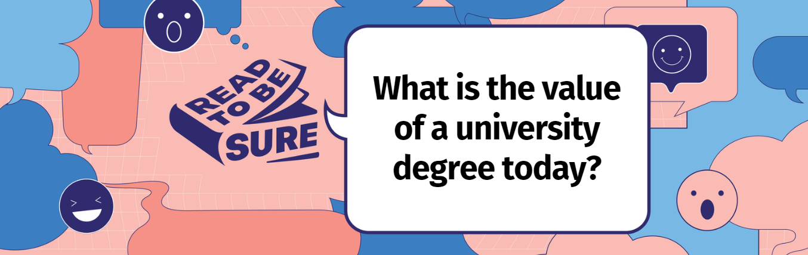
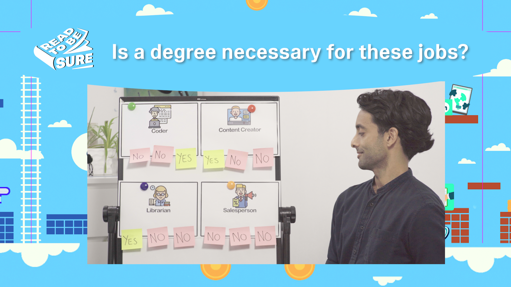
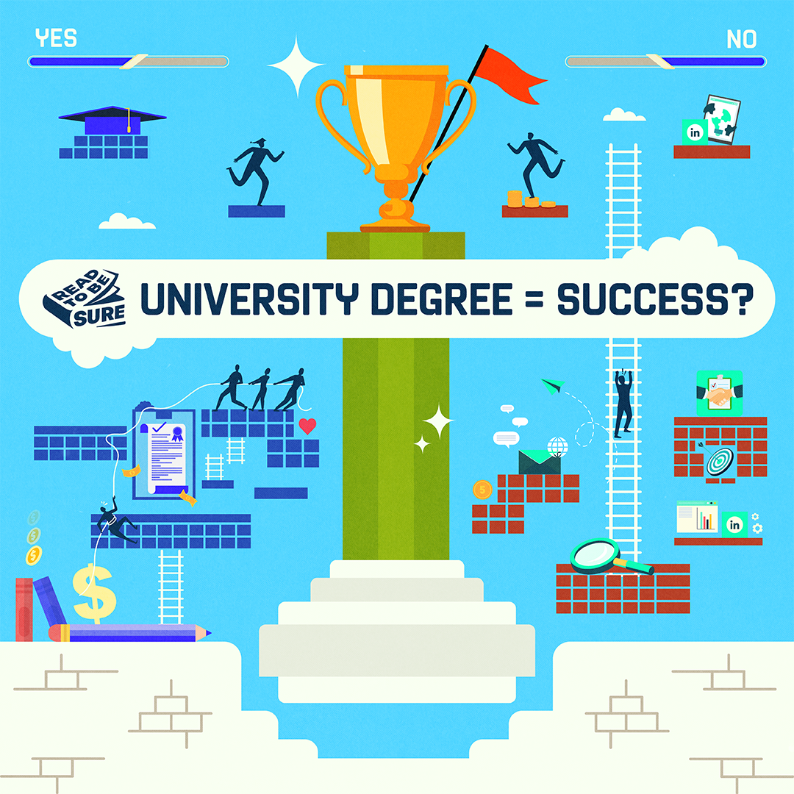
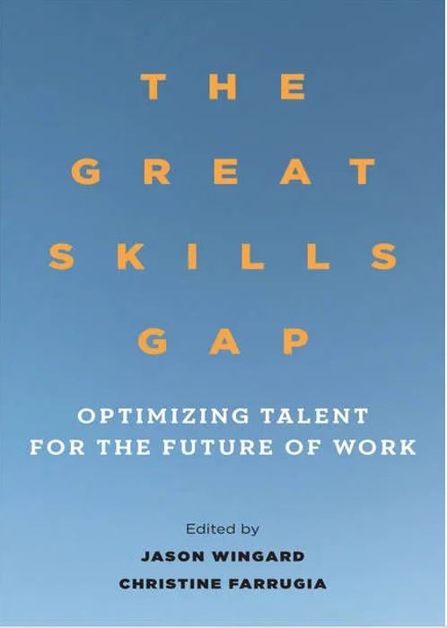
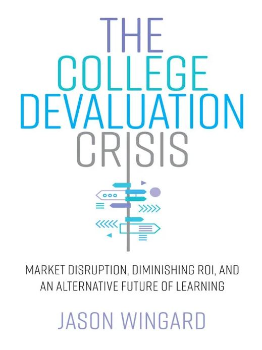
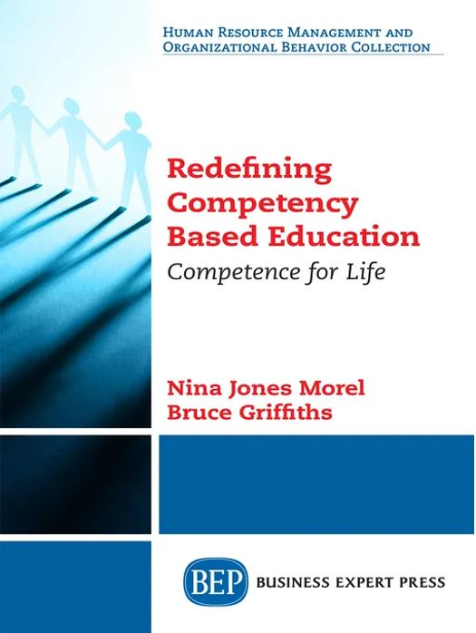
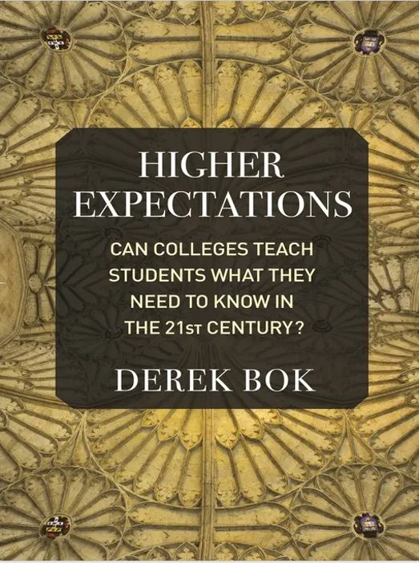
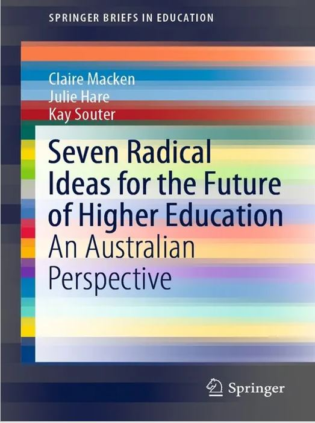

**<a href="#perspectives">Perspectives</a>**   /  **<a href="#poll">Poll</a>**   /  **<a href="#resources">Recommended Resources</a>** 

Today, a university degree carries a large wage premium. In Singapore, the median starting salary of a university graduate is [62 percent higher](https://www.straitstimes.com/singapore/community/university-grads-median-pay-is-42k-double-the-2k-of-those-with-ite-secondary-education-study) than those with diploma or A-level qualifications. 

Many individuals who obtain a degree acquire both [economic and social benefits](https://scholar.harvard.edu/files/roychan/files/chan_r._y._2016._understanding_the_purpose_aim_function_of_higher_education._jeppa_65_1-40.pdf). Technological advancements, digitalisation, and related developments in the economy and labour markets have increased the demand for high-skilled workers and professionals. Higher education plays a key role in a country’s [human capital and societal development](https://link.springer.com/article/10.1007/s10708-022-10636-1). Academic qualifications are valued because they are perceived to signal the skills and [contributions](https://www.aplu.org/our-work/4-policy-and-advocacy/publicuvalues/societal-benefits/) required by labour markets and [broader society](https://theconversation.com/whats-the-purpose-of-university-your-answer-may-depend-on-how-much-it-costs-you-151526). 

However, having higher education qualifications is not a guarantee of success or careers in desired fields. There are signs of [skill mismatch](https://www.econstor.eu/bitstream/10419/202692/1/dp12346.pdf) in the job market with instances of graduates being [over-educated and over-skilled](https://wol.iza.org/articles/overeducation-skill-mismatches-and-labor-market-outcomes-for-college-graduates/long) for the jobs they eventually take on. Some employers have started to [distrust university qualifications](https://www.oecd-ilibrary.org/sites/a44c9bad-en/index.html?itemId=/content/component/a44c9bad-en) due to changing skill demand accelerated by automation, digitisation, and artificial intelligence while the information and communication technology sector has developed its own [alternative credentialing system](https://www.oecd-ilibrary.org/sites/a44c9bad-en/index.html?itemId=/content/component/a44c9bad-en). It also seems that thriving in the new economy or finding success may not be entirely dependent on a university qualifications with [more jobs opening up to those without a bachelor’s degree](https://www.washingtonpost.com/education/2022/07/08/jobs-no-college-degrees/). 

** Placeholder for trailer video **

## So, is a degree still needed to succeed today?

[<a href="#top">Back to top</a>]

| **YES, A DEGREE IS STILL NEEDED FOR SUCCESS.**            | **NO, A DEGREE IS [NOT A MUST](https://www.straitstimes.com/singapore/parenting-education/traditional-degree-route-not-a-must-before-going-out-to-work) FOR SUCCESS.** |
| :----------------------------------------------------------- | ------------------------------------------------------------ |
| **Degrees still matter to most employers.**  Most employers still believe that [a degree is a must-have](https://cengage.widen.net/s/wn9bprbrmz/cg-employability-survey-report-part2-final) for their employees despite the fact that many have the skills to do the job via other credentials.   Employers have [confidence in higher education](https://dgmg81phhvh63.cloudfront.net/content/user-photos/Research/PDFs/AACUEmployerReport2021.pdf) and value the degree. They believe that graduates from reputable universities are already equipped with job-ready skills.    Degree requirements serve as a filter for reducing the pool of eligible applicants. A majority of employers still use [degrees to screen job applicants](https://www.cipd.co.uk/knowledge/work/skills/employer-skills-view-uk). Measuring the worth of alternative credentials is not easy.     Recruiters view that degree completion is an [indicator of potential](https://expandopportunities.org/wp-content/uploads/2022/10/ASA_JFF_Degrees-of-Risk-.pdf), showing that the candidate is committed to get to the end.   | **No degree? No problem, more employers think a degree is not necessary to do a good job.**   Increasingly, employers are [ending degree requirements](https://www.computerworld.com/article/3669412/companies-move-to-drop-college-degree-requirements-for-new-hires-focus-on-skills.html) for many job openings to reach more diverse talent. [On-the-job training as well as a candidate’s skills and relevant experience](https://www.indeed.com/lead/report-how-covid-19-pandemic-changed-recruiting?hl=en&co=US) are deemed a better gauge of success for specific roles. More companies, including Google and IBM, have [removed degree requirements](https://www.forbes.com/sites/forbeshumanresourcescouncil/2022/08/18/rethink-your-college-degree-requirements/?sh=257adfec11cc) from roles where a degree is not essential.    [More opportunities](https://remote.com/blog/degree-vs-experience-how-important-are-degrees) are now accessible to people without degrees, particularly in tech. The absence of a degree is no longer a barrier to [good jobs](https://www.washingtonpost.com/education/2022/07/08/jobs-no-college-degrees/).     Today, demand for talent outstrips supply. Many companies such as [IBM](https://www.ibm.com/impact/feature/apprenticeship) and Accenture as well as the [U.S. government](https://www.americanprogress.org/article/the-benefits-of-skills-based-hiring-for-the-state-and-local-government-workforce/) are shifting to [skills-based hiring](https://hbr.org/2022/02/skills-based-hiring-is-on-the-rise), especially in middle-skill jobs. Additionally, with rising [costs of higher education](https://www.asiaone.com/money/real-cost-how-much-does-higher-education-really-cost-singapore), [alternative (or micro credentials](https://www.shrm.org/hr-today/news/hr-magazine/summer2022/pages/alternative-credentials-help-increase-talent-pool-.aspx)) can help one gain employment.   |
| **A degree has its benefits.**    Holding a degree increases the prospect of [employment as well as higher income](https://www.oecd-ilibrary.org/education/education-at-a-glance-2019_f8d7880d-en). Workers who have higher levels of education typically [earn more and have lower rates of unemployment](https://www.bls.gov/careeroutlook/2021/data-on-display/education-pays.htm) compared to those who have less education.     According to [OECD’s Education at a Glance](https://www.oecd-ilibrary.org/sites/25ab4871-en/index.html?itemId=/content/component/25ab4871-en), the share of 25-34 year-olds with a tertiary qualification increased from 27% in 2000 to 48% in 2021. Tertiary education will soon be the most common among all working-age adults.    Building a social network is essential to success. Studying in universities provides [networking](https://www.topuniversities.com/student-info/careers-advice/5-easy-ways-network-while-university) opportunities, from interning to volunteering. Degree graduates can expect a level of support from their professors, mentors, and alumni network. Entrepreneurs are also more likely to receive 19% more funding in early-stage fundraising for start-ups if they [share an alma mater with investors](https://www.institutionalinvestor.com/article/b1vnyr22mz67xw/The-Key-to-Fundraising-for-Startups-Is-Alumni-Networks-Here-s-the-Surprise).   | **A degree is not the only path to success.**   “[Jobs do not require four-year college degrees. Employers do](https://www.burningglassinstitute.org/s/The-Emerging-Degree-Reset-2202Final.pdf).” In the last decade due to ‘[degree inflation](https://www.bbc.com/worklife/article/20210126-degree-inflation-how-the-four-year-degree-became-required),’ employers began adding degree requirements, even though the jobs themselves had not changed. However, workers should be aware that employers are placing a lot of [importance on soft skills](https://www.indeed.com/career-advice/interviewing/why-are-soft-skills-important) in today’s workplace.     Many graduates are employed in jobs for which a degree is not required ([over-education](https://wol.iza.org/articles/overeducation-skill-mismatches-and-labor-market-outcomes-for-college-graduates/long)), and in which skills they acquired in universities are not being fully utilised (over-skilling).   A [multitude of successful careers](https://www.access-sg.co/wwor) are not dependent on a university degree, instead, owing success to pursuing passions, adaptability and seeking opportunities. These careers include those in the [cybersecurity](https://www.imda.gov.sg/imtalent/guidance/success-stories/how-3-people-joined-cybersecurity) and [new media](https://www.wired.com/story/colleges-need-influencers-but-do-influencers-need-college/) industries as well as [entrepreneurial ventures](https://vulcanpost.com/726945/entrepreneurs-billionaires-school-dropouts-singapore/).     Networking sessions by various [organisations](https://www.wsg.gov.sg/career-services.html), [career fairs](https://www.wsg.gov.sg/SGUnited.html) or [online platforms](https://thehoneycombers.com/singapore/business-networking-platforms-in-singapore/) have opened up opportunities for mentorship, support and honing soft skills.   |
| **Universities are preparing students for the modern economy.**    Universities are evolving to stay relevant, in response to the [Fourth Industrial Revolution](https://www.weforum.org/agenda/2019/12/fourth-industrial-revolution-higher-education-challenges/) and ever-changing demands of the job market.     Singapore universities, for example, have introduced a slew of [initiatives](https://www.todayonline.com/big-read/big-read-short-are-spores-universities-nimble-enough-stay-relevant-1844401), including interdisciplinary learning, involvement of industry partners in internships and curriculum structure, and the promotion of lifelong learning.    | **Skills, not degrees, will shape the future of work.**    The [changing nature of work](https://www.ncsl.org/research/labor-and-employment/the-changing-nature-of-work.aspx) and careers quickened [after the COVID-19 pandemic](https://www.weforum.org/reports/the-future-of-jobs-report-2020/digest), accelerated by automation and artificial intelligence (AI).     The future of work will be about job skills; not about degrees. The [right skills](https://www.weforum.org/agenda/2020/09/reckoning-for-skills/) will be valued more than academic qualifications alone. This will steer workers without degrees toward successful careers and increase workforce diversity that makes [organisations successful](https://www.forbes.com/sites/forbeshumanresourcescouncil/2022/08/18/rethink-your-college-degree-requirements/?sh=4d3ab87111cc).    The [jobs of tomorrow](https://www.weforum.org/reports/jobs-of-tomorrow-mapping-opportunity-in-the-new-economy) at the forefront of the data and AI economy as well as new roles in engineering and cloud computing, will require talent with relevant skills – which can be learnt by those without degrees.   |

Workers need a holistic skill set composed of [cognitive skills, socio-emotional skills, technical skills, and digital skills](https://www.worldbank.org/en/topic/skillsdevelopment#2) to thrive in the modern economy. Given the accelerating pace of change, [skills development and lifelong learning](https://globalfutureofwork.com/wp-content/uploads/2020/12/ILO-Skills-Development-andLifelong-learning-2020-1.pdf) will be required to ensure the continual renewal of skills over one’s working life. 

Let's hear our guest speakers weigh in on this issue:

** Placeholder for Main Video **

## Poll: Your views matter!

[<a href="#top">Back to top</a>]

If you are unable to view the embedded form below, please click **<a href="https://forms.gle/Cim1SMHWSq3GnkiSA" target="_blank">here</a>**.

<iframe src="https://docs.google.com/forms/d/e/1FAIpQLSd3U4x8dIPAa6x2yCfdGXzG2fMtvGWKdVPsNUFV4JsInXJjjQ/viewform?embedded=true" width="640" height="500" frameborder="0" marginheight="0" marginwidth="0">Loading…</iframe>

## Recommended Resources

[<a href="#top">Back to top</a>]

*Explore the resources below to find out more about Education, and whether degrees are still needed to succeed today.*

### Videos

CNBC Make It. (2021, June 25). *Why You Need a College Degree to be Happy.* Retrieved 2023, January 11.

<iframe width="560" height="315" src="https://www.youtube.com/embed/Qs6AcZamr4k" title="YouTube video player" frameborder="0" allow="accelerometer; autoplay; clipboard-write; encrypted-media; gyroscope; picture-in-picture" allowfullscreen></iframe>

 

Harvard Business Review. (2022, November 17). *[LinkedIn CEO Ryan Roslansky: Skills, Not Degrees, Matter Most in Hiring](https://hbr.org/2022/11/linkedin-ceo-ryan-roslansky-skills-not-degrees-matter-most-in-hiring).* Retrieved 2023, January 11

New York Academy of Sciences. (2021, January 8). [*Is Traditional Higher Ed Still Worth it?*](https://www.nyas.org/ebriefings/2021/is-a-traditional-college-degree-still-worth-it/?tab=is%20traditional%20higher%20ed%20still%20worth%20it) Retrieved 2023, January 11. 

 ''

Yahoo! Finance (2021, May 29). *[https://finance.yahoo.com/video/50-recent-college-grads-feel-174628252.html?guccounter=1](https://finance.yahoo.com/video/50-recent-college-grads-feel-174628252.html?guccounter=1)* Retrieved 2023, January 11

Cambridge University Press & Assessment. (2021, June 25). [*How to Build Lifelong Learning Skills for the 21st Century Workplace.*](https://www.cambridgeassessment.org.uk/blogs/lifelong-learning-skills-for-the-21st-century-workplace/) Retrieved 2023, January 11. 

### Websites

**[The College Payoff: More Education Doesn’t Always Mean More Earnings](https://cewgeorgetown.wpenginepowered.com/wp-content/uploads/cew-college_payoff_2021-fr.pdf)** 
Carnevale, Anthony P., Ban Cheah, and Emma Wenzinger. (2021). *The College Payoff: More Education Doesn’t Always Mean More Earnings.* Georgetown University. Retrieved 2023, January 11. 

**[The Emerging Degree Reset: How the Shift to Skills-Based Hiring Holds the Keys to Growing the U.S. Workforce at a Time of Talent Shortage](https://www.burningglassinstitute.org/s/The-Emerging-Degree-Reset-2202Final.pdf)** 
Fuller, Joseph B., Christina Langer, Julia Nitschke, Layla O'Kane, Matthew Sigelman, and Bledi Taska. (2022, February). The *Emerging Degree Reset: How the Shift to Skills-Based Hiring Holds the Keys to Growing the U.S. Workforce at a Time of Talent Shortage*. Burning Glass Institute. Retrieved 2023, January 11. 

**[The Rise of Skills-Based Hiring and What it Means for Education](https://www.forbes.com/sites/tomvanderark/2021/06/29/the-rise-of-skills-based-hiring-and-what-it-means-for-education/?sh=604741c84fa7)** 
Ark, Tom Vander (2021, June 21). *The Rise of Skills-Based Hiring and What it Means for Education.* Forbes. Retrieved 2023, January 11. 

**[Why Skills - Not Degrees - Will Shape the Future of Work](https://www.weforum.org/agenda/2020/09/reckoning-for-skills/)** 
Kumar, S. Ravi, and Steve George (2020, September 21). *Why Skills - Not Degrees - Will Shape the Future of Work.* World Economic Forum. Retrieved 2023, January 11.

**[The Future of Jobs Report 2020](http://www3.weforum.org/docs/WEF_Future_of_Jobs_2020.pdf)** 
The Future of Jobs Report 2020.* (2020, October). World Economic Forum. Retrieved 2023, January 11. 

**[Changing Demand for Skills in Digital Economies and Societies](https://www.ilo.org/wcmsp5/groups/public/---ed_emp/---ifp_skills/documents/publication/wcms_831372.pdf)** 
Changing Demand for Skills in Digital Economies and Societies.* (2021, December 9). International Labour Organization. Retrieved 2023, January 11. 

  

### Podcasts

**[No Degree, No Problem for Growing Number of Employers](https://www.wsj.com/podcasts/whats-news/no-degree-no-problem-for-growing-number-of-employers/12f558ed-dabe-44ff-ad0e-f2409f2d106a)** 
The Wall Street Journal. (2022, December 2). *No Degree, No Problem for Growing Number of Employers.* Retrieved 2023, January 11.

**[Google Expands College-Alternative Tech Skills Training](https://www.hbs.edu/managing-the-future-of-work/podcast/Pages/podcast-details.aspx?episode=15654155)**  
Harvard Business School. (2020, August 18). *Google Expands College-Alternative Tech Skills Training.* Retrieved 2023, January 11.

**[More Skipping College Today, What Will that Mean for Tomorrow?](https://www.wsj.com/podcasts/as-we-work/more-skipping-college-today-what-will-that-mean-for-tomorrow/7a8bfe02-e82e-4595-9e35-4e1c8b45087d)** The Wall Street Journal. (2022, August 22). *More Skipping College Today, What Will that Mean for Tomorrow?* Retrieved 2023, January 11.

[**Joe Fuller on Enrollment Growth University: How Can Colleges Address the Middle Skills Gap While Readying Students for the Job Market?** ](https://www.hbs.edu/managing-the-future-of-work/podcast/Pages/podcast-details.aspx?episode=20556926) Harvard Business School. (2021, September 21). *Joe Fuller on Enrollment Growth University.* Retrieved 2023, January 11.

**[The Rise of Thinking Skills in Higher Education and the Workplace](https://www.cambridgeassessment.org.uk/news/audio/view/the-rise-of-thinking-skills-in-higher-education-and-the-workplace/)** Cambridge University Press & Assessment (2021, April 27). *The Rise of Thinking Skills in Higher Education and the Workplace*. Retrieved 2023, January 11.

**[“I Don’t Think the Country is Turning Away from College.”](https://freakonomics.com/podcast/i-dont-think-the-country-is-turning-away-from-college/)** Freakonomics (2022, May 4). *“I Don’t Think the Country is Turning Away from College.”* Retrieved 2023, January 11. 

 

### NLB eBooks

|                                                              | **Recommended Titles**                                       |
| ------------------------------------------------------------ | ------------------------------------------------------------ |
|  | **[The Great Skills Gap: Optimizing Talent for the Future of Work](https://go.nlb.gov.sg/m-link/details?type=ebook&id=8045DB8E-B9F0-4185-801D-392D9032FF88&utm_source=online&utm_campaign=RTBS_Jan23&utm_medium=website&utm_content=skills_gap )** Wingard, Jason, and Christine Farrugia. (2021). *The Great Skills Gap: Optimizing Talent for the Future of Work.* Stanford, California*:* Stanford University Press*.*  Retrieved from OverDrive. ([myLibrary ID](https://account.nlb.gov.sg/) is required to access the eBook).  |
|  | [****In Defense of a Liberal Education.****](https://go.nlb.gov.sg/m-link/details?type=ebook&id=B8C1A94F-479E-4EC4-ACE2-DC96D8B99DA4&utm_source=online&utm_campaign=RTBS_Jan23&utm_medium=website&utm_content=defense_liberal_education ) Zakaria, Fareed. (2015). *In Defense of a Liberal Education.* W.W. Norton & Company.   Retrieved from OverDrive. (myLibrary ID is required to access the eBook). |
|  | **[The College Devaluation Crisis: Market Disruption, Diminishing ROI, and an Alternative Future of Learning](https://go.nlb.gov.sg/m-link/details?type=ebook&id=B4D8DF29-DA02-4A2F-9D31-372CD8075903&utm_source=online&utm_campaign=RTBS_Jan23&utm_medium=website&utm_content=college_devaluation)** Wingard, Jason. (2022). The College Devaluation Crisis: Market Disruption, Diminishing ROI, and an Alternative Future of Learning. Stanford, California: Stanford University Press.  Retrieved from OverDrive. (myLibrary ID is required to access the eBook). |
| <a href="https://go.nlb.gov.sg/m-link/details?type=ebook&id=79499621-3B3F-4B36-AE31-A506C5AFB11C&utm_source=online&utm_campaign=RTBS_Jan23&utm_medium=website&utm_content=redefining_competency">!</a> | **[Redefining Competency Based Education: Competence for Life](https://go.nlb.gov.sg/m-link/details?type=ebook&id=79499621-3B3F-4B36-AE31-A506C5AFB11C&utm_source=online&utm_campaign=RTBS_Jan23&utm_medium=website&utm_content=redefining_competency)** Morel, Nina Jones, and Bruce Griffiths. (2018). Redefining Competency Based Education: Competence for Life. New York: Business Expert Press.  Retrieved from OverDrive. (myLibrary ID is required to access the eBook). |
|  | **[Higher Expectations: Can Colleges Teach Students What They Need To Know in the 21st Century?](https://go.nlb.gov.sg/m-link/details?type=ebook&id=8CEC292F-8AC2-42FE-895B-A1811332D779&utm_source=online&utm_campaign=RTBS_Jan23&utm_medium=website&utm_content=higher_expectations)** Bok, Derek. (2020). Higher Expectations: Can Colleges Teach Students What They Need To Know in the 21st Century? Princeton: Princeton University Press.  Retrieved from OverDrive. (myLibrary ID is required to access the Audiobook). |
|  | **[Seven Radical Ideas for the Future of Higher Education](https://go.nlb.gov.sg/m-link/details?type=ebook&id=E68FAA8C-3D0A-4F6D-8D4C-BA0F82CE1CAE&utm_source=online&utm_campaign=RTBS_Jan23&utm_medium=website&utm_content=seven_radical_ideas)** Macken, Claire and Julie Hare. (2021). Seven Radical Ideas for the Future of Higher Education. Singapore: Springer Nature Singapore.  Retrieved from OverDrive. (myLibrary ID is required to access the eBook).  |
|                                                              |                                                              |

