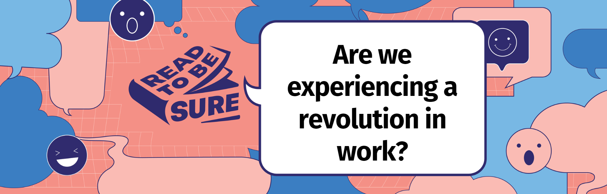
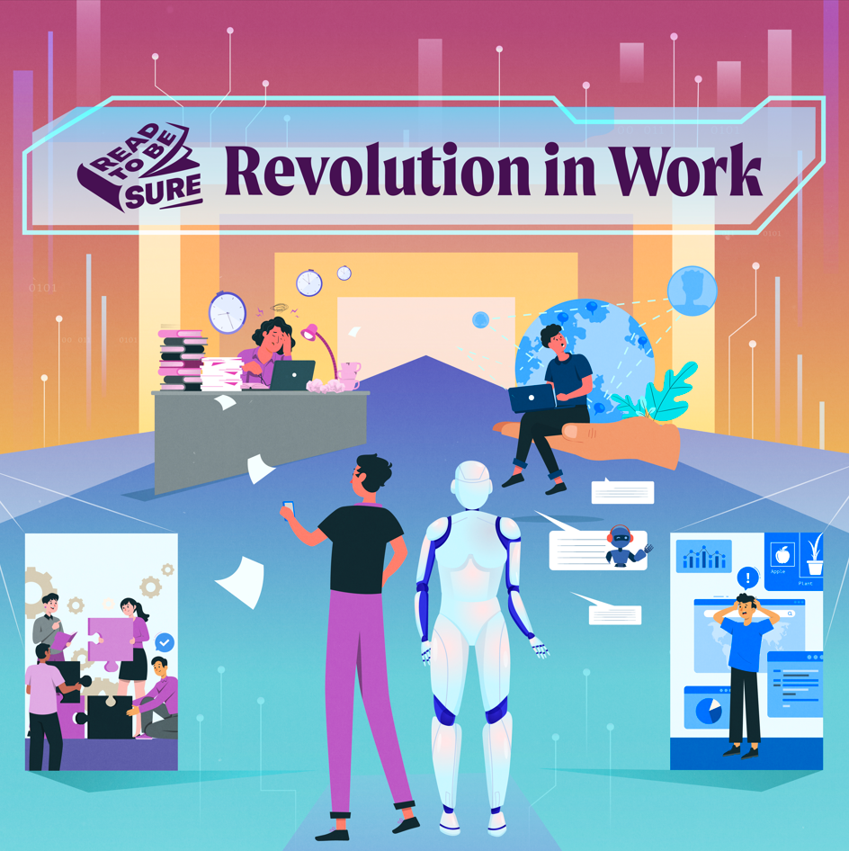
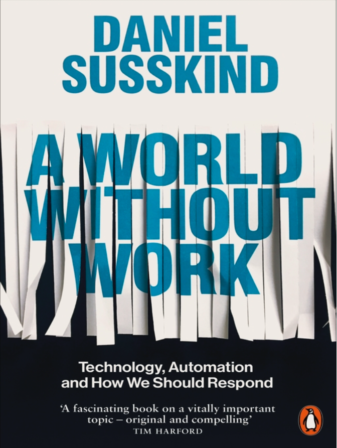
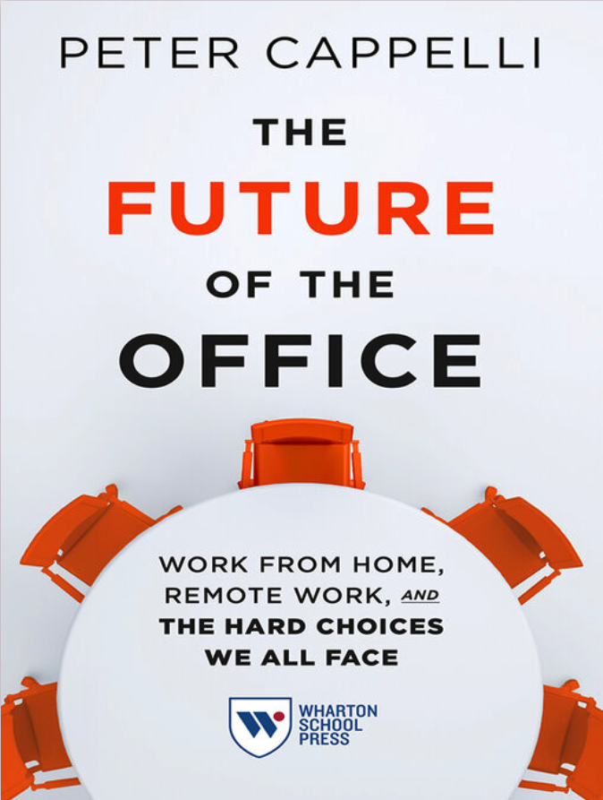
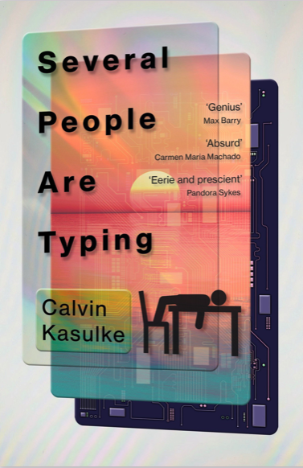

**<a href="#perspectives">Perspectives</a>**   /  **<a href="#poll">Poll</a>**   /  **<a href="#resources">Recommended Resources</a>** 

With the rise of buzzwords like “[Quiet Quitting](https://www.straitstimes.com/business/is-quiet-quitting-a-sign-of-workers-slacking-off-or-pushing-back)”, [“Death” of the 9-5 workday](https://www.cnbc.com/2023/03/03/the-future-of-remote-work-labor-experts-weigh-in.html) and “[Humineral](https://www.forbes.com/sites/jackkelly/2023/02/23/china-workers-have-their-version-of-quiet-quitting-and-acting-your-wage-huminerals-are-extracted-exploited-and-disposed-of/?sh=22cc828f7fa0)”, it begs the question: Is it time to overhaul the workplace?

 

An [alarming 85% of employees](https://www.hcamag.com/asia/news/general/85-of-singaporean-workers-at-risk-of-extreme-burnout/407677) in Singapore are at risk of burnout due to their [overworked schedules](https://sbr.com.sg/hr-education/in-focus/singapore-named-most-overworked-country-in-apac), leading to the city state having the [worst mental health record in the entire Asia Pacific.](https://sbr.com.sg/hr-education/in-focus/singapore-named-most-overworked-country-in-apac) Despite the [clear demand for more flexible work arrangements](https://www.uobgroup.com/uobgroup/newsroom/2022/half-of-singaporeans.page?path=data/uobgroup/2022/243&cr=segment), only [52% of employees](https://www.channelnewsasia.com/singapore/workers-singapore-not-accept-jobs-remote-working-flexible-hours-randstad-survey-2883016) have access to remote work options, leaving many feeling frustrated and [disconnected](https://www.mckinsey.com/capabilities/people-and-organizational-performance/our-insights/its-time-for-leaders-to-get-real-about-hybrid) from their jobs. 

 

So, what’s behind this troubling trend? Some have point to the [persistence of traditional 9-to-5 office culture](https://vulcanpost.com/818086/four-day-work-week-catch-on-in-singapore/) in Singapore and challenges of balancing [organisational and employee needs](https://www.businesstimes.com.sg/videos/is-a-four-day-work-week-ever-possible-in-singapore/6322070094112). As [hustle culture](https://www.mili.eu/milieu-conversations/finding-the-balance-understanding-hustle-culture-and-its-impact-on-mental-health-and-well-being) and [quiet quitting](https://www.bbc.com/news/business-62638908) continue to rise, the call to action for companies to prioritize employee mental health and establish work-life balance has never been more urgent. A revolution at work is brewing, and only time will tell if [companies will rise to the challenge](https://vulcanpost.com/818086/four-day-work-week-catch-on-in-singapore/).

 

Fortunately, there has been some glimmer of hope on the horizon. In recent years, [archaic workplace practices](https://mothership.sg/2023/03/women-equal-opportunities-workplace/) have been called out and there have been improvements with a push for more [inclusive](https://www.cnbc.com/2021/04/30/diversity-equity-and-inclusion-are-important-to-workers-survey-shows.html) and [flexible](https://www.wsj.com/articles/workers-care-more-about-flexible-hours-than-remote-work-11643112004) work environments. Due to the pandemic, [flexible work arrangement](https://edition.cnn.com/2021/03/09/success/remote-work-covid-pandemic-one-year-later/index.html) became the new norm, offering [benefits](https://www.wework.com/ideas/professional-development/management-leadership/benefits-of-working-remotely) such as [lower absenteeism and turnover rate](https://www.channelnewsasia.com/commentary/wfh-hybrid-why-insist-return-office-flexibility-wellbeing-3249281).

 

It’s not just changing attitudes towards work that are shaking things up in the workplace. The rise of artificial intelligence (AI) and other advanced technologies is also causing a major impact, with some experts predicting that these developments could be [a threat to our jobs](https://www.mckinsey.com/featured-insights/future-of-work/ai-automation-and-the-future-of-work-ten-things-to-solve-for#part2). But while AI may [be impressive](https://www.techtarget.com/searchenterpriseai/feature/6-key-benefits-of-AI-for-business), it's still [falling short of matching human](https://hbr.org/2021/03/ai-should-augment-human-intelligence-not-replace-it) intelligence and capabilities, which means that there is still a place for us in the workplace of the future.

<PLACEHOLDER FOR TEASER VIDEO>

<iframe width="560" height="315" src="https://www.youtube.com/embed/XxDrSHLIF94" title="YouTube video player" frameborder="0" allow="accelerometer; autoplay; clipboard-write; encrypted-media; gyroscope; picture-in-picture; web-share" allowfullscreen></iframe>

## The question remains: Are we experiencing a revolution in work?

[<a href="#top">Back to top</a>]

| ****YES, THE FUTURE OF WORK IS CHANGING!****              | ****NO, WORK** **WILL REMAIN UNCHANGED.****                  |
| :----------------------------------------------------------- | ------------------------------------------------------------ |
| **Automation and AI are replacing humans at work.**  Computing power, data, algorithms, and automation technologies have enabled [robots and AI](https://keough.nd.edu/ai-and-the-future-of-labor-dd/) to perform physical and predictive tasks with such accuracy and complexity-often surpassing humans. As a result, AI can potentially [replace the human workforce](https://www.theguardian.com/technology/2023/feb/08/ai-chatgpt-jobs-economy-inequality) across many [industries](https://builtin.com/artificial-intelligence/ai-replacing-jobs-creating-jobs), such as manufacturing and healthcare.  ChatGPT, for example, is a powerful tool that can perform [tasks](https://www.businessinsider.com/chatgpt-jobs-at-risk-replacement-artificial-intelligence-ai-labor-trends-2023-02) such as coding and computer programming, content creation, market research, customer service and graphic designing.   | **Human intelligence and abilities are still needed in the workplace.**  Human abilities are unique and [expansive](https://hbr.org/2021/03/ai-should-augment-human-intelligence-not-replace-it), capable of imagining, anticipating, feeling, and assessing evolving situations. AI complements and [amplifies human capabilities](https://www.ey.com/en_gl/ai/is-ai-the-start-of-the-truly-creative-human), not replaces them.   So far, there is [no evidence](https://www.peoplemanagement.co.uk/article/1751737/artificial-intelligence-not-caused-loss-jobs) that AI has led to overall job losses to date. While it may take over repetitive tasks, but it is [not eliminating jobs](https://www.nytimes.com/2022/10/07/opinion/machines-ai-employment.html) altogether. On the contrary, AI has the potential to [enable new industries to emerge](https://workofthefuture.mit.edu/wp-content/uploads/2020/12/2020-Research-Brief-Malone-Rus-Laubacher2.pdf) and [create new job opportunities](https://hbr.org/2021/03/why-robots-wont-steal-your-job). These new jobs will require [new skill sets](https://www.fastcompany.com/90684437/the-future-of-jobs-in-the-era-of-ai), highlighting the importance of [reskilling and upskilling](https://allwork.space/2021/11/ai-will-create-97-million-jobs-but-workers-dont-have-the-skills-required-yet/).   |
| **Work environments are better than before.**  Employees today want [flexibility](https://www.hrdive.com/spons/90-of-employees-demand-flexible-work-do-you-have-the-tools-to-support-the/621558/), [diversity, equity and inclusion](https://www.hrdive.com/news/workers-switch-jobs-for-inclusive-culture/641178/) (DEI). Both governments and companies are responding to their demands  Singapore's [Enabling Masterplan 2030](https://www.straitstimes.com/singapore/8-highlights-from-enabling-masterplan-2030-to-empower-persons-with-disabilities) targets a 40 percent employment rate for persons with disabilities by 2030, and many companies are embracing [workplace inclusivity](https://www.businesstimes.com.sg/lifestyle/championing-inclusive-workforce). Singapore is also codifying laws against [workplace discrimination](https://www.channelnewsasia.com/commentary/singapore-workplace-anti-discrimination-law-disabilities-job-support-3143916) .  In line with global trends, some Singapore companies are offering [flexible work arrangements](https://www.straitstimes.com/business/flexi-work-becoming-more-common-in-spore-despite-shift-to-living-with-covid-19-0), benefitting employees with caregiving duties and promotes better work-life harmony.   | **In fact, there are more challenges faced in the workplace today.**  There has been a rise in hustle culture in recent years, as well as trends such as [quiet quitting](https://www.gallup.com/workplace/398306/quiet-quitting-real.aspx) and the [Great Resignation](https://www.businessinsider.com/gen-z-jobs-generation-quiet-quitting-great-resignation-recession-economy-2023-2).  Burnout, increased stress levels, and heavy workloads have led to almost a quarter of Singapore employees wanting to [leave their jobs](https://www.todayonline.com/singapore/nearly-quarter-spore-workers-intend-quit-their-jobs-first-half-2022-survey-1775126) in early 2022. Companies are not offering [sufficient mental health support](https://www.channelnewsasia.com/singapore/mental-health-inclusivity-employment-lack-opportunities-3027271) or [adequate training](https://www.ntu.edu.sg/business/news-events/news/story-detail/work-life-boss-i'm-not-data-stupid.-you-never-trained-me) to perform effectively.  Singapore companies also lag in implementing DEI policies with only [30 percent](https://www.kincentric.com/-/media/kincentric/2022/january/dei_singapore/kincentricdeilandscapewhitepaperfinal.pdf) having a formal approach in place.   |
| **Flexible work arrangements are here to stay.**  Working remotely increases [employees’ productivity](https://www.straitstimes.com/business/economy/yes-working-from-home-makes-you-more-productive-us-study-finds), [improves their overall well-being, strengthens family relationships, makes them happier and decreases their stress levels](https://www.entrepreneur.com/living/employees-are-happier-in-the-office-more-research-suggests/436685). Some global companies, including [Twitter](https://www.washingtonpost.com/technology/2020/10/01/twitter-work-from-home/) and [Airbnb](https://news.airbnb.com/airbnbs-design-to-live-and-work-anywhere/), have committed to allowing employees to work remotely permanently.  Companies in the United States, the United Kingdom, Japan and New Zealand are trialling a [four-day work week](https://www.euronews.com/next/2022/12/19/the-four-day-week-which-countries-have-embraced-it-and-how-s-it-going-so-far). In Singapore, the four-day work week is one of the many [flexible work arrangements that is encouraged](https://www.channelnewsasia.com/singapore/4-day-work-week-singapore-employees-business-life-balance-3007396), depending on the business’ and employee’s needs. Employees reported less stress and fatigue, improved work-life balance and satisfaction, increased productivity, and significant savings on transportation and childcare as [benefits](https://www.bbc.com/worklife/article/20230125-how-widespread-could-the-four-day-workweek-really-be) of a shortened work week.  [Other benefits](https://www.roberthalf.com.sg/blog/employers/flexible-working-arrangements-7-benefits-your-business-missing-out) include lower absenteeism and increased cost-effectiveness. As employees no longer require permanent physical workspaces, companies can [shrink their office sizes](https://www.computerworld.com/article/3669888/in-a-hybrid-workforce-world-what-happens-to-all-that-office-space.html) and expenses, [making way for areas of collaboration, innovation, and community-building](https://www.mckinsey.com/capabilities/people-and-organizational-performance/our-insights/the-organization-blog/the-future-of-the-workplace-embracing-change-and-fostering-connectivity).   | **9-to-5 work culture in the office is still valued.**  As pandemic restrictions lift, the future of remote work remains uncertain. While some have lauded the benefits of working from home, others debate the [impact of remote work on employee communication and collaboration](https://greatergood.berkeley.edu/article/item/how_remote_work_affects_our_communication_and_collaboration). A 2022 Gallup survey found [“less access” to work resources and equipment and less “connection” to organisation’s culture](https://www.gallup.com/workplace/398135/advantages-challenges-hybrid-work.aspx) are top challenges in a hybrid work model.  Several companies are tightening their flexible work arrangements, such as [Disney](https://www.bbc.com/worklife/article/20230206-the-companies-backtracking-on-flexible-work) mandating the return to office four days a week citing the importance of in-person collaboration, camaraderie and mentorship. In Singapore, [nearly half of the workforce](https://www.channelnewsasia.com/commentary/wfh-hybrid-why-insist-return-office-flexibility-wellbeing-3249281) has resumed working full-time at their offices post-pandemic.  A physical working space provides a [focused environment](https://www.inc.com/dana-sitar/5-benefits-of-working-in-an-office-and-how-to-reclaim-them-with-a-remote-team.html), and fosters [connection, collaboration, and innovation](https://envoy.com/blog/benefits-of-working-in-an-office/), creating a [sense of belonging](https://www.shrm.org/hr-today/news/all-things-work/pages/why-belonging-matters.aspx). Working remotely blurs [work-life boundaries](https://www.prnewswire.com/news-releases/survey-remote-workers-struggle-with-work-life-boundaries-but-is-a-return-to-the-workplace-the-answer-301515832.html), increases [social isolation](https://sloanreview.mit.edu/article/the-loneliness-of-the-hybrid-worker/) risks and there may be implications for [career progression or salary growth](https://www.alliancevirtualoffices.com/virtual-office-blog/remote-work-study-career-advancement/).   |

Let's hear our guest speakers weigh in on this issue:

<PLACEHOLDER FOR MAIN VIDEO>

<iframe width="560" height="315" src="https://www.youtube.com/embed/oTRg_XZbUYg" title="YouTube video player" frameborder="0" allow="accelerometer; autoplay; clipboard-write; encrypted-media; gyroscope; picture-in-picture; web-share" allowfullscreen></iframe>

## Poll: Your views matter!

[<a href="#top">Back to top</a>]

If you are unable to view the embedded form below, please click **<a href="https://forms.gle/xfGg6LZWJs3H16GZ9" target="_blank">here</a>**.

<iframe src="https://docs.google.com/forms/d/e/1FAIpQLSd2H3rq_6j2rtk-jXg7EtDJy5eA6Pp9sDjs_m-4WY_xPGC8xA/viewform?embedded=true" width="640" height="1629" frameborder="0" marginheight="0" marginwidth="0">Loading…</iframe>

## Recommended Resources

[<a href="#top">Back to top</a>]

*Explore the resources below to find out more about Education, and whether degrees are still needed to succeed today.*

### Videos

Institute of Policy Studies (IPS) Singapore. *Singapore Perspectives 2023 "Work" — Future of Work*. Retrieved 2023, February 15. 

<iframe width="560" height="315" src="https://www.youtube.com/embed/lTRWKCHAQDo" title="YouTube video player" frameborder="0" allow="accelerometer; autoplay; clipboard-write; encrypted-media; gyroscope; picture-in-picture" allowfullscreen></iframe>

 

CBS News. (2023, February 1). The Rise of AI: Could ChatGPT Take Your Job? Retrieved 2023, February 15. 

<iframe width="560" height="315" src="https://www.youtube.com/embed/7PuNTPVkSQM" title="YouTube video player" frameborder="0" allow="accelerometer; autoplay; clipboard-write; encrypted-media; gyroscope; picture-in-picture" allowfullscreen></iframe>

### Websites

**[What is the Future of Work?](https://www.mckinsey.com/featured-insights/mckinsey-explainers/what-is-the-future-of-work)** *What is the Future of Work?* (2023, January 23). McKinsey & Company*.* Retrieved 2023, February 14.  

**[What if your Colleague is a Bot? Harnessing the Benefits of Workplace Automation Without Alienating Staff](https://theconversation.com/what-if-your-colleague-is-a-bot-harnessing-the-benefits-of-workplace-automation-without-alienating-staff-196203)** Waizenegger, Lena & Angsana A. Techatassanasoontorn. (2023, January 9). *What if your Colleague is a Bot? Harnessing the Benefits of Workplace Automation Without Alienating Staff*. The Conversation. Retrieved 2023, February 14.   

### Podcasts

**[What Makes an Office Worth Coming To?](https://www.reworked.co/digital-workplace/get-reworked-podcast-what-makes-an-office-worth-coming-to/)** reworked. (2022, June 21). *What Makes an Office Worth Coming To?* Retrieved February 14, 2023. 

 

**[Four Days' Work for Five Days' Pay: Does it Work?](https://www.ft.com/content/1ecf62bc-2e9b-4b45-876b-9a8f4a09059c)** Financial Times. (2022, December 8). *Four Days' Work for Five Days' Pay: Does it Work?* Retrieved February 14, 2023. 

 

### NLB eBooks

|                                                              | **Recommended Titles**                                       |
| ------------------------------------------------------------ | ------------------------------------------------------------ |
|  | [**A World Without Work: Technology, Automation and How We Should Respond**](https://go.nlb.gov.sg/m-link/details?type=ebook&id=C68A0EF9-6BF1-4B8E-9517-6232C8C3B62D&utm_source=online&utm_campaign=RTBS_Mar23&utm_medium=website&utm_content=future_of_office )** Susskind, Daniel. (2020). *A World Without Work: Technology, Automation and How We Should Respond.* Penguin Books Ltd*.*  Retrieved from OverDrive. ([myLibrary ID](https://account.nlb.gov.sg/) is required to access the eBook).  |
|  | [**The Future of the Office: Work from Home, Remote Work, and the Hard Choices We All Face**](https://go.nlb.gov.sg/m-link/details?type=ebook&id=C68A0EF9-6BF1-4B8E-9517-6232C8C3B62D&utm_source=online&utm_campaign=RTBS_Mar23&utm_medium=website&utm_content=future_of_office ) Cappelli, Peter. (2021). *The Future of the Office: Work from Home, Remote Work, and the Hard Choices We All Face*. Wharton School Press.   Retrieved from OverDrive. (myLibrary ID is required to access the eBook). |
|  | [**Several people are typing: A novel**](https://go.nlb.gov.sg/m-link/details?type=book&id=205608798&utm_source=online&utm_campaign=RTBS_Mar23&utm_medium=website&utm_content=several_people_typing ) Kasulke, Calvin. (2021). *Several people are typing: A novel.* London: Hodder Studio.   Call no.: KAS -[SF]  Available at selected libraries.   |
|                                                              |                                                              |

