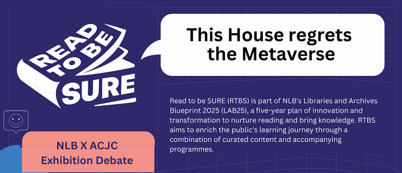

***Register for this event held at Anglo-Chinese Junior College [HERE](https://form.gov.sg/63bbe70ee5155d0012f82301).***

Is the metaverse a virtual paradise?

 

The promise of the metaverse is that it could provide a greater convergence of our digital and physical lives, and a potential social equaliser.

 

But with social, businesses, design and technical challenges, will the metaverse end up being a digital nightmare that we will regret?

 

Join the debaters representing Anglo-Chinese Junior College (ACJC) West Zone Centre For Language Excellence as they hash it out so that you can make an informed decision before stepping into the metaverse.

 

Date: 18 February 2023, Saturday

Time: 2:00pm – 3.30pm

Venue: Anglo-Chinese Junior College

Lecture Theatre 2, Level 1

25 Dover Close East

Singapore 139745

 

