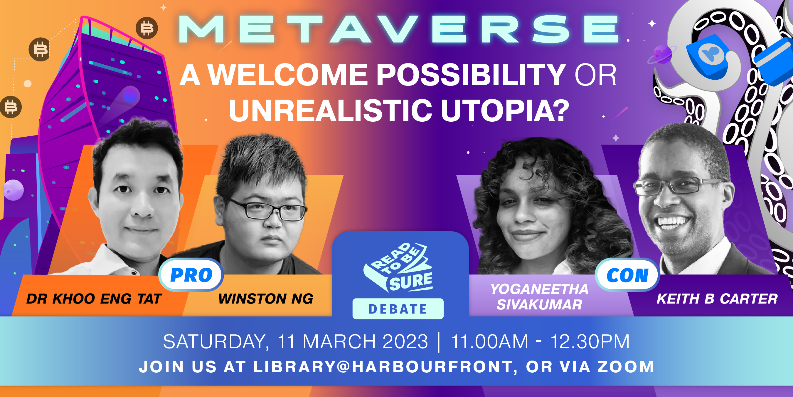

**Join our speakers as they deliberate and debate on the metaverse. Listen to the different perspectives and vote for the winning side!**

This event has ended. Watch the full recording:

<iframe src="https://nlb.ap.panopto.com/Panopto/Pages/Embed.aspx?id=543cc2dc-5a78-4f91-bd84-afef00c8bf19&autoplay=false&offerviewer=true&showtitle=true&showbrand=true&captions=false&interactivity=all" height="405" width="720" style="border: 1px solid #464646;" allowfullscreen allow="autoplay"></iframe>
 

***Note: Due to unforeseen circumstances, we have a new speaker, Soh Wan Wei, who will be joining us in this debate programme in place of Winston Ng.***

The metaverse promises a greater convergence of our physical and digital worlds as well as a potential social equaliser.

But with social, business and technical challenges, is the metaverse, a fad or an unrealistic utopia?

Join our speakers as they deliberate and debate on the metaverse. Listen to the different perspectives and vote for the winning side!

 Find out more about the metaverse: https://sure.nlb.gov.sg/read-to-be-sure-volume-2/issue2-metaverse/

**About the debaters:**

**Soh Wan Wei**          

Soh Wan Wei is a Singaporean tech futurist, ecosystem builder and thought leader in the Web3.0 and Metaverse space. Passionate about open source movements and education, she is also the founder and CEO of IKIGUIDE Metaverse Collective (IMC) and Openmetaverse.asia. IKIGUIDE Metaverse Collective counts NYSE-listed Nutanix, Hitachi, Crypto.com and non-profit alliance ChangemakersXchange as some of the key partners and clients in its portfolio.  Wan Wei identifies herself as a global citizen and has previously spent four years living in Europe and a year in Japan. An experienced community advocate, Wan Wei has spoken at more than 100 reputable Web3.0, metaverse and A.I. industry conferences and hackathons globally.

**Dr Khoo Eng Tat**

Dr Khoo is a principal investigator of the Immersive Reality Lab at the National University of Singapore. Beyond his academic interest in virtual, augmented and mixed reality, his wide industry experience includes serving as a founding member of the Holomedicine Association and being a startup mentor at Pixel.

**Keith B. Carter**

Keith is a partner at KBC Global Partners, an IT Consulting firm that helps companies monetize their data projects. Besides having vast industry experience, he was also a past associate professor at the School of Computing at the National University of Singapore and teaches at the Lee Kuan Yew School of Public Policy.

**Yoganeetha Sivakumar**

Yoganeetha is an economics graduate who pursued her passion and delved into writing as a career. She covers news and writes op-eds on the tech and startup industry for publications such as the Vulcan Post. Among her works are commentaries on the development of the Metaverse both internationally and domestically.

**About Read To Be SURE**

Read to be SURE (RTBS) is part of NLB’s Libraries and Archives Blueprint 2025 (LAB25), a five-year journey of our next phase of transformation. RTBS aims to educate and inform the public on trending topics through a combination of curated content and accompanying programmes. By exploring multiple perspectives on these topics, readers and participants will benefit from a balanced and credible knowledge base.

To find out more, please visit us at https://sure.nlb.gov.sg/read-to-be-sure/intro/

**About S.U.R.E.**

S.U.R.E. stands for Source, Understand, Research and Evaluate, and is an initiative of the National Library Board to educate the public on information literacy.

For more information and free resources, please visit us at [www.sure.nlb.gov.sg](https://www.sure.nlb.gov.sg/)

**Programme/Event Administrative Information**

• This programme is conducted both on-site at Library@Harbourfront (Programme Zones 1 and 2) and online on Zoom.

• Please note that photos and/or videos of this programme and its participants may be taken. By registering for this programme, you agree that NLB may take photographs and/or videos of you (or your child as applicable) and use the images and/or videos including to archive, exhibit and publish them for publicity or any other NLB purposes

• This programme/event is open to members of the National Library Board, Singapore. Please ensure you have your myLibrary ID on hand before proceeding with the registration. If you do not have a myLibrary ID, you can create one here: https://account.nlb.gov.sg/.

• Please ensure that you enter a valid email address as you will receive an email with the link to the programme/event near the day of the programme/event.

• The Zoom link of the programme should not be shared with others

• Do ensure you have a strong internet connection. Using your mobile data is not recommended

• The National Library Board, Singapore (NLB) reserves the right in its absolute discretion to disqualify or refuse admission to any registrant without any reason and notice