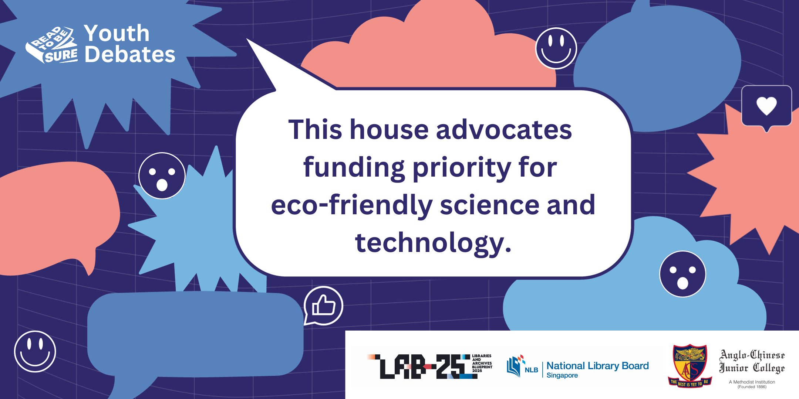

Join us for an exciting debate as students take the stand on whether funding should be prioritised for eco-friendly science and technology.

With climate change and the challenges of building a sustainable future, will our debaters be able to generate enough heat to convince the audiences that investing in eco-friendly science and technology is the way forward?

**Date and Time: Saturday, 28 October 2023, 3.30pm-5.00pm**

**Location: Jurong Regional Library, Programme Zone, Level 1**

### About this programme:

This programme is a collaboration between Anglo Chinese Junior College and National Library Board, Singapore.

 

**Register here: [https://bit.ly/rtbs-28oct](https://bit.ly/rtbs-28oct)**	
