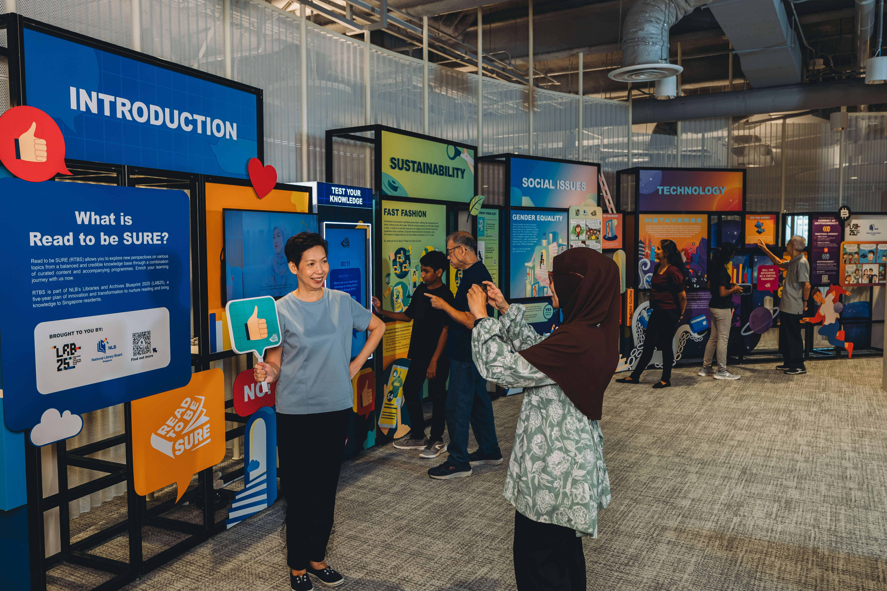

**Read to be SURE (RTBS)** is part of NLB’s Libraries and Archives Blueprint 2025 (LAB25), a five-year journey of our next phase of transformation. RTBS aims to educate and inform the public on trending topics through a combination of curated content and accompanying programmes. By exploring multiple perspectives on these topics, readers and participants will benefit from a balanced and credible knowledge base.

**Volume 3:**

- [Issue 1 - Generative A.I.](/read-to-be-sure-volume-3/issue1-generative-ai/)
- [Issue 2 - Sustainability](/read-to-be-sure-volume-3/issue2-sustainability/)
- [Issue 3 - Caregiving](/read-to-be-sure-volume-3/issue3-caregiving/)
- [Special Issue - Deepfakes](/read-to-be-sure-volume-3/deepfakes/)

 **Volume 2:**

- [Issue 1 - Gender Equality](/read-to-be-sure-volume-2/issue1-gender-equality/)

- [Issue 2 - Metaverse](/read-to-be-sure-volume-2/issue2-metaverse/)

- [Special Issue: World Cup](/read-to-be-sure-volume-2/special-issue1-worldcup/)

- [Issue 3 - Higher Education](/read-to-be-sure-volume-2/issue3-education/)

- [Issue 4 - Work Revolution](/read-to-be-sure-volume-2/issue4-workrevolution/)

- [[Public Debate] Metaverse: A Welcome Possibility or Unrealistic Utopia?](/read-to-be-sure-volume-2/mainstage-debate/)

  

**Volume 1:**

- [Issue 1: Fast Fashion](/read-to-be-sure/issue1-introduction/)

- [Issue 2: COVID-19 Curbs](/read-to-be-sure/issue2-overview/)

- [Issue 3: Cryptocurrencies and NFTs](/read-to-be-sure/issue3-overview/)

- [Issue 4: Russia-Ukraine Information War](/read-to-be-sure/issue4-ukraine/)

  

### Read to be SURE Showcase

NLB’s Read to be SURE initiative encourages patrons to explore multiple perspectives on trending topics. This will help readers and participants benefit from a balanced and credible knowledge base.

The Read to be SURE showcase explores the following topics:

1. Sustainability: Fast Fashion

2. Social Issues: Gender Equality

3. Technology: Metaverse & Cryptocurrency

From now until 14 September 2023, patrons can engage and interact with the various features, including an interactive quiz station, which introduces them to multiple perspectives of the featured topics.

<iframe width="560" height="315" src="https://www.youtube.com/embed/erOZVTrw5Zc" title="YouTube video player" frameborder="0" allow="accelerometer; autoplay; clipboard-write; encrypted-media; gyroscope; picture-in-picture" allowfullscreen></iframe>

