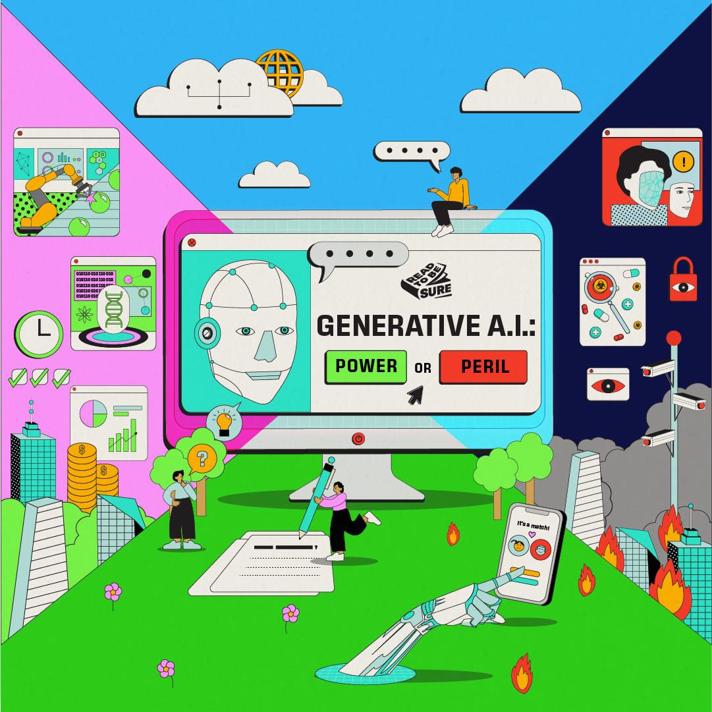
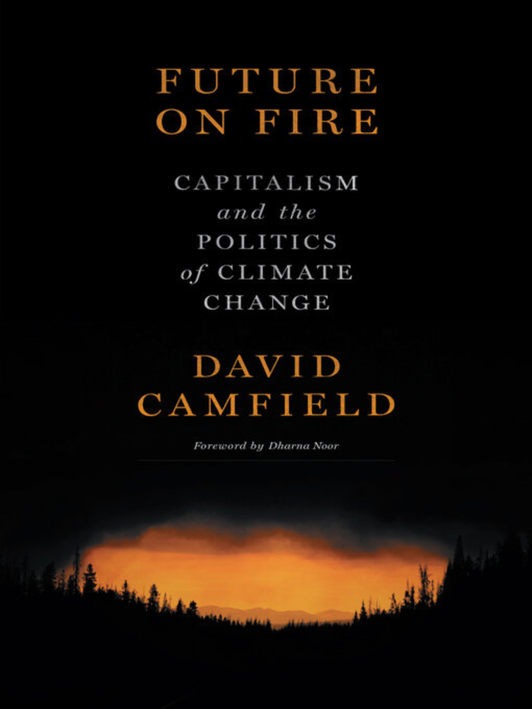
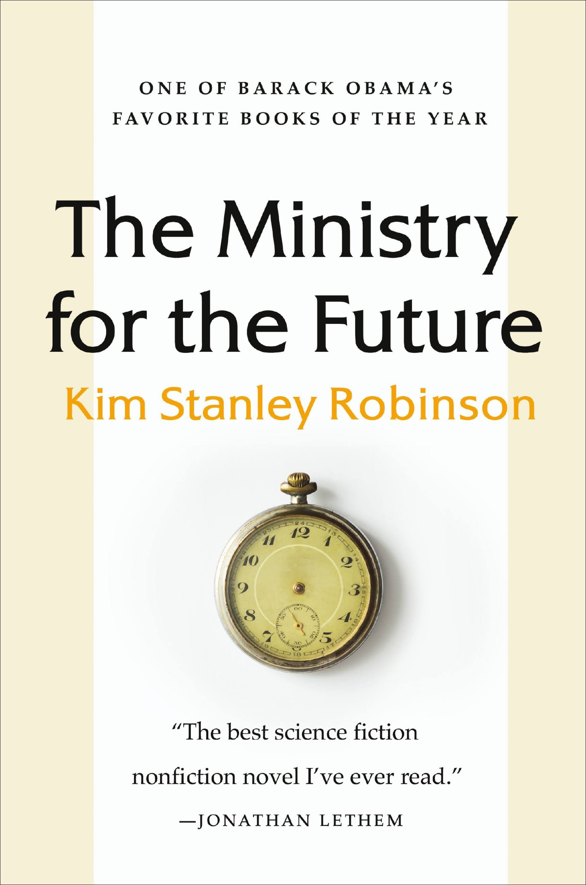
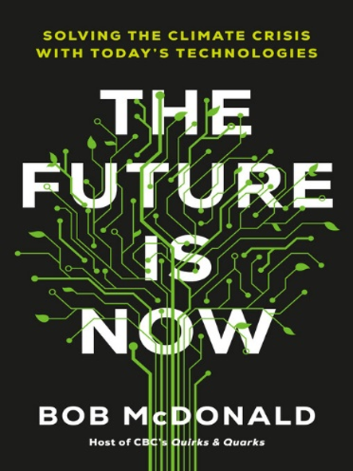

 **<a href="#perspectives">Perspectives</a>**   /  **<a href="#poll">Poll</a>**   /   **<a href="#resources">Recommended Resources</a>** 

]Are you feeling the heat? It’s not just you – Singapore’s annual mean temperature has been on the rise due to [climate change](https://www.nccs.gov.sg/singapores-climate-action/impact-of-climate-change-in-singapore/). But it’s not just about feeling uncomfortable – the effects of climate change are far-reaching and can impact our way of life, from water resources to food security. 

 

Fossil fuels are the primary culprit behind this climate crisis. Soaring carbon emissions cause [environmental degradation](https://www.nrdc.org/stories/what-are-effects-climate-change#environment) and bring about [social threats](https://www.nrdc.org/stories/what-are-effects-climate-change#humans). The [risks of climate change](https://climate.nasa.gov/effects/) include more frequent and intense droughts, rainfall, heat waves, rising sea levels, melting glaciers, and warming oceans. 

 

Science and technology may hold the key to combat the crisis. Using [new technologies](https://www.sap.com/sea/insights/viewpoints/by-land-sea-and-air-emerging-technologies-to-tackle-climate-change.html), we can identify and reduce emission sources, improve energy efficiency, and develop low-carbon alternatives to fossil fuels. [Green technologies](https://www.businesstimes.com.sg/esg/future-world-sustainability-2023/how-emerging-green-technologies-could-change-way-we-live) could help to tackle decarbonisation and climate change. [Cultured meat](https://cmr.berkeley.edu/2023/07/disrupting-the-plate-cultured-meat-technology/) or cell-based meat is an eco-friendly technological alternative to traditional livestock farming. Singapore has already taken a bold step forward by approving the world’s first [cell-culture chicken bites](https://www.straitstimes.com/singapore/eat-just-receives-approval-from-sfa-to-produce-serum-free-cultivated-meat#:~:text=Eat Just in 2020 received,the texture and meaty quality.) produced by Eat Just in 2020. 

 

However, science and technology could be a double-edged sword with environmental pitfalls. [Rare earth elements](https://news.climate.columbia.edu/2023/04/05/the-energy-transition-will-need-more-rare-earth-elements-can-we-secure-them-sustainably/#:~:text=It's difficult to mine rare,earth elements from the ore.) are required for green technologies, and their extraction can lead to deforestation and the release of toxic chemicals. The growing demand for clean energy will increase [clean energy minerals extraction](https://climate.mit.edu/ask-mit/how-does-environmental-impact-mining-clean-energy-metals-compare-mining-coal-oil-and-gas), resulting in more and larger mines. [Nuclear energy](https://www.iaea.org/bulletin/what-is-the-clean-energy-transition-and-how-does-nuclear-power-fit-in#:~:text=Nuclear power is the second,almost no greenhouse gas emissions.) is a low-carbon alternative but produces [radioactive waste](https://www.sustainability-times.com/low-carbon-energy/tackling-nuclear-waste-is-key-to-an-energy-transition/). 

 

As such, some argue that science and technology is not the only solution. We can do our part by creating a sustainable future by adopting [energy-saving habits](https://www.nea.gov.sg/our-services/climate-change-energy-efficiency/energy-efficiency/household-sector/energy-saving-tips), using [energy-efficient appliances](https://www.nrdc.org/stories/energy-efficiency-clean-facts), [reducing meat consumption](https://www.scientificamerican.com/article/eating-less-red-meat-is-something-individuals-can-do-to-help-the-climate-crisis/) and switching to more [plant-based diets](https://news.stanford.edu/report/2021/05/06/embracing-plant-based-diet/). 

 

*PLACEHOLDER FOR TEASER VIDEO*

## **So, is science and technology harming or healing the environment?**

[<a href="#top">Back to top</a>]

<table border="2" style="background-color:#FFFFFF;border-collapse:collapse;border:2px solid #000000;color:#000000;width:100%" cellpadding="3" cellspacing="3">
	<tr>
        <th style="width:50%">Science and technology are healing the environment</th>
        <th>Science and technology are harming the environment</th>
	</tr>
	<tr>
		<td><b>Alternative energy is the way forward.</b>
  
Clean, green and renewable energy reduces the dependency on fossil fuels and alleviates environmental harm. In 2022, the growth of clean energy technologies contributed to a lower-than-expected global carbon dioxide emissions growth of less than 1%. This helped limit the adverse impacts of coal and oil use. 
  
Renewable energy is produced from existing resources that naturally sustain or replenish themselves over time. It is clean, sustainable, reduces air pollution and improves air quality. For example, solar and wind power harness natural energy and do not produce carbon emissions during electricity generation. 
  
</td>
		<td><b>Alternative energy harms the environment and habitats.</b>
  
Alternative energy is not free from adverse environmental effects. Renewable energy often requires more land and affects biodiversity. 
  
Solar photovoltaic (PV) panels require several metals, some of which are toxic. Additionally, end-of-life solar panels produce toxic waste and when improperly disposed could  negatively impact human health and the environment.
 </td>
	</tr>
	<tr>
		<td><b>Electric vehicles are the future for zero-emissions vehicles.</b></b>	 
  
Electric vehicles are more energy efficient than fuel-burning internal combustion engines. The transition from fossil fuels to electricity reduces greenhouse gases and emits less pollution. Electric vehicles emit 200 grams of carbon dioxide per mile driven over their lifetime, whereas gasoline vehicles emit 350 grams.
  
With the development of technology, battery production improvements, and a cleaner electricity grid, electric vehicles will continue to improve their carbon footprint and reduce environmental impact.
</td>
        <td><b>Electric vehicles have hidden environmental costs.</b> 
  
Electric vehicle manufacturing has a higher carbon footprint than regular vehicle production, as the battery alone emits more than seven tonnes of carbon dioxide equivalent (CO2e). Lithium-ion batteries in electric vehicles rely on raw materials such as cobalt, lithium and other rare earth metals. These must be mined and have significant environmental impact such as intensive water usage, carbon emissions and toxic waste.
  	
Electric grids used to charge electric vehicles still rely on fossil fuels. Brake wear, tire wear and road surface wear also emit pollutants. 
</td>
	</tr>
	<tr>
		<td><b>High-tech farming could help to mitigate climate change. </b>
  
Conventional agriculture and livestock farming account for large shares of global greenhouse gas emissions, deforestation and biodiversity loss. A kilogram of beef may emit 100 kilogram of carbon dioxide.
  
Cultured meat requires less land, water, and greenhouse gas emissions than livestock farming. Its carbon footprint can be further lowered when produced using renewable energy. The carbon footprint of cultured meat is estimated to be 92% lower than beef, 52% lower than pork, and 17% lower than chicken
  
Vertical farming, combined with high-tech farming methods such as hydroponics, aquaponics and aeroponics, can make agriculture more sustainable by reducing land use, water consumption and pesticides. Vertical farming also allows a consistent year-round crop production and is not affected by adverse weather conditions. 
</td>
		<td><b>High-tech farming is resource intensive.</b>  
  
In order to maintain a suitable growing environment for crops, indoor vertical farming requires artificial lighting and climate control systems, which consume a lot of energy. The source of electricity may further impact the carbon footprint.
  
Cultivated meat is likely to be more resource-intensive with a higher carbon footprint than real beef. The equipment required for production facilities have associated emissions. The global warming potential of highly refined or purified growth media used in cultured meat is four to 25 times greater than the average for real beef.
  
</td>
	</tr>
</table>

Let's hear  our guest speakers weigh in on this issue:

###### *PLACEHOLDER FOR NEW MAIN VIDEO*

## Poll: Your views matter!

[<a href="#top">Back to top</a>]

If you are unable to view the embedded form below, please click **<a href="https://forms.gle/mYbgcbp8LQBZVkoY7" target="_blank">here</a>**.

<iframe src="https://docs.google.com/forms/d/e/1FAIpQLSfpOHgd2jxpqZv0rI1aD2T48BJr-udbiqLCsG7Z-30N3ER_Tw/viewform?embedded=true" width="640" height="1167" frameborder="0" marginheight="0" marginwidth="0">Loading…</iframe>

​	

*PLACEHOLDER FOR KEY VISUAL*

# Recommended Resources

[<a href="#top">Back to top</a>]

*Explore the resources below to find out more about Sustainability.

## Videos

Sustainable Tech. *The Future of Green Technology.* Retrieved 2023, September 13. 

<iframe width="560" height="315" src="https://www.youtube.com/embed/6TmSqBz4esU" title="YouTube video player" frameborder="0" allow="accelerometer; autoplay; clipboard-write; encrypted-media; gyroscope; picture-in-picture" allowfullscreen></iframe>

 

 

## Websites

**[Factcheck: How Electric Vehicles Help to Tackle Climate Change](https://www.carbonbrief.org/factcheck-how-electric-vehicles-help-to-tackle-climate-change/)** Hausfather Zeke, “Factcheck: How Electric Vehicles Help to Tackle Climate Change.” *Carbon Brief*, last updated 7 February 2020. Retrieved 2023, September 13.

 

**[Can Tech Save Us From Worst of Climate Change Effects? Doesn’t Look Good](https://news.harvard.edu/gazette/story/2022/11/can-tech-save-us-from-worst-of-climate-change-effects-doesnt-look-good/)** Simon, Clea, “Can Tech Save Us From Worst of Climate Change Effects? Doesn’t Look Good.” *The Harvard Gazette*, 17 November 2022. Retrieved 2023, September 13.

## Podcasts

**[TIL About Removing CO2 From the Atmosphere](https://climate.mit.edu/podcasts/til-about-removing-co2-from-the-atmosphere)** MIT Environmental Solutions Initiative. (19 August 2021). *TIL About Removing CO2 From the Atmosphere*.  Retrieved 2023, September 13.

## NLB eBooks

<table border="2" style="background-color:#FFFFFF;border-collapse:collapse;border:2px solid #000000;color:#000000;width:100%" cellpadding="3" cellspacing="3">
	<tr>
        <td></td>
        <td><a href="https://go.nlb.gov.sg/m-link/details?type=ebook&id=01160781-6A3A-49F7-B86A-F61B49004CA1&utm_source=online&utm_campaign=RTBS_Oct23&utm_medium=website&utm_content=futurefire"><b>Future on Fire: Capitalism and the Politics of Climate Change</b></a> 
Camfield, David. Future on Fire: Capitalism and the Politics of Climate Change. Halifax: PM Press, 2022. 
  
Retrieved from OverDrive. (myLibrary username is required to access the eBook).
  </td>
    </tr>
    <tr>
        <td></td>
        <td><a href="https://go.nlb.gov.sg/m-link/details?type=ebook&id=357A2955-C5EE-4CDE-A2F2-5D9C050EDDCD&utm_source=online&utm_campaign=RTBS_Oct23&utm_medium=website&utm_content=ministryforfuture"><b>The Ministry for the Future</b></a> 
Robinson, Kim Stanley. The Ministry for the Future. New York: Orbit, 2021. 
  
Retrieved from OverDrive. (myLibrary username is required to access the eBook).
</td>
	</tr>
    <tr>
        <td></td>
        <td><a href="https://go.nlb.gov.sg/m-link/details?type=book&id=FD346B96-396E-4075-80BD-E2C290110FC1&utm_source=online&utm_campaign=RTBS_Oct23&utm_medium=website&utm_content=futureisnow"><b>The Future is Now: Solving the Climate Crisis with Today's Technologies</b></a> 
McDonald, Bob. The Future is Now: Solving the Climate Crisis with Today’s Technologies. Toronto: Viking Canada, 2022.   Retrieved from OverDrive. (myLibrary username is required to access the eBook).
</td>
	</tr>
</table>

