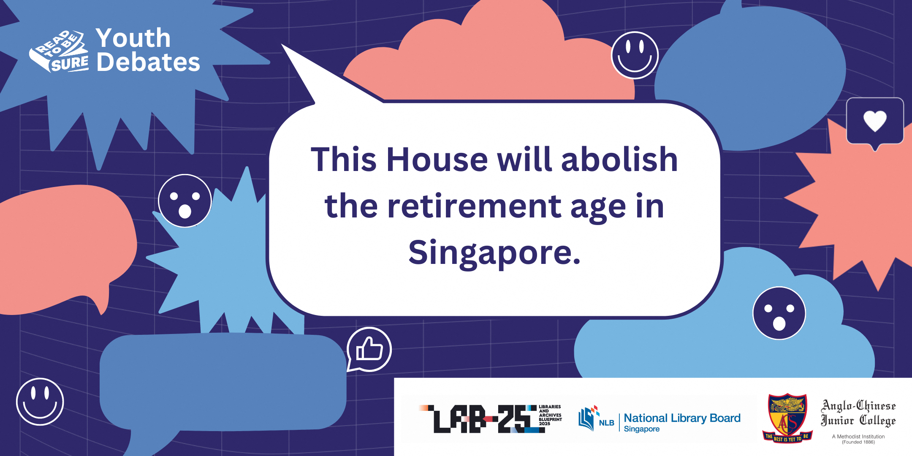

Title: RTBS Youth Debates: This House will abolish the retirement age in Singapore

Date: 27 April, Saturday

Time: 2.30pm-4pm

Venue: Woodlands Regional Library, Programme Zone, Level 1

 

Link: **[https://rtbs-2704.eventbrite.sg](https://rtbs-2704.eventbrite.sg/)** 

 

**Join us for an exciting debate as students provide perspectives on the pros and cons of retirement age.**

According to a recent local study, nearly 3 in 10 seniors in their 50s and 60s do not have a retirement plan. With Singapore being an aging society and Singaporeans expecting to live to 84 years old on average, retirement may be on our minds sooner than later.

So, should the retirement age be abolished?

Discover the diverse perspectives surrounding retirement. Visit our [Read to be SURE website](https://sure.nlb.gov.sg/read-to-be-sure-volume-3/issue4-retirement/) to learn more.

 

**About this programme**

This programme is a collaboration between Anglo Chinese Junior College, Tampines Meridian Junior College and National Library Board, Singapore.

 
