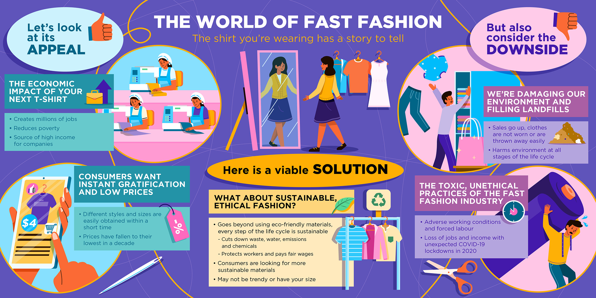

# **Curious about the fashion industry?**

It’s the weekend and you’ve got some time and money. You browse your favourite clothing store but find nothing you like. No worries, you’ll come back again next week. Chances are you’ll find new styles on the shelves.

Pretty normal, right?

That didn’t use to be the case.

Before, you would have to wait [until next season](https://www.forbes.com/sites/theyec/2019/05/13/three-reasons-why-fast-fashion-is-becoming-a-problem-and-what-to-do-about-it/?sh=3934b17c144b) to find new items. There is a demand for readily available, trend-driven fashion, thanks to the world’s [growing middle class](https://www.mckinsey.com/~/media/mckinsey/industries/retail/our insights/the state of fashion 2020 navigating uncertainty/the-state-of-fashion-2020-final.pdf) and their higher disposable income. Now, fashion companies are capitalising on fast fashion, the rapid production of trendy and cheap clothes in high volumes. 

