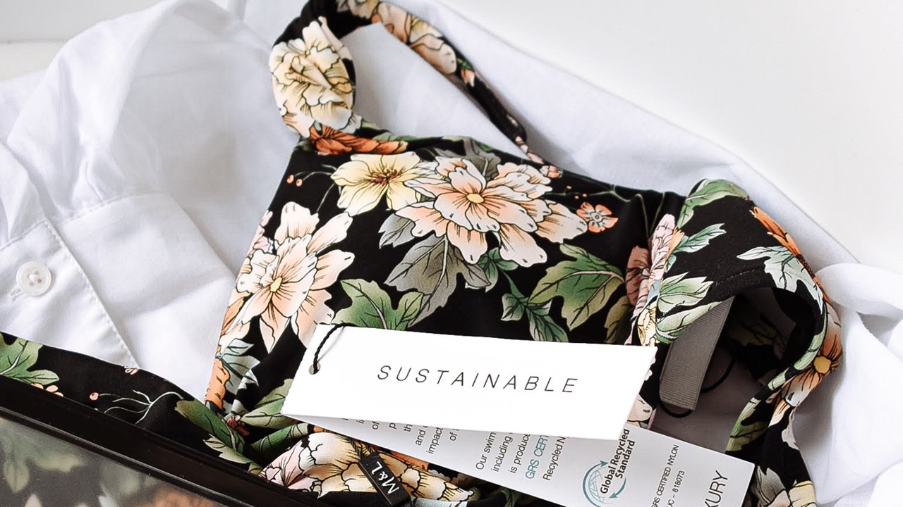

It’s the weekend and you’ve got some time and money. You browse your favourite clothing store but find nothing you like. No worries, you’ll come back again next week. Chances are you’ll find new styles on the shelves.

Pretty normal, right?

That didn’t use to be the case.

Before, you would have to wait [until the next season](https://www.forbes.com/sites/theyec/2019/05/13/three-reasons-why-fast-fashion-is-becoming-a-problem-and-what-to-do-about-it/?sh=3934b17c144b) to find new items. There is a demand for readily available, trend-driven fashion, thanks to the world’s [growing middle class](https://www.mckinsey.com/~/media/mckinsey/industries/retail/our insights/the state of fashion 2020 navigating uncertainty/the-state-of-fashion-2020-final.pdf) and their higher disposable income. Now, fashion companies are capitalising on fast fashion, the rapid production of trendy and cheap clothes in high volumes.  

**Perspectives**

Is fast fashion worth the while?  To do so, we have to look at the different impacts of fast fashion.

***1. Economic Impact***    

 
Photo by [Towfiqu barbhuiya](https://unsplash.com/@towfiqu999999?utm_source=unsplash&utm_medium=referral&utm_content=creditCopyText) on [Unsplash](https://unsplash.com/s/photos/calculator?utm_source=unsplash&utm_medium=referral&utm_content=creditCopyText)

The clothing manufacturing industry employs many and creates millions of jobs. Buying your next T-shirt could feed households and reduce poverty in many countries in the Asia-Pacific (APAC) region, also known as “the clothing factory of the world”. In 2019, [65 million people](https://www.ilo.org/wcmsp5/groups/public/---asia/---ro-bangkok/documents/briefingnote/wcms_758626.pdf) worked in the [APAC clothing manufacturing industry](https://www.ilo.org/wcmsp5/groups/public/---ed_dialogue/---sector/documents/publication/wcms_669355.pdf) — that’s every seven out of 10 workers worldwide.

Fast fashion makes a lot of money for trend-driven fashion companies. It’s almost a vicious cycle as  more [clothes are produced](https://www.vox.com/the-goods/22573682/shein-future-of-fast-fashion-explained), the more consumers [want to buy](https://www.npr.org/2013/03/11/174013774/in-trendy-world-of-fast-fashion-styles-arent-made-to-last). No wonder the industry is key to the economic and social development of many developing countries. 

***2. Price Factor***

 
Photo by [Dollar Gill](https://unsplash.com/@dollargill?utm_source=unsplash&utm_medium=referral&utm_content=creditCopyText) on [Unsplash](https://unsplash.com/s/photos/shopping?utm_source=unsplash&utm_medium=referral&utm_content=creditCopyText)  

Consumers love the instant gratification fast fashion provides. Getting their hands on [the latest fashion trends](https://www.drapersonline.com/news/how-the-desire-for-instant-gratification-is-shaping-retail) within a short time seems too good to be true. Yet this is what the industry delivers, and at affordable prices to boot. Fast fashion is everywhere and is produced at very low cost. Fast fashion companies have also been producing items in [a wide range of sizes](https://ww.fashionnetwork.com/news/Mango-completes-violeta-integration-shein-tops-plus-size-inclusivity-list,1327389.html) to cater to different body shapes.

This industry continues to grow to keep up with rising demand and rapidly changing fashion trends. One has to stop and wonder: What are the drawbacks?

***3. Environmental Impact***

 
Photo by [Maxim Tolchinskiy](https://unsplash.com/@shaikhulud?utm_source=unsplash&utm_medium=referral&utm_content=creditCopyText) on [Unsplash](https://unsplash.com/s/photos/pollution?utm_source=unsplash&utm_medium=referral&utm_content=creditCopyText)

As clothing sales go up, clothes end up not being worn or are thrown away easily. How many clothing items do you buy and get rid of within a year? [A survey](https://www.channelnewsasia.com/singapore/bursting-seams-singapores-cast-clothing-1035441) involving 1,000 Singaporeans revealed that we buy 34 pieces of new clothing on average and dispose of 27 items within 12 months. For almost every item we buy, we throw away another.

How many times do you wear a shirt before throwing it away? Clothes were only worn seven to 10 times before being thrown out. [Landfills are being filled](https://emf.thirdlight.com/link/2axvc7eob8zx-za4ule/@/download/1) with textile waste, generated through this [throw-away culture](https://www.channelnewsasia.com/singapore/bursting-seams-singapores-cast-clothing-1035441). 

From the production of raw materials to the disposal of clothes, the fast fashion industry consumes large amounts of chemicals, water and energy. It is a source of pollution for both air and water, accounting for [10% of all global carbon emissions](https://www.europarl.europa.eu/RegData/etudes/BRIE/2019/633143/EPRS_BRI(2019)633143_EN.pdf). That’s more than that of the international flights industry and the maritime shipping industry combined.

***4. Business Practices***  

 
Photo by [Rio Lecatompessy](https://unsplash.com/@riolec?utm_source=unsplash&utm_medium=referral&utm_content=creditCopyText) on [Unsplash](https://unsplash.com/s/photos/fast-fashion?utm_source=unsplash&utm_medium=referral&utm_content=creditCopyText)  

Remember the great economic impact we mentioned earlier? While that may be true, the industry has long been plagued by low wages, modern slavery, child labour and poor working conditions.

Factory workers in developing countries often work extremely long hours in harsh and dangerous conditions with a severe lack of occupational safety and health measures. Over a thousand workers were killed and another 2,500 plus were injured on 24 April 2013 upon the collapse of [Bangladesh’s Rana Plaza building](https://theconversation.com/years-after-the-rana-plaza-tragedy-bangladeshs-garment-workers-are-still-bottom-of-the-pile-159224), which housed five garment factories.

That’s not even including unethical business practices. During the COVID-19 lockdowns in 2020, many high street fashion retailers simply cancelled their orders as shops were closed and consumers stayed at home. Almost overnight, thousands of people [lost their jobs](https://www.independent.co.uk/news/world/asia/h-m-garment-workers-factory-india-jobs-a9579856.html) and their source of income.

But it’s not all bleak in the world of fast fashion. Consumers are becoming more aware of the harm behind their clothing purchases. As such, [fashion companies](https://www.vox.com/the-goods/2021/7/19/22535050/gen-z-relationship-fast-fashion) are beginning to implement [more sustainable initiatives](https://www.npr.org/2019/07/27/745418569/can-fast-fashion-and-sustainability-be-stitched-together).

***5. Sustainable Fashion*** 

 Photo by [Jess @ Harper Sunday](https://unsplash.com/@harpersunday?utm_source=unsplash&utm_medium=referral&utm_content=creditCopyText) on [Unsplash](https://unsplash.com/s/photos/sustainable-fashion?utm_source=unsplash&utm_medium=referral&utm_content=creditCopyText)  

Let’s say you come back to the same store a week later. Immediately, some clothes nearby catch your eye. You spot the tag and are taken aback by the high price. When you look closer, you spot it — a sticker labelled “Sustainable Fashion”.

[Sustainability goes beyond](http://changingmarkets.org/wp-content/uploads/2021/07/SyntheticsAnonymous_FinalWeb.pdf) switching to natural materials and labelling clothes as “eco-friendly”. Sustainable fashion uses materials that are responsibly and ethically sourced or have a lower environmental impact. The idea focuses on all aspects of the entire supply chain, production and life cycle. Companies have to [manage their waste and water](https://www.forbes.com/sites/stephanrabimov/2020/07/20/post-pandemic-fashion-will-be-sustainable-and-affordable-interview-with-anna-gedda-head-of-sustainability-at-hm-group/), limit their gas emissions and chemicals, [protect their workers](https://www.greenstrategy.se/sustainable-fashion/what-is-sustainable-fashion/) and pay them fairly.

This is why sustainable fashion may not be trendy or affordable. Sustainable clothing tend to [be more expensive](https://www.channelnewsasia.com/cnainsider/true-cost-demand-cheap-clothes-fast-fashion-industry-environment-220706) due to their small batch production and extensive manufacturing processes. Some consumers are more likely to [pay premium prices](https://www.thegoodtrade.com/features/what-is-slow-fashion) for [sustainable alternatives](https://www.vogue.co.uk/fashion/article/sustainable-fashion-affordable). There is also a lack of size diversity in sustainable fashion, with consumers [facing difficulty](https://fashionjournal.com.au/fashion/the-sustainable-fashion-industry-is-size-exclusive-take-it-from-this-model/) in finding sustainable clothing [that fits them](https://www.harpersbazaar.com/fashion/designers/a32213676/plus-size-sustainable-fashion/). 

Finally, you decide to buy a sustainable shirt from your favourite brand. On the way home, you suddenly spot headlines of the very same brand being exposed for child labour. Weren’t they supposed to be ‘sustainable’? Research might be required as some companies use [misleading marketing tactics and false sustainability claims](http://changingmarkets.org/wp-content/uploads/2021/07/SyntheticsAnonymous_FinalWeb.pdf) to get you to buy their products. 

***Still  Curious About The Fashion Industry?***

We have **[more information](/read-to-be-sure/issue1-deeplearning/)** for you.

