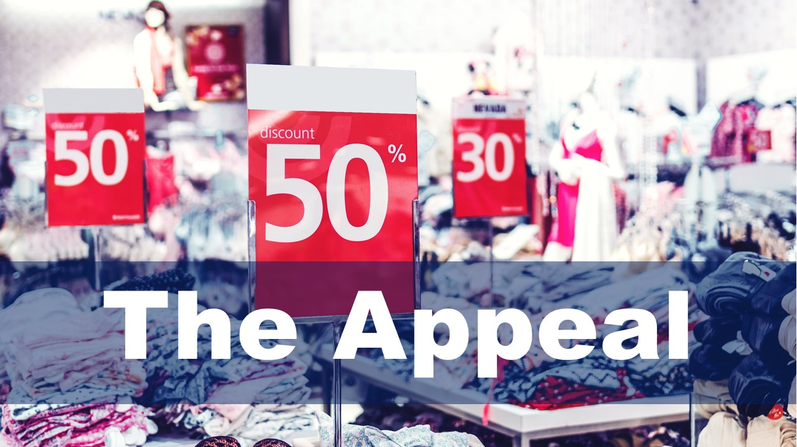
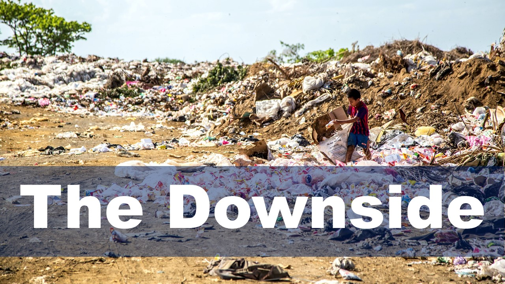

---

title: 'Dive Deeper'
permalink: /read-to-be-sure/issue1-deeplearning/
breadcrumb: 'Dive Deeper'
third_nav_title: 'Issue #1: Fast Fashion: Love it or Hate it?'

---

**ARTICLES**  1.    [How fast fashion became a multi-trillion-dollar industry](https://www.businessofbusiness.com/articles/examining-fast-fashions-appeal-and-issues/)  2.    [Brand addiction in the contexts of luxury and fast-fashion brands](https://e-tarjome.com/storage/panel/fileuploads/2020-05-06/1588762187_E14818-e-tarjome.pdf)  3.    [Fast fashion is getting faster and that’s a good thing](https://www.themanufacturer.com/articles/fast-fashion-getting-faster-thats-good-thing/)

**ARTICLES**  1.    [‘A monstrous disposable industry’: Facts about fast fashion](https://unearthed.greenpeace.org/2019/09/12/fast-facts-about-fast-fashion/)   2.    [Following a t-shirt from cotton field to landfill shows the true cost of fast fashion](https://theconversation.com/following-a-t-shirt-from-cotton-field-to-landfill-shows-the-true-cost-of-fast-fashion-127363)   3.    [Textile workers in developing countries and the European fashion industry](https://www.europarl.europa.eu/RegData/etudes/BRIE/2020/652025/EPRS_BRI(2020)652025_EN.pdf)  **PODCASTS**  1.    [Fulfilling our fast fashion fix](https://www.npr.org/2021/08/03/1024284959/fulfilling-our-fast-fashion-fix)  2.    [Weekly economics podcast: Fast fashion](https://neweconomics.org/2021/08/weekly-economics-podcast-fast-fashion)   **VIDEO**  [Our love for cheap clothes: What’s the true cost?](https://www.youtube.com/watch?app=desktop&v=n75jVQTUEE8)

**ARTICLES**  1.    [The top benefits of sustainable clothing](https://www.goodwear.com/blogs/news/the-top-benefits-of-sustainable-clothing)   2.    [Fast fashion’s waste model is going out of style](https://www.politico.eu/article/fast-fashion-waste-losing-appeal-greta-thunberg-environment/)   3.    [Synthetic anonymous: Fashion brand’s addiction to fossil fuels](http://changingmarkets.org/wp-content/uploads/2021/07/SyntheticsAnonymous_FinalWeb.pdfhttp:/changingmarkets.org/wp-content/uploads/2021/07/SyntheticsAnonymous_FinalWeb.pdf)   4.    [The problem with ‘sustainable fashion’](https://edition.cnn.com/style/article/the-problem-with-sustainable-fashion/index.html)   5.    [More consumers want sustainable fashion, but are brands delivering it?](https://www.forbes.com/sites/andriacheng/2019/10/17/more-consumers-want-sustainable-fashion-but-are-brands-delivering-it/?sh=2126650734a5)    **VIDEO**  1.    [How fast fashion adds to the world’s clothing waste problem](https://www.youtube.com/watch?app=desktop&v=elU32XNj8PM)