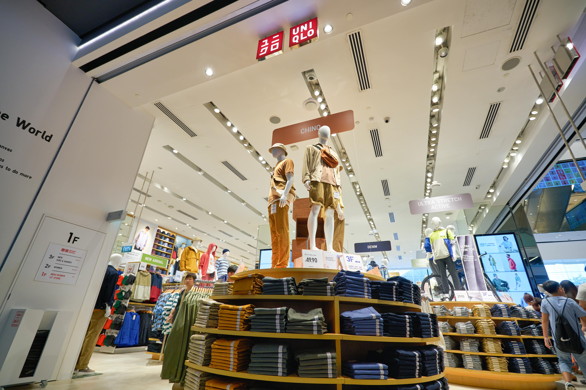

| **5-Minute Read** |
| :---------------: |
|                   |

**Why fast fashion is hot: Imagine looking luxe for the price of a latte**

 

*Fast fashion is the norm now – because who doesn’t like being spoilt for choice, purchasing dirt-cheap shirts and supporting brands that celebrate diversity?*

 

Entrance to UNIQLO Orchard Central. [Shutterstock](https://www.shutterstock.com/image-photo/singapore-circa-january-2020-entrance-uniqlo-1661613289).

**Go on, take a look at your closet. When was the last time you bought clothes? Where was it from and why did you choose to buy it?**

 

**Asia’s next top sidewalk model**

 

Fast fashion brands quickly replicate a large variety of design trends from social media and fashion runways for low prices, allowing every single one of us to purchase them. With a [significant reduction in the lengths of clothing production cycles](https://www.retaildive.com/ex/mobilecommercedaily/fast-fashion-how-modern-retailers-can-keep-pace-with-big-brands), we now have the luxury of [browsing fresh and new styles every week](https://www.theatlantic.com/magazine/archive/2021/03/ultra-fast-fashion-is-eating-the-world/617794/).

 

For instance, Thai fast fashion brand Pomelo Fashion pushes out two launches of new arrivals every week on its website and physical stores. Producing fast and affordable designs that incorporate Seoul’s streetwear styles, Pomelo Fashion lives up to its brand mission “[Fashion born in Asia. On Trend. Online. On The Go.](https://insideretail.asia/2020/03/20/how-pomelo-is-redefining-o2o-retailing-in-asia/)” Its loyal customers are able to look swanky round the clock as its streamlined supply chain syncs up with the volatile trend cycle, churning out clothing pieces swiftly.

 

Many millennial and Gen-Z customers purchase from fast fashion brands when they [look up to the brand’s ambassadors](https://www.theatlantic.com/magazine/archive/2021/03/ultra-fast-fashion-is-eating-the-world/617794/), in hopes of emulating these celebrities’ fashion styles. Combined with influence from real-time trends on the Internet, this impulsive shopping culture is fuelled by our urge to keep up with celebrity culture and, by relation, our insatiable demand for ever-changing styles. For example, Singaporean influencer Andrea Chong [successfully collaborated with local fast fashion brand Love Bonito](https://www.nylon.com.sg/2021/03/andrea-chongs-second-collaboration-with-love-bonito-has-even-more-stylish-yet-versatile-pieces/) for several runs of her &REA collection. By targeting customers who are drawn to Chong’s elegant image, the collection enjoyed immense popularity among young women who look up to her effortless styles. 

 

**Looking like riches, paying for rags**

 

Fast fashion allows us to buy fashionable clothes for as little as S$1 per piece. You might not believe it but these [ultra-cheap clothing pieces](https://www.vox.com/the-goods/2020/2/3/21080364/fast-fashion-h-and-m-zara) are so chic that you can be dressed to the nines for the price of next to nothing, at the snap of your finger.

 

Fast fashion expedites supply chains and lowers costs in order to accommodate consumers’ rapidly changing tastes. Shein monitors their customer data from social media platforms, and [mass produces selected popular styles in real time](https://slate.com/technology/2022/02/shein-china-fast-fashion.html), that in turn [reduces the cost per garment](https://www.vox.com/the-goods/22573682/shein-future-of-fast-fashion-explained) and lowers their selling prices. This low-cost production then feeds back into the cycle of attracting more customers and securing a constant demand for large amounts of garments. 

 

There is a science behind why we hanker after sales prices. Shopping panders to our appetite for instant gratification as it [triggers our brains to produce a rush of positive emotions](https://www.bbc.com/worklife/article/20161123-shopping-a-sale-gives-you-the-same-feeling-as-getting-high). Despite the [inferior quality and inaccurate sizing of cheap clothing](https://www.euronews.com/green/2021/11/18/welcome-to-the-dark-side-shein-is-the-biggest-rip-off-since-fast-fashion-was-born), we cannot stop ourselves from hunting for the next too-good-to-be-true fashion bargain because we are addicted to shopping.

 

Fast fashion is faster than ever today, with sale promotions running at any given time of the day. E-commerce has shaped the sale phenomena, where special sale events like Black Friday and Singles’ Day are [marketed as limited-time deals](https://www.cnbc.com/2019/11/29/psychology-of-black-friday-shopping-phenomenon-and-crowds-explained.html) that everyone snaps up. [Alibaba’s Singles’ Day shopping festival](https://www.voguebusiness.com/consumers/how-fashion-and-beauty-brands-embraced-singles-day) in 2021 bears testament to this — with more than S$114 billion in gross merchandise volume and 900 million shoppers browsing through 14 million steep discounts on e-commerce platform Tmall. The rise of e-commerce platforms has indeed made shopping extremely affordable with periodic discounts and sales events. 

 

**Every body deserves cool clothes**

 

Fast fashion retailers are often the only [size-inclusive brands that produce extended-size clothing lines](https://www.refinery29.com/en-us/2021/11/10781654/plus-size-fast-fashion-ethics) that most people can afford. As they have greater economies of scale in their production lines to produce the same clothing range in several sizes for marginal costs, these brands make stylish clothes accessible to people of diverse body types. The same cannot be said for smaller sustainable brands who [do not mass produce their plus-size lines at the scale of fast fashion brands](https://www.refinery29.com/en-gb/2017/04/147207/sustainable-fashion-plus-size) due to the [uncertainty of these lines’ saleability](https://www.cosmopolitan.com/uk/fashion/style/a32799341/sustainable-plus-size-fashion/), therefore selling their plus-size pieces at higher prices. To put these words into figures, [this simple straight-sized striped dress costs a whooping S$162 from ethical brand Everlane and just S$24 on UNIQLO’s racks](https://moralfibres.co.uk/ethical-clothing-expensive/). 

 

Positioned as a technology-centred fashion company “[made for all](https://www.marketing91.com/marketing-strategy-of-uniqlo/)”, Japanese brand UNIQLO sells essential modern styles in extra sizes that run from XS to 3XL for both men and women. Their low prices can be attributed to the brand’s ability to place [high-volume orders with their manufacturers and partner factories](https://www.fastretailing.com/eng/group/strategy/uniqlobusiness.html). This is only possible with UNIQLO’s brand strategy of mass appeal, as they market their minimalist and high-quality casual wear to shoppers of all sizes. To embrace body positivity, UNIQLO has released the Uniqlo U Future Lifewear collection that feature versatile essentials such as the [U wide-fit curved pants](https://www.broadsheet.com.au/national/fashion/article/stylists-picks-uniqlo-u-springsummer-collection-designed-ex-hermes-artistic-director) — trousers that cinch in at the waist, with a tapered wide-leg fit that looks flattering on multiple body types including petite and plus-sized figures. 

 

Ultimately, we find ourselves stuck in a Catch-22 situation — we can look chic without burning a hole in our pockets, only if we purchase clothes from unsustainable fast fashion brands. 

 

**Think about who might lose out from the value that fast fashion brings to consumers.** 

 

**Further reading:**

- What if we just forgot about fashion? ([Science Focus](https://www.sciencefocus.com/planet-earth/what-if-we-just-forgot-about-fashion/))

- If fast fashion disappeared… ([The Finery Report](https://www.thefineryreport.com/articles/2019/5/15/if-fast-fashion-disappeared))