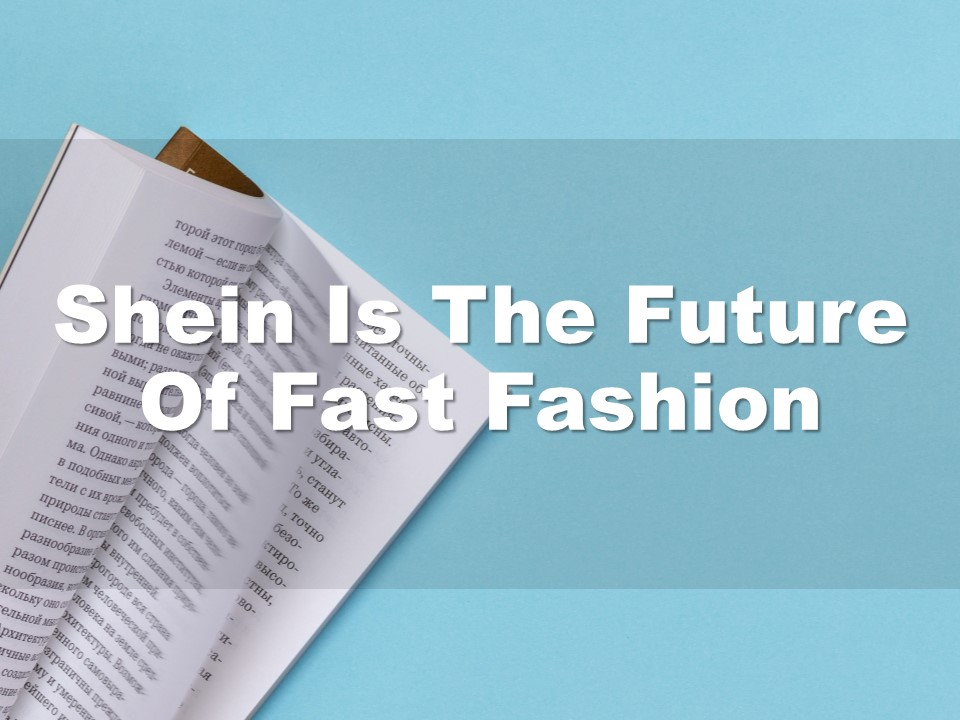

| **1-Minute Read** |
| :---------------: |
|                   |

Photo by Dollar Gill on Unsplash  

Consumers love the instant gratification fast fashion provides. Getting their hands on [the latest fashion trends](https://www.drapersonline.com/news/how-the-desire-for-instant-gratification-is-shaping-retail) within a short time seems too good to be true. Yet this is what the industry delivers, and at affordable prices to boot. Fast fashion is everywhere and is produced at very low cost. Fast fashion companies have also promoted [size inclusivity](https://ww.fashionnetwork.com/news/Mango-completes-violeta-integration-shein-tops-plus-size-inclusivity-list,1327389.html), producing a wide range of designs to appeal to different body types. 

This industry continues to grow to keep up with rising demand and rapidly changing fashion trends. One has to stop and wonder: At what cost?

    

	

***Want to know more about the Price Factor?***

    

    

    

    

	

