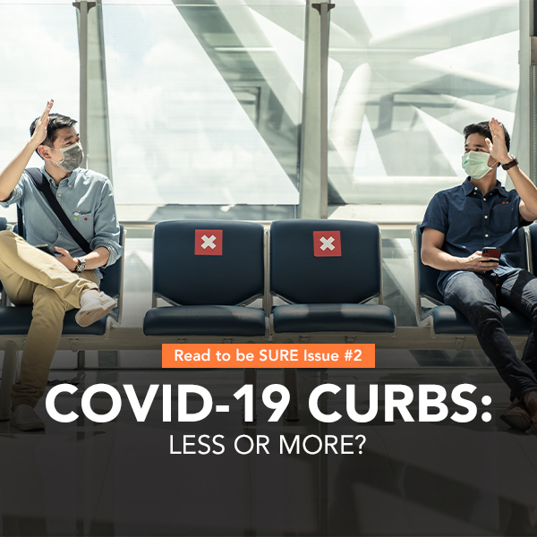
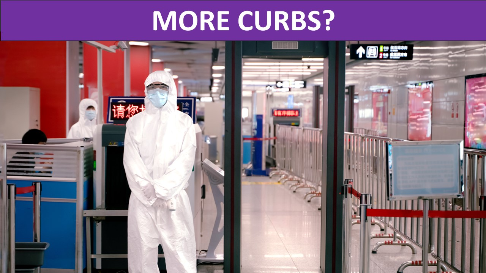
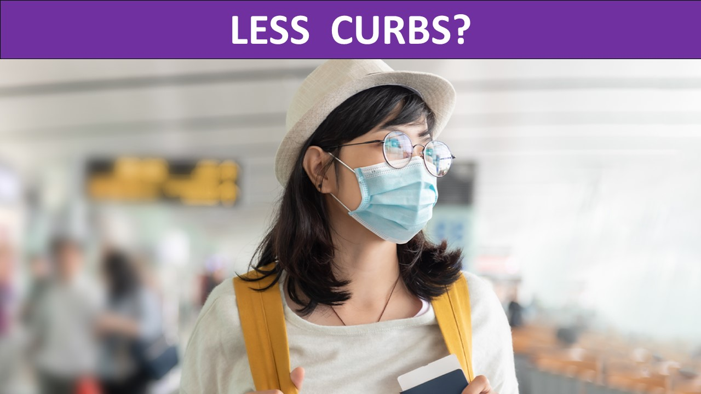

<b>1-Minute Read</b>

**COVID-19 Curbs: Less or More?**

When the Vaccination Travel Lanes (VTL) were announced and social media feeds were slowly filled up with destinations beyond the boundaries of our living room or neighbourhoods, it served as a reminder of life before the pandemic. It isn’t just wanderlust; even if not all of us are privileged to travel, the glimmer of endemicity is on the horizon. 

 

With borders reopening, it signalled that economies could be on the road to recovery. Families could be reunited. The promise of freedom of movement is a much-needed breath of fresh air after living behind our masks for two years.

 

Could this be the year when we finally move from pandemic to endemic? 

 

Some of us have our fingers crossed. Constant recalibration of restrictions, if anything, have informed us that certainty is not a given. 

 

While many countries have relaxed COVID-19 restrictions, news of variants that could threaten human health and overwhelm public health systems is still very much on our radar. It’s difficult to breathe easy when the number of infections is still in the hundreds of thousands and vaccine inequality still a concern across the globe. 

 

Fear and worry about contracting COVID-19 at home, let alone overseas, is a natural reaction for us. Differentiated measures based on vaccination status offer some comfort and a semblance of safety in the face of an unpredictable virus. After all, what else could we do to make sense of our lives turned upside down?

 

It’s hard to deny the instinct to be social and return to connecting with family, friends and even co-workers in the office freely. Individual efforts such as taking Antigen Rapid Tests (ART) when feeling sick or checking in and out of venues seem like a small price to pay in exchange for some personal freedoms. 

 

Yet, with some countries moving fast to lift almost all their COVID-19 measures, it’s easy to feel that the grass is greener elsewhere. Even though we know it’s not as simple as “if they can do it, why can’t we?”, the pandemic fatigue has taken its toll. These other possibilities of life with little or no restrictions have their appeal. 

 

Living in such unprecedented times, there’s no handbook to endemicity. Perhaps what we can hold on to, is that we are definitely moving in that direction.

 

 **Would you prefer to have...**

    

    

	

