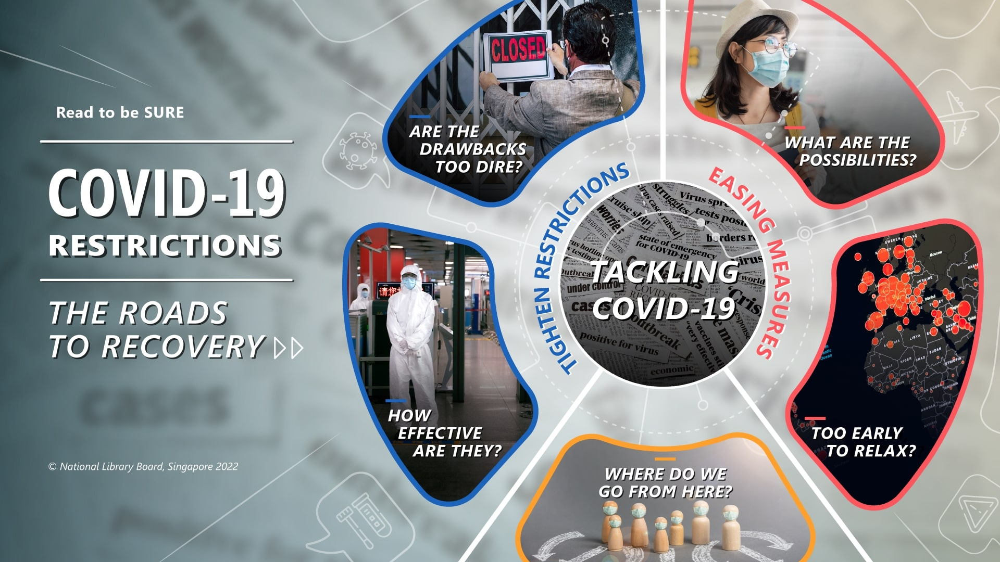
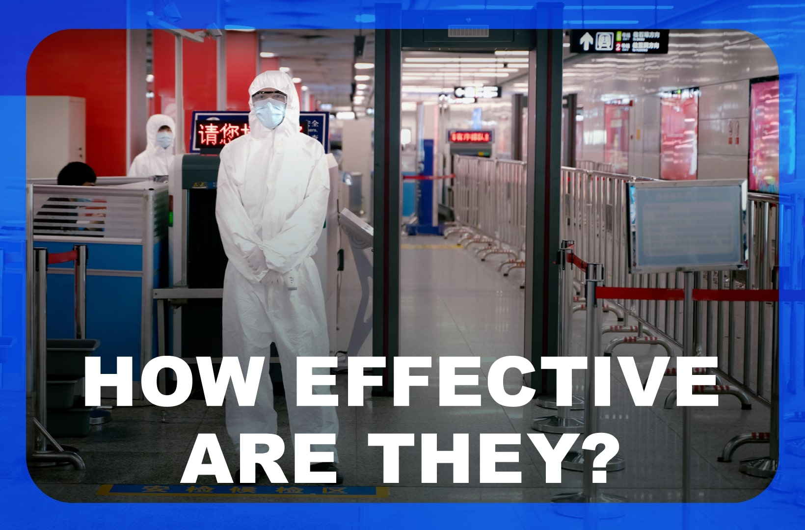
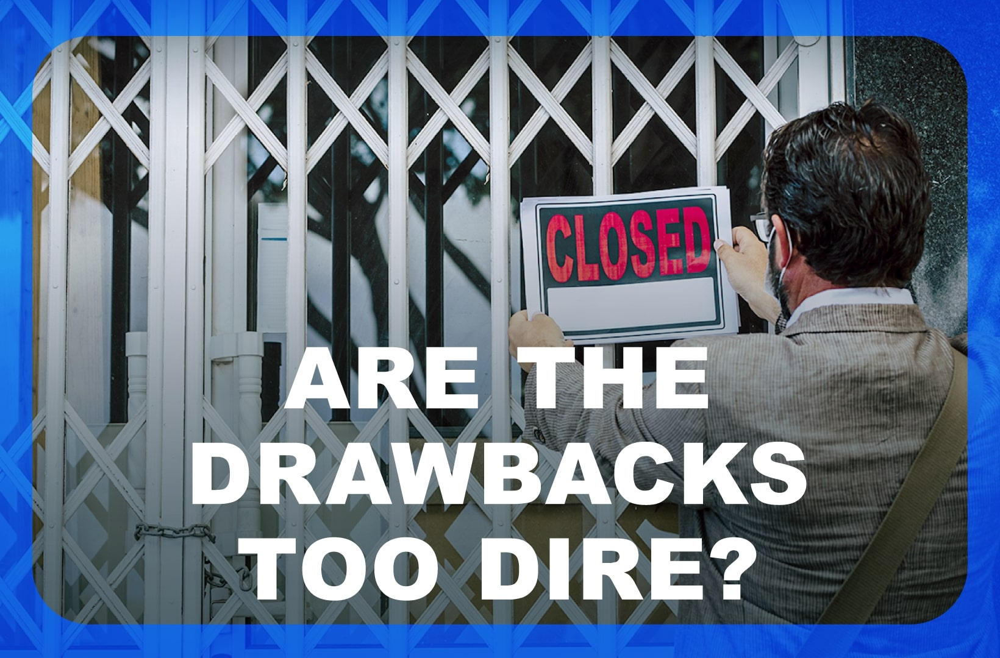
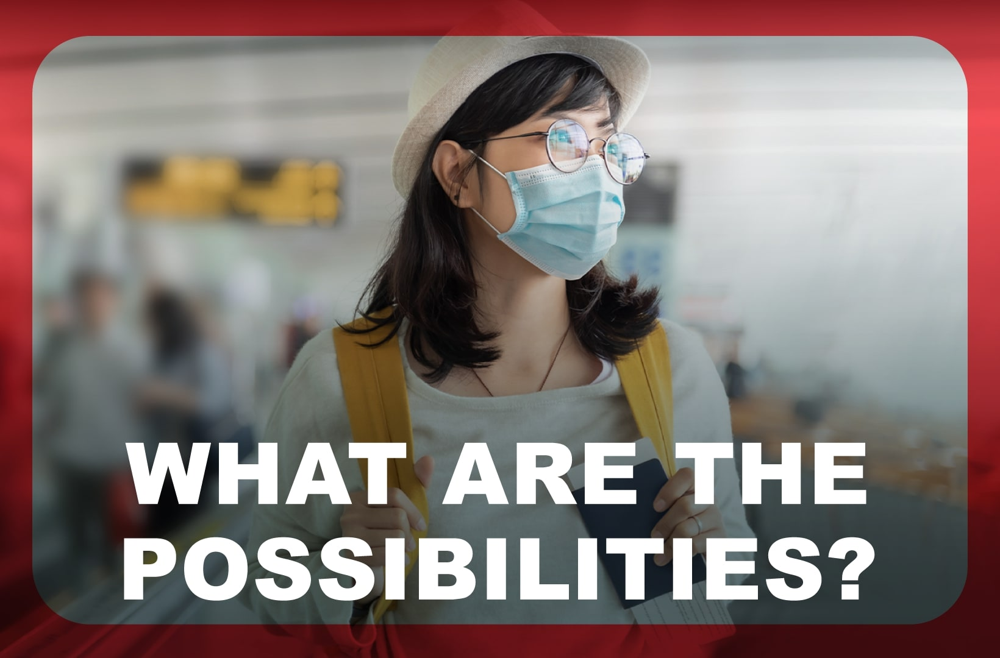
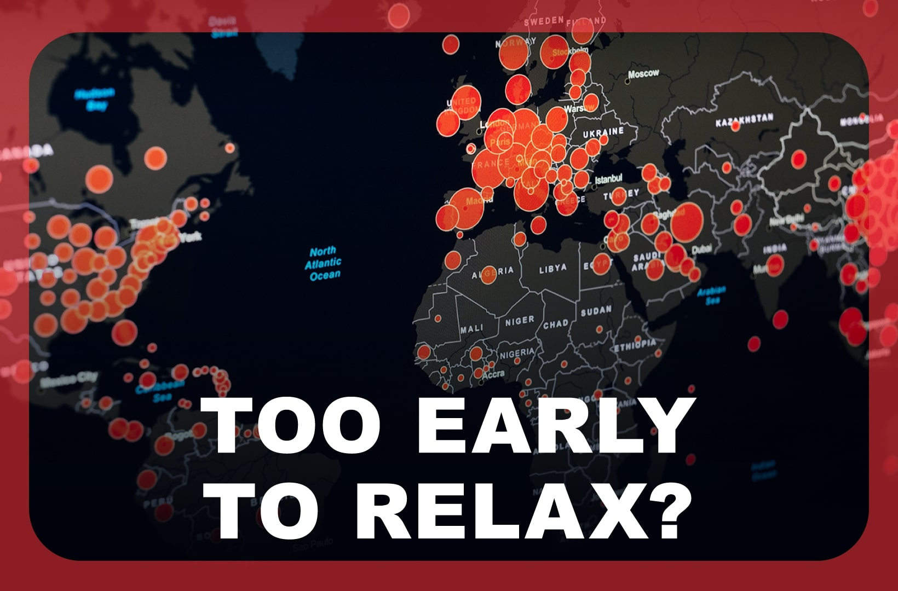
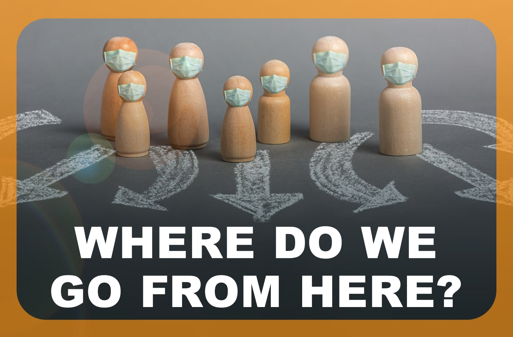

**COVID-19 Restrictions: The Roads to Recovery**

| **1-Minute Read** |
| :---------------: |
|                   |

<a href="https://staging-nlb-sure.netlify.app/images/RTBS2-visualmap.pdf" target=_new>Download the PDF</a>

**Tackling COVID-19** 

Reports of the pandemic have flooded our news feed for almost two years. While adopting masks, hand sanitisers and social distancing have become commonplace in Singapore, the reality of living with COVID-19 differs from country to country. 

 

As COVID-19 continues to spread globally, questions arise on how to better manage the spread of the coronavirus and its adverse effects. In order to prevent health systems from [becoming overwhelmed](https://www.thelancet.com/journals/lancet/article/PIIS0140-6736(20)32007-9/fulltext), many countries have implemented restrictions to limit further escalation. These include lockdowns and border closures to reduce the movement of people. 

 

Yet continuous lockdowns, quarantine orders, and limited social interactions have adverse effects on public [mental health](https://www.thelancet.com/journals/lancet/article/PIIS0140-6736(21)02143-7/fulltext) and well-being worldwide. School and business closures, as well as restricted mobility also contribute to economic and political strain. 

 

Governments worldwide face common challenges of balancing health, social, and economic concerns. [Public health principles](https://www.thelancet.com/journals/lancet/article/PIIS0140-6736(20)32007-9/fulltext) that remain pertinent towards anticipating mitigation approaches include infection status, community acceptance, public health capacity, and health-system capacity. 

 

As countries begin to realise that the coronavirus is here to [stay](https://www.nature.com/articles/d41586-021-00396-2), returning to the pre-pandemic normal by lifting restrictions completely has become seemingly less viable.

 

Read on to find out more about COVID-19 restrictions, and the outlook going forward. 

    

    

    

    

