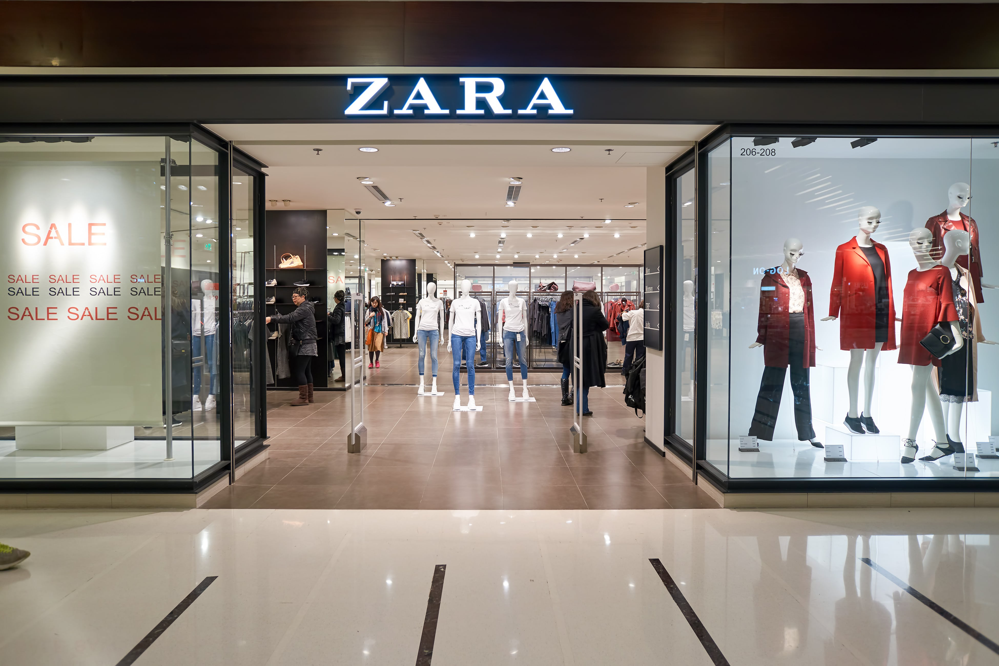

| **5-Minute Read** |
| :---------------: |
|                   |

**Fast fashion giants: Big Data, bigger inventory, biggest profit**

 

*Brands from Zara to Shein have revolutionised fashion consumption. With a different style to shop for every time you set foot in their stores or open your browser, these brands keep up with trends with shocking speed. One giant has emerged as reigning champion with bags of profit in tow — Shein and its almighty algorithm.*

*Shein online store.* *[Shutterstock](https://www.shutterstock.com/zh-Hant/image-photo/stuttgart-germany-aug-14-2021-cellphone-2037893501).*

**How often do you feel like you need a wardrobe update? Are there many options for you to do so?**

 

Take a walk through the streets and most people have on either a Uniqlo T-shirt, or something you have seen on ASOS. Before this homogeneity, there were the eclectic styles (and questionable graphic T-shirts) brought to us only by the brandless stores 

in Bugis Street or Far East Plaza — and maybe blogshops. 

 

Fast fashion’s prescient ability to keep up with the latest trends has almost wiped out small-scale and independent shops. Amidst quickly developing data technologies, brands like Zara and Shein have revolutionised fashion consumption, saturating consumers with affordable styles almost every other week. 

 

**Goodbye Bugis Street, hello H&M!**

 

In 2011, [H&M opened its flagship store in Orchard Building](https://hmgroup.com/news/first-hm-store-in-singapore-has-opened/). [Hundreds of people lined up](https://sg.style.yahoo.com/style/blogs/going-out-by-day/h-m-orchard-rd-launch-draws-hundreds-031237565.html) to be the first to enter the store. Since then, H&M had a hold on Singapore shoppers. Queues — some 3 days long — would form every time there was a drop, whether it was for the [Kenzo](https://www.straitstimes.com/lifestyle/fashion/hms-collaboration-with-kenzo-draws-long-queues-at-orchard-building-and-ion-orchard) or [Balmain](https://www.straitstimes.com/lifestyle/fashion/after-3-day-queue-shoppers-wipe-balmain-x-hm-collection-off-shelves) collaboration. By offering trendy luxury labels at affordable prices, H&M dominated fashion retail in Singapore. 

 

*A Zara store in Hong Kong having a sale.* *[Shutterstock](https://www.shutterstock.com/image-photo/hong-kong-circa-january-2016-zara-466425656).*

 

Besides H&M, brands like Zara, Forever 21 and Topshop soon became staples in the modern city-dweller’s wardrobe. 

 

Dubbed retailers of [“freshly baked clothes” for their perishable styles which survive fashion trends for around just a month](https://martinroll.com/resources/articles/strategy/the-secret-of-zaras-success-a-culture-of-customer-co-creation/), the likes of H&M and Zara analyse the latest fashion trends, mass produce these styles in weeks and fill their racks with runway-inspired looks. 

 

[“Trends” teams camp out on blogs, while cameras are set up in more fashion-forward Shanghai, New York and Tokyo offices, to catch the beginnings of fashion trends, with no need to attend fashion shows](https://martinroll.com/resources/articles/strategy/the-secret-of-zaras-success-a-culture-of-customer-co-creation/). Production can match trend analysis speeds due to highly streamlined supply chains and automated distribution facilities. 

 

A reactive design process allows quick turnaround time. While traditional fashion houses might drop a collection once every three months, [fast fashion brands can do it once every three weeks](https://www.vox.com/the-goods/2020/2/3/21080364/fast-fashion-h-and-m-zara), and at dramatically lower prices. 

 

Further, a lot of labour is outsourced overseas where labour protection is weak, such as in India or China where most manufacturing factories are, allowing round-the-clock manufacturing at low cost. With such a 365/24/7 production model, Zara can bring clothes from design-to-rack in just 15 days. 

 

**You want it? You got it.**

 

Zara follows trendsetters, and according to them, that trendsetter is you — their customer. [When different customers in 2015 asked for a pink scarf and there were none,](https://martinroll.com/resources/articles/strategy/the-secret-of-zaras-success-a-culture-of-customer-co-creation/)[ 500,000 pink scarves were dispatched to more than 2,000 Zara stores globally in just one week](https://martinroll.com/resources/articles/strategy/the-secret-of-zaras-success-a-culture-of-customer-co-creation/). 

 

[Radio Frequency Identification Technology (RFID) is also used to track inventory](https://www.advancedmobilegroup.com/blog/how-zara-controls-stock-with-rfid) to quickly assess which items or styles sell best. Instead of employees manually scanning each and every item that is sold, RFID allows headquarters to know which item is running low and needs replenishment. Completing inventories every 6 weeks, [Zara produces over 450 million items annually](https://martinroll.com/resources/articles/strategy/the-secret-of-zaras-success-a-culture-of-customer-co-creation/).

Besides data collection and analysis, brands are also harnessing the power of the celebrity to come up with consumer-savvy designs. Kim Kardashian, [the “Balmain Barbie”](https://edition.cnn.com/style/article/kim-kardashian-west-40-fashion/index.html), was and is the world’s biggest influencer. With the world catching onto Kardashian-esque styles, [H&M launched a collaboration with Balmain, which sold out in days after a 3-day queue for its drop](https://www.straitstimes.com/lifestyle/fashion/after-3-day-queue-shoppers-wipe-balmain-x-hm-collection-off-shelves). 

 

Data collection and targeted marketing are not only maximising profit margins, but may also be necessary for fashion brands’ survival. 

 

**If you want to go fast, go alone. If you want to go far, get AI**

 

The fast fashion industry is cut-throat. Despite its relative youth, Chinese online fashion retailer Shein is hogging the market — as of June 2021, [it accounted for 28% of all fast fashion sales in the US, almost equivalent to H&M’s and Zara’s sales ](https://www.earnestresearch.com/data-bites/shein-leads-fast-fashion/)*[combined](https://www.earnestresearch.com/data-bites/shein-leads-fast-fashion/)*. It [raised US$10 billion in sales in 2020, a 250% leap from 2019](https://www.bloomberg.com/news/articles/2021-06-14/online-fashion-giant-shein-emerged-from-china-thanks-to-donald-trump-s-trade-war?sref=QYWxDQ1o). 

 

The secret to its rapid growth? A proprietary internal management software. Shein’s software is the pinnacle of a desire sensor with a singular purpose — ensuring it and its suppliers are "more efficient and profitable”, as described by a Shein spokesperson when [Rest of World](https://restofworld.org/2021/how-shein-beat-amazon-and-reinvented-fast-fashion/) asked about the software.

 

With the help of this software, the middleperson — trend offices or merchandising departments — are cut out. Lead times needed from design to delivery are slashed. In this way, Shein adds as much as 2,000 to 10,000 individual styles to its app *each day*.

 

“Everything is optimised with big data,” Lin Zhen, a leading Chinese clothing manufacturer and Shein supplier, explained to [Rest of World](https://restofworld.org/2021/how-shein-beat-amazon-and-reinvented-fast-fashion/). Every supplier has an account on this software’s platform. 

 

As every aspect of the Shein business has been integrated into the software, data collection and analysis is immediate. “You can see the current sales, and then it will tell you to stock up more if you sell well and what you need to do if you don’t sell well. It’s all there.” In other words, consumer feedback in the form of sales returns directly to the factory through the software. 

 

Further, it provides simple design specifications so manufacturers can get on production ASAP. Unlike other brands, Lin explains that even “a typical university student” can get to designing, further ramping up production speeds while keeping costs low. 

 

By the time you click the add-to-cart button, Shein’s algorithms have already successfully identified and designed items you would like and is getting to work on the next design thanks to your purchase. 

 

Fast fashion retailers are hungry for hungry consumers. With their eyes, ears and software all focused on what makes a customer fork out cash, they — especially Shein — are hard at work keeping you coming back for more styles than you could possibly want. 

 

The speeds at which they produce clothes are far from sustainable, but the customer is always right, right? 

 

**Is using data this way always beneficial for consumers? How does it affect the way we consume or behave?**

 

Further reading:

- [The Conversation — Explainer: what is surveillance capitalism and how does it shape our economy?](https://theconversation.com/explainer-what-is-surveillance-capitalism-and-how-does-it-shape-our-economy-119158)

- [The Nation — Is “Big Data” Actually Reinforcing Social Inequalities?](https://www.thenation.com/article/archive/big-data-actually-reinforcing-social-inequalities/)

- [Foster School of business — The dark side of “Big Data” marketing](https://foster.uw.edu/research-brief/dark-side-big-data-marketing/) 

 

*Go even deeper:* 

- [Journal of Physics: Conference Series 2020 — The Impact of Big Data Analysis on Consumer Behaviour](https://iopscience.iop.org/article/10.1088/1742-6596/1544/1/012165/meta#:~:text=The results show that the,thus affecting consumer decision-making.) 

- [William Mitchell Law Review, Volume 40, Issue 2, 2014 — The Costs of Lost Privacy: Consumer Harm and Rising Economic Inequality in the Age of Google](https://papers.ssrn.com/sol3/papers.cfm?abstract_id=2310146)

 