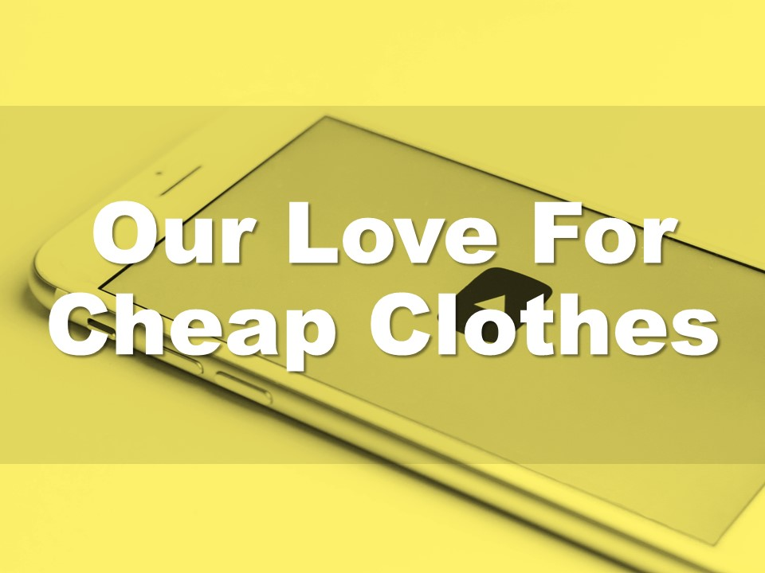
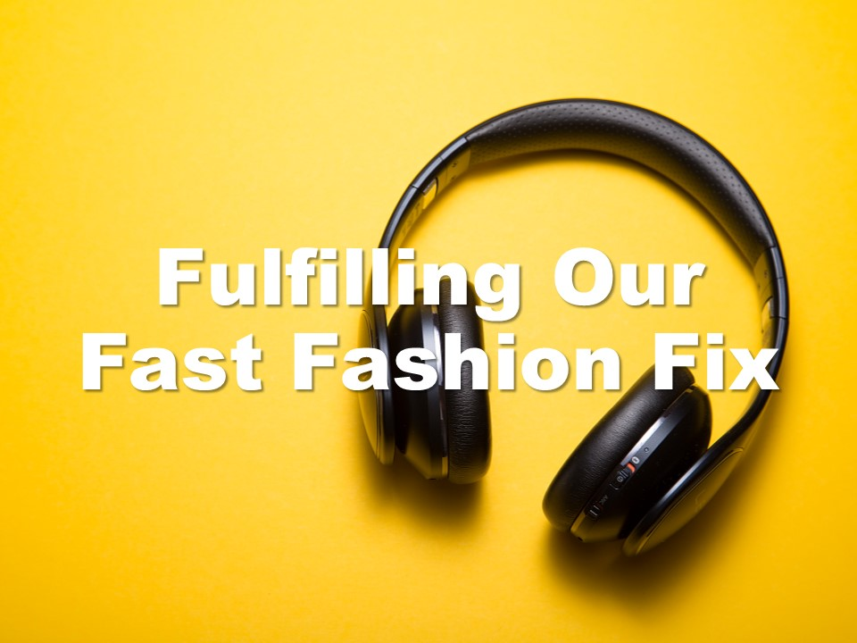
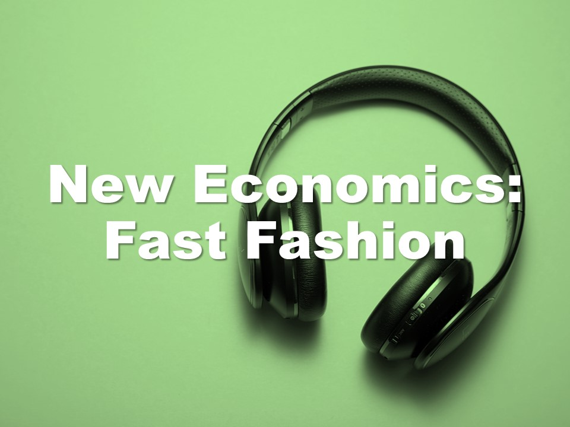
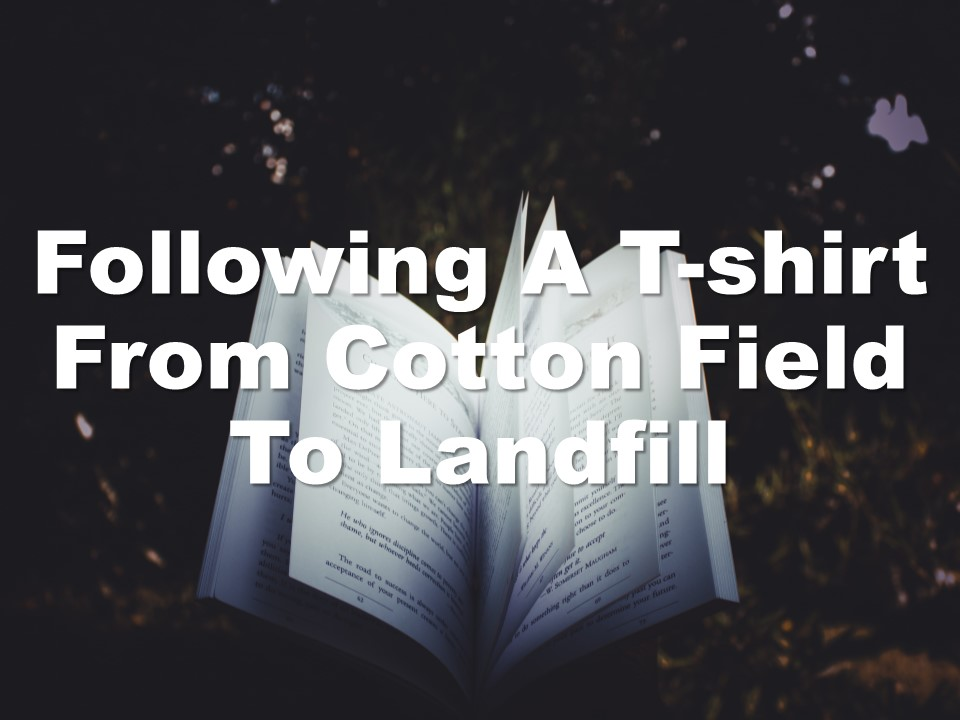

| **1-Minute Read** |
| :---------------: |
|                   |

Photo by Maxim Tolchinskiy on Unsplash

How many clothing items do you buy and get rid of within a year? A survey involving 1,000 Singaporeans revealed that we [buy 34 pieces of new clothing on average](https://www.channelnewsasia.com/singapore/bursting-seams-singapores-cast-clothing-1035441) and dispose of 27 items within 12 months. For almost every item we buy, we throw away another.

Do you remember how often you wore a shirt before throwing it away? Clothes were only worn 7 to 10 times before being thrown out. [Landfills are being filled](https://emf.thirdlight.com/link/2axvc7eob8zx-za4ule/@/download/1) with textile waste, generated through this [throw-away culture](https://www.channelnewsasia.com/singapore/bursting-seams-singapores-cast-clothing-1035441).

From the production of raw materials to the disposal of clothes, the fast fashion industry consumes large amounts of chemicals, water and energy. It is a source of pollution for both air and water, accounting for [10% of all global carbon emissions](https://www.europarl.europa.eu/RegData/etudes/BRIE/2019/633143/EPRS_BRI(2019)633143_EN.pdf). That’s more than that of the international flights industry and the maritime shipping industry combined.

The demand to be “on trend” leads to clothes churned out faster than we can wear them out. What can we do about it? 

    

	

***More about the Environmental Impact***

    

    

    

    

    

	

