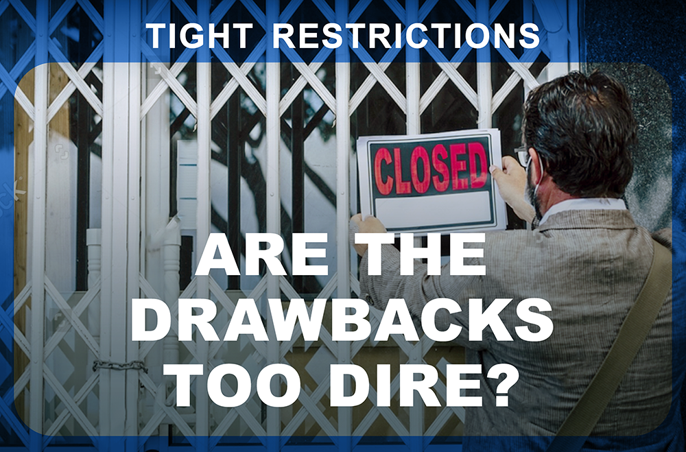

| **1-Minute Read** |
| :---------------: |
|                   |

While the pandemic started unexpectedly, the world has begun accepting that it has fully transformed our daily routine. Today’s toddlers relate wearing masks to going out, and terms like “circuit breaker”, “lockdown” and “quarantine” have become mainstream. The world came to a standstill as governments took similar approaches to deal with the unknown. Public health resource considerations and a desire to prevent the spread of the virus spurred zero-COVID strategies, despite differences in political systems and development levels. 

 

Countries such as Australia, China, Hong Kong, Macau, New Zealand, Singapore, Taiwan and Vietnam backed policies aimed at [eliminating COVID‑19](https://www.eiu.com/n/asias-transition-away-from-zero-covid/) through strict containment measures, extensive testing, contact tracing and firm international border controls. Such efforts curbed the spread of the virus.

 

While today most of the world expects COVID-19 to become [endemic](https://www.nature.com/articles/d41586-021-00396-2), [China](https://www.straitstimes.com/asia/east-asia/china-is-more-dedicated-than-ever-to-covid-19-zero-as-it-battles-delta) continues to maintain this approach. [Public support](https://research.nus.edu.sg/eai/wp-content/uploads/sites/2/2020/06/EAIBB-No.-1535-Life_political-opinions_COVID-19-lockdown-Chengdu-n-Wuhan-2.pdf) for the zero-COVID approach in China appears strong, possibly due to the [social stigma and discrimination](https://www.frontiersin.org/articles/10.3389/fpsyg.2021.694988/full) of those who contract COVID-19. A study even estimates that China would have to cope with over [600,000 cases a day](https://www.straitstimes.com/asia/east-asia/china-study-warns-of-colossal-covid-19-outbreak-if-it-opens-up-like-us-france) if travel restrictions are lifted, highlighting China’s argument that its approach is one driven by necessity. 

 

Yet, those who live in democracies and value personal liberty might find the costs of an [epidemic-free society](https://theconversation.com/zero-covid-worked-for-some-countries-but-high-vaccine-coverage-is-now-key-169327) too high and hope governments will relax COVID-19 restrictions. 

 

Read on to find out more about the cost of strict COVID-19 restrictions. 

    

    

	
    

	

***Want to know more about COVID-19 restrictions?***

    

    

    

    

	

