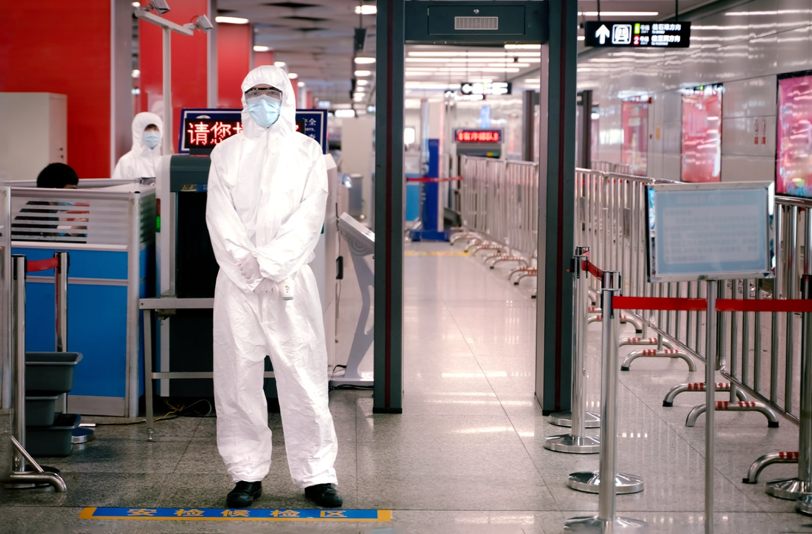
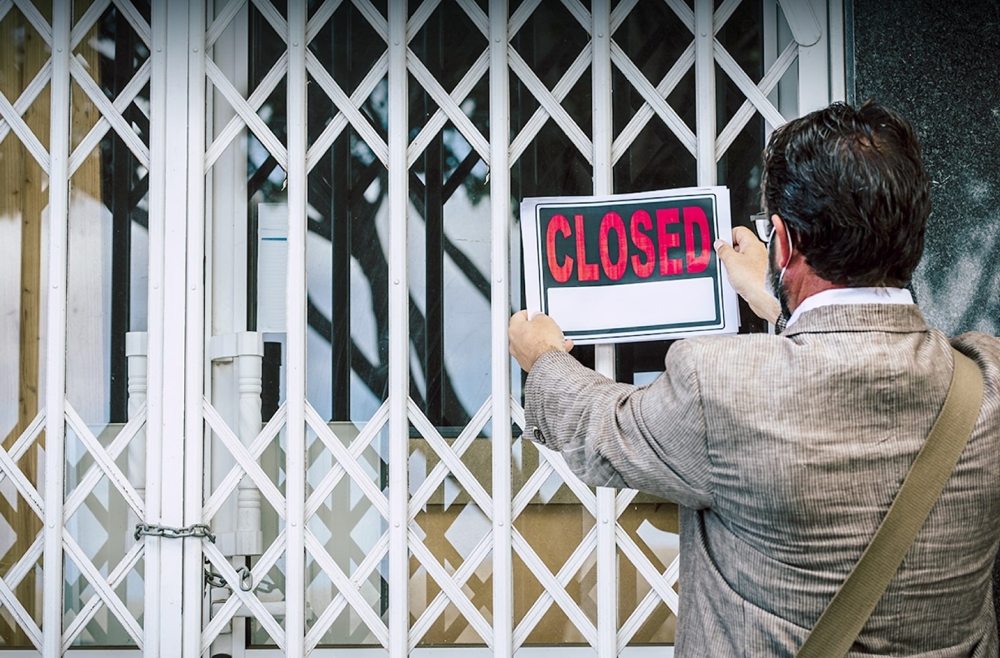
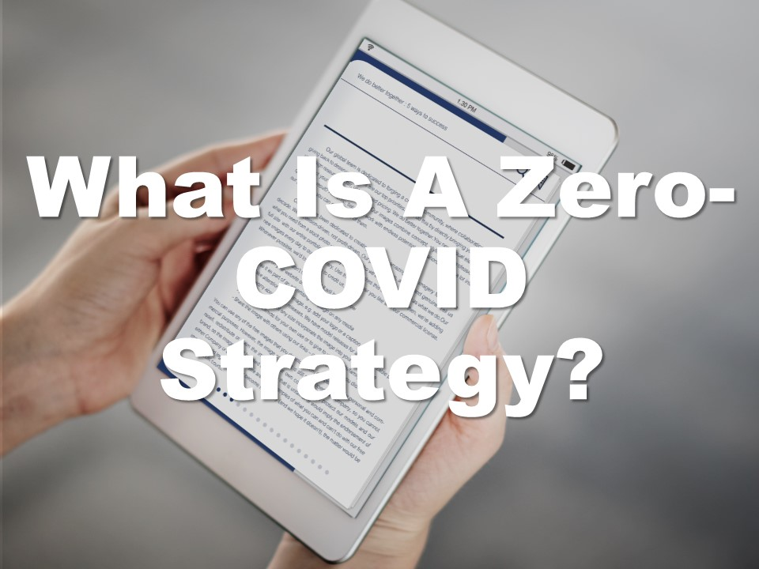
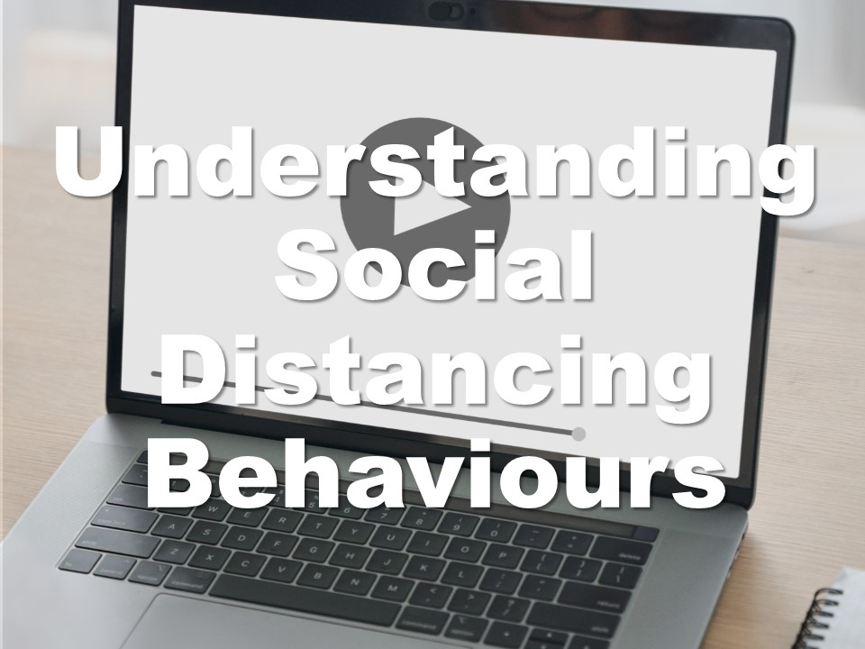
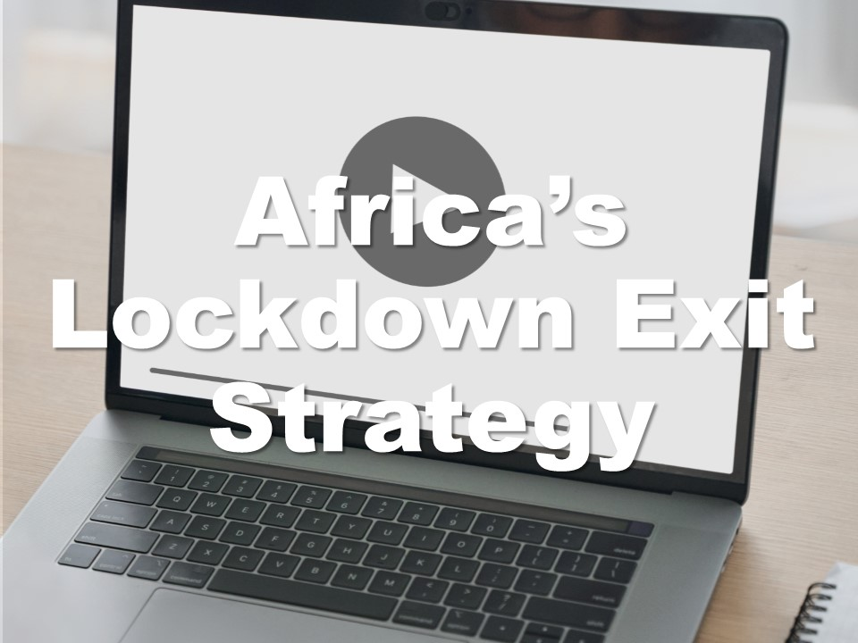

| **1-Minute Read** |
| :---------------: |
|                   |

While the pandemic started unexpectedly, the world has begun to accept that it has fully transformed our daily routine. Today’s toddlers relate wearing masks to going out, and terms like “circuit breaker”, “lockdown” and “quarantine” have become mainstream. The world came to a standstill as governments took similar approaches to deal with the unknown. Public health resource considerations and a desire to prevent the spread of the virus spurred zero-COVID strategies, despite differences in political systems and development levels. 

 
<b>What's the case for more restrictions?</b>

 
Countries such as Australia, China, Hong Kong, Macau, New Zealand, Singapore, Taiwan and Vietnam backed policies aimed at [eliminating COVID‑19](https://www.eiu.com/n/asias-transition-away-from-zero-covid/) through strict containment measures, extensive testing, contact tracing and firm international border controls. Such efforts strived to curb the spread of the virus.

While today most of the world expects COVID-19 to become [endemic](https://www.nature.com/articles/d41586-021-00396-2), [China](https://www.straitstimes.com/asia/east-asia/china-is-more-dedicated-than-ever-to-covid-19-zero-as-it-battles-delta) continues to maintain this approach. [Public support](https://research.nus.edu.sg/eai/wp-content/uploads/sites/2/2020/06/EAIBB-No.-1535-Life_political-opinions_COVID-19-lockdown-Chengdu-n-Wuhan-2.pdf) for the zero-COVID approach in China appears strong, possibly due to the [social stigma and discrimination](https://www.frontiersin.org/articles/10.3389/fpsyg.2021.694988/full) of those who contract COVID-19. A study even estimates that China would have to cope with over [600,000 cases a day](https://www.straitstimes.com/asia/east-asia/china-study-warns-of-colossal-covid-19-outbreak-if-it-opens-up-like-us-france) if travel restrictions are lifted, highlighting China’s argument that its approach is one driven by necessity.

    
<b>What are the downsides to having more restrictions?</b>

 Countries fear <a href="https://www.theguardian.com/world/2021/oct/30/people-are-starting-to-wane-china-zero-covid-policy-takes-toll">being left behind</a> in social and economic pursuits as the zero-tolerance strategy has a significant impact on work and life for millions of people.
 

<a href="https://www.straitstimes.com/singapore/health/moving-from-covid-19-pandemic-to-endemic">Singapore</a>, <a href="https://www.economist.com/china/2021/10/16/how-long-can-chinas-zero-covid-policy-last">Australia, New Zealand</a> and <a href="https://theconversation.com/zero-covid-worked-for-some-countries-but-high-vaccine-coverage-is-now-key-169327">Vietnam</a>, for example, have shifted their prior zero-COVID policy approach as scientists expect that COVID-19 will become endemic over time – meaning that it will continue to circulate within pockets of the <a href="https://www.nature.com/articles/d41586-021-00396-2">global population</a> for years to come.
 

73% of the respondents of a <a href="https://www.iata.org/en/pressroom/2021-releases/2021-10-05-01/">survey</a> conducted by the International Air Transport Association reported that their quality of life was suffering due to travel restrictions. They had missed many “family moments, personal development opportunities and business priorities.” 

***Want to know more about COVID-19 restrictions?***

    

    

    

    

	

