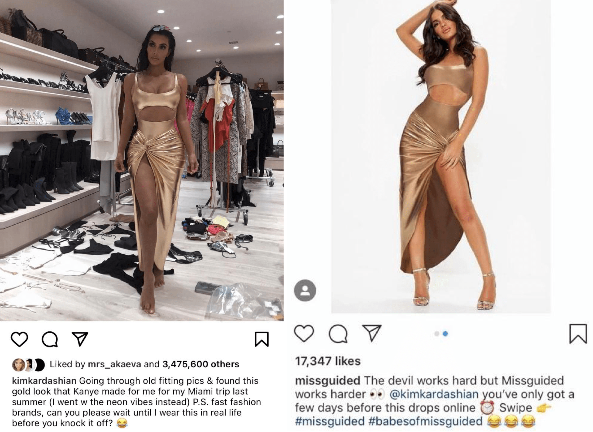

| **1-Minute Read** |
| :---------------: |
|                   |

**When shopping becomes your personality: FashionTok and overconsumption**

 

*Although flash sales, point rewards and aggressive marketing are popular sales tactics, it’s often a familiar (or attractive) face that rakes in the most cash. With the rise of social media, everyone can be an influencer. Hopping on trends to get views, many* *TikTokkers show off Shein hauls and styles that last as long as a TikTok trend cycle — that is, barely a month.*

*A collage of TikTok #sheinhaul videos. TikTok.*

**Where do you get your style inspirations from?**

 

Social media’s ubiquity makes it seem like it should be somewhere in Maslow’s hierarchy of needs. The power of its influence is far-reaching — [in the UK, about half of online fashion shoppers shop based on social media inspirations](https://www.marketingcharts.com/industries/retail-and-e-commerce-110385#:~:text=Similarly%2C Yotpo's survey found that,years old) reported the same.). 

 

Users, influencers and celebrities are constantly posting fit pics to flex their taste in fashion. Instagram now even has a *shop* feature, replacing where the notifications tab once was. Social media platforms and their influencers are [transforming the way people shop, and often in unhealthy ways](https://greenisthenewblack.com/shein-ultra-fast-fashion-consumerism-tiktok-influencer/).

 

With so many driven to shop the latest trends to carve out their own personal brand, our sense of identity is inevitably moulded by our pocket computers.

 

**#OOTD**

 

The phenomenon of the influencer — becoming popular from shopping a lot or posting haul videos — tells us that [consumption has become a personality trait in and of itself](https://www.psychologytoday.com/us/blog/me-the-self-and-i/201904/how-do-we-form-identities-in-consumer-society). Dressing up for the ‘gram, and by extension shopping, is now a fundamental mode of self-expression and communication. 

 

Many brands have caught on that the most powerful advertisement is a friend’s recommendation (or maybe a rival’s flex). Of course, what a “friend” means is stretched on social media. Nowadays, many form [parasocial relationships](https://www.scmp.com/lifestyle/entertainment/article/3150722/parasocial-relationships-illusion-friendship-celebrity) with influencers and celebrities, whose life updates appear alongside our friends’ on the same feed while lending their eponymous influence toward brands they wear. 

 

Fast fashion brands are tapping into this influence on social media. For instance, [Fashion Nova decking influencer Kylie Jenner out in their products](https://www.instagram.com/p/BhkWrrTl2AI/?hl=en) or even [developing an entire collection with rapper Cardi B](https://www.instagram.com/p/Bso_K7SFRME/?hl=en), all posted on Instagram.

 

*Missguided makes a replica of a dress hours after influencer Kim Kardashian posts a picture. Instagram.*

 

Besides celebrities, influencers are notorious for their product promotions and sponsored posts. Sent public relations (PR) packages from shops like Shein, they wear free clothes in exchange for posting a cute fit pic on the ‘gram. [Zara, for instance, featured influencer Teesh Rosa, garnering over 300,000 views](https://www.instagram.com/p/BCfp8XIC_Y7/).

 

Consequently, followers’ feeds are a series of fast fashion drip — a quick class on what is hot this week — and these brand names.

 

Marketing in this form instead of full-blown campaigns is considerably effective. The [influencer market industry was worth US$9.7 billion in 2020, a figure expected only to grow](https://influencermarketinghub.com/influencer-marketing-benchmark-report-2021/).

 

This market is certainly impacted by a new social media player: what do [cottagecore](https://thevou.com/fashion/cottagecore/), [normcore](https://www.thecut.com/2014/02/normcore-fashion-trend.html) and [goblincore](https://www.theguardian.com/fashion/2021/jul/30/goblincore-fashion-trend-embraces-chaos-dirt-mud) have in common besides their suffixes? They are all fashion trends (inspired by the aesthetics of rural living, functional normality and, well, goblins, respectively) from TikTok, now a major player in fashion trendsetting. 

 

**This one my #sheinhaul**

 

TikTok, arguably one of the most influential social media platforms today with [1 billion active users in 2021](https://www.businessofapps.com/data/tik-tok-statistics/), is saturated with #sheinhaul videos — TikTokkers buying hundreds and thousands of dollars’ worth of fast fashion items and flaunting them. 

 

*Person recording themselves with a new sweater and clothes.* *[Shutterstock](https://www.shutterstock.com/image-photo/young-woman-selling-clothes-online-by-1931387588).*

 

Yes, even people who are not sponsored are doing haul videos and tagging brands. Haul videos are popular for both creator and consumer. With [algorithms that reward focusing on niches and consistency](https://later.com/blog/tiktok-algorithm/), content creators are hauling in views, TikTok fame and [sometimes even money](https://www.shopify.com.sg/blog/make-money-on-tiktok). Meanwhile, viewers get to keep up with trendy items at basically no expense. 

 

The problem, however, is that these haul videos result in intense trend turnover. While trend cycles used to last 20 years from introduction, rise, acceptance, decline to obsolescence, they are now squeezed into just about 20 days. 

 

Mandy Lee, a trend analyst and fashion writer (@oldloserinbrooklyn on TikTok) explains the “microtrend” phenomenon to [Lithium Magazine](https://lithiumagazine.com/2021/06/15/how-tiktok-makes-fast-fashion-faster/). Since brands send out PR packages in one big push with influencers having a limited time to post their fit pic, “you can definitely notice it on your Explore page: where is this yellow leather fur-trimmed set coming from that’s here for a week and then never seen again?”

 

More than that, haul videos are normalising overconsumption. “They’re just glamourising it,” Lee notes. She explains that even counter-responses to such fast fashion haul videos, like “Trends I Hate” videos or thrift hauls can contribute to overconsumption. Such content simply forms yet another stylistic or trend niche which will suffer the same rapid turnover. 

 

**I buy, therefore I am**

 

Platforms like TikTok prey on our need for self-affirmation. Allowing users to express their individualism offers a sense of identity security that keeps them addicted. 

 

Psychologist Paul Verhaeghe explains in his book *[What About Me? The Struggle for Identity in a Market-Based Society](https://nlb.overdrive.com/media/1642697)* the phenomenon of an “economic social Darwinism” in a consumptive society. It is selection of the fittest, with fittest being the one who has the ability to display a desirable social status. 

 

Displaying social superiority comes down to expression of taste, which ultimately boils down to what you buy. With quick trend turnovers and fast fashion’s ubiquity, it’s becoming about *how much* you can buy. 

 

With this in mind, media becomes avenues for identity-construction and self-presentation. Social media allows people to look for styles to incorporate into their repertoire, while flaunting their latest acquisitions — whether it’s a $20,000 watch or a sleek slit dress. Putting up a sort of online façade, users are incentivised to keep posting and scrolling to build that stylistic identity they have found. 

 

Beyond that, it has been shown that [Facebook](https://www.cbsnews.com/news/facebook-addictive-as-cigarettes-former-executive-says/) and [Instagram](https://www.businessinsider.com/facebook-has-been-deliberately-designed-to-mimic-addictive-painkillers-2018-12) are designed to be addictive. By hogging your attention and offering a ([faux](https://www.psychologytoday.com/us/blog/me-the-self-and-i/201904/how-do-we-form-identities-in-consumer-society)) sense of identity security through style replication, these platforms are perfect breeding grounds for influencer marketing campaigns from the likes of Fashion Nova and Missguided, as well as profits for all — except the user. 

 

 

**What responsibilities should social media platforms have when it comes to issues of consumer behaviour?**

 

Further Reading:

- Facebook Delays Instagram App for Users 13 and Younger ([The New York Times](https://www.nytimes.com/2021/09/27/technology/facebook-instagram-for-kids.html))

- There is a Dark Side of Social Media, and It Is Data Privacy and “Second Order Consent” ([University of Texas](https://news.utexas.edu/2018/04/26/data-privacy-and-second-order-consent-need-regulation/))

 

*Go even deeper:*

- Social Media Influence on Consumer Behaviour: The Case of Mobile Telephony Manufacturers ([MDPI](https://www.mdpi.com/2071-1050/12/4/1506))