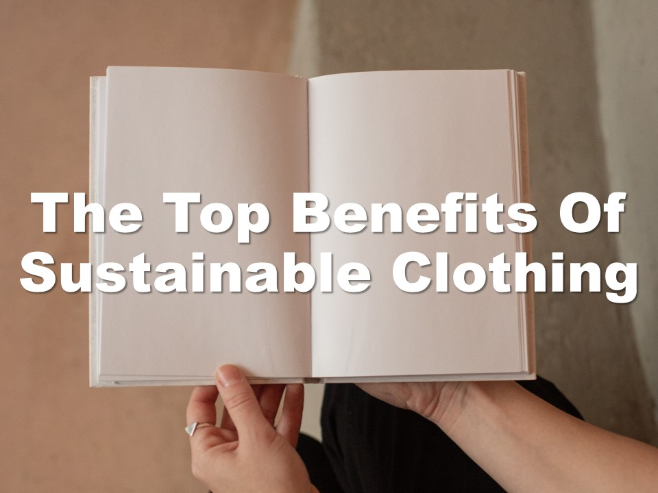

| **1-Minute Read** |
| :---------------: |
|                   |

Photo by Rio Lecatompessy on Unsplash  

We know all about fast fashion’s great [economic impact](/read-to-be-sure/issue1-perspective1/). While that may be true, the industry has long been plagued by low wages, modern slavery, child labour and poor working conditions.

Factory workers in developing countries often work extremely long hours in harsh and dangerous conditions with a severe lack of occupational safety and health measures. Over a thousand workers were killed and another 2,500 plus were injured on 24 April 2013 upon the collapse of [Bangladesh’s Rana Plaza building](https://theconversation.com/years-after-the-rana-plaza-tragedy-bangladeshs-garment-workers-are-still-bottom-of-the-pile-159224), which housed five garment factories.

That’s not even including [unethical business practices](https://www.independent.co.uk/news/world/asia/h-m-garment-workers-factory-india-jobs-a9579856.html). During the COVID-19 lockdowns in 2020, many high street fashion retailers simply cancelled their orders as shops were closed and consumers stayed at home. Almost overnight, thousands of people lost their jobs and their source of income.

But it’s not all bleak in the world of fast fashion. As consumers are becoming more aware of these hidden costs, [fashion designers and retailers](https://www.vox.com/the-goods/2021/7/19/22535050/gen-z-relationship-fast-fashion) are beginning to implement [more sustainable initiatives](https://www.npr.org/2019/07/27/745418569/can-fast-fashion-and-sustainability-be-stitched-together).

    

	

***More about the Business Practices***

    

    

    

    

    

    

	

