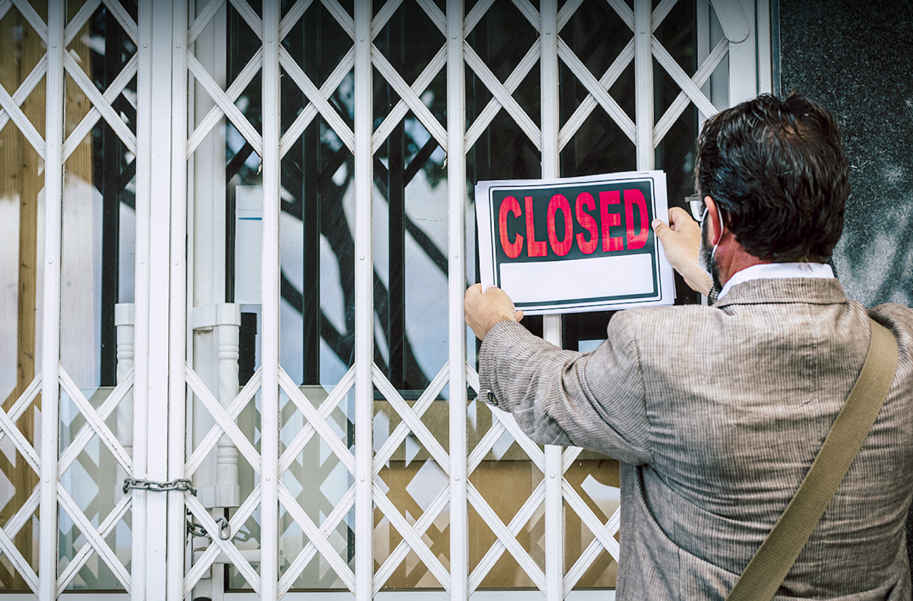
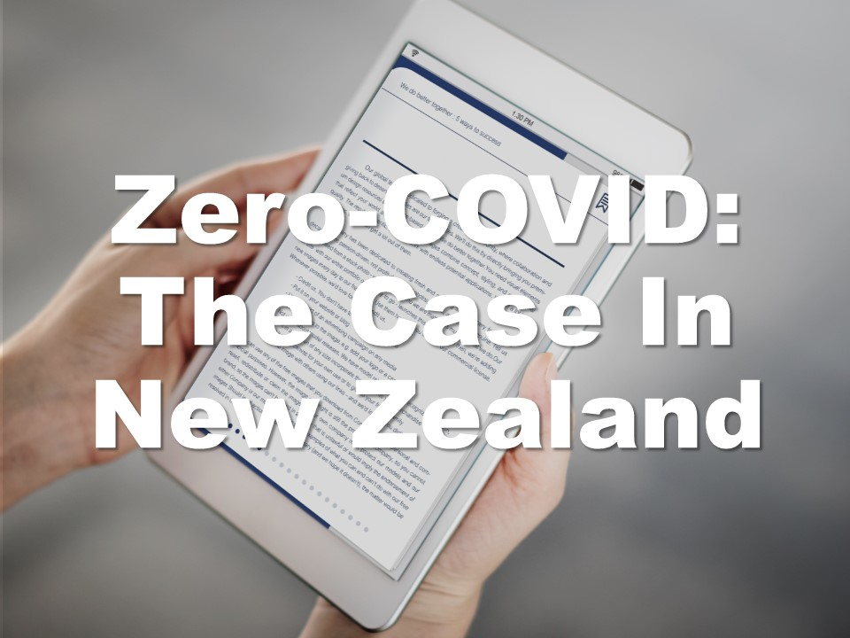
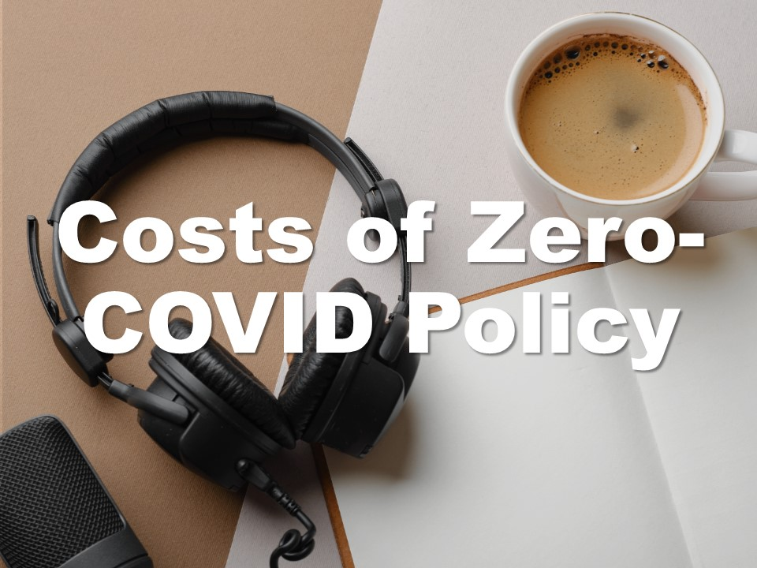
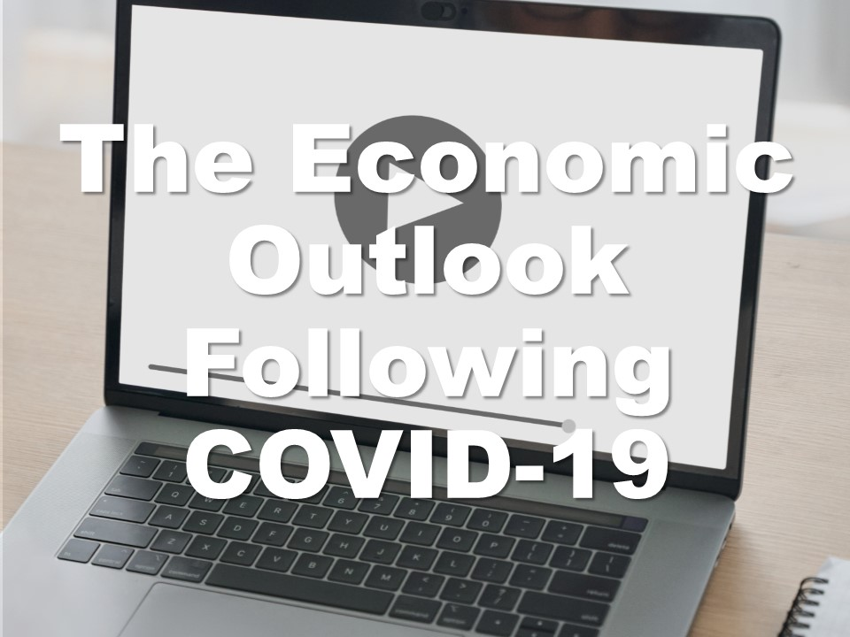
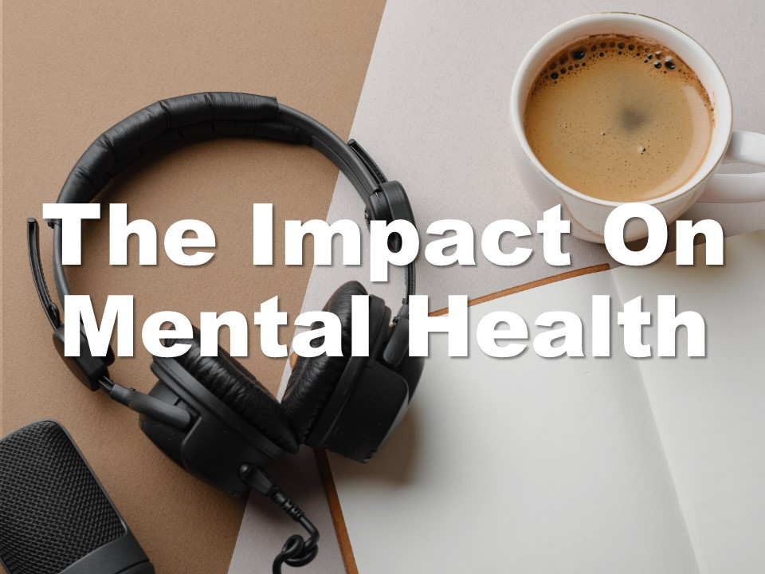

| **1-Minute Read** |
| :---------------: |
|                   |

Countries fear [being left behind](https://www.theguardian.com/world/2021/oct/30/people-are-starting-to-wane-china-zero-covid-policy-takes-toll) in social and economic pursuits as the zero-tolerance strategy has a significant impact on work and life for millions of people.

[Australia, New Zealand](https://www.economist.com/china/2021/10/16/how-long-can-chinas-zero-covid-policy-last) and [Vietnam](https://theconversation.com/zero-covid-worked-for-some-countries-but-high-vaccine-coverage-is-now-key-169327), for example, have shifted their prior zero-COVID policy approach as scientists expect that COVID-19 will become endemic over time – meaning that it will continue to circulate within pockets of the [global population](https://www.nature.com/articles/d41586-021-00396-2) for years to come. 

The European Chamber of Commerce in Hong Kong said that the strict quarantine rules left residents “indefinitely [trapped in Hong Kong](https://www.straitstimes.com/ASIA/EAST-ASIA/STRICT-COVID-19-CURBS-LEAVE-HONG-KONG-INDEFINITELY-TRAPPED-EU-CHAMBER-SAYS) when the rest of the world is moving on” thereby threatening its standing as a global financial hub. Strict immigration and quarantine rules leave the territory [isolated](https://www.economist.com/the-economist-explains/2021/10/06/why-hong-kongs-zero-covid-strategy-could-backfire), to the frustration of many families and businesses.

73% of the respondents of a [survey](https://www.iata.org/en/pressroom/2021-releases/2021-10-05-01/) conducted by the International Air Transport Association reported that their quality of life was suffering due to travel restrictions. They had missed many “family moments, personal development opportunities and business priorities.” 

 Read on to know what easing COVID-19 restrictions might mean. 

    

    

    

  

	

***Want to know more about issues associated with tight COVID-19 restrictions?***

    

    

    

    

	

