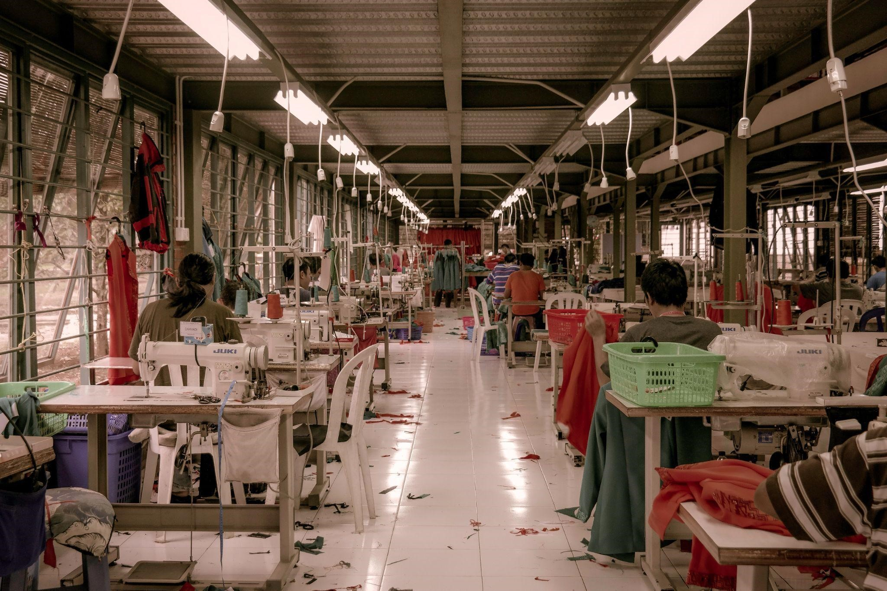
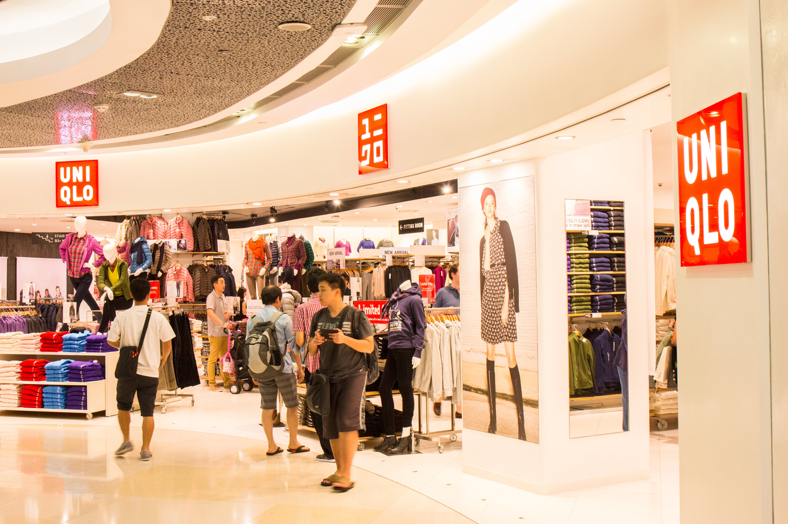

| **-Minute Read** |
| :--------------: |
|                  |

**The Real Price Tag of Fast Fashion**

 

*Affordable clothing should be accessible to everyone. But when the world buys too much and too often, who is really footing the bill?*

 

*Clothes sales rack.* *[Artem Beliaikin/Unsplash](https://unsplash.com/photos/Ta3f1ZcCgWg)**.*

 

***What was the last item of clothing you purchased? How often have you worn it so far?\*** 

 

In one of pop culture’s most enchanting moments, Cinderella’s fairy godmother waves her wand and conjures a sparkling, ethereal ball gown. Fashion is the stuff of dreams, but real clothes don’t materialise from nothing. Instead, they are frequently produced at a nightmarish, decidedly un-magical cost to workers and the environment. 

 

**Item 1: Lower Wages and Fewer Worker Protections**

 

Global clothing consumption has reached unprecedented levels. And thanks to cheap and abundant fast fashion, our insatiable appetite for clothes is only set to grow. 

 

To churn out garments fast while keeping prices competitive, factory workers from developing countries are underpaid and overworked in unsafe conditions. Outsourced manufacturing means that giants like Sweden’s H&M and Spain’s Zara can avoid direct accountability for employee abuses. Without oversight, third-party suppliers have perpetrated [wage theft](https://www.theguardian.com/global-development/2021/jul/09/top-fashion-brands-face-legal-challenge-over-garment-workers-rights-in-asia) (Sri Lanka), [violent crackdowns on protests](https://www.nytimes.com/2021/03/12/business/myanmar-garment-workers-protests.html) (Myanmar), and even [sexual violence](https://www.theguardian.com/news/2020/aug/20/fashion-industry-jeans-lesotho-garment-factory-workers-sexual-violence) (Lesotho) against workers. 

 

The oppression of garment workers intersects with gender-based violence in many cases. Women living in poverty, many of whom have children as well, are more likely to accept poorly paid work and be exploited. “The brands benefit from this model and its lower production costs,” explains researcher Bobbie Sta Maria.

 

*Factory workers in Indonesia, 2020. An estimated [80% of garment workers worldwide are women](https://www.fairtradecertified.org/news/fashion-is-a-womens-issue#:~:text=Despite the fact that women,of garment workers are female.), often from countries where they have fewer legal rights or protections against gender-based violence.*

 *[Rio Lecatompessy/Unsplash](https://unsplash.com/photos/cfDURuQKABk).*

 

In turn, workers have begun to organise in cross-border unions such as [The Asia Floor Wage Alliance](https://twitter.com/asia_floorwage), to demand that mega-corporations such as H&M be held responsible for their supply chains. However, with the sizable legal budgets that these companies have, it remains to be seen whether such positive changes will materialise.

 

**Item 2: Poisoned Ecosystems**

 

Garment workers also disproportionately bear the environmental costs of fast fashion. The production of clothing in enormous quantities creates unmanageable amounts of byproducts, which pollute local ecosystems and create health hazards for garment workers and their communities. The UN estimates that fashion accounts for [one-fifth of industrial water pollution](https://edition.cnn.com/style/article/dyeing-pollution-fashion-intl-hnk-dst-sept/index.html). China and Bangladesh, the world’s largest exporters of clothing, have seen rivers once used for drinking, bathing, and cooking choked lifeless with toxic fabric dyes.

 

Landscapes are permanently altered by textiles that will not quickly biodegrade if at all; an easily avoidable crisis that will now persist generations. “[Our] kids get sick if they stay here because of the water,” explains one Bangladeshi garment worker of his choice to send his children and grandchildren far away from the mills where he is employed. 

 

When it comes to the destruction of their natural surroundings, garment workers once again confront a frustrating lack of accountability from the companies they work for.

 

**Item 3: Disposable Clothing Culture**

 

In safe and clean Singapore, such devastating effects of fast fashion can be hard to grasp. Because most of us live far away from the factories and landfills where clothes are manufactured and destroyed, “consumers are unable to see the connection between clothing consumption and the resultant waste that they produce”, explains environmental engineer [Nuramirah Suyin Zaihan](https://www.channelnewsasia.com/singapore/bursting-seams-singapores-cast-clothing-1035441). 

 

As tiny as Singapore is compared to other countries population-wise, all of us are capable of generating shocking amounts of clothing waste.

 

For example, [a 2016 survey](https://www.channelnewsasia.com/singapore/bursting-seams-singapores-cast-clothing-1035441) of 1,000 Singaporeans revealed that the average consumer bought 34 pieces of clothing and disposed of 27 items of clothing annually. Between 2008 and 2016, Singapore’s textile waste soared 61.52% from 93,300 tonnes to 150,700 tonnes. This increase is largely owed to social media and a proliferation of fast fashion brands enabling more consumption. Unfortunately for us, the technology and infrastructure for clothes recycling has not kept pace.

 

 *Uniqlo store in ION Orchard. [Shutterstock](https://www.shutterstock.com/image-photo/singapore-oct-19-uniqlo-store-ion-235832014).*

 

In 2020, only [4% of Singapore’s 137,000 tonnes](https://www.nea.gov.sg/our-services/waste-management/waste-statistics-and-overall-recycling) of textile, fabric, clothing, and leather waste was recycled. Our remaining waste gets incinerated or dumped in landfills, and due to burgeoning consumption, Singapore’s [only landfill on Semakau island](https://www.straitstimes.com/singapore/singapore-throw-away-nation) is projected to reach capacity by 2035, one decade sooner than originally predicted.

 

Some would suggest trading the garbage bin for a donation bin. Although thrift stores are designed to offer affordable secondhand clothing for those with fewer means, our current supply of secondhand clothes far outstrips demand, to the extent that there may be little real difference between donation and garbage bins.

 

Singapore’s charities, among them the Salvation Army, [Society of St. Vincent de Paul (SSVP)](https://youthopia.sg/read/why-we-need-to-be-mindful-when-thrifting/), and [Gift Appeal Foundation](https://www.straitstimes.com/singapore/salvation-army-sees-spike-in-donations-amid-festive-season-appeals-for-items-in-good-condition), are used to receiving more clothing donations than they can handle. If these surplus clothes are not redirected to landfills, they are instead exported to other countries of greater presumable need, with an emphasis on “presumable”.

 

**Item 4: Overflowing Landfills**

 

The sheer quantity of unwanted clothing exported for resale or as trash has caused landfills in places such as [Accra, Ghana](https://www.abc.net.au/news/2021-08-12/fast-fashion-turning-parts-ghana-into-toxic-landfill/100358702) to overflow, with many undesirable impacts.

 

Exporting clothes in shipping containers further contributes to fashion’s [already significant carbon emissions](https://www.un.org/sustainabledevelopment/blog/2019/08/actnow-for-zero-waste-fashion/). Oversupply of cheap, literally disposable clothing makes reselling less cost-effective and also decimates local clothing makers who cannot afford to compete with rock-bottom prices. 

 
 *Discarded clothing and shoes made from synthetic materials can cause microplastic runoff and harm wildlife. Fabrics derived from plastic account for around[60% of all clothing](https://www.vox.com/the-goods/2018/9/19/17800654/clothes-plastic-pollution-polyester-washing-machine) produced today.[Shutterstock](https://www.istockphoto.com/photo/pile-of-old-clothes-and-shoes-dumped-on-the-grass-as-junk-and-garbage-littering-and-gm957312514-261398518?utm_source=unsplash&utm_medium=affiliate&utm_campaign=srp_photos_top&utm_content=https%3A%2F%2Funsplash.com%2Fs%2Fphotos%2Fclothing-waste&utm_term=clothing waste%3A%3A%3A).*

Merchants also claim that the quality of second-hand clothing has steadily decreased. “[People] think [that in] Africa here… we are not like human beings,” says Ghanaian importer Emmanuel Ajaab, “Even if somebody knocked [on] your door [to beg], you cannot just … pick something from your dustbin. In this case … they’re doing this to us”.

 

It’s a sobering pill to swallow. Since the 1970s, people around the world have been encouraged to [reduce, reuse, and recycle](https://sdgs.un.org/sites/default/files/2020-12/UNCRD_10th 3R Forum_Webinar V-Presentation-Background of State of 3R-Shinichi Sakai.pdf) to save the environment. While our efforts at the latter activities must continue to grow, they remain insufficient solutions to the problem of clothing waste. Reducing the number of clothes we buy may ultimately be the most efficient — and cost-effective, as our wallets would likely attest — means of making a dent in the fast fashion crisis.

 

 

***Based on the information presented, what will you do with your next item of unwanted clothing, and would your choice have been different prior to reading this article?\***

 

Further reading:

- I got hired at a Bangladesh sweatshop. Meet my 9-year-old boss ([Toronto Star](https://www.thestar.com/news/world/clothesonyourback/2013/10/11/i_got_hired_at_a_bangladesh_sweatshop_meet_my_9yearold_boss.html))

- The troubled second life of donated clothes ([ScienceLine](https://scienceline.org/2018/06/the-troubled-second-life-of-donated-clothes/))

- I Gave Up Shopping for a Year – Here’s How ([InStyle](https://www.instyle.com/fashion/no-shopping-resolution-how-to))