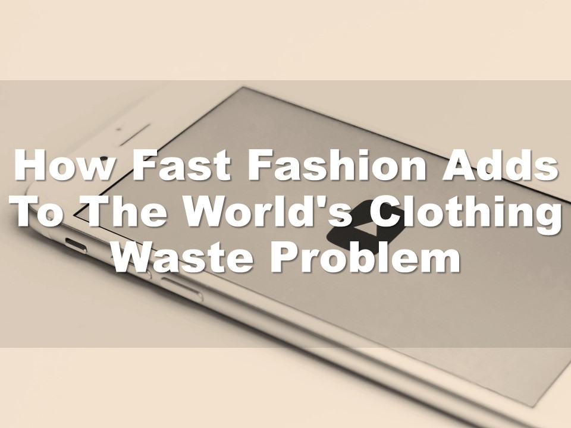
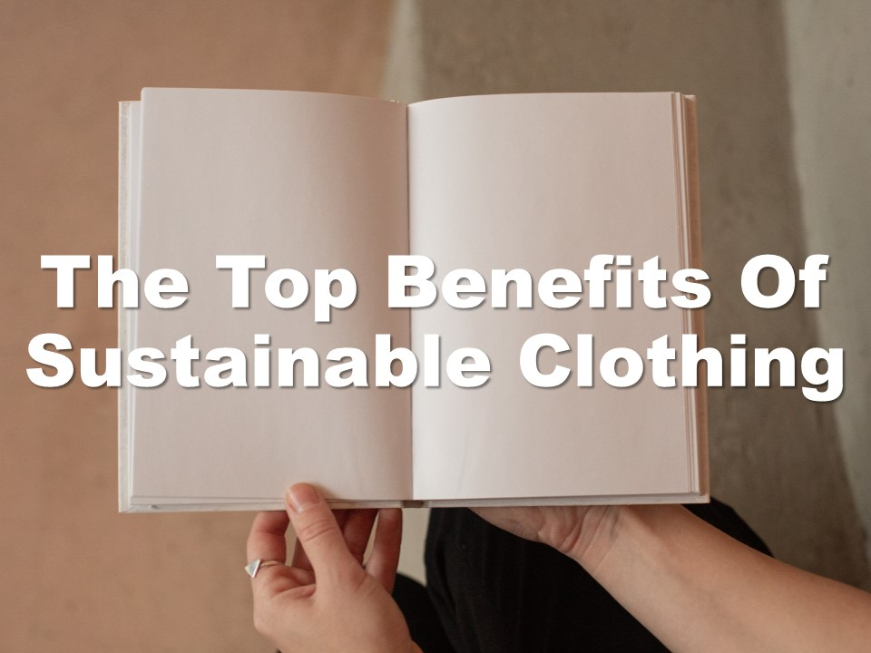
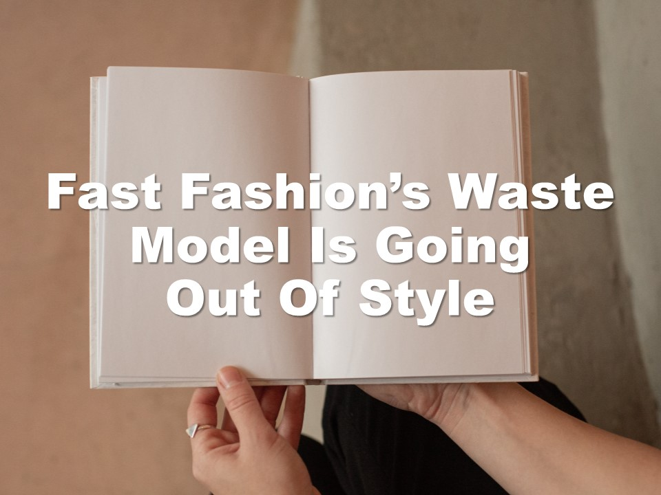

| **1-Minute Read** |
| :---------------: |
|                   |

Photo by Jess @ Harper Sunday on Unsplash  

Let’s say you head down to a store to get your fashion fix. Immediately, some clothes nearby catch your eye. You spot the tag and are taken aback by the high price. When you look closer, you spot it — a sticker labelled “Sustainable Fashion”.

[Sustainable fashion goes beyond](http://changingmarkets.org/wp-content/uploads/2021/07/SyntheticsAnonymous_FinalWeb.pdf) switching to natural materials and labelling clothes as “eco-friendly”. The idea focuses on all aspects of the entire supply chain, production and life cycle. Companies have to [manage their waste and water](https://www.forbes.com/sites/stephanrabimov/2020/07/20/post-pandemic-fashion-will-be-sustainable-and-affordable-interview-with-anna-gedda-head-of-sustainability-at-hm-group/), limit their gas emissions and chemicals and [protect their workers](https://www.greenstrategy.se/sustainable-fashion/what-is-sustainable-fashion/).

This is why sustainable fashion may not be trendy or affordable. They tend to [be more expensive](https://www.channelnewsasia.com/cnainsider/true-cost-demand-cheap-clothes-fast-fashion-industry-environment-220706) due to their small batch production and extensive manufacturing processes. Some consumers are more likely to [pay premium prices](https://www.thegoodtrade.com/features/what-is-slow-fashion) for going [eco-friendly](https://www.vogue.co.uk/fashion/article/sustainable-fashion-affordable). There is also a [lack of size inclusivity](https://www.harpersbazaar.com/fashion/designers/a32213676/plus-size-sustainable-fashion/) in sustainable fashion, with consumers [facing difficulty](https://fashionjournal.com.au/fashion/the-sustainable-fashion-industry-is-size-exclusive-take-it-from-this-model/) in finding the right fit.

Finally, you decide to buy a sustainable shirt. On the way home, you suddenly spot headlines of the brand being exposed for child labour. Weren’t they supposed to be ‘sustainable’? Research might be required as some companies use [misleading marketing tactics and false sustainability claims](http://changingmarkets.org/wp-content/uploads/2021/07/SyntheticsAnonymous_FinalWeb.pdf) to get you to buy their products.

    

	

***Want to know more about Sustainable Fashion?***

    

    

    

    

    

    

    

    

    

    

    

    

	

